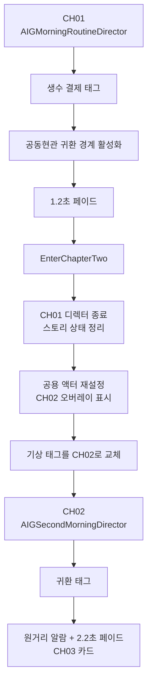

# Architecture

## 의존 방향

콘텐츠는 런타임 기반에 의존하지만, 기반 시스템은 특정 챕터의 사건을 알지 못합니다.

```text
Chapter Directors -> Sequence + Narrative + Interaction -> Player + Core
                                  Save -------------> Core
```

현재는 빌드 복잡도와 반복 루프의 메모리 비용을 낮추기 위해 `IndieGame` 단일 Runtime 모듈을 사용합니다. 독립 배포가 필요한 챕터가 생길 때만 Game Feature Plugin으로 분리합니다.

## 런타임 경계

- `Core`: GameInstance, GameMode, 월드 조립과 공통 수명 주기
- `Player`: 캐릭터, 컨트롤러, Enhanced Input, 단일 trace 기반 상호작용 탐색, HUD
- `Interaction`: 상호작용 계약과 재사용 가능한 문·냉장고·픽업·계산대·엘리베이터
- `Narrative`: Gameplay Tag 기반 지속 상태와 데이터 기반 챕터/스토리 비트
- `Sequence`: 기상, CH01 루틴, CH02 공포 비트와 목표를 소유하는 상태 머신
- `Save`: 스키마 버전, 체크포인트와 스토리 상태의 비동기 저장

## 한 월드 안의 반복 구조

CH01과 CH02는 맵을 다시 열지 않습니다. `AIGPrologueWorldScene`이 아파트, 복도, 엘리베이터, 로비, 골목과 편의점을 한 번 조립하고, CH02에 필요한 미러룸과 의례 소품은 시작 시 숨김 상태로 미리 만듭니다.



`EnterChapterTwo`는 다음 작업을 한 경계 함수에서 처리합니다.

- 열린 문서 패널과 CH01 디렉터 종료
- 스토리 상태를 중간 방송 없이 정리
- CH01 소지품을 숨기고 CH02 지갑·생수·손전등을 활성화
- 미러룸, 젖은 발자국, 우편함 문서와 제물 오버레이의 표시·충돌 활성화
- 냉장고, 현관문, 공동현관문, 미러룸 문, 엘리베이터와 계산대 초기화
- 플레이어를 같은 침대 옆 위치로 이동
- `AIGWakeUpDirector`에 CH02 기상·체크포인트 태그를 주입하고 다시 시작
- `AIGSecondMorningDirector` 생성과 HUD 목표 공급자 교체

맵 재로딩과 중복 공간 없이 같은 사물의 상태 차이가 공포가 되며, CH03가 추가되어도 공유 지오메트리를 다시 복제하지 않습니다.

## 챕터 감독과 목표 공급자

`AIGMorningRoutineDirector`와 `AIGSecondMorningDirector`는 모두 `IIGObjectiveProvider`를 구현합니다. 인터페이스는 다음 세 값만 제공합니다.

- 현재 언어의 목표 텍스트
- 한글 폰트를 사용할 수 없을 때의 ASCII 목표 텍스트
- 0~1 범위의 목표 진행도

`AIGHorrorHUD`는 구체적인 챕터 감독 클래스를 판정하지 않고 현재 `IIGObjectiveProvider`를 조회합니다. CH02와 이후 챕터가 추가되어도 HUD 분기문을 늘리지 않아도 됩니다. 기존 `SetMorningDirector`는 CH01 호환용으로 남아 있으며 내부적으로 공용 `SetObjectiveProvider`에 위임합니다.

읽기 화면은 `AIGReadableNote`가 가진 표현 데이터를 따릅니다. 일반 공지와 메모는 기존 종이 문서 패널을 사용하고, 편의점 영수증은 `FIGThermalReceiptData`의 상품·금액·결제 행을 전용 감열지 렌더러가 좌우 열로 배치합니다. 따라서 현지화 문구에 공백을 채워 정렬하지 않으며, 이후 영수증 품목이 늘어나도 HUD의 좌표를 다시 작성할 필요가 없습니다.

CH02 감독은 지오메트리를 직접 만들지 않습니다. `AIGSecondMorningDirector`가 Gameplay Tag와 좁은 장면 API만 사용해 다음 비트를 순서대로 조율합니다.

- 플레이어의 위치·시야를 검사하는 복도 소등
- 미러룸 문 닫힘, 스탠드 소등과 도어락 음
- 엘리베이터 2층 중간 정차, 발자국 공개와 운행 재개
- 무인 편의점의 두 번째 입장 차임
- 영수증 조사와 동일 영수증 재출력
- 빌라 귀환 후 CH02 엔딩

장면 컴포넌트와 수명은 `AIGPrologueWorldScene`이 소유하고, 감독은 사건의 순서만 소유합니다. 이 분리는 CH02 연출을 바꾸어도 월드 조립과 상호작용 구현을 다시 만들지 않게 합니다.

## 상태와 이벤트

- `Event.*`는 그 순간 일어난 사실입니다. 예: `Event.Wake.AlarmStopped`.
- `State.*`는 현재 루프에서 성립한 진행 상태입니다. 예: `State.CH02.Loop.LiftStopped`.
- `Checkpoint.*`는 안전하게 재개할 위치입니다. 예: `Checkpoint.CH02.Woke`.
- `Chapter.*`는 저장 스냅샷이 속한 챕터입니다. 예: `Chapter.CH02`.

문자열 비교, raw Actor 포인터, Blueprint 클래스 경로는 저장 데이터에 넣지 않습니다. 시각 연출은 진행 사실을 직접 소유하지 않고, 완료와 스킵은 같은 멱등 완료 함수로 수렴합니다.

CH01과 CH02는 서로 다른 기상·냉장고·지갑·생수·결제 태그를 사용합니다. 따라서 두 번째 루프가 시작되어도 첫 루프의 완료 태그가 상호작용을 미리 소비하지 않습니다.

## 상호작용

플레이어의 `UIGInteractionComponent` 하나가 10~15Hz로 카메라 중앙 trace를 실행합니다. 상호작용 액터는 기본적으로 Tick하지 않습니다.

공통 계약은 다음을 포함합니다.

- 현재 대상이 상호작용 가능한지 판정
- 프롬프트, 입력 방식과 홀드 시간 제공
- 시작, 취소, 완료 처리
- 완료 이벤트 Gameplay Tag 제공

챕터 전환은 액터를 새로 복제하는 대신 작은 재설정 API를 사용합니다.

- 냉장고: 챕터별 완료 태그·생각 문구 설정과 문/조사 상태 초기화
- 계산대: 필수 소지·구매 완료 태그와 가격 문구 설정, 결제 상태 초기화
- 스윙도어: 즉시 상태 강제와 크릭만 재생하는 스크립트 스윙
- 엘리베이터: 새 운행 초기화, 12cm 중간 정차, 감독 신호 후 운행 재개
- 기상 감독: 챕터별 저장 태그 설정과 재진입 안전한 기상 재시작

침대, 알람, 문, 스탠드가 별도의 입력 시스템을 만들지 않습니다.

## 콘텐츠와 에셋 경계

현재 수직 슬라이스의 런타임 조립 재료는 다음 위치에 있습니다.

```text
Content/Maps
Content/Prototype
Content/Photo
Content/Meshes
Content/SourceArt
```

최종 챕터 콘텐츠는 `Content/IndieGame/Features/CHxx_*` 아래로 옮기고, 챕터 폴더끼리 직접 참조하지 않습니다. 여러 챕터가 사용하는 에셋만 `Shared`로 승격합니다. 작은 실내 공간에는 World Partition을 기본값으로 강제하지 않으며, 공간 재사용이 필요할 때 Level Instance와 Data Layer를 선택합니다.

## 저장

진행 저장과 사용자 설정 저장을 분리합니다. 진행 저장은 스키마 버전, 챕터, 맵, 체크포인트, 스토리 상태를 보존하고 UObject 또는 Actor 주소를 저장하지 않습니다. 저장 중 도착한 자동저장은 가장 최근 체크포인트로 합쳐 처리합니다.

현재 로드는 스토리 상태 적용까지 구현되어 있습니다. 저장된 맵 열기, 체크포인트 앵커 선택과 플레이어 배치는 별도 Load Coordinator가 담당해야 합니다. 이 기능이 완성되기 전 CH02 자동저장은 첫 루프의 순환 저장 슬롯을 밀어내지 않도록 비활성화되어 있습니다. 이전 체크포인트로의 라이브 롤백 대신 안전한 맵 재진입을 기본으로 합니다.
