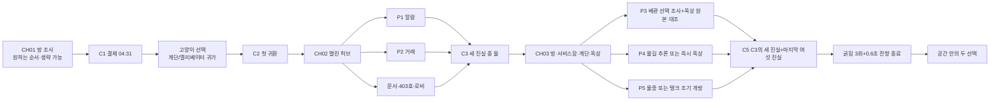

# 4시 44분 — REBIRTH 스토리 마스터

> **전체 스포일러.**
>
> 이 문서는 `4시 44분`을 서사·공포·연출·음악·효과음·이미지·대화·텍스트까지
> 하나의 경험으로 다시 설계한 차기 제작 기준이다.
>
> 이 문서는 **REBIRTH의 단일 제작 정사**다. 현재 빌드는 구버전 챕터와
> REBIRTH 1차 그레이박스가 공존하므로 출시 후보가 아니며, 실제 반영 상태는
> `IMPLEMENTATION_STATUS.md`, 출시 판정은 아래 `§14~15`를 따른다.
> 서사 명세의 완성과 게임 빌드의 완성을 같은 말로 사용하지 않는다.

### 개정 3 — 현실 인과·인간 행동 최종 잠금

개정 2 이후 분기별 소지품 위치, 수거 일정, 배관 압력, 추락 궤적,
주인공의 행동 동기를 다시 검수했다. 아래 항목은 모두 본문과 테스트 표에
동시에 반영하며, 어느 하나도 연출 편의를 이유로 되돌리지 않는다.

| # | 결함 | 조치 | 주요 반영 절 |
|---:|---|---|---|
| 1 | 지운이 산 생수의 행방이 문서 전체에서 사라짐 | 편의점 봉지를 3챕터 관통 모티프로 승격. 04:43 사다리 앞 하차 → 06:08~06:10 강만식이 옥상에서 쓰레기로 오인 회수 → 06:12 1층 마대 투입 → 7월 30일 CCTV 대조로 재수색 확정 | §2, §5, §6, §7, §8 |
| 2 | 점검구 **안쪽**에 늘어진 호스를 06:08에 사다리 없이 회수할 수 없음 | 호스 끝을 점검구 **테두리 걸침**으로 변경. 고양이가 밟으면 안으로 미끄러져 수면·철판을 치고 자체 무게로 받침 위로 복귀 | §2, §4.7, §8 |
| 3 | 손전등 배터리 소모가 “게임오버·진행 불능 없음”과 충돌 | 배터리 소모를 폐기하고 밝기 저하·브라운아웃을 **압박 연출 전용**으로 규정 | §4.6, §13, §14 |
| 4 | P3 배관에만 선행 학습이 없음 | CH01 복도에 잠긴 서비스함, CH02 단수 공지에 예비조 분리 문구를 심음 | §6, §7, §4.6 |
| 5 | 옥상 도달 직전에 문서 4장이 몰려 페이싱 붕괴 | 4층 서비스함 원본 1장 / 철문 옆 IP65 현장 기록함 인계표 1장 / 철문 바깥 환경 안내 / 철문 안쪽 미래 중첩 경찰 수사철 2탭으로 분산. 옥상에 들어가기 전 전면 문서는 한 장만 허용 | §8 |
| 6 | 엔딩 A가 정보량 0이라 두 엔딩의 무게가 비대칭 | 암전 끝에 읽히지 못하는 어머니의 진동 1회를 추가해 A를 **상실**로 만듦 | §9 |
| 7 | 작업표의 분 단위 시각이 “설계도”처럼 읽힘 | 사람이 쓴 기록은 흐리고 비고, 기계 기록만 정확하다는 규칙 도입. 가장 정확한 `04:10`이 유일한 거짓 | §8, §16 |
| 8 | 미완공 5층에 세대가 입주해 있는 상태가 미설명 | 2019년 중단된 위반 증축으로 확정. 관리 예산난·사진 승인·옥상 통제를 한꺼번에 설명 | §2, §3, §8 |
| 9 | 지운이 가족을 피했다는 근거가 문자 2개뿐 | 뜯지 않은 택배 상자와 부재중 전화 2건을 CH01에 심고 엔딩 B에서 테이프 소리로 회수 | §3, §6, §9 |
| 10 | 정막례에게 목격·애도·미신 3기능이 몰림 | 목격의 일부를 402호 야간근무 이웃에게 이관. 정막례는 “듣고 알린 사람 = 기다린 사람” 한 축으로 통일 | §3, §7, §8 |
| 11 | 생수 용량 선택이 애니메이션만 다른 장식 | 2L 두 병은 늘어나는 봉지 밑을 받쳐 양손으로 운반. 상호작용 직전 자동 하차·재파지가 **04:43의 마지막 반복**이 되도록 학습시킴 | §6, §4.7 |
| 12 | 자막이 플레이어가 방금 증명한 것을 다시 말함 | “손이 증명한 것은 자막이 말하지 않는다” 원칙 도입, 해당 대사 지연·삭제 | §10.1 |
| 13 | 휴대폰 결제 분기에서는 폰이 옥상에 있어야 하지만 엔딩은 빈방의 폰을 요구 | 폰은 3% 충전 상태로 방에 고정. 지갑을 두고 왔을 때는 후드 주머니의 실물 체크카드로 결제하고 승인 알림은 집의 폰에 수신 | §2, §6, §7, §9 |
| 14 | 금요일에 마대에 들어간 봉지가 토요일 수거 뒤에도 7월 30일 남음 | 재활용 수거를 **매주 수요일**로 고정. 7월 30일 회수와 충돌하지 않게 함 | §2, §6, §7 |
| 15 | 유입과 배수가 모두 닫힌 배관에서 압력이 저절로 0이 됨 | 별도 `압력 해제` 블리드 밸브를 추가. 유입 차단 → 블리드 개방 → 0압력 대기 → 본배수 순서로 수정 | §4.6, §8, §11 |
| 16 | “두 번째 발판”이 아래에서 두 번째라면 탱크 안 추락 불가 | **상단에서 두 번째 외부 발판**으로 고정. 상체가 점검구 위에 놓인 상태에서 젖은 테두리 손이 미끄러져 중심이 안쪽으로 넘어가는 궤적을 명시 | §2, §8, §12 |
| 17 | CH02에서 자기와 닮은 형체를 본 뒤 다시 물을 사러 가는 행동이 작위적 | 통화·이웃 호출 실패 뒤 불 켜진 편의점에서 사람을 찾으러 가게 변경. P2는 재구매가 아니라 직원 호출 단말이 내미는 미완료 거래 대조로 발생 | §7, §10 |
| 18 | 생수 봉지가 탱크 속 몸의 신원까지 증명함 | 봉지는 옥상 체류·추락의 물증으로만 사용. 신원은 휘어진 안경·수색 전단 복장·403호와 탱크의 등·슬리퍼 마모로만 확정 | §4.7, §8 |
| 19 | CH01에 없다고 쓴 손전등이 공간표와 코드에서는 보임 | CH01부터 같은 신발장 위에 **배경 프롭으로 보이되 상호작용만 비활성화**하는 것으로 통일 | §4.6, §6 |
| 20 | 바람이 무거운 철제 점검구 뚜껑을 편의상 닫는 것처럼 보임 | 접이식 지지쇠의 고정핀이 유실된 상태에서 관리인이 뚜껑을 뒤쪽 스토퍼에만 기대 둔 것으로 고정. 04:37 돌풍은 흔들기만 하고, 04:44 추락 충격이 탱크 전체를 울린 뒤 이어지는 돌풍들이 뚜껑을 수직선 안쪽으로 넘긴다. 폐쇄를 끝내는 힘은 중력이며, 엔딩 B의 점검봉만 같은 풍압 범위를 실제로 버틴다 | §2, §8, §15 |

부수 정정: 04:37 금속음의 원인을 세 번째 돌풍으로 확정(§2), 소금과
정화수의 기호 충돌 정리(§3.3), CH02 복도 소등의 정상 원형을 CH01에
심음(§6), P4를 난이도가 아닌 체감 장치로 재정의하고 부담을 P3로
이동(§4.6).

### 개정 3.1 — 결제 분기 파급 정리

개정 3이 결제 수단을 지갑/주머니 카드 두 갈래로 나누면서, 그 분기에
의존하던 기존 단서 하나가 무너졌다. 아래 세 건은 같은 원인에서 나온
후속 정리다.

| # | 결함 | 조치 | 반영 절 |
|---:|---|---|---|
| 21 | 미러룸의 `책상 위 지갑이 없다`가 결제 분기에 따라 단서가 되기도 하고 아무것도 아니기도 함. 지갑을 챙긴 플레이어에게는 “내 주머니에 있는데?”가 되어 공포가 소멸 | 단서를 **CH01의 유일한 후드집업 → 플레이어가 입은 회색 소매 → 403호 형체가 입은 같은 후드집업 → 빈 아래 고리**의 삼각 대조로 교체. 신발턱은 보조 출처로만 사용한다. 403호 지갑은 404호와 동일하게 두되 획득 불가 반사 프롭으로 만든다 | §3.1, §5, §7, §10 |
| 22 | 본문은 04:43을 “구조가 아니라 확인”으로 바꿨는데 정량 목표만 `“고양이를 구하려고”`로 남아, 정답을 말한 테스터가 오답 처리됨 | `“고양이 때문에”`를 합격선으로 두고, **탱크 진입이 아니라 상부 확인**으로 구분하는 세부 기준을 추가 | §15 |
| 23 | §10.1은 P1 정답 자막을 403호 퇴장으로 미뤘는데 §7 본문은 정답 순간에 그대로 재생 | 본문을 표에 맞춰 정정하고, 퇴장 시 1회·미해결 시 무재생 조건을 명시 | §7, §10.1 |

21번의 전제로 CH01 장면 1에 **벽걸이 행거의 고리 두 개와 채워진
신발턱**을 명시했다. 다만 빈 고리 자체는 외출한 사람의 정상 흔적일 뿐
공포 단서가 아니다. 플레이어가 입은 한 벌과 침대 형체가 입은 같은 한
벌이 동시에 보여야 비로소 “나갔는데 누워 있다”가 성립한다.

### 개정 3.2 — 착의·옥상 진입·증명 경로 회귀 검수

이번 검수에서는 새 단서가 장면 설명 안에서만 성립하고 실제 이동·저장
상태에서는 무너지는지를 다시 따라갔다.

| # | 결함 | 조치 | 반영 절 |
|---:|---|---|---|
| 24 | CH02·03이 침대 기상에서 바로 시작해, 미러룸에서 비교해야 할 외출복을 언제 입었는지 비어 있음 | 각 장의 404호 첫 퇴실에 동일한 1.2초 착의를 두고 `OutfitEquippedByChapter`로 1회만 실행. 재입장·불러오기 복제를 금지 | §4.7, §6~8, §12, §14~15 |
| 25 | 열쇠가 꽂혀 있다는 사실만으로는 고양이가 지운보다 먼저 닫힌 옥상 철문을 통과할 수 없음 | 처진 철문이 약 11cm를 남기고 문턱에 걸리는 실제 결함을 설정. 강만식이 열쇠를 꽂은 채 덜 닫고 내려가고, 고양이는 틈을 통과하며 지운은 뒤이어 문을 당겨 연다 | §2, §4.8, §8, §15, §17 |
| 26 | `T_DEATH_OVERLAY`의 대체 경로가 P1과 같은 시계의 04:44 표시만 다시 비교해 독립 증명이 되지 못함 | `05:10으로 복원된 시계 + 편의점의 04:44 선행 영수증`처럼 서로 다른 생활 기록 두 개를 대조해야만 성립하도록 수정 | §4.7, §7 |
| 27 | 탱크 리빌에 슬리퍼 한 짝만 보이지만 다른 한 짝의 물리적 행방이 없음 | 보이는 것은 뒤축이 닳은 왼짝, 오른짝은 같은 몸의 반대 발에 있으나 수면·사다리 그늘에 가려지는 것으로 고정. 외부에 새 프롭을 만들지 않음 | §4.8, §8, §12 |
| 28 | CH02의 시각 퍼즐만으로 `04:44=사망 시각`까지 안다고 쓰여 반전의 원인이 조기 확정됨 | CH02에서는 “생활 기록을 침범한 정체불명의 시각”까지만 증명. `T_FALL+T_IDENTITY` 뒤에야 사망 시각으로 재해석 | §4.6~7, §7~8 |
| 29 | 같은 봉지를 든 지운의 진입과 관리인의 하강을 어느 카메라가 어떻게 모두 찍었는지 불명확 | 1층 로비 천장의 공동현관 CCTV로 고정. 유리 출입문과 계단 마지막 단, 재활용 마대를 한 화각에 두어 진입·하강·투입을 연속 기록 | §2, §6~8, §17 |
| 30 | `봉지+벗겨진 발판`만으로 탱크 **안쪽** 추락까지 확정해 증거가 결론보다 약함 | `T_FALL`은 상단 슬리퍼 끝·들뜬 패드·부식 클립의 실패 클러스터와 테두리 안쪽 손바닥 쓸림을 모두 요구한다. 안쪽으로 기우는 기억 충돌과 봉지는 각각 방향·등반 동기 보강이며 확정식을 대신하지 않음 | §4.7, §8, §10 |
| 31 | 호스 위 앞발과 최종 호스 위치만으로 “고양이가 밟아 물을 쳤다” 전체를 확정해 물 접촉 증명이 약함 | 고양이 원인 단서(호스 위 압착 앞발)와 물 접촉 단서(커플링 충격+테두리 안쪽 마찰)를 교차 대조해야만 `T_HOSE_CAUSE` 확정 | §4.7, §8, §15 |
| 32 | CH01에서 잠긴 서비스함이 CH03에서 “수압 때문에” 원인 없이 열림 | 자물쇠가 아닌 부식된 1/4회전 래치로 고정. CH03 수격이 래치 받침 나사를 뽑아 같은 문이 4cm 벌어지고, 파손 나사·받침이 남음 | §6, §8, §14~15 |
| 33 | P2 오답 셔터가 바닥 1.2m까지 내려와 “가두지 않는다”는 원칙과 달리 서 있는 플레이어를 물리적으로 봉쇄 | 매장 천장 240cm 기준 최초 20cm, 오답마다 5cm, 최대 35cm만 하강. 하단 205cm를 보장해 176cm 캡슐이 웅크리기 없이 왕복 | §7, §12~15 |
| 34 | “행거에 한 벌만 보였다”만으로는 같은 회색 후드가 여러 벌일 가능성이 남아 미러룸 동일성 증명이 약함 | 후드 왼쪽 소매 안쪽의 검은 실 세 땀 수선 자국을 CH01 착의·플레이어 소매·403호 형체·탱크 속 왼팔에 같은 위치로 반복 | §3.1, §5~8, §12, §15 |

### 개정 3.3 — 개정 3.2 미전파 항목 정리

개정 3.2가 새로 정한 규칙 중 본문 일부에 전파되지 않은 곳을 찾아 맞췄다.
새 설정을 추가한 것이 아니라 **이미 내린 결정을 지키지 못한 자리**를
고친 것이다.

| # | 미전파 | 조치 | 반영 절 |
|---:|---|---|---|
| 35 | 24번이 “각 장의 첫 퇴실에 착의”를 정했는데 CH03에만 착의가 없어, 탱크 리빌에서 대조할 소매가 플레이어 팔에 없음 | CH03 장면 5 앞에 **세 번째 외출 준비**를 추가. 세 번째이므로 가장 짧고 조용하게 재생하되 생략하지 않는다 | §8 |
| 36 | 32번이 서비스함 개방 원인을 래치 파손으로 바꿨는데 §5 모티프 장부와 §6 P3-a 설명은 여전히 `수압으로 열려 있고` | 두 곳을 래치 받침 나사 파손으로 통일하고, CH01의 녹슨 나사 두 개를 CH03의 빠진 나사와 **같은 나사**로 알아보게 하는 조명 지침 추가 | §5, §6 |
| 37 | 28번이 “CH02에서 04:44를 사망 시각으로 부르지 않는다”를 정했는데 §7 P2 장면의 시각 대조표에 `사망 시각이 덮어쓴 거래`가 그대로 남음 | 표 제목을 **CH02에서 아는 것**으로 바꾸고 `정체불명의 시각`으로 수정. 이 표를 근거로 죽음을 암시하는 자막·문서·UI를 만들지 말라는 금지를 명시 | §7 |
| 38 | 25번의 고양이 진입 서술이 `틈으로 빠져나간다`여서 들어가는 것인지 나가는 것인지 모호 | `틈을 먼저 통과해 옥상으로 들어간다`로 통일 | §2, §17 |

### 개정 3.4 — 출시 전 인과·절차·증명 잠금

독립 검수에서 “결과는 맞지만 그 결과에 도달한 사람이 작가처럼 행동하는”
지점을 다시 찾았다. 이번 개정은 새 반전을 더하지 않고, 사고·수색·증명·
엔딩이 현실의 순서대로만 성립하게 만든다.

| # | 출시 차단 결함 | 최종 조치 | 주요 반영 절 |
|---:|---|---|---|
| 39 | 젖은 발판과 왼손이 같은 순간 독립적으로 실패해 추락이 우연 두 개의 합처럼 보임 | 04:03 사진에 이미 들뜬 패드 모서리와 부식된 고정 클립을 심는다. 체중을 받은 패드가 먼저 벗겨지고, 골반이 안쪽으로 꺾인 뒤 왼손이 젖은 테두리를 긁으며 놓치는 **하나의 연쇄 실패**로 고정 | §2, §8, §15 |
| 40 | 추락과 정확히 같은 순간 한 번의 운명적 돌풍이 뚜껑까지 닫음 | `04:44`는 초가 아니라 사고가 난 **분**이다. 추락 충격이 탱크와 스토퍼를 울리고, 그 뒤 10~20초 동안 이미 불던 같은 방향의 돌풍이 두 번 더 뚜껑을 흔든 끝에 무게중심을 넘긴다 | §2, §8, §15 |
| 41 | P3만 풀어도 업체 인계와 허위 보고까지 안 것으로 처리됨 | P3는 빈 측정 원자료만 남긴다. `T_NEGLIGENCE`는 03:58 업체 인계를 필수 선행으로 두고, `04:03 개방 사진+06:20 허위 입력` 또는 이를 함께 확인한 경찰 대조표가 있어야 확정한다 | §4.7, §8, §15 |
| 42 | 7월 28일 경찰이 옥상 바닥까지 갔는데 점검구 외부 확인도 하지 않고 이틀을 기다림 | 1차 수색은 **잠긴 옥상 철문 바깥**까지로 축소한다. 7월 30일 밤 새 증거가 나온 즉시 경찰이 옥상문을 봉인·통제하고, 소방 밀폐공간 구조팀·추락 방지 장비·업체 도면이 모두 모이는 최초 시각 04:00에 외부 개방한다 | §2, §8, §9 |
| 43 | 경찰의 상세 CCTV·주민 진술을 과실 당사자인 강만식에게 보내고 그가 현장에 걸어 둠 | 강만식에게는 `현장 보존·출입 금지·입회 요구`만 통지한다. 상세 증거는 경찰이 소지한 현장 확인 체크리스트로 분리하고, 플레이어는 5층 통제선 안의 미래 중첩 수사철에서 읽는다 | §8 |
| 44 | 실종 신고 뒤 만든 허위 문서 때문에 강만식이 ‘안일한 사람’이 아니라 수색 방해자로 바뀜 | 허위 `04:10` 전산 입력은 실종 사실을 알기 전인 **7월 26일 06:20**에 자기 작업 누락을 덮으려고 작성한다. 신고 뒤에는 새 문서를 만들지 않고 이미 입력한 내용을 반복 주장한다 | §2, §3 |
| 45 | 선택 전에 확보하는 ‘재확인 예정’과 엔딩 뒤의 ‘실제 발견’을 같은 상태로 취급 | C5는 `T_RECHECK_SCHEDULED_0731`, C6만 `T_FOUND_0731`을 사용한다. 현실의 발견은 A와 B 모두에서 고정 사실로 제시하고, 두 엔딩의 차이는 현실 결과가 아니라 지운의 수용 여부로만 남긴다 | §4.7, §9, §15 |
| 46 | P5의 “두 단서”가 원자료 두 개와 증명식 두 개를 혼용해 약한 조합도 결론을 냄 | 원자료는 모두 개별 `SourceId`로 저장한다. UI의 한 상호작용이 여러 흔적을 묶어 보여 줄 수는 있지만, `T_HOSE_CAUSE`에는 물 접촉 범주, `T_FALL`에는 안쪽 방향 범주, `T_IDENTITY`에는 고유 착의 범주가 반드시 포함돼야 한다 | §4.7, §8, §15 |

### 개정 3.5 — 출시 판정과 전수 계약 잠금

내부 검수에서 “대표 경로 한 번 성공”과 “모든 자유 경로가 안전함”이
혼용되는 문제를 분리했다. 이 개정은 새 이야기를 더하지 않고, 이미 정한
정사가 어떤 상태 조합에서도 같은 사실로 합류하는지 판정하는 계약이다.

| # | 검증 공백 | 최종 조치 | 주요 반영 절 |
|---:|---|---|---|
| 47 | 진실을 11개라고만 적어 예정된 재확인과 실제 발견의 수가 다시 섞일 수 있음 | 진실은 **총 12개**로 고정한다. 선택 전 11개와 공통 발견 뒤 `T_FOUND_0731` 1개를 모든 표·세이브·테스트에서 분리한다 | §4.7, §14~15 |
| 48 | P3의 대표 성공 동선만 확인하면 빈 기록+04:03 사진만으로 과실 전체가 확정되는 회귀를 놓침 | 과실 원자료 다섯 개의 32개 부분집합을 전수 검사한다. `03:58 업체 인계`가 반드시 있고, 여기에 `04:03 사진+06:20 허위 입력` 또는 `경찰 사진·원본 대조표`가 함께 있어야만 `T_NEGLIGENCE`가 참이다. P3의 빈 측정란은 이 결론을 보강하지만 대신하지 않는다 | §4.7, §8, §15 |
| 49 | P5에서 연결 불가능한 물증에도 `대조한다`가 떠 UI가 정답 후보를 누설하거나 거짓 약속을 함 | 11개 상호작용 노드의 서로 다른 첫 대조 110개와 자기 재선택 11개를 검사한다. 네 직접 증명쌍의 양방향 8개만 즉시 확정하고, 신원 보조식은 전단·안경·탱크 착의의 확보 순서 6개를 별도 검사한다. 관찰과 확정은 분리한다 | §8, §10, §15 |
| 50 | 스토리 문서가 완성되면 현재 실행 빌드도 출시 가능하다고 오인 | `서사 명세 잠금`, `정적 계약`, `엔진 런타임`, `초견 플레이`, `패키징`을 별도 게이트로 둔다. 뒤 세 게이트의 증거가 없으면 게임 출시 판정을 내리지 않는다 | §14~15 |

### 개정 3.6 — 최종 연속성 잠금

개정 3.5의 전수 계약을 장면·대사·소품 위치까지 다시 역추적했다. 아래
항목은 선택 순서가 달라도 같은 횟수·시각·위치를 보장한다.

| # | 연속성 결함 | 최종 조치 | 주요 반영 절 |
|---:|---|---|---|
| 51 | 골목 진입 9초와 결제 후 유리 반사에 두 번째 돌풍이 중복됨 | 첫 돌풍은 골목 진입, 두 번째는 결제 후 출입문 전환, 세 번째는 04:37로 단일화 | §2, §6, §11 |
| 52 | 7월 31일 04:00 재점검 일정이 생성되기 전부터 CH01 철문에 붙어 있음 | 7월 29일 업체 회신으로 일정을 만든 뒤 안내를 부착하고, CH03 미래 중첩에서만 보이게 고정 | §2, §4.7, §8 |
| 53 | 구매는 임의 조합처럼 쓰였지만 저장·프롭은 세 프로필만 지원하고, 04:31 영수증이 지갑과 카운터에 동시에 존재함 | A/B/C 세 고정 프로필로 잠그고, 실제 영수증은 지갑·후드 주머니에 유지하며 편의점에서는 기록 UI로만 재현 | §4.7, §6~8, §12 |
| 54 | P5의 네 결론을 한 퍼즐의 한 진실처럼 쓰고, 세 번째 긁힘 전에 선택이 열릴 수 있음 | P5-a~d 네 독립 증명식으로 분리하고 `AccidentScratchCount==3`과 0.6초 잔향 종료를 마지막 선택의 필수 게이트로 추가 | §4.6~7, §8, §11, §15 |

### 개정 3.7 — 제작 가능성·표현 계약 잠금

서사 기능과 특정 제작 기술을 같은 것으로 취급하던 항목을 분리한다.
플레이어가 알아야 하는 사실과 저장 뒤 유지돼야 하는 결과는 바꾸지 않되,
그 결과를 반드시 스켈레탈 애니메이션이나 실시간 물리로 만들어야 한다고
강제하지 않는다.

| # | 제작 위험 | 최종 조치 | 주요 반영 절 |
|---:|---|---|---|
| 55 | 1.2초 착의를 손·발 스켈레탈 애니메이션으로만 해석해, 없는 캐릭터 파이프라인이 출시 선행조건이 됨 | 필수 계약을 `한 벌뿐인 후드의 소유권 이전+현재 왼쪽 소매 수선 노출+행거·신발턱 비움+장별 1회 저장`으로 고정. 정적 1인칭 프롭·카메라·폴리 조합을 동등한 정식 표현으로 허용 | §4.7, §6~8, §12, §14~15 |
| 56 | 플레이어 시야 밖의 고양이·호스·추락까지 매번 동적 시뮬레이션해야 하는 것으로 읽힘 | 최종 메시에서 통과 가능한 치수와 충돌을 검증하되, 본편은 소리 선행과 전후 프롭·데칼 상태로 인과를 표현할 수 있다. 플레이어가 보는 동안의 무근거 프롭 교체만 금지 | §2, §8, §12, §14~15 |
| 57 | 7,200개 상태 조합을 실제 월드에서 모두 재생해야 하는 것으로 읽힘 | 순수 라우터·증명식은 전수 검사하고, UE 월드는 대표 자유 경로와 경계 저장점을 반복 검증한다. 전수 모델을 대표 12개로 축소하지 않는다 | §14~15 |
| 58 | 최소 완성 경로가 기능이 아니라 몽타주·배우 음성·완전 물리 같은 구현 수단까지 축소 금지로 묶음 | `Docs/FEASIBILITY.md`의 `Keep / Static Proxy / Cut-or-Postlaunch` 결정을 제작 계약으로 사용한다. 공통 발견·신원·인과·자유 합류는 유지하고 표현 수단만 비용에 맞게 치환 | §9, §12, §14~15 |

밀폐공간 장면의 제작 기준은 법률 해설을 흉내 내는 대사가 아니라 실제
안전 동작이다. 제작팀은 한국산업안전보건공단의
[밀폐공간 작업 전 확인·조치사항](https://www.kosha.or.kr/ebook/fcatalog/access/ecatalogt.jsp?Dir=495&callmode=normal&eclang=ko&start=14&um=s)과
[밀폐공간 안전장비 기준](https://www.law.go.kr/LSW/flDownload.do?bylClsCd=200201&flNm=%5B%EB%B3%84%ED%91%9C+34%5D+%EB%B0%80%ED%8F%90%EA%B3%B5%EA%B0%84%EC%9E%91%EC%97%85+%EC%95%88%EC%A0%84%EC%9E%A5%EB%B9%84%EC%9D%98+%EC%A2%85%EB%A5%98&flSeq=151296281)을
팩트 체크 기준으로 삼는다. 다만 작품은 경찰·소방의 법정 매뉴얼을 단정하지
않고, 산소·유해가스 외부 측정, 환기, 추락 방지, 외부 감시, 구조용
삼각대·윈치가 준비되기 전에는 누구도 탱크 안으로 들어가지 않는 장면만
확정한다.

---

## 0. 작품의 약속

### 제목

**4시 44분**

영문 표기는 **4:44 AM**. 부제는 붙이지 않는다.

### 장르와 길이

- 1인칭 한국 생활공포
- 반복 공간·환경 서사·심리 공포·환경 추론
- 첫 엔딩 35~70분: 직행형 35~45분, 탐색형 55~70분
- 메인 엔딩 2종
- 이동·조사·해결 순서와 선택 행동에 따른 문맥 변주
- 추격 실패, 전투, 괴물 모델, 게임오버 없음

### 로그라인

새벽 4시 44분에 죽은 기억에 갇힌 남자가, 목이 말라 나섰던 마지막
심부름을 반복한다. 세 번째 아침, 그는 물이 없는 집이 아니라
**자신을 찾던 시간이 들어오지 못한 집**에 갇혔음을 알게 된다.

### 한 문장 주제

**죽음보다 무서운 것은 아무도 찾지 않는다고 믿는 것이고, 죽음보다 오래
남는 것은 끝까지 찾는 사람이다.**

### 플레이어가 마지막에 느껴야 하는 감정

1. “저 안에 무언가 있다.”
2. “저 안에 내가 있다.”
3. “이 사람을 기다린 사람이 있었다.”
4. “이 사람은 끝내 발견되었다.”

공포는 3에서 끝나지 않는다. 4가 있어야 이 작품이 단순한 시체 반전을
넘어선다. 플레이어는 과거를 고치는 영웅이 아니라, 지운이 죽음 뒤의
시간을 받아들이도록 끝까지 함께 걷는 증인이다.

### 작품의 핵심 문장

기존의 “그가 자기 자신이 물이기 때문에 물을 사러 간다”는 문장은
이미지로는 강하지만 논리적으로는 추상적이다. 새 기준 문장은 다음이다.

> **물을 사러 나간 사람은, 돌아오지 못한 뒤에야 물 한 그릇을 기다리는
> 사람이 되었다.**

---

## 1. 이번 재설계에서 반드시 달라지는 것

### 유지한다

- 갈증과 물그릇이라는 중심 주제
- 404호, 4층, 4시 44분
- 같은 심부름을 두 번 반복하고 세 번째에 위로 올라가는 공간 구조
- 얼굴 없는 인물 표현
- 403호의 잠든 등과 물탱크 속 등의 운율
- 편의점의 안전감과 열화
- 관리 기록의 거짓말
- 어머니의 읽지 않은 문자
- 뚜껑을 닫아 04:44에 머무는 결말과 발견 이후의 시간을 받아들이는 결말
- 점프스케어와 추격에 의존하지 않는 공포

### 제거하거나 바꾼다

1. **숫자 4의 과잉을 제거한다.**
   - `4:44`, `404호`, `4층`만 핵심 기호로 쓴다.
   - 영수증의 사업자번호·주소·전화번호·카드번호에는 4를 반복하지 않는다.

2. **발견까지 21일 걸리던 설정을 5일로 줄인다.**
   - 사망: 7월 26일
   - 발견: 7월 31일
   - 탱크는 사용 중인 생활용수가 아니라, 평소 직결 급수와 분리된
     **옥상 구형 예비 저수조**다.
   - 주민들이 시신이 든 물을 3주간 마셨다는 현실성 문제를 없앤다.

3. **자기 죽음의 소리가 과거로 새어 사고를 일으키는 부트스트랩 인과를
   제거한다.**
   - 실제 새벽에는 지운이 돌보던 길고양이가 옥상으로 올라간다.
   - 지운은 고양이가 열린 탱크에 빠졌다고 생각해 사다리를 오른다.
   - 루프에서 들리는 세 번의 긁힘은 사고의 원인이 아니라,
     지운이 물속에서 남긴 마지막 소리의 기억이다.

4. **순회 관리인의 과실을 한 장의 설명문에 몰지 않는다.**
   - CH01: 정상 단수 공지
   - CH02: 401호의 “사람 떨어지는 소리” 민원과
     관리인의 “고양이로 추정” 답변
   - CH03: 비어 있는 차단 시각·0압력·배수량 종료 기록
   - 옥상: 업체의 03:58 임시 폐쇄 인계, 강만식의 04:03 개방 사진,
     허위 완료 기록의 모순

5. **지운의 선의를 플레이어 행동으로 만든다.**
   - CH01에서 고양이에게 물을 줄지, 어떤 용기에 줄지, 마실 때 기다릴지
     플레이어가 정한다.
   - 고양이가 건물로 뛰어드는 원인은 물이 아니라 위층 금속음과 돌풍이다.
     따라서 물을 주지 않아도 사고의 핵심 인과는 달라지지 않는다.
   - 이 선택은 엔딩 조건이 아니며, 마지막 물그릇과 고양이 생존음을
     받아들이는 방식만 달라진다.

6. **엔딩 B의 “물이 조금 달다” 문장을 제거한다.**
   - 수질은 정상으로 돌아온다.
   - 다음 봄 4시 44분, 잠긴 수도꼭지에서 맑은 물 한 방울만 떨어진다.
   - 오염이 아니라 기억이 남는다.

7. **지운이 산 생수를 이야기에서 잃어버리지 않는다.**
   - 갈증으로 나간 사람이 물을 사 들고 돌아와, 그 물을 사다리 밑에
     내려놓고 물에 빠져 죽는다. 이 아이러니가 주제 문장의 이미지다.
   - 편의점 봉지는 CH01의 프롭, CH02의 침입자, CH03의 물증,
     그리고 실제 수사를 움직인 결정적 증거로 네 번 쓰인다.

8. **결정적 증거를 지운 행동과 수색을 늦춘 거짓말의 책임을 구분한다.**
   - 강만식은 옥상 바닥의 낯선 편의점 봉지를 조금 전 내려간 청소 업체의
     소모품 봉투로 단정하고 1층 재활용 마대에 넣는다. 이때는 실종 사실을
     모르므로 고의적인 증거 인멸이 아니다.
   - 그러나 06:20에 실제 확인 없이 `내부 비어 있음`을 사후 입력한 것은
     명백한 자기보호다. 닷새는 청소 하나가 아니라 **오인→현장 정리·봉지
     회수→잠금→1층 마대 투입→허위 기록을 반복한 결과**다.

9. **호스를 탱크 안에 넣어 두지 않는다.**
   - 안쪽에 늘어진 호스는 06:08에 사다리 없이 회수할 수 없고,
     7월 28일 1차 수색에서 즉시 개방 사유가 되어 발견일을 무너뜨린다.
   - 호스 끝은 점검구 테두리에 걸쳐 있다가, 밟히면 안으로 미끄러져
     한 번 치고 자체 무게로 받침 위로 돌아온다.

10. **미완공 5층을 배경 소품으로 두지 않는다.**
    - 2019년에 중단된 위반 증축으로 확정한다.
    - 이 한 줄이 관리 예산난, 건물주의 사진 승인 요구, 옥상이 공식
      동선이 아닌 이유를 동시에 설명한다.

11. **정막례에게 세 가지 기능을 몰지 않는다.**
    - 목격의 한 축을 402호 야간근무 이웃에게 넘긴다.
    - 정막례는 “이상하다고 느껴 알린 사람이자, 그래서 물을 놓은 사람”
      하나로만 남는다.

12. **자유도를 결과의 자유로 홍보하지 않는다.**
    - 이 게임의 자유는 **무엇을 먼저 믿고 어떻게 증명할지**의 자유다.
    - 스토어·온보딩·목표 문구 어디에서도 “선택에 따라 결말이 달라진다”고
      약속하지 않는다.

---

## 2. 진실의 타임라인

플레이어는 이 순서를 그대로 듣지 않는다. 세 챕터에 걸쳐 뒤에서부터
조각으로 확인한다.

| 시점 | 실제로 일어난 일 |
|---|---|
| 2019년 | 건물주가 달빛빌라 5층에 옥탑 증축을 시작한다. 골조와 계단만 올린 채 위반건축물로 적발되고, 이행강제금과 자금 문제로 공사가 중단된다. 엘리베이터는 4층까지만 놓인 상태로 남고, 5층과 옥상은 관리 열쇠로만 드나드는 비공식 공간이 된다. 이행강제금은 건물주 개인에게 부과되지만 그는 그 비용을 핑계로 공용부 수선 승인을 미룬다. 상주 관리실은 없고, 인근 빌라 세 채를 맡은 순회 관리인 강만식이 계단 밑 자재함과 옥상 열쇠를 관리한다. 수리비는 사진과 견적을 보내야만 건물주가 승인한다. |
| 2022년 봄 | 한지운이 지방에서 서울로 올라온다. 공무원 시험을 준비하며 고시원에서 1년을 보낸다. |
| 2023년 여름 | 달빛빌라 404호로 이사한다. 보증금 500만 원, 월세 40만 원. |
| 2024년 상반기 | 2차 시험에서 다시 떨어진다. 생활비를 위해 새벽 물류 상하차 일을 시작한다. 평일 알람은 05:10, 캠프 집결은 05:30이다. |
| 7월 중순 | 오래된 빌라의 수압이 약하고 수돗물에서 쇠 맛이 난다는 민원이 반복된다. 달빛빌라는 평소 상수도 직결 급수를 쓰고, 옥상의 구형 예비 저수조는 단수 때만 사용한다. 건물주와 위탁 관리업체는 배관을 세척하고 예비 저수조를 다시 가동하기로 한다. |
| 7월 22일 | 어머니가 보낸 쌀 택배가 도착한다. 지운은 “시험 끝나면 갈게”라고 답한다. 이것이 지운이 보낸 마지막 완결문이다. 상자는 뜯지 않은 채 현관 옆에 세워 둔다. |
| 7월 24일 21:40 | 어머니가 전화한다. 지운은 받지 않는다. 답장도 보내지 않는다. |
| 7월 25일 오후 | 순회 관리인과 청소 업체가 재가동 시험을 위해 예비 저수조에 물을 일부 채운다. 청소 전이라 급수계통과는 계속 분리돼 있다. |
| 7월 25일 20:58 | 어머니가 다시 전화한다. 이번에도 받지 않는다. |
| 7월 25일 21:12 | 어머니가 “주말에 내려오니?”라고 보낸다. 지운은 “이번 주는 일 잡혔어. 다음 주에 갈게.”라고 입력하지만 보내지 못하고 잠든다. 메시지는 임시 저장 상태로 남는다. |
| 7월 26일 03:50 | 순회 관리인 강만식이 배관 세척을 위해 전체 급수를 잠시 끊는다. 급수계통과 분리된 예비 저수조에는 전날 시험 급수 약 1.8m가 남아 있다. 세척에는 옥상 벽의 건물 호스를 쓴다. |
| 03:56 | 청소 업체 기사가 부식된 연결 밸브를 발견하고 추가 작업을 거부한다. 기사는 점검구 뚜껑을 임시로 내려놓고 `현장 인계 03:58 / 관리인 강만식`에 서명을 받은 뒤 장비와 흰 소모품 봉투를 챙겨 내려간다. 옥상에 남는 젖은 건물 호스와 점검봉, 관리 열쇠는 업체 장비가 아니라 강만식의 관리 대상이다. |
| 04:01 | 건물주가 교체비 승인을 위해 수위와 부식 부위 사진을 요구한다. |
| 04:02~04:03 | 강만식은 혼자 점검구를 다시 열고, 촬영 각도를 확보하려고 받침 위 호스를 사다리 쪽으로 밀어 **끝을 점검구 테두리에 걸쳐 둔 채** 사진을 찍어 04:03에 보낸다. 사진 하단에는 외부 사다리 상단에서 두 번째 고무 패드의 들뜬 앞 모서리와 녹슨 고정 클립이 우연히 잡히지만, 그는 확대하지 않는다. 접이식 지지쇠의 고정핀은 유실돼 체결할 수 없는데도, 철제 뚜껑을 수직보다 조금 뒤쪽의 스토퍼에만 기대 둔다. 그때 아래층에서 단수 항의 전화가 연달아 오자, 점검봉은 바닥에 놓고 내려간다. 아래 경첩이 처져 완전히 놓으면 문짝이 문턱에 걸리는 옥상 철문을 약 11cm 덜 닫고, 관리 열쇠도 바깥 자물쇠에 꽂은 채 내려간다. |
| 04:05 | 지운이 갈증으로 잠에서 깬다. 수도는 단수 중이고 냉장고 생수는 비었다. 실제 알람이 울린 것은 아니다. 일어나며 침대맡 안경을 쓰고, 흰 면티와 검정 트레이닝 바지 위에 회색 후드집업을 걸친다. 현관에서 삼선 슬리퍼를 신는다. 금 간 폰은 배터리 3%라 책상 충전기에 그대로 둔다. |
| 04:16~04:31 | 새벽24 무영로점에 다녀온다. 플레이어가 A 500mL×2, B 1L×1, C 2L×2 중 하나의 고정 구매 프로필을 골라 결제하고 봉지에 담아 나온다. 지갑을 챙겼다면 지갑 속 카드, 두고 왔다면 전날 작업 뒤 후드 주머니에 남아 있던 실물 체크카드를 쓴다. 어느 쪽이든 승인 시각은 04:31이며, 집의 폰에는 와이파이를 통해 승인 알림이 남는다. |
| 04:33 | 골목에서 한 병을 따 몇 모금 마신다. 뗀 뚜껑은 다시 닫아 봉지에 넣는다. |
| 04:34 | 빌라 앞에서 평소 보던 고등어태비 고양이를 만난다. 물을 줄지, 어떤 용기에 줄지, 기다릴지는 저장 슬롯의 세부 과거로 남는다. |
| 04:37 | 골목에서 앞서 두 번 들었던 것과 같은 방향의 **세 번째 돌풍**이 옥상 배수 체인을 먼저 흔든다. 물을 받았는지와 관계없이 고양이가 그 금속음에 놀라 공동현관 안으로 달려간다. 지운이 따라 한 걸음 들어간 0.8초 뒤, 같은 돌풍이 고정핀 없이 스토퍼에만 기대 있던 점검구 뚜껑을 한 번 흔든다. 뚜껑은 아직 열린 상태다. |
| 04:38 | 지운이 봉지를 든 채 고양이를 따라 빌라에 들어온다. 1층 로비 천장의 공동현관 CCTV에는 유리 출입문을 통과해 계단 쪽으로 향하는 모습까지 찍힌다. 카메라 화각은 출입문·계단 마지막 단·재활용 마대를 함께 담지만 5층과 옥상은 보지 못한다. |
| 04:40 | 계단 위에서 고양이 울음이 난다. 엘리베이터는 증축 중단으로 4층까지만 운행하므로 지운은 계단으로 5층과 옥상에 오른다. |
| 04:42 | 고양이는 처진 옥상 철문이 문턱에 걸려 남긴 약 11cm 틈을 먼저 통과해 옥상으로 들어간다. 뒤따른 지운은 바깥 자물쇠에 꽂힌 관리 열쇠와 열린 틈을 보고 철문을 당긴다. 지운이 문짝을 통과할 만큼 여는 사이, 고양이가 탱크 받침을 가로지르며 젖은 호스를 밟는다. 테두리에 걸쳐 있던 호스 끝이 안으로 미끄러져 수면과 철판을 한 번 크게 치고, 바깥쪽 호스 몸통 무게에 끌려 도로 빠져나와 받침 위로 늘어진다. 문을 다 연 지운에게는 탱크 곡면과 받침 사이로 꼬리 끝만 보인다. 출입문 시야에서는 꼬리 끝이 열린 점검구 테두리와 겹친 높이에서 아래로 사라져 안쪽·바깥쪽 방향을 판별할 수 없다. 점검구 쪽에서 끊긴 젖은 앞발자국과 아직 울리는 물·철판 소리까지 겹치자, 그는 고양이가 빠졌을 가능성을 먼저 떠올린다. 실제 고양이는 몸 전체가 곡면 뒤에 가려진 다음에야 받침 반대편으로 뛰어내리고, 지운의 시야 밖에서 같은 철문 틈을 지나 계단으로 달아난다. |
| 04:43 | 지운은 혀를 두 번 차 고양이를 부르지만 대답이 없다. 물에 빠졌는지만 위에서 확인하려고 외부 사다리 앞에 편의점 봉지를 내려놓는다. 구조를 위해 탱크 안에 들어가려는 행동이 아니다. |
| **04:44** | 지운이 점검구를 내려다보려고 상체를 열린 테두리 위로 기울인다. 오른발이 딛고 있던 **상단에서 두 번째 외부 발판**의 들뜬 고무 패드가 체중을 받자 녹슨 고정 클립에서 먼저 벗겨진다. 오른발이 앞쪽으로 밀리며 골반과 중심이 안쪽으로 꺾이고, 그 다음 왼손이 젖은 테두리를 안쪽으로 길게 쓸며 놓친다. 안경은 바깥 난간의 U볼트 연결부에 걸리고, 지운은 예비 저수조 안으로 떨어져 왼쪽 어깨와 관자부를 내부 사다리에 부딪힌다. 짧은 의식 소실과 왼쪽 어깨 탈구 뒤 깨어난 그는 기도가 수면 아래로 다시 잠기기 전 반사적으로 철판을 세 번 긁지만, 한 팔로는 등 뒤 위쪽의 내부 사다리에 닿지 못한다. 추락 충격이 탱크와 뚜껑 스토퍼를 크게 울린다. |
| **04:44~04:45** | 사고음 뒤 10~20초 동안 이미 불던 같은 방향의 돌풍이 뚜껑을 두 번 더 흔든다. 첫 흔들림에는 스토퍼로 돌아오지만, 다음 흔들림에 고정핀 없는 뚜껑의 무게중심이 수직선 안쪽을 넘고 중력이 끝까지 닫는다. 사고와 폐쇄는 같은 분에 일어나지만 같은 프레임의 기적적인 돌풍이 아니다. 지운은 추락 충격·의식 소실·어깨 손상·깊은 잔수가 겹쳐 익사한다. |
| 같은 날 04:44 | 401호 정막례가 예불 중 옥상에서 큰 “쿵” 소리를 듣는다. |
| 05:10 | 404호의 실제 알람이 빈방에서 울린다. |
| 05:50 | 야간 근무를 마친 402호 윤성희가 귀가하다가 4층 계단실 문이 열려 있고 위층에서 바람이 내려오는 것을 본다. 피곤해서 문만 닫고 들어간다. 이 사소한 기억이 7월 30일 진술이 된다. |
| 06:00 | 강만식이 지하 밸브실에서 직결 급수를 복구한다. 예비 저수조는 계속 배관에서 분리돼 있어 지운이 빠진 물은 세대 급수로 들어가지 않는다. |
| 06:08~06:10 | 강만식이 열쇠와 현장 물품을 회수하러 옥상에 올라온다. 받침 위에 늘어진 호스를 당겨 감고 바닥의 점검봉을 치우면서, 지상에서는 닫힌 뚜껑만 본다. 그는 바람에 닫힌 뚜껑을 자신이 내려놓았다고 잘못 기억하고, 사다리에 오르지 않는다. 사다리 밑 편의점 봉지도 조금 전 내려간 업체의 흰 소모품 봉투와 비슷한 작업 쓰레기로 단정해 함께 집어 든다. 봉지 안의 개봉 생수도 기사들이 마신 것으로 여긴다. 06:10 무렵 옥상 철문을 닫고 잠근 뒤 같은 봉지를 든 채 계단으로 내려간다. |
| 06:12 | 강만식이 1층에 도착해 누구에게도 묻지 않은 채 그 봉지를 재활용 마대에 넣는다. 공동현관 CCTV에는 그가 계단 마지막 단을 내려와 봉지를 마대에 넣는 전 과정이 남는다. 이 성급한 청소는 옥상 체류를 바로 가리킬 가장 눈에 띄는 물증을 지우지만, 발견을 닷새 늦춘 원인은 옥상문 잠금과 8분 뒤 작성한 허위 기록까지 합친 연쇄다. |
| 06:20 | 강만식은 실종 사실을 알기 전, 자신이 다시 연 점검구와 비어 있는 측정 기록을 숨기려고 관리업체 전산에 `04:10 예비 저수조 배수 완료 / 내부 비어 있음 / 옥상 및 점검구 잠금 이상 없음`을 사후 입력한다. 정확한 `04:10`은 기계 기록이 아니라 그가 골라 넣은 유일한 거짓 시각이다. |
| 07:02 | 어머니가 “지운아”라고 보낸다. |
| 11:41 | “전화 좀 받아.” |
| 7월 27일 오전 | 정막례가 “사람 떨어지는 소리 같았다”고 1층 관리 연락함에 적어 넣는다. 처음에는 401호 문지방에 소금 줄과 밥을 놓지만, 관리인의 답을 받은 뒤 밥을 치우고 소금을 자기 손으로 흩어 그 바깥에 맑은 물그릇과 `목마른 사람은 이 물을 드시오` 쪽지를 둔다. 강만식은 전날 아침과 똑같이 닫힌 뚜껑을 지상에서만 보고, 사다리에 오르지 않은 채 “고양이로 추정, 옥상 잠금 확인”이라고 답한다. |
| 7월 27일 저녁 | 지운의 어머니가 경찰에 실종 신고를 한다. 강만식은 새 문서를 만들지 않고, 실종 사실을 알기 전에 입력해 둔 `04:10 내부 비어 있음 / 잠금 이상 없음` 기록을 사실이라고 반복한다. |
| 7월 28일 | 경찰이 404호와 공용 복도, 미완공 5층, **잠긴 옥상 철문 바깥 계단참까지** 1차 수색한다. 이때는 지운이 04:38에 귀가했다는 DVR 시각도, 봉지가 옥상에서 내려왔다는 연결도 아직 없다. 강만식은 06:20에 사후 입력한 `04:10 내부 비어 있음 / 잠금 이상 없음` 전산 기록을 제시하고 옥상을 위험한 작업구역이라고 설명한다. 경찰은 철문과 계단참을 촬영하고 원본 작업 기록·출입 CCTV 추출을 요구하지만, 이 기록만 믿고 옥상 바닥이나 저수조를 수색했다고 쓰지 않는다. |
| 7월 29일 | CCTV 설치업체가 오래된 공동현관 기록장치의 관리자 암호를 복구한다. 화면 시각 오버레이는 `TIME ERROR`지만 DVR 이벤트 파일의 서버 수신 시각과 프레임 순서는 남아 있다. 경찰은 원본 저장장치를 봉인한 뒤 복제본을 넘기고, 설치업체는 전체 영상 내보내기와 메타데이터 대조를 시작한다. 이날은 최종 추출본이 아직 전달되지 않는다. 별도로 경찰의 원본 작업 기록 요구를 받은 미르워터텍은 `03:58 임시 폐쇄` 뒤 누가 설비를 다시 열었는지 현장에서 확인해야 한다고 회신하고, 2인 작업조와 장비가 확보되는 7월 31일 04:00을 재방문 시각으로 확정한다. 이때의 일정은 설비 재확인 일정이지 실종자 발견의 예고가 아니다. 관리 측은 그날 옥상 철문 바깥에 재방문 안내를 붙인다. 가족은 병원과 근무지를 계속 확인하고, 정막례는 401호 앞의 같은 물그릇과 쪽지를 5층 계단참으로 옮긴다. |
| 7월 30일 밤 | `21:46`, CCTV 설치업체가 `04:38 / 06:12`를 분 단위로 복원한 최종 추출본을 경찰에 전달한다. 담당자가 공동현관 로비 영상의 두 장면과 재활용 마대 회수를 즉시 연결한다. `04:38` 봉지를 들고 귀가한 지운은 주출입구로 다시 나오지 않았고, `06:12` 강만식은 같은 봉지를 들고 계단을 내려와 마대에 넣었다. 수요일 수거 전이라 남아 있던 봉지의 품목은 04:31 결제 내역과 일치한다. 여기에 402호의 `05:50 계단실 문 열림`, 업체의 `03:58 임시 폐쇄`, 관리 앱의 `04:03 열린 점검구 사진`, `06:20`에 사후 입력된 허위 `04:10 완료`가 맞물린다. 경찰은 즉시 옥상 철문을 봉인하고 출입기록을 시작하며, 강만식에게는 상세 증거가 아니라 현장 보존·출입 금지·입회 요구만 통지한다. 어머니는 22:14에 “내일 새벽에 경찰이 옥상 물탱크를 다시 본대. 거기 있으면, 조금만 기다려.”라고 보낸다. 생존 구조가 가능한 시간이 지난 사건이지만 구조자의 2차 사고를 허용하지 않으므로, 현장은 밤새 지키고 소방 밀폐공간 구조팀·추락 방지 장비·업체 도면이 모두 모이는 가장 이른 통제 개방 시각을 기존 재방문 시각인 04:00으로 확정한다. |
| 7월 31일 03:40 | 경찰 현장책임자, 소방 구조팀, 업체 기술자가 통제선 안에서 안전 브리핑을 한다. 외부에서 산소·유해가스를 측정하고 환기 덕트, 안전 하네스, 외부 감시자, 구조용 삼각대와 윈치를 배치한다. 사람은 아직 탱크 안에 들어가지 않는다. |
| **7월 31일 04:00** | 하네스를 맨 구조대원이 외부 사다리에 올라 점검구 바깥 난간 U볼트에 걸린 검은 뿔테 안경을 먼저 발견한다. 외부에서 뚜껑을 열자 지운의 몸이 육안으로 확인되어 이 시각을 `발견`으로 기록한다. 내부 진입과 수습은 추가 측정·환기 뒤 별도로 진행한다. 현실의 이 발견은 플레이어가 어느 엔딩을 택해도 바뀌지 않는다. |
| 8월 1일 | 가족이 404호에서 폰, 작업조끼, 수험서, 보내지 못한 문자를 챙긴다. 어머니는 현관 옆에 열흘 동안 뜯기지 않은 채 서 있던 자기가 보낸 택배 상자를 직접 뜯는다. 정막례는 옥상에 맑은 물 한 그릇을 놓는다. |
| 다음 봄 | 404호에 새 세입자가 들어온 첫날, 수질은 정상이다. 04:44에 잠근 수도꼭지에서 맑은 물 한 방울이 단 한 번 떨어지고 다시 반복되지 않는다. |
| 게임의 세 아침 | CH01은 04:05에 시작한 실제 마지막 새벽의 기억이다. CH02부터 기상 시각이 사망 시각 04:44로 덮이고, 죽은 뒤 쌓인 흔적이 새어 든다. CH03은 실제 발견까지의 단서가 한 공간에 겹친 상태다. 엔딩 선택은 과거를 바꾸지 않고, 지운이 04:44 이후의 시간을 받아들일 수 있는지를 결정한다. |

### 인과 체크섬

아래 연결 중 하나라도 제작 과정에서 삭제되면 다음 결과 장면도 함께
재검토한다. 결과만 남기고 원인을 지우지 않는다.

| 원인 | 결과 | 게임 안의 증거 |
|---|---|---|
| 2019년 증축 중단 | 엘리베이터가 4층까지만 운행하고 5층·옥상이 비공식 공간이 됨. 건물주는 개인에게 부과된 이행강제금을 핑계로 공용 수선을 미루고 사진 없이는 비용을 승인하지 않음 | 5층 골조와 위반건축물 표기, 건물주 명의 고지서, 04:01 사진 요구 대화 |
| 업체가 03:58 점검구 뚜껑을 임시로 내리고 강만식에게 인계 | 사고 책임이 업체 전체가 아니라 재개방한 관리 주체로 좁혀짐 | 업체 서명이 있는 원본 인계표 |
| 건물주의 사진 요구로 강만식이 04:02 다시 개방, 04:03 사진 전송 | 열린 점검구·테두리에 걸친 호스·꽂힌 열쇠가 남음 | 관리 앱 원본 사진·전송 메타데이터 |
| 고양이가 받침 위 젖은 호스를 밟음 | 걸쳐 있던 호스 끝이 안으로 미끄러져 수면과 철판을 한 번 치고 자체 무게로 되돌아옴 | 호스 위 앞발 자국, 호스 끝의 철판 충격 자국, 점검구 테두리 안쪽의 짧은 젖은 마찰 흔적 |
| 처진 옥상 철문이 문턱에 걸려 약 11cm 열리고 열쇠가 꽂힌 채 남음 | 고양이가 지운보다 먼저 옥상에 들어가고 다시 나올 실제 통로가 생김 | 문짝 아래 경첩 처짐·문턱 긁힘·11cm 틈을 왕복한 앞발자국 |
| 지운이 철문을 당겨 여는 동안 호스가 이미 되돌아옴 | 탱크 곡면 뒤에서 방향을 판별할 수 없이 사라진 꼬리 끝·점검구 쪽에서 끊긴 발자국·물과 철판의 복합음·열린 점검구가 겹쳐 “빠졌을 가능성부터 확인한다”는 판단이 성립 | 들어온/나간 고양이 발자국, 받침 위로 늘어진 호스 |
| 지운이 고양이가 빠졌는지 **확인하려고** 외부 사다리에 오름 | 들뜬 상단 두 번째 패드가 체중에 먼저 벗겨짐→오른발과 골반이 안쪽으로 꺾임→왼손이 테두리를 긁으며 놓침→안쪽 추락 | 04:03 사진의 들뜬 모서리·녹슨 클립, 받침 아래 편의점 봉지, 상단까지 이어진 슬리퍼 자국, 테두리 안쪽 손바닥 쓸림, 벗겨진 패드, U볼트의 난간 안경 |
| 골목에서 두 번, 04:37에 세 번째로 예고된 건물 사이 돌풍 + 고정핀이 유실된 뚜껑 지지쇠 + 04:44 추락 충격 | 사고음 뒤 10~20초 동안 이어진 돌풍이 무게중심을 넘기고 중력이 닫아 지상에서 내부가 보이지 않음 | 잎·입간판·배수 체인, 04:37 뚜껑 흔들림, 빈 지지쇠 고리, 탱크 전체의 사고음 K |
| 강만식이 06:08~06:10 받침 위 호스·점검봉·봉지를 회수하고 사다리에 오르지 않은 채 옥상문을 잠금 | 현장이 정리되어 1차 수색에서 이상이 보이지 않음 | 회수된 열쇠, 비어 있는 원본 측정·잠금 기록 |
| 강만식이 같은 봉지를 들고 내려와 06:12 작업 쓰레기로 알고 1층 마대에 버림 | CCTV의 귀가 장면과 옥상 체류를 지상에서 즉시 연결할 물증이 현장에서 사라짐. 난간 안경은 사다리에 오르기 전에는 보이지 않음 | CH02 로비 마대의 같은 브랜드 생수병, 06:12 하강·투입 영상 |
| 실종 사실을 알기 전인 7월 26일 06:20에 사후 입력한 허위 `04:10 내부 비어 있음` 기록 | 1차 수색에서 잠긴 옥상문 너머가 이미 확인된 위험 작업구역으로 오인됨 | CH02 민원 답변, CH03 관리 전산 추출본 |
| 공동현관 CCTV 암호 복구와 원본 기록 대조 | 같은 로비 화각의 04:38 봉지 귀가와 06:12 봉지 하강·마대 투입이 맞물려 옥상 체류가 확정됨 | 두 영상 캡처, 마대 회수 품목과 04:31 결제 내역 일치 |
| 402호의 05:50 계단실 문 열림 진술 | 04:44 이후 옥상 동선이 열려 있었음이 확인됨 | 7월 30일 경찰 현장 체크리스트의 진술 요약 |
| 7월 30일 21:46 증거 결합 뒤 즉시 현장 봉인, 밤샘 통제, 소방 구조팀·추락 방지 장비·업체 도면의 04:00 합류 | 외부 측정·환기·감시·추락 방지 뒤 점검구를 열고 지운을 발견 | 경찰 봉인, 출입기록지, 철문의 재방문 안내문, 양쪽 엔딩의 합동 발견 카드 |
| 엔딩 A/B 선택 직후 실제 사고 상태가 다시 겹침 | 닫기·점검봉 선택 모두 과거를 바꾸지 않음 | 닫힌 뚜껑·바닥 점검봉·난간 안경 0.8초 |

### 강만식은 악마가 아니다

그는 안전 확인을 빠뜨렸고, 정막례의 말을 무시했고, 이후 거짓말했다.
그러나 지운을 죽이려고 한 사람은 아니다. 공포는 한 명의 악인이 아니라
“작은 실수 하나를 숨기기 위해 다음 거짓말을 얹는 평범한 사람”에게서
나온다. 얼굴이나 독백으로 그를 변명하지 않는다.

---

## 3. 인물과 관계

### 3.1 한지운, 29세

#### 외형

- 176cm, 62kg
- 검은 뿔테 안경. 왼쪽 코받침이 휘어 조금 기울어진다.
- 왼쪽 소매 안쪽에 검은 실 세 땀으로 터진 솔기를 꿰맨 회색 후드집업,
  흰 면티, 검정 트레이닝 바지, 왼쪽 뒤축이 유난히 닳은 삼선 슬리퍼
- 왼손등의 상하차 상처와 손바닥 굳은살
- 얼굴은 게임에서 보여 주지 않는다.

#### 삶

- 지방 과수원 집의 외아들
- 공무원 시험 2차 낙방
- 05:30 물류 캠프 집결
- 남을 돕는 영웅은 아니지만, 골목 고양이에게 물을 챙길 정도의 사람
- 힘든 일을 가족에게 자세히 말하지 않는다.

#### 그가 가족을 피하는 방식

이 게임의 감정선은 “아무도 그를 찾지 않았다”가 거짓임을 밝히는 데
있다. 그러려면 **찾는 쪽이 아니라 피한 쪽이 지운이었다**는 사실이
CH01에 먼저 심겨야 한다. 설명하지 않고 물건으로만 보여 준다.

| 심는 것 | 위치 | 말하지 않는 것 |
|---|---|---|
| 뜯지 않은 택배 상자 | 현관 옆, 7월 22일 송장 | 쌀은 냉동실에 넣으라고 했는데 나흘째 그대로다 |
| 부재중 전화 2건 | 폰, 7/24 21:40 · 7/25 20:58 | 전화는 목소리가 남고 문자는 안 남는다 |
| 문자로만 이어진 대화 | 폰 | 모든 답은 짧고 완결형이며 늦다 |
| 임시 저장된 초안 | 폰, CH03에서 공개 | 마지막 문장은 끝내 보내지 못했다 |

지운은 어머니가 싫은 것이 아니다. **떨어졌다는 말을 아직 못 했을
뿐이다.** 이 한 겹이 있어야 엔딩 B의 “집에 가자, 지운아”가 감상이
아니라 결말이 된다. 어떤 자막도 이 이유를 직접 말하지 않는다.

#### 성격

- 놀랄수록 말수가 줄어든다.
- 혼잣말은 사실 확인형이다.
- 자기 연민을 설명하지 않는다.
- 물건을 버리지 못한다. 불합격 통지서를 책갈피로 쓰고, 금 간 폰을
  계속 쓴다.
- 미루는 방식이 일정하다. 상자를 안 뜯고, 전화를 안 받고, 답을 아침으로
  미룬다. 그리고 그 아침은 오지 않는다.

#### 말투 규칙

- 한 문장 18자 안팎
- 감탄사 금지
- 말줄임표는 한 문장에 한 번
- 공포를 이름 붙이지 않는다.
- “귀신”, “죽었다”, “시체”는 탱크를 열기 전까지 말하지 않는다.
- 가족에 대한 감정을 직접 말하지 않는다. 어머니 관련 대사는 언제나
  사실 확인형이다.

### 3.2 지운의 어머니

- 얼굴 없음
- 폰 메시지, 택배 상자, 엔딩의 옷 정리 소리로 존재
- 지운을 “버려진 청년”으로 만들지 않는 핵심 인물
- 말은 짧고 생활적이다. 사랑을 설명하지 않고 밥과 날씨를 묻는다.
- 전화를 두 번 걸었고 두 번 다 받지 못했지만, 다시 문자로 돌아온다.
  이 사람은 화내지 않는 방식으로 계속 두드린다.
- 엔딩 B에서 그녀가 하는 마지막 행동은 울음이 아니라 **자기가 보낸
  상자를 대신 뜯는 일**이다.

### 3.3 정막례, 401호, 79세

- 새벽 4시 예불
- 04:44의 “쿵”을 듣고 **1층 관리 연락함에 글로 적어 넣은** 사람
- 미신적인 장식 인물이 아니라, 순회 관리인보다 먼저 이상을 알아챈 증인
- 엔딩 B에서 그녀의 물그릇이 공포의 물을 애도의 물로 바꾼다.

#### 기호 정리 — 쫓는 소금과 부르는 물

401호의 흔적은 두 시기로 나뉘며, 게임은 반드시 이 순서로 보여 준다.
같은 문지방에 두 마음을 동시에 놓아 “할머니가 지운을 무서워한다”로
읽히게 하지 않는다.

| 시기 | 놓인 것 | 마음 |
|---|---|---|
| 7월 27일 이른 오전 | 문지방의 소금 줄, 밥 한 공기, 수직으로 꽂은 숟가락 | 무언가 떨어져 죽었다고 느낀 노인의 방어와 배웅 |
| 7월 27일 관리 답변 뒤 | 밥을 치우고 소금을 손으로 흩은 뒤, 선 바깥에 맑은 물 한 그릇과 쪽지 | 쫓는 것을 그만두고 **기다리기로 바꾼** 마음 |
| 7월 29일 | 같은 물그릇과 쪽지를 401호 앞에서 5층 계단참으로 옮김 | 기다리는 대상을 옥상 쪽으로 좁힌 마음 |

CH02 현관은 7월 27일 관리 답변 뒤 상태를 겹쳐 보여 준다.
**소금 줄은 이미 끊어져 있다.** 누군가 밟아 지운 것이 아니라 그녀가
손으로 흩은 것이다. 물그릇은 소금 줄 안쪽이 아니라 바깥에 놓여 있다.
이 두 배치가 “쫓다가 마음을 바꿨다”를 대사 없이 읽히게 한다. 밥과
숟가락은 이때 이미 치워져 있고, 마른 자국만 남는다. CH03에서는 7월
29일의 이동까지 반영되어 같은 흠집의 그릇과 같은 쪽지가 5층에 있다.

### 3.4 윤성희, 402호, 34세

- 3교대 간호사. 야간 근무 뒤 05:40~06:00에 귀가한다.
- 얼굴도 목소리도 나오지 않으며, **문서와 문에 붙은 스티커로만**
  존재한다.
- 지운과는 계단에서 몇 번 마주쳤고, 지운이 그녀의 택배를 한 번 대신
  받아 문 앞에 놓아 준 적이 있다. 둘 다 그 일을 기억하지만 말한 적은
  없다.
- 7월 26일 05:50, 4층 계단실 문이 열려 있고 위에서 바람이 내려오는
  것을 보고 문만 닫았다. 이 사소한 기억이 7월 30일 진술이 된다.
- 이 인물의 역할은 딱 하나다. **정막례가 유일한 목격자가 되지 않게
  하는 것.** 한 사람이 모든 것을 듣고 보고 애도하면 세계가 아니라
  장치가 된다.
- 게임 안 등장: CH01 402호 문의 야간근무 안내 스티커, CH02 같은 문의
  쌓인 택배, CH03 경찰 현장 체크리스트의 진술 한 줄.

### 3.5 강만식, 순회 관리인, 58세

- 소형 빌라에 상주하는 관리소장이 아니다. 인근 건물 세 채의 청소·검침·
  간단한 시설 대응을 맡은 용역 관리인으로, 달빛빌라에는 계단 밑 자재함과
  열쇠 보관함만 있다.
- 안전 확인 누락과 허위 기록의 책임자
- 업체가 임시로 닫아 인계한 점검구를 사진 촬영 때문에 혼자 다시 연 사람
- 06:08의 첫 오판은 자기 기억을 믿은 안일함, **옥상에서 봉지를 회수해
  06:12 마대에 넣은 것은 악의가 아니라 습관**, 06:20 허위 전산 입력은 책임을 피하려는 의식적인
  자기보호다. 실종 신고 뒤 새 문서를 조작하지는 않지만 이미 만든 거짓을
  반복 주장한다.
- 치명적인 것은 청소 하나가 아니라 **확인하지 않은 판단을 다음 행동의
  전제로 계속 쌓은 것**이다. 그는 살인을 의도하지 않았지만, 안전 확인을
  거짓으로 기록한 책임까지 가볍게 만들지 않는다.
- 직접 등장하거나 말하지 않는다.
- 급히 눌러쓴 볼펜과 삐뚤어진 도장으로만 존재한다.

### 3.6 고등어태비 길고양이

- 괴이의 원인이 아니다.
- 오른쪽 귀에 작은 V자 흠이 있고, 높은음 뒤 낮은음이 붙는 쉰 두 음의
  울음이 있다. 둘은 같은 개체임을 보강하는 반복 특징이며, P5의 생존
  확정은 옥상에 들어온 발자국과 다시 나간 발자국을 능동 대조해야 한다.
- 물을 주면 지운의 마지막 선의를, 지나가면 피곤한 새벽의 짧은 망설임을
  보여 주는 생명
- 실제 사고의 계기지만 책임은 없다.
- CH01에서는 몸이 보인다.
- CH02에서는 소리와 흔적만 보인다.
- CH03에서는 물그릇과 들어왔다가 다시 나간 젖은 발자국만 남는다.
- 엔딩 B에서는 선택에 따라 화면 밖의 물 마시는 소리 또는 그릇으로
  다가오는 발소리와 쉰 두 음 울음으로 생존이 확인된다.

---

## 4. 공포 엔진

### 4.1 이 게임이 무서운 이유

플레이어를 죽이는 적이 없다는 사실은 안전을 뜻하지 않는다.
플레이어는 이미 죽었기 때문에 다시 죽을 수 없다.

공포는 다음 순서로 작동한다.

```text
정상 학습 → 작은 예측 성공 → 한 항목의 배반 → 직접 확인
→ 자신과 연결 → 사회적 흔적 발견 → 죽음의 장소 도착 → 선택
```

### 4.2 아홉 가지 공포 규칙

1. **처음 보는 것으로 놀라게 하지 않는다.**
   무섭게 바뀌는 대상은 반드시 정상 상태를 먼저 보여 준다.

2. **소리가 먼저 온다.**
   모든 중요한 시각 리빌은 0.4~3초 먼저 소리로 예고한다.

3. **얼굴을 보여 주지 않는다.**
   얼굴 대신 등, 손때, 물건, 자세, 빈자리로 사람을 보여 준다.

4. **문은 닫히지만 잠기지 않는다.**
   플레이어가 스스로 다시 열고 나오는 시간이 공포다.

5. **추격의 문법을 빌리되 추격자는 주지 않는다.**
   등 뒤 소등, 늦은 발소리, 차오르는 물은 따라오지만 잡지 않는다.

6. **점프스케어는 한 번만 허용한다.**
   CH02 마지막, 옥상에서 실제 사고의 “쿵”이 건물 전체를 울린다.
   원인이 있는 소리이며 화면 앞에 무언가를 스폰하지 않는다.

7. **완전한 침묵은 두 번만 쓴다.**
   - CH03 시작, 알람이 스스로 멈춘 뒤 4초
   - 물탱크를 연 뒤 6초

8. **공포 뒤에는 반드시 의미가 온다.**
   놀람만 남는 장면은 삭제한다. 모든 강한 공포는 인물·사고·발견 중
   하나를 알려야 한다.

9. **CH01에는 초자연을 넣지 않되, 원인이 즉시 밝혀지는 생활 불안을
   정확히 두 번 쓴다.**
   규칙 1은 “정상 상태를 먼저 보여 준다”이므로, CH02에서 무섭게 쓸
   현상은 CH01에 반드시 **정상 원형**이 있어야 한다. 아래 두 개는 공포
   허용량이 아니라 규칙 1을 지키기 위한 의무다.

   | # | CH01의 정상 원형 | 즉시 밝혀지는 원인 | CH02에서 배반되는 방식 |
   |---:|---|---|---|
   | 1 | 귀갓길 4층 복도 등 하나가 두 번 깜빡이고 다시 안정된다 | 노후 안정기. 소리와 함께 곧 복구된다 | 등이 플레이어 등 뒤에서 하나씩 꺼지고 다시 켜지지 않는다 |
   | 2 | 편의점 유리에 비친 골목 위쪽에서 무언가 움직인다 | 돌아보면 빌라 옥상 배수 체인이 두 번째 돌풍에 흔들린 것 | 유리에 비친 것과 뒤돌아본 골목의 상태가 어긋난다 |

   이 두 사건은 스팅·드론·음량 상승 없이 생활 베드 안에서 일어나고,
   플레이어가 확인하면 반드시 원인이 보인다. 원인을 확인하지 않고
   지나쳐도 진행에는 영향이 없다.

### 4.3 금지 목록

- 갑자기 카메라 앞에 나타나는 얼굴
- 피 묻은 벽글씨
- 이유 없는 여성 비명
- 화면 노이즈로만 처리한 환각
- 랜덤 확률로 발동하는 문 쾅
- 물탱크에서 기어 나오는 시체
- 좁은 길에서 강제 추격
- “사실 주인공이 살인자였다” 식의 추가 반전
- 관리인을 초자연적 악당으로 만드는 설정
- 엔딩 B 뒤 “사실 저주가 옮겨 갔다”는 반전

### 4.4 공포 강도 곡선

자유 동선에서는 절대 플레이 시간이나 장면 번호로 긴장을 올리지 않는다.
라우터가 **현재 챕터에서 새로 확보한 진실 수, 현재 공간의 압박 단계,
직전 강한 비트 이후 경과**를 함께 보고 다음 범위를 선택한다.

| 상태 비트 | 목표 강도 | 감정·라우팅 |
|---|---:|---|
| CH01 생활 탐색 | 0.05 | 피로, 정상 학습 |
| CH01 결제 뒤 귀환 | 0.15 | 아주 작은 불안 |
| CH02 첫 이상 발견 | 0.35 | 뒤를 확인함 |
| CH02 첫 시간 진실 경로 | 0.55→0.70 | P1·P2·대체 기록 중 먼저 고른 곳 |
| CH02 이동 흔적 | 0.70~0.75 | 계단·엘리베이터 중 선택한 경로의 보이지 않는 동행 |
| CH02 두 번째 진실 경로 | 0.55→0.82 | 먼저 끝낸 뒤 15초 숨을 주고 다시 상승 |
| C3 사고음 K | 0.88 | 순서와 무관한 챕터 합류 |
| CH03 시작·미래 문자 | 0.35 | 공포보다 상실, 최소 45초 회복 |
| CH03 첫 조사 경로 | 0.55→0.78 | P3·P4·문서·옥상 중 먼저 고른 곳 |
| 반복 계단을 선택함 | 최대 0.78 | 공간 탈출 불가, 선택하지 않으면 강제 재생 없음 |
| 옥상 첫 도달 | 0.45 | 넓은 하늘로 의도적 감압 |
| 사고 진실 1~4개 확보 | 0.60→0.82 | 긁힘이 낮아지고 가까워짐 |
| 탱크 조기 개방 | 0.88 | 정체를 모르는 몸; 10초 뒤 이동 가능 수준으로 감압 |
| `T_IDENTITY` 최초 확정 | 1.0 | 자기 발견, 어느 자유 순서에서든 한 번만 쓰는 최고점 |
| C5 사실+긁힘 3회·잔향 종료 | 0.45 | 선택 준비. 새 스팅 없이 바람과 긁힘만 비워 감압 |
| 엔딩 | 0.2 | 부정 또는 애도 |

강도 `0.8` 이상의 비트 두 개를 15초 안에 연속 재생하지 않는다. 조기
탱크 개방 뒤 다른 진실을 찾으러 내려가면 그 공간의 고유 강도로 돌아가고,
다시 탱크에 왔을 때 리빌을 반복하지 않는다. 따라서 자유로운 역순 플레이도
최고점을 여러 번 소비하지 않는다.

### 4.5 시간 규칙 — 과거는 바뀌지 않는다

이 규칙은 엔딩의 인과를 지키기 위한 절대 기준이다.

1. CH01은 실제 마지막 새벽을 지운의 기억으로 다시 걷는 구간이다.
2. CH02와 CH03의 괴이는 새로운 사건이 아니라, 실제 사고 전후에 존재했던
   물건·소리·기록이 04:44에 잘못 겹친 것이다.
3. 플레이어가 루프 안에서 물건을 옮겨도 현실의 7월 26일 이후 핵심
   기록은 바뀌지 않는다. 생수 상품, 고양이에게 물을 줄지, 이동 경로처럼
   공식 기록에 남지 않는 작은 행동은 저장 슬롯의 세부 과거와 이후
   프롭·생각 자막만 바꾼다.
4. 지운은 실제로 7월 31일 발견됐다. 두 엔딩 모두 같은 발견 카드를 먼저
   보여 주며 어느 선택도 발견을 만들거나 취소하지 않는다.
5. 엔딩 A는 현실의 발견 뒤에도 지운의 기억이 그 사실을 듣지 못한 채
   04:44로 돌아가는 잔류 상태다.
6. 엔딩 B는 닫히는 뚜껑을 기억 속에서 붙들어 두고, 이미 일어난 7월 31일을
   끝까지 받아들이는 수용 상태다.
7. CH02와 CH03의 기계 시계는 플레이 시간만큼 흐르지 않는다. 기억에
   속한 시계는 `04:44`에 고정되고, 실제 문서에서 넘어온 기록만 원래
   시각을 보존한다. 출처 시각을 신뢰할 수 없는 CCTV에는 숫자 대신
   `TIME ERROR`를 표시한다. 공동현관 영상의 `04:38 / 06:12`는 화면
   오버레이가 아니라 7월 29일 설치업체가 복원한 DVR 서버 메타데이터로만
   경찰 문서에 나타난다.

따라서 두 엔딩은 세계의 서로 다른 과거가 아니라, 같은 진실을 대하는
지운의 서로 다른 결말이다.

### 4.6 퍼즐 엔진 — 문제를 풀수록 더 무서워진다

퍼즐은 진행을 늦추는 자물쇠가 아니다. 플레이어가 단서를 읽고 직접
인과를 증명하는 과정이다. 정답을 맞힌 순간 문이 열리는 것보다,
**정답이 자기 죽음이라는 사실을 이해하는 것**이 보상이어야 한다.

#### 퍼즐 절대 원칙

1. **세계 안에 존재하는 문제만 쓴다.**
   숫자 패드, 체스판, 임의의 문양, 색깔 순서 맞추기는 금지한다.
   숫자를 입력시키더라도 플레이어가 이미 가진 영수증·플래너의 기록을
   대조하는 행위여야 하며, 숨은 비밀번호를 추측하게 해서는 안 된다.

2. **정답은 이미 본 생활 정보에서 나온다.**
   05:10 알람, 04:31 영수증, 배관 작업 순서, 물 흐름, 젖은 발판처럼
   플레이어가 기억할 수 있는 사실을 사용한다.

3. **하나의 증명은 하나의 진실만 확정한다.**
   P1~P4는 각각 하나의 핵심 진실만 증명한다. P5는 같은 옥상 장면 안에
   `P5-a 고양이 생존 / P5-b 호스 원인 / P5-c 추락 / P5-d 신원` 네 개의
   독립 증명식을 묶은 복합 조사다. 한 대조가 여러 진실을 동시에 확정하거나,
   네 상태를 하나의 수집률로 뭉개서는 안 된다.

4. **오답은 죽음이 아니라 공간의 반응을 부른다.**
   물이 5cm 오르고, 조명이 한 칸 꺼지고, 긁힘이 가까워진다.
   플레이어를 즉사시키거나 챕터 처음으로 돌려보내지 않는다.

5. **압박은 실제 제한과 거짓 제한을 섞는다.**
   물과 소리는 계속 악화되지만, 플레이어가 생각할 최소 시간은 보장한다.
   화면에 카운트다운을 표시하지 않는다.

6. **현재 진행에 필요한 진실은 3분 안에 첫 힌트를 준다.**
   퍼즐을 생략했거나 다른 경로로 이미 진실을 얻었다면 그 퍼즐의 타이머는
   멈춘다. 힌트는 정답 팝업이 아니라 지운의 짧은 사실 확인이다.

7. **퍼즐을 푼 뒤 반드시 공포가 한 단계 구체화된다.**
   단순한 열쇠나 아이템 보상으로 끝내지 않는다.

8. **각 퍼즐이 요구하는 사고의 종류를 정직하게 명시한다.**
   다섯 개가 모두 “추론”인 척하지 않는다. 읽기·계산·절차·관찰·연결은
   서로 다른 능력이며, 난이도 목표와 힌트 간격도 그에 맞춰 다르게 잡는다.
   난이도를 올릴 곳과 올리지 않을 곳을 문서가 먼저 구분한다.

#### 핵심 퍼즐 5개

| ID | 위치 | 요구하는 사고 | 플레이어가 증명하는 진실 | 압박 |
|---|---|---|---|---|
| P1 | CH02 403호 | **계산** — 05:30에서 20분을 뺀다 | 지운의 실제 알람은 05:10이며, 04:44는 자신이 맞춘 생활 시각이 아니다 | 스탠드 단계 소등, 침대 천 마찰 |
| P2 | CH02 편의점 | **대조** — 이미 가진 기록을 찾아 옮겨 적는다 | 실제 결제는 04:31이며, 정체불명의 04:44가 거래 기록까지 덮었다 | 셔터 하강, 겹차임, 쇼케이스 험 제거 |
| P3 | CH03 4층 서비스함 | **절차 추론** — 구조를 읽고 압력을 해제한 뒤 순서와 대기를 지킨다 | `배수 완료`라면 남아야 할 차단·압력 해제 시각·0압력·배수량 기록이 전부 비어 있다 | 수위 상승, 손전등 브라운아웃, 배관 충격 |
| P4 | CH03 계단 | **관찰 판단** — 표지 대신 물의 방향을 믿는다 | 건물 표지는 거짓말하지만 물은 위에서 내려온다 | 반복할수록 수위와 늦은 발소리 증가 |
| P5-a~d | CH03 옥상 | **연결** — 결론마다 서로 맞물리는 두 물증을 대조한다 | a 고양이 생존 / b 호스의 물 접촉 / c 안쪽 추락 / d 탱크 속 신원을 각각 독립 확정 | 독립 진실이 쌓일수록 탱크 긁힘이 가까워짐 |

#### 난이도 분담 — 어디를 어렵게 하고 어디를 어렵게 하지 않는가

다섯 퍼즐의 무게는 같지 않다. 같게 만들려고 P1·P2·P4에 인위적인 벽을
세우면 이 게임이 지켜 온 “막지 않는 공포”가 무너진다. 대신 **추론의
무게는 P3와 P5에 몰고, 나머지 셋은 리듬과 연출을 맡는다.**

| ID | 역할 | 목표 체감 | 하지 않을 것 |
|---|---|---|---|
| P1 | 첫 조작 학습 + 403호를 오래 머물게 하는 구실 | 짧게. 30초~1분 | 계산을 어렵게 만들려고 단서를 숨기지 않는다 |
| P2 | 시간이 오염됐다는 사실의 **연출**. 문제는 사실상 받아쓰기다 | 짧게. 1~2분 | 영수증을 못 찾게 하거나 기억에 의존시키지 않는다 |
| P3 | **이 게임의 유일한 절차 퍼즐.** 난이도의 중심 | 3~5분 | 정답 순서를 문장으로 알려 주지 않는다 |
| P4 | 반복 계단의 **체감 장치**. 난이도가 아니라 길이의 문제 | 1~2분 | 위를 먼저 고른 플레이어를 되돌려 세우지 않는다 |
| P5 | **감정의 클라이맥스.** 오답이 없는 대신 이해의 깊이를 잰다 | 4~6분 | 체크리스트·진행률로 수집을 재촉하지 않는다 |

##### P4를 퍼즐로 위장하지 않는다

아래는 `EXIT`이고 위에는 표지가 없다. 공포 게임의 관습만으로도 대부분의
플레이어는 위를 고른다. 그러므로 P4의 성공 기준은 **“위를 골랐는가”가
아니라 “왜 위인지 말할 수 있는가”**다.

- 계단에 들어선 **즉시** 세 단서가 동시에 보이도록 배치한다. 위에서
  내려오는 얇은 물줄기, 위에서 떠내려오는 영수증 조각, 위가 먼저이고
  아래가 늦는 첨벙.
- 90초 힌트를 45초로 앞당긴다. 여기서 오래 헤매는 것은 추론이 아니라
  길 찾기 실패이며, 이 게임이 만들려는 감정이 아니다.
- 아래를 고른 플레이어에게는 벌 대신 **반복의 체감**을 준다. 한 바퀴가
  같은 4층으로 돌아오는 경험 자체가 이 구간의 콘텐츠다.
- 관찰 지표는 “몇 번 만에 위로 갔는가”가 아니라 “근거를 두 개 이상
  말할 수 있는가”로 잰다.

##### P3는 두 단으로 나눈다

P3만 선행 학습 없이 CH03에서 갑자기 등장하던 문제를 없앤다. 배관은
이 게임에서 유일하게 “배워야 다룰 수 있는” 대상이므로, 배우는 자리를
앞 챕터에 만든다.

| 단 | 위치 | 플레이어가 얻는 것 |
|---|---|---|
| P3-a | CH01 4층 복도, 잠긴 철제 서비스함 | 이 건물에 `직결 급수 / 예비조 / 압력 해제 / 바닥 배수`가 있다는 사실. 열 수 없고 라벨과 작은 계통도만 읽힌다 |
| P3-b | CH02 복도 단수 공지 하단의 건물 관리 덧붙임 | `※ 예비 저수조는 세대 급수와 분리되어 있습니다` — 주민이 그 물을 마시지 않았다는 방어이자 P3의 전제 |
| P3-c | CH03 침수된 4층, 열린 서비스함 | 실제 조작. 두 유입 차단 → 작은 `압력 해제` 밸브 개방 → **압력계가 0에 닿을 때까지 대기** → 본배수 |

P3-c의 난이도는 밸브 선택이 아니라 **압력을 실제로 빼고 기다리는 데**
있다. 두 유입만 잠그면 밀폐된 작업관의 압력은 그대로 남는다. 플레이어가
작은 황동 `압력 해제` 밸브를 열어야 가는 블리드관으로 물이 빠지고,
그때부터 바늘이 약 6초에 걸쳐 0으로 내려간다. 압력 해제를 생략하거나
바늘이 0에 닿기 전에 본배수를 열면 오답으로 처리하고 수격음과 함께
수위가 오른다. 이 6초가 “끝난 작업이라면 남아야 할 측정값”이라는 결론을
몸으로 가르친다. 화면에 대기 시간을 표시하지 않는다.

#### 압박 단계

퍼즐마다 내부 압박값을 `0~3`으로 가진다. HUD에는 표시하지 않는다.
P1은 403호 문이 닫힐 때, P2는 직원 호출 단말을 누를 때, P3는 서비스함을
열 때, P4는 수색 전단이 드러날 때 긴장 시계를 가동한다.
기본 난이도에서는 55초마다 압박이 1단계 오르고, 오답도 즉시 1단계를
추가한다. 문서·기록 보기, 설정, 일시정지 중에는 긴장 시계를 멈춘다.
따라서 오답 없이 신중하게 생각하는 플레이어도 공간 반응을 경험하지만,
55초 안에 해결한 플레이어에게 억지 연출을 강제하지는 않는다.

| 단계 | 연출 | 플레이 영향 |
|---:|---|---|
| 0 | 정상 베드, 공간 관찰 가능 | 없음 |
| 1 | 조명 한 칸 소등 또는 수위 +5cm | 시각 압박만 |
| 2 | 지운 뒤쪽에서 한 번의 소리, 손전등 15% 흔들림 | 조작·이동 성능은 그대로 |
| 3 | 물·금속음 최대, 카메라 가장자리 미세 왜곡 | 더 악화되지 않음, 게임오버 없음 |

P1~P4는 정답을 맞히면 압박값이 1단계 내려가지만 완전히 안전해지지
않는다. 해당 진실을 다른 경로로 먼저 얻으면 퍼즐은 선택 조사로 남고
압박값을 올리지 않는다. P5는 긴장 시계를 쓰지 않는다. 새로운 사고 진실을
확정할수록 긁힘이 가까워진다. `C5Facts`가 먼저 완성돼도 남은 긁힘은
끝까지 재생하고, `AccidentScratchCount==3`과 0.6초 잔향 종료가 모두
성립할 때 탱크 쪽 긁힘·바람 압박층만 멎는다. 생활 베드는 유지한다.
정답이 가까울수록 더 무서워지는 마지막 추론이다.

#### 힌트 사다리

기본 난이도 기준:

- 90초: 지운이 관련 사실 하나를 중얼거린다.
- 150초: 조사해야 할 물건에서 아주 작은 생활음이 난다.
- 210초: 목표 문구가 장소가 아니라 관계를 알려 준다.
  예: `집결 시각보다 앞선 알람을 맞추자`

힌트를 써도 엔딩·도전과제·스토리가 달라지지 않는다.

#### 퍼즐별 힌트 적용표

| 퍼즐 | 90초: 사실 확인 | 150초: 세계의 반응 | 210초: 관계 제시 |
|---|---|---|---|
| P1 | `집결은 5시 30분. 알람은… 스무 분 전.` | 메모의 `05:30`과 `20분 전` 아래에서 볼펜 누르는 소리 | `집결 시각보다 20분 앞선 시간을 맞추자` |
| P2 | 지갑 결제: `처음 받은 영수증은… 지갑 안에 있다.` / 주머니 카드: `처음 받은 영수증은… 후드 앞주머니에 넣었지.` | 지갑 결제면 지퍼와 감열지, 주머니 카드면 앞주머니 천과 감열지가 스치는 소리. 어느 분기든 404호로 돌아가면 폰 승인 진동도 들림 | `처음 결제 기록과 현재 거래의 시각을 대조하자` |
| P3 | `두 유입관이… 같은 작업관으로 들어온다.` | 열린 유입관이 떨린다. 둘을 잠그면 작은 황동 블리드 밸브의 `압력 해제` 각인에만 조명이 남고, 그것까지 열면 바늘이 움직이기 시작한다 | `두 유입 차단 → 압력 해제 → 0 확인 → 본배수 순서를 지키자` |
| P4 | `물은… 위에서 내려오고 있어.` (45초로 앞당김) | 영수증 조각이 위에서 아래로 떠내려감 | 물때 아래 `저수조 ↑`가 드러남 |
| P5 | 가장 가까운 미확인 진실에 따라 `나간 흔적이 있어.` / `물소리와 자국이 안 맞아.` / `발자국이 사다리 위에서 끊겼어.` / `왼쪽 소매의 실밥이… 낯익어.` 중 하나 | 현재 위치에서 아직 관찰하지 않은 유효 조사 노드에만 앞발·철판 물소리·젖은 고무·소매 천 스침·안경 링 중 하나가 남 | `나간 흔적, 물을 친 것, 안쪽으로 끊긴 움직임, 자기와 같은 착의를 연결하자` |

P4만 힌트 사다리를 `45 / 100 / 150초`로 앞당긴다. 여기서의 지연은
사고가 아니라 길 찾기이며, 이 게임은 길 찾기로 시간을 쓰게 하지 않는다.

#### 난이도

| 모드 | 힌트 | 압박 상승 간격 | 정답·스토리 |
|---|---|---|---|
| 이야기 | 45/90/150초 | 80초 | 동일 |
| 기본 | 90/150/210초 | 55초 | 동일 |
| 침묵 | 자동 힌트 없음, 요청 가능 | 45초 | 동일 |

난이도는 정보량과 압박 상승 간격만 바꾼다. 퍼즐 정답이나 엔딩 조건은
바꾸지 않는다.

`카메라 흔들림 감소`를 켜면 압박 2~3단계의 흔들림과 가장자리 왜곡을
조명 맥동으로 대체한다. `공포음 방향 표시`를 켜면 발소리·긁힘·배관음의
방향만 화면 가장자리에 짧은 무채색 파형으로 표시한다. 두 설정 모두
힌트 사용으로 계산하지 않는다.

#### 손전등은 자원이 아니다

**손전등 배터리는 소모되지 않는다.** 잔량 표시도, 교체 아이템도, 꺼져서
못 움직이는 상태도 없다.

이 게임에는 게임오버가 없고, 진행 불능이 없고, 오답이 플레이어를
되돌려 보내지 않는다. 자원 관리는 그 셋과 반드시 충돌한다. 어두운
계단 한가운데에서 셀이 다 되는 순간 이 작품은 다른 장르가 된다.

따라서 손전등의 밝기 변화는 전부 **압박 연출 전용**이며 원인이 있는
곳에서만 일어난다.

| 상황 | 손전등의 반응 | 회복 |
|---|---|---|
| 압박 2단계 | 15% 흔들림 | 압박이 내려가면 즉시 |
| P3 오답 직후 | 1.2초 브라운아웃 | 자동 |
| 탱크 뚜껑 홀드 중 | 밝기 15% 감소 | 홀드가 끝나면 |
| 그 외 | 변화 없음 | — |

밝기가 흔들려도 조사·이동·상호작용은 항상 가능하다. 어두워서 못 보는
장면을 만들지 않는다는 §12.1의 시각 철학이 여기에도 그대로 적용된다.

같은 손전등은 CH01부터 현관 신발장 위에 배경 프롭으로 보인다. CH01에는
조사 프롬프트만 없고, CH02부터 집을 수 있다. 이후 챕터에서 다시 잃지
않는다. 플레이어 시야 밖에서 새 물건이 생겨난 것처럼 만들지 않는다.

### 4.7 자유도 엔진 — 어떤 길을 가도 같은 진실에 닿는다

자유도는 과거를 마음대로 고치는 능력이 아니다. 플레이어는 **어디부터
보고, 무엇을 믿고, 어떤 방법으로 증명할지** 자유롭게 정한다. 실제 사고와
발견은 고정돼 있지만 그 진실에 도착하는 단서 조합과 순서는 열려 있다.

#### 고정 사실과 자유 변수

| 고정되는 핵심 사실 | 플레이어가 자유롭게 정하는 것 |
|---|---|
| 지운은 갈증 때문에 04:05에 깨어남 | 방 안에서 수도·냉장고·주전자·공지 중 무엇부터 확인할지 |
| 실제 결제는 04:31에 이루어짐 | A/B/C 세 구매 프로필 중 선택, 진열대 조사 순서 |
| 지운은 봉지를 들고 귀가했고 사다리 앞에 내려놓음 | 어떤 상품을 골랐는지에 따라 봉지의 형태와 하차 동작이 달라짐 |
| 고양이는 건물과 옥상으로 올라감 | 물을 줄지, 어떤 용기에 줄지, 마실 때 기다릴지 |
| 고양이가 밟은 호스가 수면을 침 | 고양이·호스·발자국·봉지 중 무엇을 먼저 조사할지 |
| 지운은 04:44에 혼자 추락함 | P3·P4·P5를 어떤 순서와 증거 조합으로 이해할지 |
| 7월 31일 합동 확인에서 발견됨 | 발견 기록을 언제 읽고 어떤 단서와 연결할지 |
| 과거는 바뀌지 않음 | 마지막에 기억을 다시 닫을지, 발견 이후를 받아들일지 |

생수의 정확한 상품과 고양이에게 물을 준 세부 행동처럼 공식 기록에
남지 않는 정보는 첫 플레이에서 정해지는 **저장 슬롯의 세부 과거**다.
한 번 정해지면 같은 저장 슬롯의 CH02 영수증·프롭·대사에 그대로 반영한다.
핵심 인과는 달라지지 않는다.

#### 자유는 순서의 자유다

이 게임의 선택은 결말을 바꾸지 않는다. 그것은 결함이 아니라 §4.5의
직접적인 결과다. **과거는 바뀌지 않으므로, 바뀔 수 있는 것은 지운이
그 과거를 어떤 순서로 이해하는가뿐이다.**

그래서 문서·목표 문구·스토어 설명 어디에서도 “선택에 따라 달라지는
결말”을 약속하지 않는다. 대신 이렇게 약속한다.

> 무엇을 먼저 믿을지, 무엇으로 증명할지는 당신이 정한다.

이 약속은 실제로 지켜진다. P1~P4로 얻는 시간·과실·재확인 진실에는
대체 원자료가 있어 퍼즐 자체를 생략할 수 있고, 어떤 문도 그 해결 순서를
강제하지 않는다. 다만 P5는 기본·무음 난이도에서 마지막 결론을 스스로
만드는 **필수 능동 대조**다. 그 안에서도 조사 위치와 순서는 자유이고,
신원은 현재 소매의 세 땀을 쓰는 직접식과 전단·안경·탱크 착의를 잇는
보조식 중 하나로 합류한다. 스토리 접근성의 `자동 연결`을 켠 경우에만
유효한 단서를 모두 관찰하면 같은 결론을 자동 확정한다.

#### 공간 자유도의 범위

이 게임은 넓고 비어 있는 오픈 월드가 아니라, 작은 장소가 플레이어의
선택을 오래 기억하는 **고밀도 허브형 공포**다.

| 구간 | 자유롭게 오갈 수 있는 장소 | 합류 전 닫히지 않는 길 |
|---|---|---|
| CH01 | 404호, 4층 복도, 계단, 엘리베이터, 로비, 건물 앞 골목, 편의점 | 계단/엘리베이터, 골목 왕복, 매장 출입문 |
| CH02 | 404호, 403호, 4층 복도, 계단, 엘리베이터, 로비, 401호 앞, 골목, 편의점 | P1/P2를 시작하지 않거나 중단해도 전 구역 왕복 |
| CH03 | 404호, 침수 복도, 서비스함, 반복 계단, 옥상, 사다리, 탱크 | P3/P4 해결 여부와 P5 물증 조사 순서에 무관하게 방↔서비스함↔계단↔옥상 왕복 |

플레이 공간 바깥 경계는 챕터 진행에 따라 생기는 투명 벽이 아니라 처음부터
같은 위치에 있는 생활 경계로 만든다. 편의점 뒤는 철도 방음벽, 골목 반대편은
공사 펜스, 옥상 외곽은 실제 난간이다. 경계 문구나 되돌림 카운트다운은
없고, 플레이어가 보는 지형 자체가 범위를 설명한다.

#### 공간 연속성 계약 — 공포보다 먼저 현실을 지킨다

초현실 현상은 정상 공간을 충분히 학습한 뒤에만 일어난다. 그 전까지 모든
방·문·층·바닥·소품은 현실의 위치와 크기를 지킨다. 제작 편의를 위한 순간
이동, 중복 캐빈, 스트리밍 경계가 있더라도 플레이어가 보는 문이 열린
상태에서는 절대 노출하지 않는다.

CH01의 기준 동선은 다음과 같다.

```text
404호 침실·주방
→ 신발턱과 세대 현관
→ 4층 복도
→ 엘리베이터 또는 계단
→ 1층 로비
→ 공동현관
→ 처마 아래 문턱과 필로티
→ 골목 보행면
→ 편의점 자동문
→ 매장
```

| 나가는 곳 | 반드시 같은 프레임에서 확인할 다음 공간 | 물리 조건 |
|---|---|---|
| 404호 | 현관문 너머 4층 복도 바닥·맞은편 벽 | 8cm 신발턱, 210cm 유효 높이, 열린 문짝과 캡슐 비간섭 |
| 4층 엘리베이터 | 닫히기 전 캐빈, 1층에서 열릴 때 로비 | 문이 완전히 닫힌 동안만 기술적 위치 전환, 캐빈 바닥 위 캡슐 착지 보장 |
| 4층 계단 | 3층→2층→1층의 계단참 | 층간 300cm, 표지·창·생활음이 층마다 이어짐 |
| 1층 로비 | 유리 공동현관 너머 처마와 골목 | 문 안팎의 같은 손잡이·문틀·바닥 문턱 사용 |
| 공동현관 | 처마 아래 필로티와 골목 | 현관을 통과하기 전 골목 사건을 시작하지 않음 |
| 골목 | 접근할수록 커지는 편의점 간판·유리 반사 | 같은 보행면 위 연속 이동, 자동문 센서 범위에서만 개방 |
| 편의점 자동문 | 문밖에서 보이던 계산대와 진열대 | 문 양쪽 배치·조명·반사가 일치 |

공동현관에서 편의점 자동문까지는 같은 골목을 따라 `68m`다. 404호
책상에서 편의점 POS까지 보통 걸음으로 약 2분 30초, 왕복은 5분 안팎이라
지갑을 두고 온 플레이어가 실제 길로 돌아갔다 와도 04:16~04:31의 구매
구간 안에 들어온다. 플레이 시간은 실제 초와 1:1로 흐르지 않고
`04:05 기상 / 04:31 결제 / 04:44 사고`의 기억 사건에서만 고정된다.
빠른 플레이어를 04:31까지 기다리게 하거나 느린 플레이어의 영수증 시각을
바꾸지 않는다.

건물의 고도 기준은 `1층 0cm / 2층 300cm / 3층 600cm / 4층 900cm`다.
CH02의 2층 정지는 1층 로비 문을 재사용하지 않는다. 실제 2층 바닥과
어두운 승강장을 300cm에 두고, 캐빈은 그 위치에서만 12cm 열린다.
문이 다시 완전히 닫힌 뒤 1층 캐빈으로 이어지며, 문이 열릴 때 플레이어의
캡슐 하단은 반드시 보이는 바닥보다 1~3cm 위에 있다. 샤프트·하늘·골목
위 공중이 한 프레임이라도 보이면 출시 차단 버그다.

404호 소품은 생활 행위와 벽의 여백으로 배치한다.

- 달력은 남쪽 벽 책상 정중앙 위, 바닥에서 하단 133cm·상단 175cm에 건다.
- 달력과 책상 상판 사이에는 55cm를 두고, 옷장·협탁의 실루엣과 겹치지 않는다.
- 지갑은 책상 상판, 손전등은 현관 신발장, 알람은 침대에서 손이 닿는 협탁에 둔다.
- 두 고리 벽걸이 행거는 현관문 안쪽 손잡이 반대 벽, 문짝 회전 반경 밖에
  고정한다. 위 고리는 바닥에서 155cm, 아래 고리는 120cm이며, 문을 열고
  나갈 때 아래 고리와 신발턱이 같은 시야에 들어온다.
- 택배 상자는 현관문 경첩 쪽 내벽에 세워 문짝을 끝까지 열어도 닿지 않게
  하고, 신발턱에서 복도로 이어지는 유효 보행 폭 85cm를 침범하지 않는다.
- 벽걸이는 벽면에서 1~2cm만 띄우고, 가구 뒤·문짝 회전 반경·카메라 시작
  프레임 가장자리에 끼우지 않는다.
- 모든 프롭은 “누가 마지막으로 왜 거기에 놓았는가”를 한 문장으로 답하지
  못하면 장식으로 추가하지 않는다.

공간 전환의 소리도 좌표를 따른다. 세대 문을 열면 복도 형광등과 라디오가
문틈에서 먼저 들어오고, 공동현관을 열면 골목 도로음과 찬 바람이 실내
잔향을 밀어낸다. 편의점 징글은 자동문이 실제로 움직인 뒤 울린다. 장소
베드는 문턱 전후 1.5초 이상 겹쳐 갑자기 다른 음원으로 갈아타지 않는다.

##### 의도된 현실 위반 화이트리스트

초자연이라는 말로 제작 오류를 덮지 않는다. 아래 다섯 종류만 현실 법칙을
의도적으로 어길 수 있으며, 모두 CH01의 정상 공간을 먼저 학습한 뒤
발생한다.

| 허용된 위반 | 먼저 학습한 정상 | 플레이어가 보는 위반 | 서사 의미 |
|---|---|---|---|
| CH02 403호 이동 | CH01의 정상 문패와 맞은편 벽 | 원래 자리의 나사 자국, 반대편에 생긴 문 | 건물이 기억을 잘못 배치함 |
| CH02 기록·흔적의 선행 | 04:31 정상 영수증·현재 날짜 우편물·마른 엘리베이터 | 04:44 중복 거래·미래 우편·앞서 생긴 젖은 슬리퍼 자국 | 죽은 뒤의 기록과 사고 흔적이 04:44로 스며듦 |
| CH02 감각·미세 물리 역행 | CH01 유리·차량·생활음의 동기, 정상 중력의 물과 잎 | 반사만 움직임, 소리 1초 지연, 잎 역행, 컵 수면이 위로 솟거나 젖은 원이 바깥에서 안으로 마름 | 감각과 사건의 순서가 분리됨 |
| CH03 물의 기억 경계 | CH01·02의 마른 동일 문턱과 연속된 계단 바닥 | 복도 물이 404호 안으로 넘지 않고 5층 골조 입구에서 끊김 | 방은 마지막 아침의 시작점, 물은 사고 방향만 가리키도록 고정됨 |
| CH03 하행 계단 루프·시간 중첩 | CH01의 4→3→2→1 정상 계단 | 내려가도 같은 4층, 서로 다른 날짜의 기록이 공존 | 탈출이 아니라 진실의 시작점인 위로 향하게 함 |

탱크 속 몸, 미래 문자, 반복된 외출 준비는 위 시간 중첩의 결과이지 새
물리 규칙이 아니다. 이 표에 없는 문 관통·가구 교차·프롭 복제·열린
문에서의 좌표 전환·공중 스폰·원인 없는 잠금 해제는 전부 출시 차단
버그다. 새 현실 위반을 추가하려면 정상 원형, 위반 순간, 서사 회수,
회귀 테스트를 이 표에 먼저 추가해야 한다.

#### 자유도 절대 원칙

1. 잠긴 문, 투명 벽, “아직 갈 수 없습니다” 문구로 순서를 강제하지 않는다.
2. 필수 진실 하나를 오브젝트 하나에만 맡기지 않는다.
3. 먼저 정답을 알아낸 플레이어에게 오답 장면이나 설명문을 강제로
   보여 주지 않는다.
4. 선택이 같은 합류점으로 향하더라도 이동·소리·생각 자막·남는 프롭 중
   최소 하나는 실제로 달라져야 한다.
5. 놓친 핵심 단서는 사라지지 않고 논리적으로 연결된 다음 장소로 이월된다.
6. 플레이어가 되돌아갈 수 있는 동안 조사 장소를 폐쇄하지 않는다.
7. 장면 번호는 제작용 비트 번호이며 실제 플레이 순서를 뜻하지 않는다.
8. 최종 합류는 “몇 번 오브젝트를 눌렀는가”가 아니라 플레이어가 확보한
   **진실 상태**로 판정한다.

#### 내러티브 라우터

HUD에 표시하지 않는 진실 상태를 저장한다.

| 상태 | 의미 | 확보 가능한 경로 |
|---|---|---|
| `T_NEED_WATER` | 방에 마실 물이 없음 | 수도·냉장고·주전자 중 2개 / 단수 공지+빈 병 |
| `T_PURCHASE_0431` | 실제 결제는 04:31 | CH01 POS / 지갑·후드 주머니 영수증 / 방에 둔 폰 승인 알림 / CH02 원영수증 대조 |
| `T_ALARM_0510` | 실제 알람은 05:10 | P1 시계 / 404호 책상 수험 플래너의 `기상 05:10` |
| `T_DEATH_OVERLAY` | 04:44가 생활 기록을 덮음. CH02에서는 원인 미확정 | P2 / 두 영수증 직접 겹침 / P1의 05:10 복원+편의점 04:44 선행 영수증 |
| `T_WAS_SEARCHED` | 가족과 이웃이 지운을 찾음 | 미래 문자 / 수색 전단 / 401호 민원+물그릇 / 5층의 경찰 수색 번호표 |
| `T_NEGLIGENCE` | 업체가 닫아 인계한 점검구를 관리인이 다시 열고도 확인 없이 완료 처리함 | **필수 선행:** 03:58 업체 인계. 여기에 `04:03 개방 사진+06:20 허위 입력` 또는 두 원본을 함께 대조한 `경찰 사진·원본 대조표`가 있어야 확정. P3 빈 측정란은 미측정을 보강하지만 선행 인계나 허위 입력을 대신하지 않음 |
| `T_CAT_SAFE` | 고양이는 탱크에서 나옴 | 들어온 젖은 발자국+같은 문틈으로 나간 젖은 발자국. 아래층의 쉰 두 음 울음과 V자 귀는 분위기·동일 개체 보강이며 대체 확정식이 아님 |
| `T_HOSE_CAUSE` | 물을 친 것은 고양이가 밟은 호스 | 호스 위 압착 앞발+커플링 철판 충격+테두리 안쪽 젖은 마찰. 되돌아온 호스와 물·금속 복합음 기억은 보강이며 대체 확정식이 아님 |
| `T_FALL` | 지운은 상단에서 두 번째 외부 발판에서 안쪽으로 추락 | 상단까지 이어진 슬리퍼 자국·들뜬 패드·벗겨진 클립+테두리 안쪽 손바닥 쓸림. 안쪽 3cm 기억 충돌과 내부 사다리 충격음은 보강이고, 봉지와 안경은 각각 동기·신원 단서 |
| `T_IDENTITY` | 탱크 안의 몸은 지운 | **직접식:** 현재 왼쪽 소매 세 땀+탱크 소매 세 땀·왼쪽 뒤축 마모. **보조식:** 수색 전단의 복장+휘어진 안경+탱크 속 복장 |
| `T_RECHECK_SCHEDULED_0731` | 7월 31일 04:00 안전 통제 개방이 예정됨 | 7월 29일 업체 회신으로 작성된 CH03 미래 중첩 철문 안내(철문 밖 업체 재방문 안내) / 7월 30일 04:00 합동 개방을 명시한 미래 중첩 현장 보존 통지. 어머니의 재수색 문자는 감정적 보강이며 라우터 출처를 대신하지 않음 |
| `T_FOUND_0731` | 7월 31일 04:00 실제로 지운을 발견함 | 양쪽 엔딩의 실제 상태 복원 뒤 합동 개방 카드에서만 등록. C5의 선행 정보로 사용 금지 |

각 상태는 불리언 하나가 아니라 `출처 목록`도 함께 저장한다.
같은 진실을 두 번째로 확인하면 설명을 반복하지 않고 더 짧고 확신에 찬
생각 자막을 사용한다.

`T_NEGLIGENCE`의 `SourceIds`에는
`P3.EmptyMeasurements`, `ManagementApp.Photo0403`,
`Handover.Closed0358`, `ManagementDb.FalseCompletion0620`,
`PoliceChecklist.PhotoAndAudit`를 각각 저장한다.
라우터는 `Handover.Closed0358`을 필수로 요구한 뒤
`Photo0403+FalseCompletion0620` 또는 독립 경찰 대조표를 평가한다.
`EmptyMeasurements`는 절차를 실제로 하지 않았음을 체감시키는 보강
원자료이며, 그것만으로 폐쇄·재개방의 주체나 허위 보고를 추정하지 않는다.

`T_DEATH_OVERLAY`는 제작용 내부 이름이다. CH02의 지운과 플레이어가
그때 아는 것은 “04:44가 알람과 거래를 덮었다”까지다. 이 이름을 HUD·목표·
자막·도전과제에 노출하지 않는다. 04:44가 **사망 시각**이라는 해석은
CH03에서 `T_FALL`과 `T_IDENTITY`가 모두 성립한 뒤에만 확정한다.

##### 편의점 봉지 — 세 챕터를 관통하는 단일 출처

봉지는 새 진실 상태를 만들지 않는다. 대신 **이미 있는 세 상태의 강한
보강 출처**로 쓰여, 진실을 늘리지 않고 밀도만 올린다.

| 챕터 | 어디서 보이는가 | 무엇을 지지하는가 |
|---|---|---|
| CH01 | 편의점에서 담고, 상호작용마다 내려놓았다 다시 든다 | 04:43의 하차 동작이 학습된 습관이 되게 함 |
| CH02 | 1층 계단 밑 자재함 옆 재활용 마대의 같은 브랜드 개봉 생수병 | `T_DEATH_OVERLAY` — 아직 다 마시지도 않은 물이 이미 버려져 있다 |
| CH03 옥상 | 탱크 받침 아래, 사다리 바로 밑 | `T_FALL`의 등반 동기 보강 — 양손을 쓰려고 짐을 내려놓고 급히 올라갔다. 봉지만으로 추락 방향은 확정하지 않음 |
| CH03 문서 | 경찰 수사철 부록의 회수 품목과 06:12 하강·마대 투입 영상 | 재수색 동기의 서사 보강. `T_RECHECK_SCHEDULED_0731` 등록은 7월 29일 업체 재방문 안내 또는 7월 30일 현장 보존 통지가 담당 |

CH02 마대의 병은 플레이어가 고른 상품과 반드시 같아야 한다. 다른
브랜드가 놓이면 이 모티프 전체가 우연으로 읽히고 소름이 사라진다.

#### 스토리 합류점

| 합류점 | 필요한 상태 | 자유롭게 가능한 플레이 | 합류 결과 |
|---|---|---|---|
| C1 편의점 결제 | `T_NEED_WATER` 또는 편의점 직접 도착 | 방 조사 순서, 계단/엘리베이터, A/B/C 구매 프로필 선택 | 선택한 세 프로필 중 하나를 04:31 결제 상태로 저장 |
| C2 첫 귀환 | `T_PURCHASE_0431` | 고양이 물 주기·대기·지나가기, 귀가 경로 | 고양이가 옥상 소리에 반응해 건물로 들어감 |
| C3 두 번째 아침 종료 | `T_ALARM_0510`, `T_DEATH_OVERLAY`, `T_WAS_SEARCHED` 중 2개 | P1/P2 순서 교환, 한 퍼즐 생략, 문서 자유 조사 | 빠진 진실을 CH03의 논리적 장소로 이월하고 사고음 K 발생 |
| C4 옥상 도달 | 상태 요구 없음 | P3 해결/생략, 위·아래 계단 선택, 문서 읽기/보류 | 플레이어가 원하면 즉시 옥상과 탱크 조사 가능 |
| C5 마지막 선택 | C3의 세 상태 전부+`T_CAT_SAFE`+`T_HOSE_CAUSE`+`T_FALL`+`T_IDENTITY`+`T_NEGLIGENCE`+`T_RECHECK_SCHEDULED_0731` | 빠진 C3 진실의 CH03 회수, 물증 순서, 탱크 조기 개방, P3 해결·생략과 무관한 옥상 원본 대조 | 동일한 시간·사고·수색·재확인 예정으로 합류. 긁힘 3회와 0.6초 잔향 종료 뒤 공간 안 선택을 노출 |
| C6 발견 이후 | A 또는 B 선택+실제 상태 복원 | 앞선 선택·조사량과 무관 | 고정된 7월 31일 합동 발견 카드를 제시하는 순간 `T_FOUND_0731`을 등록해 C6를 완료하고, 지운의 수용 여부에 따라 후속 감각만 분기 |

C3는 세 상태 중 둘만으로 챕터를 넘길 수 있지만, 남은 하나를 `NarrativeDebt`
목록에 넣어 CH03의 가까운 대체 경로에서 회수한다. C5는 C3의 세 상태와
마지막 여섯 상태가 모두 모이는 유일한 합류점이다. P1~P4와 생활 진실은
복수 출처 또는 생략 경로를 갖지만, 기본·무음 난이도의 P5는 고양이·호스·
추락에 각각 정해진 완전식 하나를 능동 대조해야 한다. 신원만 직접식과
보조식 두 개를 허용한다. 각 식 안의 조사 순서와 탱크 개방 시점은 자유다.
선택 프롬프트가 아직 나오지 않을 때
문을 잠그지 않는다. 가장 가까운 미확인 진실의 생활음만 들려주고
플레이어가 방·계단·서비스함·옥상을 자유롭게 다시 오가게 한다.



화살표는 권장 흐름이지 일방통행이 아니다. C2 이후 각 허브의 방문 지점은
엔딩 선택 전까지 왕복 가능하며, 라우터는 플레이어가 선택한 순서를
기억해 다음 소리·생각·대체 단서만 조정한다.

#### 단서 이월

| 놓친 내용 | 다음 장소의 대체 경로 | 이월 방식 |
|---|---|---|
| CH01 플래너 | CH02 P1 메모 / CH02 귀환 05:10 알람 | 같은 알람 정보의 다른 출처 |
| P1 전체 | CH02 귀환 알람+CH03 플래너 | `T_ALARM_0510`만 확보, 403호 시체 예고는 보지 못함 |
| P2 전체 | CH03 지갑·기록 보기의 두 영수증 또는 방에 둔 폰의 04:31 원승인·04:44 중복 내역 | POS를 다시 만들지 않고 선택한 결제 수단의 기록으로 대조 |
| CH02 민원·의례 | CH03 미래 문자+수색 전단 | “찾는 사람이 있었다”는 진실만 이월 |
| P3 전체 | 옥상 원본 인계표+04:03 관리 앱 사진+06:20 허위 전산 추출본 | 배관 조작은 생략되지만 재개방·허위 보고 두 범주를 모두 채워 `T_NEGLIGENCE` 확보 가능 |
| 옥상 인계표·전산 추출본 | 03:58 업체 인계+관리 앱 04:03 사진+06:20 전산 입력 이력 | P3 빈 측정값은 절차 체감용 보강으로 다시 내려가 조사할 수 있고, 경찰 대조표는 사진·입력 원본의 압축된 합류 출처가 됨 |
| 나간 고양이 발자국을 지나침 | 옥상 철문 쪽 반마른 자국이 사라지지 않고 재방문 때 같은 자리에 유지 | `T_CAT_SAFE`에는 들어온·나간 자국 대조가 필수다. 아래층 울음과 V자 귀는 확정 뒤 보강만 하며 누락을 대신하지 않음 |
| 검은 안경을 지나침 | 현재 왼쪽 소매 세 땀+탱크 소매 세 땀·왼쪽 뒤축 마모의 직접식 | 안경이 필요한 보조식 대신 직접식으로 `T_IDENTITY` 확보. 직접식을 놓쳤다면 안경은 난간에 남아 재방문 가능 |
| CH02 재활용 마대 | CH03 옥상 봉지+경찰 현장 체크리스트의 회수 품목 | 같은 봉지를 뒤에서 다시 만나게 함 |
| 옥상 봉지 | 경찰 현장 체크리스트의 `06:12 관리인 하강` 영상 요약 | 실물을 못 봤어도 문서로 같은 사실에 도달 |

단서 이월은 플레이어 앞에 문서를 순간이동시키는 기능이 아니다.
영수증은 지갑, 종료 기록은 서비스함, 인계표는 옥상 IP65 현장 기록함, 소리는 해당
공간처럼 원래 있을 수 있는 장소에서만 활성화한다.

#### 자유 선택의 실제 반응

- 계단을 쓰면 층마다 정상 생활음을 더 듣고, 엘리베이터를 쓰면 안전 공간의
  변화를 더 선명하게 본다. 이동 시간은 20초 이상 차이 나지 않는다.
- P1을 먼저 풀면 P2에서 `05:10`이 오답 후보로 보이고, P2를 먼저 풀면
  P1의 `04:44` 세그먼트에 영수증 프린터 노이즈가 섞인다.
- P3를 풀고 올라가면 물은 발목 높이, 생략하면 무릎 아래로 유지되지만
  이동 속도와 조사 가능성은 보존한다.
- 탱크를 일찍 열면 지운은 `누구지…`까지만 말한다. 이후 물증을 모아
  돌아오면 같은 몸을 두 번째로 보고 `저 안에 있던 게, 나였어.`라고
  완성한다.
- 고양이에게 물을 줬다면 엔딩 B 끝에 두 번 핥는 소리가 난다.
  지나갔다면 물그릇 옆에 고양이 발소리만 남고, 생존 정보는 동일하다.
- 2L 두 병을 골랐다면 CH01 내내 상호작용 직전에 봉지를 내려놓았다 다시 드는
  동작을 보게 되고, CH03 옥상의 봉지 실루엣도 크고 낮다. 500mL 두 병을
  골랐다면 봉지가 얕게 서 있고 한 병에만 끊어진 개봉 링과 낮은 수위가
  남는다. 실제 뚜껑 유무는 `BottleClosureState`를 따른다.
- 모든 선택 결과는 저장 슬롯에 남는다. 챕터 전환 때 편의를 위해
  선택값을 초기화하지 않는다.

#### 생수 용량은 장식이 아니다

세 프로필은 라벨만 다른 것이 아니라 **손을 다르게 쓴다.** 그리고 그
손버릇이 04:43의 마지막 동작을 설명한다.

| 프로필 | 손 | CH01에서 실제로 달라지는 것 |
|---|---|---|
| A 500mL × 2 | 한 손 봉지 | 상호작용에 제약 없음. 고양이에게 따를 때 한 손으로 기울인다 |
| B 1L × 1 | 한 손 봉지 | 무게 때문에 걷는 팔 스윙이 줄고, 봉지가 다리에 한 번씩 닿는 소리가 난다 |
| C 2L × 2 | **양손 점유** | 손잡이가 늘어나는 얇은 봉지를 한 손으로 들지 않고 다른 손으로 밑을 받친다. 문 열기·고양이 물 주기·물건 조사 직전에 자동으로 내려놓고 끝나면 다시 든다 |

C의 하차·재파지는 **자동**이다. 플레이어에게 버튼을 요구하지 않고,
이동을 막지 않고, 봉지를 잃어버리게 하지 않는다. 조작 부담 없이
관찰만 남기는 것이 목적이다.

그리고 04:43, 사다리 앞에서 지운은 어떤 프로필이든 봉지를 내려놓는다.
2L 두 병을 고른 플레이어는 04:33에 병을 꺼내 마실 때 이미 이 동작을 한
번 보았고, 선택 상호작용 수만큼 반복 횟수만 달라진다. A·B를 고른
플레이어에게는 **처음 보는 행동**이다. 어느 쪽이든 옥상 바닥의 봉지는
같은 사실을 말한다. 그는 양손이 필요했고, 급했다.

#### 저장 상태와 불변 조건

| 묶음 | 저장 데이터 |
|---|---|
| 세부 과거 | `PendingPurchaseProfile`, `PurchaseProfile`, `PaymentMethod`, `HasPaperCup`, `CatWaterState`, `WaitedForCat`, `BottleClosureState`, `BagHandSlots`, `HasMemoryFlashlight`, `OutfitEquippedByChapter[CH01..CH03]`, CH01 이동 경로 |
| 진실 | `TruthSources[TruthId]`, `NarrativeDebt[]`, `FocusedEvidence`, C1~C6 도달 여부 |
| 퍼즐 | P1~P5 각각 `unseen / entered / solved / left / proven_elsewhere` |
| 공간 | 구역 방문 횟수, 열린 문·서비스함·탱크, 수위 단계, 현재 귀환 가능 경로 |
| 연출 | 이미 재생한 강한 비트, 세 번의 긁힘 단계, 완전 침묵 사용 여부 |
| 탱크 | `TankOpened`, `TankOpenedEarly`, `TankRevealPlayed`, `IdentityRecognized`, `FinalChoiceAvailable`, `LidSupportState=rear_stop / rod_wedged` |
| 엔딩 | `EndingChoice=none / residual_A / acceptance_B`, `ActualStateRestored`, `Found0731Presented`, `FamilyMontagePlayed` |

다음 조건은 어떤 저장·불러오기·챕터 전환에서도 깨지면 안 된다.

1. 한 번 확보한 진실과 출처는 되돌리거나 중복 가산하지 않는다.
2. `NarrativeDebt`는 실제 대체 출처를 보았을 때만 제거한다.
3. 상품·결제·고양이 프롭은 CH01 세부 과거에서 생성하며 임의 기본값으로
   돌아가지 않는다.
4. 퍼즐에서 이탈하면 조작 상태와 압박 상한은 보존하되 긴장 시계는 멈춘다.
5. `FinalChoiceAvailable`은 C3의 세 진실과 마지막 여섯 진실, 탱크 속
   신원 인식, 긁힘 3회, 0.6초 잔향 종료가 모두 참일 때만 켜진다.
6. `FinalChoiceAvailable=false`는 이동문 잠금 조건으로 사용하지 않는다.
7. 강한 공포음·완전 침묵·신원 대사는 저장 후 재개해도 지정 횟수를
   초과해 반복하지 않는다.
8. `PurchaseCommitted` 뒤에는 `PaymentMethod`와 실제 지갑 위치를
   바꾸지 않는다. CH02·CH03의 404호 지갑과 403호 반사 지갑은 조사만
   가능하며 획득·장착·결제 분기 재선택을 허용하지 않는다.
9. 각 장의 외출복 착의는 해당 장에서 404호 문을 처음 열 때 한 번만
   실행한다. `OutfitEquippedByChapter`가 참이면 재입장·저장 불러오기에도
   아래 고리와 신발턱은 빈 상태를 유지하며 옷을 복제하거나 다시 벗기지
   않는다.

#### 합류 판정 의사 코드

```text
RegisterSource(sourceId):
    truthId = SourceToTruth[sourceId]
    if sourceId not in TruthSources[truthId]:
        TruthSources[truthId].add(sourceId)
        ConfirmTruthWhenEvidenceThresholdMet(truthId)
    RecomputeConvergence()

RecomputeConvergence():
    C1 = PurchaseCommitted
    C2 = C1 and ReturnedToBuilding

    C3Known = count(T_ALARM_0510, T_DEATH_OVERLAY, T_WAS_SEARCHED)
    if C2 and C3Known >= 2 and PlayerApproachesFourthFloor:
        NarrativeDebt = missing truths among C3 set
        PlayAccidentKOnce()
        EnterChapter3()

    C4 = Chapter3 and ReachedRoof          // 다른 진실 요구 없음

    C5Facts = all(
        T_ALARM_0510, T_DEATH_OVERLAY, T_WAS_SEARCHED,
        T_NEGLIGENCE, T_CAT_SAFE, T_HOSE_CAUSE,
        T_FALL, T_IDENTITY, T_RECHECK_SCHEDULED_0731
    )
    ScratchSequenceComplete =
        (AccidentScratchCount == 3) and ScratchTailSettled
    FinalChoiceAvailable =
        C5Facts and TankOpened and IdentityRecognized
        and PlayerLookingInsideTank and ScratchSequenceComplete

    // FinalChoiceAvailable이 거짓이어도 문·사다리·귀환 경로는 건드리지 않는다.

OnEndingChoice(choice):
    EndingChoice = choice
    RestoreActualAccidentState()
    ActualStateRestored = true
    PlaySafeJointOpening()
    PresentFound0731Card()
    RegisterSource(T_FOUND_0731, Ending.CommonDiscoveryCard)
    C6 = EndingChoice != none and ActualStateRestored and T_FOUND_0731
```

`PurchaseCommitted`는 상품 프로필과 결제 수단이 저장된 원자적 사건이다.
결제 애니메이션 중 저장·종료해도 돈만 빠지고 C1이 성립하지 않는 중간
상태를 만들지 않는다.

### 4.8 소지품 인과 장부 — 실제 물건과 기억 물건을 섞지 않는다

| 물건 | 04:05 실제 시작 | 04:44 사고 직후 | 이후 실제 행방 | 기억 세계의 사용 |
|---|---|---|---|---|
| 금 간 폰 | 404호 책상 충전기, 3% | 같은 자리 | 5일 동안 충전된 채 메시지 수신, 가족이 404호에서 회수 | CH02 통화 실패, CH03 미래 문자, 엔딩 A 진동. 어느 결제 분기에서도 지운의 몸이나 옥상에 없음 |
| 검은 뿔테 안경 | 침대맡, 일어나며 착용 | 점검구 바깥 난간 연결부 | 7월 31일 합동 확인에서 발견 | 403호의 중복 안경과 P5 신원 대조. 집어 들지 않음 |
| 지갑 | 선택 시 책상→후드 주머니, 미선택 시 책상 | 선택했다면 몸의 주머니, 미선택이면 404호 | 선택 분기는 경찰 개인 소지품으로 회수, 미선택 분기는 가족이 방에서 회수 | 종이 영수증은 `기록 보기`에 복제하되 물리 지갑을 책상으로 순간이동시키지 않음. 403호 지갑은 동일 상태의 획득 불가 반사 프롭 |
| 후드 주머니 체크카드 | 전날 작업 뒤 주머니에 남음 | 몸의 주머니 | 경찰 개인 소지품으로 회수 | 지갑 미소지 결제에만 사용. 카드 승인 알림은 집의 폰에 남음 |
| 종이 영수증 | 결제 뒤 지갑 또는 후드 앞주머니 | 선택 위치 그대로 | 몸 또는 지갑과 함께 회수 | CH02·CH03의 `기록 보기`는 읽은 기록의 기억이며 새 종이가 방에 생기는 것이 아님 |
| 회색 후드집업 | 현관 아래 고리 한 벌, 퇴실 때 착용. 왼쪽 소매 안쪽에 검은 실 세 땀 수선 | 몸에 입은 상태 | 발견 때 몸과 함께 회수 | 각 장의 첫 퇴실에 같은 착의 기억을 재생하되 장 안에서는 벗거나 다시 생성하지 않음. 403호 형체의 옷은 반사된 기억이지 두 번째 실제 옷이 아님. 수선 위치·실 색·땀 수는 전 장면 동일 |
| 삼선 슬리퍼 한 켤레 | 현관 신발턱, 퇴실 때 착용 | 양쪽 모두 몸의 발에 있음 | 발견 때 몸과 함께 회수 | 탱크 리빌에는 뒤축이 닳은 왼짝만 빛에 보이고, 오른짝은 반대 발에서 수면·사다리 그늘에 가림. 옥상 바닥이나 방에 잃어버린 한 짝을 새로 만들지 않음 |
| 생수·편의점 봉지 | 편의점에서 생성, 손에 듦 | 외부 사다리 밑 | 06:08 강만식 회수→06:12 1층 페트 마대 투입→7월 30일 경찰 회수 | CH02 마대와 CH03 사고 직후 옥상 상태가 겹쳐 보임 |
| 고양이 물 용기(분리한 병뚜껑·종이컵) | 선택 전에는 편의점 물건 | `cap+먼저 귀가`면 뚜껑, `cup`이면 컵이 골목에 남음. `cap+기다림`은 뚜껑을 회수해 병에 닫고 젖은 원형 자국만 남음. `skipped`는 별도 용기 없음 | 남은 용기는 수거되거나 바람에 젖음. 수사 물증이 아님 | CH02 물결·젖은 자국과 엔딩 음향만 분기 |
| 손전등 | 신발장 위, 상호작용 불가 | 같은 자리 | 가족이 방 정리 때 회수 가능하나 엔딩에서 지목하지 않음 | CH02부터 기억 속 도구로 획득. CH03 옥상에 들고 있어도 실제 사고 소지품이 아님 |
| 옥상 열쇠·철문 | 바깥 자물쇠에 열쇠가 꽂히고, 처진 아래 경첩 때문에 문짝이 문턱에 걸려 약 11cm 열림 | 같은 상태 | 06:08 열쇠 회수, 현장 정리 뒤 06:10 무렵 문짝을 들어 밀어 완전히 닫아 잠금 | 고양이의 선행·탈출 통로와 지운의 진입 원인을 함께 보여 주는 환경 물증. 열쇠는 인벤토리에 넣지 않음 |
| 호스 | 끝이 테두리에 걸쳤다가 받침 위로 복귀 | 받침 위 | 06:08 강만식 회수 | P5에서 사고 원인 대조. 탱크 안에 계속 남지 않음 |
| 점검봉 | 옥상 바닥 | 옥상 바닥 | 06:08 강만식 회수 | 엔딩 B에서 2초 동안 기억 속 뚜껑만 지지하고, 실제 사고 직후 상태에서는 다시 바닥에 있음 |
| 원본 작업 기록·인계표 | 서비스함 IP65 파일 / 철문 옆 IP65 현장 기록함 | 같은 현실 위치 | 7월 30일 경찰이 원본을 확보 | CH03에서 실제 위치의 정보가 겹침. 노출 작업대나 다른 방에 복제하지 않음 |
| 경찰 수사철 | 아직 존재하지 않음 | 존재하지 않음 | 7월 30일 경찰 소지, 통제선 안 증거가방 | 미래 기록의 기억 중첩. `EvidenceBinder=police_custody_0730`; 실제 사고 프롭·P5 현장 물증으로 취급하지 않음 |

`기록 보기`와 CH03의 겹친 공간은 물건의 **정보**를 다시 보여 줄 수 있지만
실제 물건의 04:44 위치를 바꾸지 않는다. 한 분기에서 몸에 있던 지갑이
다른 장면의 책상 프롭으로 나타나거나, 방에 둔 폰이 옥상 손전등 인벤토리에
들어가는 순간 해당 빌드는 출시 차단이다.

---

## 5. 반복 모티프 장부

| 모티프 | CH01 정상 | CH02 변주 | CH03 회수 |
|---|---|---|---|
| 시각 | 시계 04:05, 알람 설정 05:10 | 시계와 알람이 04:44로 바뀜, 멀리서 실제 05:10 알람 패턴 | 04:44는 사망, 05:10은 빈방에서 울린 실제 알람 |
| 물 | 빈 냉장고, 플레이어가 고른 생수 | 선택에 따라 남은 병뚜껑·종이컵의 물 또는 젖은 원형 자국, 선택하지 않았다면 젖은 발자국만 | 가득 찬 냉장고, 침수 복도, 예비 저수조 |
| 고양이 | 몸과 발소리, 선택에 따라 물을 마심 | 몸 없이 발소리와 선택 프롭의 물결 | 옥상 젖은 앞발자국, 선택했다면 엔딩 B의 물 마시는 소리 |
| 작은 물그릇 | 병뚜껑·종이컵, 회수한 뚜껑의 젖은 원형 자국 또는 비어 있는 배수구 | 남은 선택 프롭이면 물이 아래가 아니라 위로 떨리고, 회수 분기면 젖은 원이 바깥에서 안으로 마름 | 401호 정화수와 옥상 물그릇으로 의미가 합류 |
| 403호 | 정상 문패 | 문 안이 404호 | 침대의 등과 탱크 속 등이 같은 자세 |
| 안경 | 침대맡, 일어나며 착용 | 403호 침대맡 | 점검구 바깥 난간 연결부 |
| **현관 벽걸이 행거** | 위 고리에 작업조끼, 아래 고리에 유일한 회색 후드집업. 왼쪽 소매 안쪽 검은 실 세 땀을 보인 뒤 아래 것만 걷어 입음 | 404호와 403호의 아래 고리가 모두 비고, 자기 왼쪽 소매와 403호 형체의 같은 위치에 같은 수선이 있음 | 탱크 속 회색 후드의 젖은 등과 내부 사다리에 걸린 왼팔의 같은 수선 |
| **신발턱** | 삼선 슬리퍼 한 켤레, 신고 나감 | 404호와 403호 신발턱이 모두 비어 있음. 정상 외출 흔적이므로 단독 확정 금지 | 탱크 속 삼선 슬리퍼 한 짝과 왼쪽 뒤축 마모 |
| 영수증 | 정상 결제 04:31 | 결제 전 04:44 영수증, 결제 후 같은 장 | 죽음의 시각이 기억을 덮음 |
| 편의점 차임 | 앞에서 한 번 | 앞과 뒤에서 두 번 | 엔딩 A 암전에서 한 번 |
| 건물 사이 돌풍 | 골목 진입 첫 번째, 결제 후 두 번째, 04:37 세 번째로 같은 방향을 학습. 잎·입간판·배수 체인이 반응 | 첫 돌풍 누락, 두 번째 타이밍에 잎만 역행 | 04:37 세 번째 돌풍은 뚜껑을 흔들기만 하고, 사고 뒤 두 후속 흔들림과 중력이 폐쇄 |
| 소금과 물 | 401호 생활 흔적 | 끊어진 소금 줄 바깥에 놓인 물그릇 | 5층 정화수와 옥상 물그릇 |
| “쿵” | 편의점 백룸 철제 카트가 문턱을 넘는 낮은 충격음 | 백룸에서는 사라지고, 귀환 때 건물 전체를 울리는 사고음 | 탱크 뚜껑이 닫힌 기억 |
| 계단 표지 | 4F, 5F, ROOF 정상 | 배경으로만 보임 | 내려가도 4F, 이후 수색 전단과 저수조 화살표 |
| 문자 | 어머니와 보낸 대화, 부재중 2건 | 답이 없는 빈 알림 | 읽지 않은 미래 메시지와 미전송 초안 |
| **편의점 봉지** | 편의점에서 담고 상호작용마다 내려놓았다 다시 듦 | 1층 재활용 마대에 같은 브랜드의 개봉 생수병 | 옥상 사다리 밑의 봉지, 경찰 회수 품목, 06:12 하강 영상 |
| **택배 상자** | 현관 옆, 7/22 송장, 뜯지 않음 | 그대로. 송장의 날짜만 더 낡음 | 그대로. 엔딩 B에서 어머니가 테이프를 뜯는 소리로만 회수 |
| **복도 등** | 귀갓길에 하나가 두 번 깜빡였다 안정됨(노후 안정기) | 등 뒤에서 하나씩 꺼지고 다시 켜지지 않음 | 녹색 비상등만 남음 |
| **서비스함** | 4층 복도 벽, 부식된 1/4회전 래치가 걸린 철제함. 네 라벨과 작은 계통도만 읽힘 | 래치는 그대로. 단수 공지에 예비조 분리 문구가 붙음 | 반복된 수격이 래치 받침 나사를 뽑아 문짝이 4cm 벌어지고, 빠진 나사와 기울어진 받침이 바닥에 남음 |
| **402호 문** | 야간근무 안내 스티커, 조용함 | 택배 두 개가 쌓임 | 문서 속 진술 한 줄로만 등장 |

### 5.1 추론 공정성 장부

반전은 마지막 문서가 새로 알려 주는 정보가 아니라, 플레이어가 이미
본 정보들의 유일한 설명이어야 한다.

| 플레이어의 질문 | 먼저 심는 단서 | 직접 증명 | 최종 회수 |
|---|---|---|---|
| 04:44는 왜 반복되는가? | CH01 시계 04:05·알람 표시 05:10 | P1에서 05:30보다 20분 전인 05:10 복원 | 옥상 기록과 사다리 기억이 사고 시각 04:44를 확정 |
| 편의점은 왜 먼저 결제를 아는가? | CH01 지갑·후드 주머니 영수증 또는 방의 폰 04:31 승인 | P2에서 04:31 원거래와 04:44 중복 기록 대조 | 사망 시각이 마지막 심부름의 물건을 덮었다고 이해 |
| 403호의 형체는 누구인가? | CH01에서 한 벌만 본 후드집업과 왼쪽 소매의 검은 실 세 땀, 현재 자기 소매, 403호 형체의 같은 수선·후드, 빈 아래 고리, 안경, 숨 쉬지 않는 등 | P1 정답 뒤 자기 왼쪽 소매·형체의 수선된 왼쪽 소매·안경·빈 아래 고리를 한 프레임으로 확인 | 탱크 안 같은 수선·회색 후드의 자세와 삼선 슬리퍼 왼짝 |
| 물은 왜 위에서 오는가? | 단수 공지의 옥상 예비조, 엘리베이터 문틈 낙수 | P3로 유입·배수 구조를 배우고 P4에서 흐름을 거슬러 올라감 | 옥상 예비 저수조 도착 |
| 사고는 누구의 잘못인가? | 401호 민원과 하루 늦은 답변 | P3 뒤 비어 있는 유입 차단·압력 해제 시각·0압력·배수량 | 업체의 03:58 임시 폐쇄, 강만식의 04:03 재개방 사진, 허위 `내부 비어 있음` 기록 |
| 고양이는 어떻게 됐는가? | CH01 물과 옥상으로 향한 울음, CH02 몸 없는 발소리 | P5의 들어온/나간 앞발자국과 호스를 누른 앞발 | 호스가 수면을 쳤다는 오인의 원인, 엔딩 B 마지막의 물 핥는 소리 |
| 지운은 어떻게 떨어졌는가? | 젖은 슬리퍼 자국, 사고음 K, 세 번의 긁힘 | P5의 상단에서 끊긴 사람 자국·상단 두 번째 발판·테두리 안쪽 손바닥 쓸림 | 탱크의 내부 사다리와 지운의 등. 난간 안경은 신원에만 사용 |
| 그가 산 물은 어디로 갔는가? | CH01 내내 손에 들려 있고 상호작용마다 내려놓던 봉지 | CH02 마대의 같은 브랜드 생수병, CH03 사다리 밑의 봉지 | 06:08~06:10 옥상 회수와 06:12 하강·마대 투입 영상, 회수 품목이 재수색을 결정 |
| 정말 아무도 찾지 않았는가? | 반송 우편, 정막례 민원, 402호의 쌓인 택배 | 미래 문자와 수색 전단, 5층의 수색 번호표 | 7월 31일 발견, 어머니의 한 문장 |
| 그는 왜 답을 미뤘는가? | 뜯지 않은 택배 상자, 부재중 전화 2건, 문자로만 이어진 대화 | CH03의 미전송 초안 | 어머니가 자기가 보낸 상자를 대신 뜯는 소리 |
| 엔딩 선택이 과거를 고치는가? | 선택 전에 읽는 7월 31일 업체 재방문 일정·경찰 봉인 | A의 닫기와 B의 점검봉은 기억 속 동작일 뿐이며, 양쪽 모두 닫힌 뚜껑·바닥의 점검봉·난간 안경으로 실제 상태가 복원됨 | 같은 발견일의 경찰·소방·업체 합동 확인을 양쪽에 보여 주고, B만 발견 이후의 가족 시간을 끝까지 수용 |

이 장부의 어느 행도 한 단서만으로 결론 나서는 안 된다. 반대로 같은
결론을 지지하지 않는 장식성 문서나 가짜 떡밥도 추가하지 않는다.

#### 인물 정보의 심는 위치 규칙

지운의 내면은 자막이 아니라 **그가 미룬 물건들**로만 전달한다. 아래
세 가지는 CH01에서 조사하지 않아도 진행에 지장이 없지만, 전부 동선
중앙에 놓여 시야에는 반드시 걸린다.

| 물건 | 위치 | 조사했을 때 나오는 것 |
|---|---|---|
| 택배 상자 | 현관 옆, 신발턱 바로 안쪽 | 송장의 `7/22`와 `쌀`, 뜯지 않은 테이프. 대사 없음 |
| 부재중 전화 | 폰 첫 화면 | 두 줄의 시각. 대사 없음 |
| 작업조끼 | 현관 벽걸이 행거의 위 고리 | 형광 연두, 어깨 부분이 닳음. 대사 없음 |

세 개 모두 **생각 자막이 없다.** 지운은 자기가 무엇을 미루고 있는지
말하지 않는다. 이 침묵이 CH03에서 미전송 초안을 열었을 때의 무게를
만든다.

---

## 6. 챕터 1 — 「물이 없다」

### 목적

플레이어가 겁먹지 않게 만드는 챕터다. 지운의 방, 동네, 고양이,
편의점의 소리를 기억하게 한다. 이 챕터의 생활이 구체적일수록 이후의
공포가 강해진다.

### 목표 시간

5~10분. 방 조사·지갑 회수·고양이 대기에 따라 달라진다.

### 장면 1. 04:05

**화면**

- 검정에서 2초 페이드인
- 누운 시점
- 천장 한쪽의 오래된 물 얼룩
- 침대맡 디지털 시계 `4:05`
- 시계 구석의 작은 알람 설정 표시 `5:10`
- 달력에는 `7월 26일 금요일`

**소리**

- 냉장고 컴프레서 60Hz
- 창밖 멀리 한 대의 승용차
- 이웃집 예불 라디오는 말로 식별되지 않는 저역만

**목표**

`몸을 일으키자`

**생각**

`…목부터.`

지운은 알람이 아니라 갈증 때문에 깼다. 일어서면 실제 방의 소리가
넓어진다. 일어서기 애니메이션 안에서 침대맡의 검은 뿔테 안경을 쓰며,
시야를 억지로 흐리는 효과는 쓰지 않는다. 그는 흰 면티와 검정 트레이닝
바지를 입고 잤고, 현관에서 회색 후드집업과 삼선 슬리퍼를 더한다.
이 네 물건은 나중에 신원을 증명하므로 **착의가 일어났다는 사실과
소유권 변화**를 생략하지 않는다. 손·발 스켈레탈 애니메이션 자체는
필수 계약이 아니다.
별도 드론은 없다.

현관 벽걸이 행거에는 고리가 **두 개**다. 위에 형광 연두 작업조끼,
아래에 회색 후드집업 한 벌이 걸려 있고, 지운은 아래 것만 걷어 입는다.
신발턱에는
삼선 슬리퍼 한 켤레가 있고 그것을 신고 나간다.

이 두 장면은 카메라를 고정하거나 자막을 붙이지 않는다. 현관문
상호작용에 기본 1.2초의 짧은 착의 비트를 두고, 화면 아래의 정적 소매·
슬리퍼 프롭, 작은 카메라 하강, 옷감·고무 폴리를 조합해도 된다. 플레이어가
시선을 돌려도 회색 소매와 삼선이 한 번 보이고, 소매 안쪽의 터진 솔기를
검은 실로 세 번 꿰맨 자국이 읽혀야 한다. 1.2초와 수선 노출 0.6초는
초견 인지율을 위한 기본값이며, §15의 인지 기준을 만족하는 범위에서
조정할 수 있다. 별도 확대나 강조음은 붙이지 않는다.
**CH02의 삼각 대조가 성립하려면 여기서 아래 고리에 한 벌만
있던 상태와 착의 뒤 현재 소매를 반드시 보여 줘야 한다.** 고리가 하나뿐이거나
후드집업이 처음부터 몸에 있는 빌드에서는 미러룸의 핵심 모순이 사라진다.

### 장면 2. 물이 없는 방

플레이어는 다음을 어느 순서로 확인해도 된다.

| 물을 찾는 곳 | 결과 |
|---|---|
| 수도 | 공기와 금속이 긁히는 소리만 남 |
| 냉장고 | 반찬통·우유·소주와 옆으로 누운 빈 생수병 |
| 전기주전자 | 바닥에 마른 석회 자국만 있고 물은 없음 |
| 복도 단수 공지 | 04:00~06:00 단수와 옥상 점검 확인 |

두 경로를 확인하면 `T_NEED_WATER`가 성립한다. 하나만 보거나 아무것도
보지 않고 나가도 문은 열린다. 편의점에 직접 도착하면 갈증과 빈 진열
바구니를 근거로 같은 상태가 성립한다.

**목표**

`마실 물을 해결하자`

**생각**

수도나 단수 공지를 확인했다면:

`단수였지. 편의점 다녀오면 되겠다.`

냉장고·주전자만 보고 나가거나 편의점으로 직행했다면:

`목말라. 물부터 사자.`

다음 물건을 선택 조사할 수 있다. 어느 것도 필수가 아니고, 어느 것도
생각 자막을 만들지 않는다.

| 물건 | 위치 | 보이는 것 |
|---|---|---|
| 9급 수험서 4권 | 책상 | 한 권만 자주 펼친 자국 |
| 불합격 통지서 | 수험서 사이 | 책갈피로 쓰이고 있다 |
| 물류 작업조끼 | 현관 벽걸이 행거의 위 고리 | 형광 연두, 어깨가 닳음 |
| 수험 플래너 | 책상 | `05:10 기상 / 05:30 캠프 집결`, `7/25 생수·고양이 물` |
| 금 간 폰 | 책상 충전기 | 배터리 `3%`, 어머니와의 대화, 부재중 2건 |
| **택배 상자** | 현관 옆 신발턱 안쪽 | `7/22` 송장, `쌀`, 뜯지 않은 테이프 |

택배 상자는 동선 중앙에 있어 나가려면 반드시 옆을 지나지만, 상호작용
프롬프트는 가까이 볼 때만 뜨고 조사해도 대사가 없다. 지운은 자기가
무엇을 미루고 있는지 말하지 않는다.

폰은 배터리 `3%`로 충전 중이며, 지운은 가까운 편의점만 다녀올 생각으로
책상에 둔다. 어떤 구매 분기에서도 폰을 주머니에 넣지 않는다.

지갑을 챙기지 않고 나가도 막지 않는다. POS에서 결제하려 할 때 주머니를
확인하는 짧은 애니메이션 뒤, `404호 책상에서 지갑을 가져온다 / 후드
주머니의 체크카드를 쓴다` 중 하나를 선택하게 한다. 주머니 카드는 전날
물류 작업 뒤 빼 두지 않은 실물 카드다. 책상으로 돌아가면 지갑을 얻는다.
그동안 상품은 계산대의 얕은 바구니에 `PendingPurchaseProfile`로 보존한다.
돌아오면 같은 상품이 그대로 있어 강제로 다시 고르게 하지 않는다. 원하면
결제 전 진열대로 돌려놓고 다른 상품으로 바꿀 수 있다.

주머니 카드를 쓰면 종이 영수증은 후드 앞주머니에 접어 넣고, 카드사의
승인 알림은 집 와이파이에 연결된 폰에 `04:31`로 도착한다. 그래서 실제
사고와 두 엔딩에서 폰은 언제나 빈방 책상 위에 있고, 결제 기록은 분기와
무관하게 남는다.
플래너와 폰 내용 조사는 선택이다.

### 장면 3. 지운의 문자

CH01에서는 과거 대화까지만 보인다.

폰을 열면 대화보다 **부재중 목록이 먼저** 한 화면에 있다.

```text
부재중 전화

엄마   7/25  20:58
엄마   7/24  21:40
```

이 화면에는 생각 자막이 없다. 지운은 아무 말도 하지 않는다.
아래로 내리면 대화가 이어진다.

```text
엄마  7/22  18:08
쌀 보냈다. 냉동실에 넣어.

지운  18:11
응. 고마워. 시험 끝나면 갈게.

엄마  18:12
시험보다 밥이 먼저다.

엄마  7/25  21:12
주말에 내려오니?
```

통화 기록은 없고, 지운이 실제로 남긴 답도 문자뿐이다. 두 부재중 전화에
따로 답한 것처럼 보이게 만들지 않는다. 이 사실을 설명하는 문장은
어디에도 없다. 플레이어가 스스로 알아보게 둔다.

마지막 메시지 아래 입력창에는 커서만 깜빡인다. CH01에서는 임시 저장
문장을 보여 주지 않는다.

**생각**

`아침에 답하지 뭐.`

이 게임에서 가장 평범하고, 나중에 가장 아픈 문장이다. 톤은 죄책감이
아니라 피곤한 사람의 정상적인 미룸이어야 한다.

### 장면 4. 복도

404호 문을 열면 복도 네 등이 전부 정상이다.

- 401호: 연등 스티커, 작은 라디오
- 402호: 닫힌 문, 손글씨 스티커
- 403호: 닫힌 문, 문패, 신발 두 켤레
- 벽: 단수 공지
- 계단 입구 벽: 잠긴 철제 서비스함

402호 문의 스티커는 지나가며 읽힌다.

```text
야간 근무 중입니다.
낮에는 벨 눌러도 못 나갑니다.
죄송합니다.
```

이 한 장이 402호를 사람으로 만들고, CH03 문서에 나오는 `05:50 진술`이
갑자기 등장한 편의로 읽히지 않게 한다.

단수 공지는 읽지 않아도 동선 중앙에 걸린다.

```text
[단수 안내]

일시  7월 26일(금) 04:00~06:00
대상  달빛빌라 전 세대

배관 세척 및 옥상 예비 저수조 점검으로
일시 단수합니다.

점검 중 옥상 출입을 금합니다.
— 달빛빌라 건물 관리
```

#### P3-a — 래치가 걸린 서비스함

계단 입구 벽의 낡은 철제함이다. CH01에서는 **열리지 않는다.** 외부
자물쇠가 아니라 중앙의 부식된 1/4회전 래치가 안쪽 받침에 걸려 있고,
손잡이는 2mm만 움직인다. 래치 받침의 녹슨 나사 두 개가 그대로 보인다.
열쇠나 파손 프롬프트를 띄우지 않고, 목표로 지시하지도 않는다. 다만
조사하면 문짝의 빛바랜 라벨 네 줄과 아주 작은 계통도가 읽힌다.

```text
직결 급수
예비조
압력 해제
바닥 배수
```

여기서 플레이어가 얻는 것은 정보가 아니라 **익숙함**이다. CH03에서
같은 함이 수격에 뜯긴 래치 받침과 함께 4cm 벌어져 있을 때, 처음 보는
장치가 아니라 “늘 지나치던 그 함”이어야 한다. 사고를 일으킨 물리적
원인은 전부 정상 형태로 먼저 심는다는 원칙(§16-22)이 배관에도 적용된다.

CH01에서 녹슨 나사 두 개를 한 번이라도 본 플레이어만이 CH03에서
빠진 나사와 기울어진 받침을 **같은 나사**로 알아본다. 그래서 이 두
나사는 라벨보다 크게, 조사 없이도 눈에 걸리는 밝기로 둔다.

조사하지 않아도 진행에 아무 영향이 없다. 지운은 이 함에 대해 한 마디도
하지 않는다.

### 장면 5. 엘리베이터와 로비

엘리베이터는 이 게임에서 첫 안전 공간이다.

- 밝은 5600K
- 층 차임 4→3→2→1
- 거울 없음
- 깨끗한 바닥
- 버튼은 `1 2 3 4`뿐이다. 5층 자리에는 아무것도 없고, 그 위에는 낡은
  스티커 자국만 남아 있다.

버튼판은 이 게임에서 “5층으로는 아무도 올라가지 않는다”를 처음 말하는
물건이다. CH03에서 계단으로만 위에 갈 수 있는 이유가 여기서 이미
설명돼 있어야 한다. 지운은 언급하지 않는다.

플레이어는 엘리베이터 대신 계단으로 내려갈 수 있다. CH01의 계단은
층 표지·센서등·발소리가 모두 정상이며, 각 층 생활음을 더 들려준다.
두 경로는 같은 로비에서 합류한다. 어느 경로도 다른 경로의 수집 요소를
필수로 요구하지 않는다.

엘리베이터 문이 열리면 플레이어는 캐빈에서 직접 1층 로비로 걸어 나온다.
정면 2.5m의 유리 공동현관 너머로 처마와 푸른 골목이 보인다. 공동현관을
직접 열고 8cm 문턱을 밟아 필로티를 지난 뒤에야 골목 생활음과 장면 6의
상대 큐가 시작된다. 엘리베이터에서 골목으로 컷하거나 공중에 스폰하지 않는다.

로비에는 다음이 있고, 전부 정상이다.

- 광고 전단만 조금 꽂힌 우편함
- 계단 밑 잠긴 관리 자재함, `순회 관리인 연락처` 자석
- 자재함 옆 **재활용 마대 두 개** — 페트와 캔. 반쯤 차 있고 `매주
  수요일 수거` 안내가 붙어 있다
- 천장 모서리의 낡은 공동현관 CCTV — 유리문, 계단 마지막 단, 재활용
  마대를 한 화각에 담는다. CH01에는 녹색 전원등만 보이고 프롬프트가 없다

이 마대는 CH01에서 아무 의미도 없어야 한다. 배경으로 한 번 지나가는
것이 전부이며, 프롬프트도 대사도 없다. CH02에서 여기에 무엇이 들어
있는지가 이 게임에서 가장 조용한 소름이 된다.

공동현관 유리는 새벽의 푸른빛을 보여 준다.

### 장면 6. 골목의 생활

골목 진입 후 상대 큐:

| 진입 뒤 | 사건 |
|---:|---|
| 0.8초 | 고등어태비가 배수구 옆에서 몸을 드러낸다. |
| 3.2초 | 건물 사이 첫 돌풍, 같은 방향으로 마른 잎 7~10장과 편의점 입간판 끈. |
| 6.5초 | 승용차가 차체·빛·엔진음과 함께 통과한다. |
| 12.0초 | 배달 오토바이가 통과한다. |

고양이는 플레이어에게 도망가지 않고 두 걸음 물러나 앉는다.
오른쪽 귀의 작은 V자 흠이 가로등 역광에서도 읽힌다. 플레이어가 가까이
가면 높은음 뒤 낮은음이 붙는 쉰 울음을 한 번 낸다.
아직 물이 없으므로 상호작용은 불가능하다.

고양이를 1.5초 이상 바라본 경우에만:

`기다려. 올 때 줄게.`

바라보지 않고 지나가면 대사는 없다. 사고 동기는 이후의 울음과 금속음이
독립적으로 만든다.

### 장면 7. 새벽24 무영로점

편의점은 가장 밝고 가장 안전해야 한다.

**이미지**

- 6500K 흰 조명
- 유리문에 골목 반사
- 음료 쇼케이스의 정렬
- 카운터 뒤에 사람은 없지만 백룸에서 박스 끄는 소리가 난다.

입장 4~7초 뒤 백룸의 철제 운반 카트가 문턱을 한 번 넘는다.
낮고 짧은 `쿵` 뒤에 바퀴와 박스 소리가 이어지므로, 이때는 정상적인
새벽 입고 작업으로만 들려야 한다. CH02에서는 카트와 박스 소리가 모두
사라진다. 이것이 옥상 사고음의 정상 원형이다.

**음악**

매장 징글 `새벽 산책`, C장조, 76BPM, 8마디.
말렛·소프트 스퀘어·작은 벨로 만든다.

**POS 화면**

```text
상품을 스캔해 주세요.
```

화면 옆에는 작은 `직원 호출` 버튼이 있다. CH01에서 누르면 백룸 카트
바퀴가 멎고 직원의 발걸음이 두 걸음 가까워진 뒤 결제 안내 화면이
유지된다. 얼굴과 목소리는 나오지 않는다. CH02에서 같은 버튼을 눌렀을 때
아무도 응답하지 않는 차이를 위한 정상 원형이다.

냉장 쇼케이스와 상온 진열대에서 다음 구매 프로필 중 하나를 만들 수 있다.

| 예시 프로필 | 상품 | 단가 | 합계 | 손 | 봉지 실루엣 |
|---|---|---:|---:|---|---|
| A | 새벽샘물 500mL × 2 | 1,000원 | 2,000원 | 한 손 | 얕고 넓게 선다. 병 두 개가 서로 기댄다 |
| B | 한강수 1L × 1 | 1,500원 | 1,500원 | 한 손 | 좁고 높다. 걸을 때 다리에 한 번씩 닿는다 |
| C | 맑은산 2L × 2 | 2,000원 | 4,000원 | **양손** | 손잡이가 늘어나 한 손은 손잡이, 다른 손은 봉지 밑을 받친다. 바닥에서는 넓고 낮게 선다 |

브랜드·용량·수량을 임의로 섞지는 않는다. A/B/C 세 고정 프로필 중 하나를
선택해야 결제가 가능하며, 선택 뒤 상품을 추가하거나 뺄 수 없다.
`PurchaseProfile`의 상품명·용량·수량·단가·합계는 CH02에도 그대로 유지하며,
기존 영수증과 중복 영수증은 거래 시각만 `04:31`에서 `04:44`로 바꾼다.
상품을 들지 않고 나가도 출입문은 잠기지 않는다. 골목과 매장을 자유롭게
오갈 수 있고, 결제할 때만 C1 합류가 성립한다.

#### 봉지 — 이 게임에서 가장 오래 손에 남는 물건

결제하면 지운은 상품을 **비닐봉지에 담아** 나온다. 이 봉지는 CH01의
남은 시간 동안 계속 손에 있고, 플레이어는 그것을 의식하지 않는 채
익숙해져야 한다.

- 봉지는 인벤토리 항목이 아니라 **손에 들린 프롭**이다. 버릴 수 없고,
  잃어버리지 않으며, 관리할 필요도 없다.
- 프로필 C를 골랐다면 4kg과 늘어나는 손잡이 때문에 양손을 쓴다.
  문 열기·고양이 물 주기·물건 조사
  직전에 지운이 **자동으로** 봉지를 내려놓고, 끝나면 다시 든다.
  플레이어에게 버튼을 요구하지 않고 이동을 막지 않는다.
- 프로필 A·B는 한 손이므로 하차 동작이 없다. 대신 걸을 때의 무게
  소리와 병 부딪힘이 다르다.
- 04:33, 골목에서 지운이 한 병을 따 몇 모금 마신다. 프로필 C라면 병을
  꺼내기 전에 봉지를 바닥에 내려놓고, 다시 닫은 병을 넣은 뒤 들어 올린다.
  자동 재생이며
  선택이 아니다. **갈증 때문에 나온 사람이 물을 마시지 않고 죽는 것이
  아니라, 마시고도 물에 빠져 죽는다.** 마신 뒤 뚜껑은 다시 닫는다.
  이후 고양이에게 병뚜껑으로 물을 주고 **먼저 돌아가면** 뚜껑은 골목에
  남고 병은 열린 채 봉지에 들어간다. 두 번 핥는 것을 끝까지 기다렸다면
  지운이 빈 뚜껑을 집어 병에 다시 닫고, 배수구에는 젖은 원형 자국만
  남긴다. 종이컵을 쓰거나 지나가도 병은 다시 잠긴 채 남되 물높이와
  끊어진 개봉 링으로 마신 병임을 알 수 있다.
  `BottleClosureState=missing_cap / resealed`를 저장한다.

이 봉지는 지운이 옥상에 올라간 동선을 CCTV와 연결하는 **결정적 물리
증거**가 되며, 그것을 치운 사람은 악당이 아니라 청소를 한 관리인이다.
난간의 안경도 현장 물증이므로 `유일한 증거`라고 부르지 않는다.
§2의 06:08~06:12 회수·하강·투입 연쇄를 참조한다.

온수기 옆에는 무지 종이컵이 있다. 플레이어가 직접 하나를 챙기면
`HasPaperCup=true`가 되고 귀가길 고양이 상호작용에 종이컵 선택이
추가된다. 챙기지 않아도 병뚜껑과 지나가기 선택은 남으며, 컵을 원하면
편의점으로 돌아갈 수 있다.

#### 유리에 비친 위쪽 — 정상 원형 2

계산을 마치고 출입문 쪽으로 돌아설 때, 유리문에 비친 골목 위쪽에서
무언가가 한 번 움직인다. 플레이어가 나가서 올려다보면 **빌라 옥상의
배수 체인**이 같은 방향의 두 번째 돌풍에 흔들리고 있다. 이 돌풍은
결제 후 출입문을 향해 돌아선 순간에만 발생한다. 원인은 즉시 보이고,
스팅도 드론도 없다.

확인하지 않고 지나가도 아무 일도 없다. 이 장면의 목적은 놀람이 아니라
CH02에서 “유리에 비친 것과 뒤돌아본 골목이 어긋나는” 순간을 위해
정상 상태를 먼저 보여 두는 것이다. 대사는 없다.

아래는 프로필 A의 정상 영수증 예시다.

```text
새벽24 무영로점
2024/07/26(금) 04:31

새벽샘물 500mL   2   2,000원
체크카드 승인

이용해 주셔서 감사합니다.
```

사업자번호·주소·카드번호에 의미 없는 4 반복을 넣지 않는다.
지갑 결제라면 지운은 영수증을 한 번 접어 지갑 안에 넣는다. 주머니
카드라면 종이 영수증을 후드 앞주머니에 넣고, 집에 둔 폰에는 카드사 승인
알림이 남는다. 이후 회차의 `첫 결제 기록`은 선택한 결제 수단에 따라
지갑 영수증, 기록 보기에 저장된 후드 주머니 영수증, 또는 404호 폰 승인
알림에서 다시 볼 수 있어야 한다.
선택한 상품명·용량·수량·가격을 `PurchaseProfile`로 저장하고 CH02의
선행 영수증, POS, 진열대 빈자리에도 동일하게 반영한다. 정답은 상품이
아니라 모든 프로필에서 동일한 `04:31`이다. `PaymentMethod`와
`HasPaperCup`도 함께 저장한다.

### 장면 8. 고양이에게 물

귀가길 고양이가 같은 배수구 옆에 있다.

플레이어는 가능한 행동 중 하나를 선택하거나 상호작용하지 않고 지나갈 수 있다.

- `병뚜껑에 물을 따른다`
- `편의점 종이컵에 물을 따른다` — `HasPaperCup=true`일 때
- `그냥 지나간다`

물을 주면 병을 열고 용기에 물이 차는 소리 뒤:

`너도 목마르냐.`

그 뒤 `마시는 걸 기다린다 / 먼저 돌아간다`를 선택할 수 있다.
기다리면 두 번 핥는 모습을 보고, 먼저 가면 등 뒤에서 같은 소리를 듣는다.
지나갔다면 대사와 물 프롭이 없다.

`CatWaterState = cap / cup / skipped`와 `WaitedForCat`을 저장한다.
`BottleClosureState`는 `cap && !WaitedForCat`일 때만 `missing_cap`,
그 밖에는 `resealed`다. 이 값은 챕터 전환 때 다시 추정하지 않는다.
어느 선택도 엔딩을 잠그거나 고양이의 이동 원인을 바꾸지 않는다.

프로필 C라면 물을 따르기 위해 봉지를 바닥에 내려놓고, 끝나면 다시 든다.
이 동작이 04:43의 마지막 반복을 위한 마지막 학습이다.

### 장면 9. 돌아온 현관

04:37, 위층 배수 체인이 앞선 두 번과 같은 방향의 **세 번째 돌풍**에
먼저 흔들린다.
물을 마시던 고양이도, 물을 받지 않은 고양이도 그 소리에 놀라
공동현관 안으로 달려간다. 기다렸다면 고양이가 먼저 뛰고, 먼저 돌아갔거나
지나갔다면 현관 앞에서 지운을 추월한다.
지운이 한 걸음 따라 들어가면 위층에서 짧은 울음이 난다.

0.8초 뒤, 아주 멀리 금속 뚜껑이 한 번 흔들린다.

**생각**

`옥상문, 잠겨 있을 텐데.`

공동현관 안에서 플레이어는 엘리베이터와 계단 중 어느 쪽으로든 4층까지
고양이를 따라간다. 엘리베이터는 실제 캐빈으로 4층에 멈추고, 계단은
1층부터 4층까지의 계단참을 연속해서 지난다. 두 경로는 4층 복도와
계단실 문 앞에서 합류한다.

#### 정상 원형 1 — 깜빡이는 복도 등

4층 복도로 나오면 등 하나가 두 번 깜빡였다가 안정기 소리와 함께
다시 켜진다. 원인은 즉시 들리고, 등은 꺼진 채로 남지 않는다.

- 스팅 없음, 드론 없음, 음량 상승 없음
- 지운은 올려다보지도 않고 대사도 없다
- 확인하든 지나치든 진행은 같다

CH02에서 등이 하나씩 꺼지고 다시 켜지지 않을 때, 플레이어는 “처음 보는
현상”이 아니라 “아까와 다른 것”을 알아본다. 규칙 1을 지키기 위한
의무 장면이다.

엘리베이터 위 표시등은 `4`에서 멈추고 버튼판에는 5층이 없다. 고양이의
쉰 울음은 계단실 위에서 다시 난다. 플레이어가 4층에서 5층으로 향하는
첫 계단을 밟는 순간에만 화면이 1.8초 페이드아웃한다. 계단을 막거나
옥상으로 순간이동시키지 않고, 기억이 사고 직전 동선을 감추는 챕터
경계로 처리한다.

카드:

```text
첫 번째 아침
물이 없다
```

---

## 7. 챕터 2 — 「집이 먼저 알고 있다」

### 목적

플레이어가 배운 정상 패턴을 하나씩 배반한다.
각 공포는 “세계가 내가 오기 전에 내 행동을 알고 있다”는 한 문장으로
수렴해야 한다.

### 목표 시간

10~25분. P1·P2 생략, 역순, 재방문에 따라 달라진다.

### 자유 동선

404호를 나온 뒤 403호, 계단, 엘리베이터를 어느 순서로 사용해도 된다.
P1을 건너뛰고 편의점부터 다녀온 뒤 403호로 돌아올 수 있고, P1만 푼 뒤
편의점을 보류할 수도 있다. 403호·로비·편의점은 C3가 성립할 때까지
폐쇄하지 않는다. 아래 장면 번호는 가장 자연스러운 초견 순서일 뿐이다.

### 장면 1. 같은 기상

CH01과 같은 카메라 이동이지만 이번에는 알람이 울리고 있다.
시계는 실제 기상 시각 `4:05`가 아니라 `4:44`다.

차이는 세 개뿐이다.

- 울릴 이유가 없는 04:44 알람
- 천장 물 얼룩이 손바닥만큼 넓다.
- 폰 입력창의 커서가 플레이어가 보지 않아도 한 번 깜빡인다.

이 단계에서 드론을 넣지 않는다.

알람을 끈 뒤 지운은 시각을 말로 설명하지 않는다. 플레이어가 먼저
이상함을 알아보게 한다.

현관 옆 택배 상자는 어제와 똑같이 뜯기지 않은 채 서 있다. 송장의
날짜만 조금 더 낡아 보인다. 대사도 프롬프트 변화도 없다.

#### 반복되는 외출 준비

기상 직후에는 CH01과 똑같이 아래 고리에 회색 후드집업 한 벌, 신발턱에
삼선 슬리퍼 한 켤레가 있다. 지운은 잠옷 차림으로 403호에 가지 않는다.
404호 문을 처음 열면 CH01과 같은 짧은 착의 비트를 반복해 후드집업을
입고 슬리퍼를 신는다. 정적 1인칭 프롭·카메라·폴리 표현도 정식 구현이다.
두 번째 반복에는 자막이나 강조음을 붙이지 않는다.
플레이어가 스스로 “어제와 같은 외출 준비”로 받아들이게 한다.

착의 뒤 404호 아래 고리와 신발턱은 비고, 화면 아래에는 회색 소매가
남는다. 이 상태에서만 403호의 같은 후드집업과 빈 아래 고리의 모순이
성립한다. 저장 후 재개하거나 404호로 되돌아와도 착의 비트와
프롭을 다시 생성하지 않는다.

#### 손전등

현관 신발장 위에 손전등이 있다. 챙기지 않고 나가도 막지 않지만,
복도 등이 꺼진 뒤 되돌아와 집을 수 있다.

**배터리는 소모되지 않는다.** 잔량 UI도, 교체 아이템도, 꺼져서 갇히는
상태도 없다. 이후의 모든 밝기 변화는 §4.6의 압박 연출 전용 표를 따른다.

### 장면 2. 복도 소등

문을 열면 404호 바로 앞 등만 켜져 있다.
플레이어가 각 등을 지나 카메라 시야에서 완전히 제외한 뒤
3초 간격으로 안정기 스냅과 함께 꺼진다.

**어제 두 번 깜빡였다가 다시 켜졌던 그 등**이 첫 번째로 꺼진다.
같은 안정기 소리가 나지만 이번에는 복구되지 않는다. 이 순서를 지켜야
플레이어가 “처음 보는 현상”이 아니라 “아까와 다른 결말”을 읽는다.

소등은 반드시 등 뒤에서만 일어난다.

세 번째 등이 꺼진 뒤:

`…뒤에서 나갔나.`

손전등을 켜기 전 401호 라디오가 잠깐 멎었다가 다시 시작한다.

402호 문 앞에는 택배 두 개가 쌓여 있다. 야간 근무 스티커는 그대로다.
조사하면 송장 날짜가 `7/27`, `7/29`로 이미 미래다. 대사는 없다.

### 장면 3. 403호

CH01에서 403호였던 자리에는 문패 나사 자국만 있다.
404호 반대편, 전날 벽이었던 곳에 `403` 문이 반쯤 열려 있다.

문 안에서는 404호 스탠드의 따뜻한 빛과 같은 냉장고 험이 나온다.

**생각**

`저 방에서… 우리 방 소리가 난다.`

### 장면 4. 미러룸

403호 안은 404호와 같은 방이지만 “조금 뒤의 상태”다.

- 404호와 마찬가지로 **현관 벽걸이 행거에는 형광 연두 작업조끼만 남고,
  회색 후드집업의 아래 고리가
  비어 있다.**
- 플레이어가 상호작용할 때 화면 아래에는 자기가 입은 회색 소매가 보인다.
- 냉장고 문이 열려 있다.
- 침대맡 시계는 `4:44`와 `--:--` 사이를 불규칙하게 오간다.
- 침대에는 **플레이어와 같은 회색 후드집업을 입은** 형체가 등을 돌리고
  누워 있다. 이불 밖으로 나온 왼쪽 소매 안쪽에는 같은 위치의 검은 실
  세 땀이 보인다. 손이나 피부는 보이지 않는다.
- 형체는 호흡하지 않는다.
- 검은 뿔테 안경은 꺼진 스탠드 그늘에 있어 처음에는 윤곽만 보인다.

##### 이 방의 모순은 “나갔는데 누워 있다”이다

빈 고리 하나만으로는 공포가 성립하지 않는다. 외출한 사람의 고리가 빈
것은 정상이다. 이 장면은 `CH01에서 아래 고리에 한 벌만 봄 → 지금 내
소매와 검은 실 세 땀에 있음 → 403호 침대 형체의 같은 위치에도 같은
수선이 있음 → 아래 고리는 비어
있음` 네 정보를 한 시야에 묶어야 한다. 모순은 옷이 없는 방이 아니라
**한 벌뿐이던 옷을 입은 내가 서 있는데, 같은 옷을 입은 몸이 누워
있다는 것**이다.

**이 자리에 지갑을 쓰지 않는다.** 지갑은 결제 분기에 따라 404호 책상에
있기도 하고 없기도 하므로, 분기에 따라 단서가 되기도 하고 아무것도
아니기도 한다. 지갑을 챙긴 플레이어에게는 “내 주머니에 있는데?”가 되어
공포가 사라진다. 반면 후드집업과 삼선 슬리퍼는 **어느 분기에서도 지운이
반드시 입고 신고 나간 물건**이므로 100% 성립한다.

403호의 지갑 상태는 404호와 **똑같이** 둔다. 지갑을 두고 온 분기라면
양쪽 책상에 다 있고, 챙긴 분기라면 양쪽 다 없다. 403호 지갑은 획득
프롬프트가 없는 반사 프롭이며 기록도 새로 만들지 않는다. 404호 지갑도
`PurchaseCommitted` 뒤에는 조사만 가능하고 결제 수단이나 실제 사고
소지품을 바꾸지 않는다. 아트·상호작용 패스에서 이 프롭에 의미를 실으면
§4.8 소지품 인과 장부와 충돌한다.

현관 신발턱의 삼선 슬리퍼 자리도 같은 이유로 비어 있다. 아래 고리를
지나친 플레이어를 위한 두 번째 출처이며, 나중에 탱크 리빌의 슬리퍼
한 짝과 왼쪽 뒤축 마모로 회수된다.

플레이어가 침대에서 2.5m 안으로 들어가면 문이 1초 동안 천천히 닫힌다.
문 닫힘 뒤 바깥쪽 도어락에서 네 음이 낮아진다.

조명은 40%까지 어두워진다.

아무 일도 일어나지 않는다.

플레이어가 스스로 문을 열어 나와야 한다.

#### P1 — 실제 알람 복원

시계에는 `시 / 분 / 확인` 세 버튼이 있다.
책상 메모에는 다음 두 줄이 남아 있다.

```text
캠프 집결  05:30
알람        집결 20분 전
```

CH01에서 플래너를 읽은 플레이어는 이미 `05:10`을 알고 있다.
읽지 않았어도 위 두 줄로 계산할 수 있다.

플레이어는 시계를 `05:10`으로 맞춰야 한다.

오답을 확인할 때마다:

1. 스탠드 밝기 -10%
2. 침대 이불이 호흡이 아니라 무게가 내려앉듯 한 번 꺼짐
3. 바깥 도어락 한 음이 더 낮아짐

세 번 이후에는 더 어두워지지 않는다. 형체가 일어나거나 플레이어를
공격하지 않는다. 문도 잠기지 않는다.

플레이어는 해결 전에도 403호에서 나올 수 있다. 403호 문은 열린 채
유지되며 엘리베이터와 계단도 정상적으로 사용할 수 있다. P1을 보류하면
시계는 계속 `4:44 / --:--`를 오가고, CH02 귀환의 05:10 알람과 CH03
플래너가 대체 경로로 `T_ALARM_0510`을 제공한다.

90초 힌트:

`집결은 5시 30분. 알람은… 스무 분 전.`

정답을 확인하면 `4:44` 세그먼트가 완전히 꺼지고 `5:10`만 안정적으로
남는다. 스탠드가 2초 켜지며 화면 아래 자기 왼쪽 소매의 검은 실 세 땀,
형체 왼쪽 소매의 같은 수선, 검은 안경, 비어 있는 아래 고리가 한 프레임
안에 들어온다.
카메라를 고정하지 않으며, 플레이어가 시선을 돌렸다면 다음 조사 때 같은
네 요소를 다시 볼 수 있게 기본 조도를 남긴다.

**정답 순간에는 자막을 띄우지 않는다.** 플레이어가 방금 자기 손으로
맞춘 시각을 지운이 다시 읽어 주지 않는다(§10.1 자막 제1원칙). 꺼지는
세그먼트와 2초의 스탠드가 전부다.

형체에 가까이 가면:

`숨을… 안 쉬는데.`

안경을 보면:

`내 건 여기 있는데.`

빈 아래 고리를 보면 지운이 자기 회색 소매를 한 번 내려다본다. 대사는 없다.

`T_ALARM_0510`을 확보한 채 403호 문을 넘어 복도로 나설 때, 한 번만:

`4시 44분은… 내가 맞춘 게 아니야.`

방 안에서 즉시 말하지 않고 문턱을 넘은 뒤로 미룬다. 플레이어가 스스로
깨달은 다음에 확인받는 순서가 되어야 같은 문장이 설명이 아니라 여운이
된다. P1을 보류한 채 나가면 이 대사도 나오지 않고, 다른 경로로
`T_ALARM_0510`을 얻은 뒤 403호를 지나칠 때 재생하지 않는다.

#### 인간 행동 게이트 — 먼저 사람을 찾는다

지운은 이상한 물증을 보고도 곧바로 다음 퍼즐을 수행하는 사람이 아니다.
첫 강한 불가능 현상 하나를 본 뒤에는 다음 현실 확인을 자유롭게 시도할
수 있다.

- 404호 폰으로 `엄마 / 112 / 순회 관리인` 중 하나에 발신한다.
  어느 번호든 통화 연결음 대신 04:44 알람의 첫 음이 한 번 나고
  `통화 연결 불가`로 끝난다. 상대 목소리는 들리지 않는다.
- 401호 벨을 누르면 라디오가 멎지만 문은 열리지 않는다.
- 402호 벨을 누르면 CH01의 `야간 근무 중` 스티커 아래 표시등만 켜진다.

어느 시도도 강제하지 않는다. 플레이어가 곧바로 아래층으로 내려가도,
로비 유리문 너머에서 밤새 켜진 편의점과 카운터의 흰빛을 보게 한다.

`편의점엔… 사람 있겠지.`

이 문장이 나온 뒤 목표는 `불 켜진 편의점에서 사람을 찾자`가 된다.
편의점은 재구매 장소가 아니라 가장 가까운 도움 요청 장소다. 이 동기가
성립한 뒤에만 P2의 거래 기록이 지운을 다시 사고 쪽으로 끌어당긴다.

### 장면 5. 엘리베이터 2층

엘리베이터를 고르면 밝고 정상적으로 출발한다.
4→3→2에서 멈춘다.

캐빈 바닥과 같은 높이의 실제 2층 승강장이 문 너머에 있다. 2층 바닥은
1층보다 정확히 300cm 높고, 어두운 복도 끝에는 닫힌 설비문과 희미한
층 표지만 있다. 1층 우편함·공동현관·골목 빛은 이 틈에서 보이지 않는다.

문이 12cm 열린다.

- 틈 너머는 완전한 암흑
- 물 한 방울이 캐빈 안으로 떨어짐
- 문밖에서 슬리퍼 한 번 끄는 소리
- 5초 동안 아무것도 보이지 않음

문이 닫히기 0.6초 전 캐빈 바닥에 젖은 슬리퍼 자국이 나타난다.
문에서 들어와 플레이어 바로 뒤에서 끝난다.

플레이어가 돌아보면 아무것도 없다.

`젖은 건… 내 슬리퍼 자국인데.`

계단을 골랐다면 같은 진실을 다른 연출로 본다.

- 2층 계단참에 도착할 때 벽 너머 엘리베이터 차임이 울림
- 닫힌 엘리베이터 문 아래에서 물 한 방울
- 플레이어가 지나간 뒤 문에서 계단 쪽으로 젖은 삼선 슬리퍼 자국이 생김
- 자국은 플레이어 바로 뒤에서 끝나지만 계단 동선은 막지 않음

두 연출 중 하나를 본 상태는 `SawFollowerTrace`로 저장한다.
다른 경로로 돌아왔을 때는 두 번째 강한 연출을 반복하지 않고 약한 잔향만
들려준다.

### 장면 6. 우편함과 민원 메모

로비의 404호 우편함이 고지서로 가득 차 있다.
가장 앞 봉투:

```text
반송
수취인 연락 불가

404호 한지운
```

공동현관 옆 관리 연락함 게시판에는 401호 민원 사본이 붙어 있다.

```text
[시설 확인 요청]

7월 26일 새벽,
옥상에서 사람 떨어지는 것 같은 큰 소리를 들었습니다.
확인해 주세요.

— 401호
```

그 아래 붉은 볼펜:

```text
7/27 확인.
고양이 소리로 추정.
옥상 잠금 이상 없음.
— 관리
```

**생각**

`확인했다면서… 날짜가 다음 날이야.`

이 문서는 선택 조사지만 동선 중앙에 둔다.

관리 연락함 게시판 옆, 복도의 단수 공지에는 어제 없던 한 줄이 아래에 덧붙어
있다. 붉은 볼펜이 아니라 프린터 글씨다.

```text
※ 옥상 예비 저수조는 세대 급수와 분리되어 있습니다.
   수질 민원과는 무관합니다.
```

순회 관리인이 주민을 안심시키려고 붙인 정상적인 문구다. 동시에 P3의
전제이자, “주민들이 그 물을 마셨는가”라는 질문에 대한 답이다.
지운은 여기에 대해 아무 말도 하지 않는다.

#### 재활용 마대

계단 밑 관리 자재함 옆, 어제 그냥 지나쳤던 페트 마대. 이번에는 손전등을 비추면
맨 위에 놓인 병 하나가 보인다.

**플레이어가 몇 시간 전에 고른 바로 그 브랜드와 용량이다.** 라벨의
접힌 자국까지 같다. `BottleClosureState=missing_cap`이면 뚜껑이 없고,
`resealed`면 뚜껑은 닫혀 있지만 개봉 링이 끊기고 물높이가 낮다.
고양이 행동 문구가 아니라 저장된 마개 상태를 그대로 따라야 한다.

```text
(마대 안내문)
페트 · 캔
매주 수요일 수거
```

**생각**

`아직… 다 마시지도 않았는데.`

이것은 `T_DEATH_OVERLAY`의 보강 출처다. 조사는 선택이지만 마대는
공동현관으로 나가는 동선 바로 옆에 있다. 다른 브랜드가 놓이면 이
장면 전체가 우연으로 읽히므로, `PurchaseProfile`과의 일치는 출시 차단
조건으로 다룬다.

### 장면 7. 현관의 의례

문지방의 배치가 두 시기를 동시에 보여 준다. 이 배치는 “할머니가 지운을
무서워한다”가 아니라 “쫓다가 마음을 바꿨다”로 읽혀야 하며, 그래서
소금과 물의 위치가 중요하다.

- **끊어진 소금 줄** — 밟혀 지워진 것이 아니라 손으로 흩은 자국이다.
  가운데가 비어 있고 양옆에 쓸린 방향이 남는다.
- **마른 밥그릇 자국** — 밥과 숟가락은 이미 치워졌고, 바닥에 둥근
  마른 자국만 있다.
- **맑은 물 한 그릇** — 소금 줄 **안쪽이 아니라 바깥**에 놓여 있다.
  쫓는 선 밖에서 부르고 있다는 뜻이다.

물그릇 쪽지:

```text
목마른 사람은
이 물을 드시오.

— 401호
```

별도 스팅이나 드론 상승은 없다.

`누굴… 기다리는 거지.`

밥과 숟가락을 화면에 남기지 않는다. 사잣밥과 정화수를 같은 프레임에
두면 배웅과 기다림이 겹쳐 읽혀, 엔딩 B에서 그녀가 옥상에 물을 놓는
장면의 의미가 절반으로 준다.

### 장면 8. 인과가 틀어진 골목

CH01 큐를 같은 순서로 반복하되 한 요소씩 뺀다.

| 사건 | CH02 변화 |
|---|---|
| 고양이 | 몸은 없고, 배수구 철판 위 젖은 앞발자국 두 개만 있다. |
| 물을 준 용기 | `cap+먼저 귀가`면 같은 뚜껑, `cap+기다림`이면 젖은 원형 자국이 바깥에서 안으로 한 번 마른다. `cup`이면 젖은 컵의 수면이 한 번 위로 솟고, `skipped`면 용기 없이 앞발자국만 남는다. |
| 돌풍과 잎 | 골목 진입의 첫 돌풍은 오지 않고, CH01에서 결제 뒤 일어났던 귀환길 돌풍 타이밍에는 잎 세 장만 반대로 구른다. |
| 승용차 | 차체와 헤드라이트는 보이지만 플레이어 앞을 지날 때 엔진음이 사라진다. |
| 오토바이 | 같은 경로로 오지만 체인 소리가 실제 위치보다 1초 늦다. |
| 편의점 유리의 반사 | 어제와 같은 위치에서 위쪽의 무언가가 움직인다. 그러나 돌아서 올려다보면 배수 체인은 **완전히 멈춰 있다.** 반사만 여전히 흔들린다 |

### 장면 9. 무인 편의점

문을 열면 차임이 앞에서 한 번, 0.8초 뒤 플레이어 뒤에서 한 번 울린다.

매장은 무인이다.

- 백룸 박스 소리 없음
- 북쪽 조명 두 개 소등
- 징글은 같은 곡이지만 -18센트, -8% 템포, 미세한 와우
- 쇼케이스 기계음만 정상

CH01부터 POS 옆에 있던 `직원 호출` 버튼도 그대로다. 그 옆에 영수증이
이미 놓여 있다.

상품 행은 CH01의 `PurchaseProfile`을 그대로 사용한다. 아래는 프로필 A의
예시이며, 다른 상품을 골랐어도 시각만 `04:44`로 덮인다.

```text
새벽24 무영로점
2024/07/26(금) 04:44

새벽샘물 500mL   2   2,000원
체크카드 승인
```

**생각**

`난 아무것도 고르지 않았는데.`

### 장면 10. CCTV 모니터

첫 회차에는 카운터 위 작은 흑백 모니터가 정상적인 빈 매장 화면만
보여 주며 상호작용할 수 없다. 어느 엔딩이든 한 번 본 뒤 다시 시작한
회차에서만 화면 오른쪽 아래 녹화 아이콘과 조사 프롬프트가 나타난다.

네 칸 중 입구 화면만 움직인다.

화면의 시각 자리는 처음부터 끝까지 `TIME ERROR`다.

1. 유리문이 열린다.
2. 아무도 보이지 않는다.
3. 정확히 6초 뒤 문이 다시 열린다.
4. 두 번째 차임이 모니터 스피커가 아니라 플레이어 뒤에서 들린다.

카메라 영상에는 플레이어도 고양이도 나오지 않는다.
유리문만 두 번 열린다.

진행에 필요한 단서는 아니며, 2회차 플레이어에게 “루프 안의 지운은
카메라 기록에 남지 않는다”는 추가 해석만 제공한다.

### 장면 11. 응답하지 않는 호출

플레이어가 사람을 찾으려고 `직원 호출` 버튼을 누르면 백룸 벨은 울리지
않는다. 대신 POS가 켜져 말 대신 글자로 응답한다.

```text
직원 응답 없음.

[보류 거래 자동 복원]
이미 결제된 상품입니다.
```

0.7초 뒤 출입문 셔터가 240cm 천장에서 20cm 내려와 하단이 바닥
220cm에 놓인다. 완전히 닫히지 않으며 플레이어를 죽이거나 가두지 않는다.
셔터 메시의 실제 충돌도 보이는 하단과 일치하고, 176cm 플레이어 캡슐은
웅크리기 입력 없이 계속 왕복할 수 있다.

POS 화면:

```text
[중복 거래 확인]
원거래 시각을 입력해 주세요.

__:__
```

#### P2 — 실제 결제 시각 찾기

플레이어는 `시`와 `분` 필드를 조작해 실제 첫 결제 시각을 입력한다.
정답은 CH01 지갑·후드 앞주머니의 종이 영수증 또는 방에 둔 폰 카드 승인
알림의 `04:31`이다.

현재 공간에는 세 시간이 공존한다. **이 시점의 지운과 플레이어가 아는
범위**로만 적는다.

| 시각 | CH02에서 아는 것 |
|---|---|
| 04:31 | 실제 편의점 결제 |
| 04:44 | 알람에 이어 거래 기록까지 침범한 **정체불명의 시각** |
| 05:10 | 지운이 맞춰 둔 실제 알람 |

`04:44`를 **사망 시각**으로 부르지 않는다(§4.7). 여기서 증명되는 것은
“어떤 시각이 생활 기록을 덮고 있다”까지이며, 그것이 죽은 시각이라는
해석은 CH03에서 `T_FALL`과 `T_IDENTITY`가 모두 성립한 뒤에만 열린다.
이 표를 근거로 CH02 자막·문서·UI에 죽음을 암시하는 표현을 넣지 않는다.

오답을 확인할 때마다:

- 셔터가 5cm 더 내려오되 세 번째 오답부터는 총 35cm, 바닥 205cm
  하한에서 멈춤
- 천장 조명 한 줄 소등
- 플레이어 뒤에서 입장 차임 한 번
- 영수증 프린터가 빈 종이 2cm를 밀어냄

압박 3단계 이후 더 닫히거나 어두워지지 않는다.

90초 힌트:

지갑 결제를 사용했다면:

`처음 받은 영수증은… 지갑 안에 있다.`

주머니 체크카드를 사용했다면:

`처음 받은 영수증은… 후드 앞주머니에 넣었지.`

어느 분기든 404호로 돌아가면 책상 폰의 승인 알림에서도 같은 시각을
확인할 수 있다.

`04:31`을 입력하면 화면이 두 기록을 동시에 보여 준다.

```text
원거래  04:31  확인
현재    04:44  중복

현재 거래를 취소합니다.
```

셔터가 천천히 올라가고 CH01의 정상 징글 첫 두 음이 1회만 돌아온다.
그 직후 동일한 04:44 영수증이 한 장 더 출력된다.

두 장을 겹쳐 보면 인쇄 얼룩과 승인번호까지 같다. 정답 순간에는 자막을
띄우지 않는다. 플레이어가 직접 입력한 `04:31`을 지운이 다시 읽어 주지
않는다.

매장을 나서며 유리문에 `04:44` 영수증이 겹쳐 비칠 때 한 번만:

`4시 44분이… 거래까지 덮었어.`

플레이어는 P2를 시작하지 않고 매장을 나갈 수 있으며 셔터도 내려오지
않는다. C3가 다른 두 진실로 성립하면 P2는 생략되고, CH03 `기록 보기`의
지갑·후드 주머니 영수증 또는 집에 둔 폰의 승인 기록에
`04:31 원승인 / 04:44 중복` 두 항목이 함께 남아
`T_DEATH_OVERLAY`의 대체 경로가 된다.

### 장면 12. 귀환

편의점에서 나오면 빌라 404호 방향에서 `05:10` 알람 패턴이 아주 작게
들린다. 직원도 통화 상대도 없고, 방에 둔 폰과 알람만 반응한다.

`내 방에서… 알람.`

이것이 지운이 다른 동네로 떠나는 대신 빌라로 돌아가는 이유다. 골목의
철도 방음벽과 공사 펜스는 CH01부터 같은 자리에 있어 투명 벽처럼 갑자기
길을 막지 않는다.

빌라 로비에 들어오면 4층 복도 등이 아래에서 위로 한 번에 켜진다.
그 직후 404호 방향에서 05:10 알람 패턴이 아주 작게 들린다.

C3 라우터가 `T_ALARM_0510 / T_DEATH_OVERLAY / T_WAS_SEARCHED`를
확인한다.

| 빠진 상태 | 귀환 뒤 나타나는 논리적 대체 단서 |
|---|---|
| `T_ALARM_0510` | 404호의 실제 알람 패턴과 침대맡 `05:10` 설정 표시 |
| `T_DEATH_OVERLAY` | 지갑·기록 보기의 후드 주머니 영수증 또는 책상 폰에서 `04:31 원승인 / 04:44 중복` 두 기록 |
| `T_WAS_SEARCHED` | 404호 우편함에서 떨어지는 `수취인 연락 불가` 봉투와 401호 민원 |

세 단서 중 둘을 이미 확보했다면 대체 단서는 만들지 않는다. 하나 이하라면
가장 가까운 두 출처를 활성화하되 조사 여부는 플레이어에게 맡긴다.
플레이어는 다시 403호·편의점·골목으로 돌아갈 수 있다.

세 상태 중 둘이 성립하고 플레이어가 계단이나 엘리베이터로 4층에
접근하는 순간, 옥상에서 한 번의 큰 “쿵”이 난다.

- 게임 전체에서 유일한 +8dB 물리 충격
- 카메라 흔들림 0.12초
- 유리문 미세 진동
- 이후 추격 없음

2초 뒤 401호 라디오가 멎는다.

**생각**

`방금… 위에서.`

화면 페이드.

확보하지 못한 세 번째 진실은 소실되지 않고 CH03의 플래너·거래 기록·
미래 문자 중 대응하는 출처로 이월한다.

카드:

```text
두 번째 아침
집이 먼저 알고 있다
```

---

## 8. 챕터 3 — 「찾지 못한 곳」

### 목적

공포의 방향을 아래에서 위로 뒤집고, 초자연 현상을 사고와 수색의
물증으로 바꾼다. 탱크 반전 전에 지운을 사람으로 붙드는 시간을 충분히
준다.

### 목표 시간

18~35분. P3 해결 여부, 계단 탐색, 탱크 개방 시점에 따라 달라진다.

### 자유 동선

CH03이 시작되면 방의 플래너·폰·냉장고를 어느 순서로 보거나 전부
보류하고 복도로 나갈 수 있다. 복도에서는 서비스함 P3과 계단 P4 중
무엇을 먼저 할지 정한다. P3를 풀지 않아도 무릎 아래 수위를 헤치고
계단과 옥상까지 갈 수 있고, 옥상에 먼저 도착한 뒤 다시 내려와
서비스함과 수색 전단을 확인할 수 있다.

탱크 역시 조기에 열 수 있다. 단, 몸을 보았다는 사실만으로 마지막 선택을
열지 않는다. C5의 진실 상태가 모일 때까지 방·복도·계단·옥상의 왕복
동선을 유지한다.

#### CH02에서 남긴 진실의 회수

C3에서 두 상태만 확보하고 넘어왔다면 나머지 하나가 `NarrativeDebt`가
된다. CH03 시작 시 새 오브젝트를 생성하지 않고 이미 존재하는 다음
출처의 조사 반응만 활성화한다.

| 남은 진실 | CH03의 가까운 출처 | 플레이어가 확인하는 것 |
|---|---|---|
| `T_ALARM_0510` | 침대맡 시계+수험 플래너 | `4:44` 현재 표시와 `05:10 기상` 기록 |
| `T_DEATH_OVERLAY` | 지갑 영수증 / 기록 보기의 후드 주머니 영수증 / 책상 폰 승인 내역 | `04:31 원승인`과 동일 상품의 `04:44 중복` |
| `T_WAS_SEARCHED` | 미래 문자+계단 수색 전단 | 7월 27일 경찰서 메시지와 자기 이름 |

플레이어가 해당 출처를 보지 않고 옥상부터 가도 막지 않는다. C5 전 동적
목표와 생활음이 가장 가까운 출처를 한 번 제안하고, 확인하면 빚을
제거한다. 이 회수는 퍼즐 재현이 아니라 놓친 맥락의 짧은 사실 확인이다.

### 장면 1. 스스로 멎는 알람

알람은 0.4초 늦은 간격과 -30센트로 울린다.
4초 뒤 플레이어가 손대지 않았는데 멈춘다.

그 순간:

- 냉장고
- 보일러
- 도로
- 라디오
- 드론

모든 소리가 4초간 완전히 사라진다.

`…손도 안 댔는데.`

침묵이 끝나면 천장에서 한 방울이 떨어져 장판에 닿는다.

기상 직후의 복장은 다시 흰 면티와 검정 트레이닝 바지다. CH01·CH02와
같이 404호 문을 처음 열 때 아래 고리의 회색 후드집업을 입고 신발턱의
삼선 슬리퍼를 신는다. 세 번째 반복은 1.2초를 기본값으로 삼고 대사는
없다. 이 장에서
처음 방을 나서기 전에 탱크 속 복장과 일치하는 외출복을 플레이어의 몸에
다시 고정하고, 이후 재입장·저장 불러오기에는 반복하지 않는다.

### 장면 2. 생수로 가득 찬 냉장고

냉장고 모든 선반이 `PurchaseProfile`과 같은 브랜드·용량의 생수로 가득하다.
라벨은 정면이 아니라 전부 안쪽을 향한다.
병끼리 아주 작게 부딪히는 소리가 난다.

한 병만 옆으로 누워 있다. CH01의 빈 병과 같은 위치다.

`누가 채운 게 아니야. …원래 여기 있었던 것처럼.`

### 장면 3. 05:10

플래너:

```text
평일
05:10  기상
05:30  캠프 집결

7/25  생수 · 고양이 물
7/26  __________________
```

`내 알람은 5시 10분이었는데.`

시계의 `4:44` 표시가 처음으로 한 번 깜빡인다.

### 장면 4. 보내지 못한 문자

폰은 CH01보다 많은 미래 메시지를 보여 준다.

```text
엄마  7/25  21:12
주말에 내려오니?

[보내지 못한 메시지]
이번 주는 일 잡혔어.
다음 주에 갈게.

엄마  7/26  07:02
지운아

엄마  7/26  11:41
전화 좀 받아

엄마  7/27  18:13
경찰서에 왔다. 어디 있니
```

이 화면을 닫은 뒤:

`찾고 있었구나.`

이 문장은 이야기의 감정적 중심이다.

1.2초 뒤 폰이 한 번만 더 진동한다. 플레이어가 다시 열면:

```text
엄마  7/30  22:14
내일 새벽에 경찰이 옥상 물탱크를 다시 본대.
거기 있으면, 조금만 기다려.
```

이 메시지는 재확인 일정에 감정적 의미를 더하지만
`T_RECHECK_SCHEDULED_0731`을 직접 등록하지 않는다. 일정의 라우터
출처는 옥상 철문 밖 업체 재방문 안내와 철문 안쪽 현장 보존 통지뿐이다.

`다시 오고 있었어.`

### 장면 5. 침수 복도

#### 세 번째 외출 준비

CH01·CH02와 동일하게, 404호 문을 **이 장에서 처음 열 때** 같은 짧은
착의 비트가 한 번 실행된다. 아래 고리의 회색 후드집업과 신발턱의 삼선 슬리퍼는
기상 시점에 다시 제자리에 있고, 착의 뒤 두 자리가 비며 화면 아래에
왼쪽 소매의 검은 실 세 땀이 남는다.

세 번째 반복이므로 **가장 짧고 가장 조용하게** 재생한다. 자막도
강조음도 없고, 카메라도 멈추지 않는다. 스켈레탈 손·발 동작은 생략할 수
있지만 현재 소매·빈 고리·빈 신발턱의 상태 변화는 생략하지 않는다.
CH03 후반 탱크 리빌에서 플레이어가 대조할 소매가 **지금 자기 팔에
있어야** 하기 때문이다. 이 착의를 건너뛰면 §8 장면 14의 왼팔 수선
대조가 한쪽 항을 잃는다.

`OutfitEquippedByChapter[CH03]`이 참이 되면 저장·재개·404호 재입장에도
착의 비트와 프롭을 다시 생성하지 않는다.

문밖은 발목 높이까지 물이 차 있다.
비상등만 녹색으로 켜져 있다.

- 이동속도 -20%
- 걸을 때 실제 첨벙
- 멈춘 뒤 0.4초 후 한 걸음이 더 들림
- 추가 발소리는 40초 쿨다운

404호 문을 닫으면 안쪽에서 폰 진동이 한 번 더 난다.
문은 다시 열 수 있다. 안의 시계는 계속 `04:44`지만 폰 화면은 꺼져 있고
새 단서는 생기지 않는다. 복도의 물은 문턱을 넘지 않는다. 플레이어가
스스로 다시 복도로 나올 때까지 기다리며, 문으로 진행을 가두지 않는다.

### 장면 6. 죽은 엘리베이터

호출 버튼이 반응하지 않는다.
문틈에서 물이 아니라 마른 먼지가 한 번 나온 뒤, 늦게 물 한 방울이
떨어진다.

샤프트 안에서 2층 차임이 울린다.

`아래에… 멈춰 있나.`

### 장면 7. 4층 서비스함

**CH01에서 잠겨 있던 그 함**이다. 새 오브젝트가 아니라, 늘 지나치던
벽의 철제함이다. CH03의 겹친 배관 상태에서 복도가 차오르는 동안 반복된
수격이 부식된 래치 받침의 위쪽 나사를 뽑아내고 아래쪽 나사를 휘어,
문짝이 약 4cm 벌어져 있다. 빠진 나사와
기울어진 받침이 함 바닥에 남으므로 “퍼즐을 위해 잠금이 사라졌다”로
보이지 않는다. 플레이어가 손잡이를 당기면 휘어진 아래 나사가 빠지며
열리고, 안에는 문짝 라벨에 적혀 있던 네 기능과 손잡이가 그대로 있다.

서비스함 조사는 선택이다. 문을 닫거나 지나가도 계단 통로는 열려 있다.
퍼즐 구역에서 5m 이상 벗어나면 긴장 시계만 일시정지하고 밸브 상태는
그대로 보존한다. 미해결 상태의 복도 수위는 무릎 아래에서 고정된다.

이곳은 세대 분기 전 유지보수용 바이패스다. `예비조` 관은 시험 급수와
배수에만 쓰이며 세대 수도꼭지로 이어지지 않는다. CH03의 시작 상태는
03:50 차단, 03:56 작업 중단, 06:00 직결 복구가 한꺼번에 겹친 기억이지
7월 26일 어느 한 시점의 실제 밸브 상태가 아니다.

| 장치 | 라벨 | 시작 상태 |
|---|---|---|
| 세대 직결관 | `직결 급수` | 열림, 강한 진동 |
| 옥상관 | `예비조` | 반쯤 열림, 간헐 진동 |
| 소구경 블리드관 | `압력 해제` | 닫힘. 작업관에서 바닥 배수관으로 이어지는 가는 황동 밸브 |
| 하향 본관 | `바닥 배수` | 닫힘 |

문 안쪽의 낡은 계통도는 두 유입관이 하나의 작업관으로 합쳐진 뒤
압력계에서 `압력 해제` 블리드관과 본배수관으로 나뉘는 실제 배관 경로를
보여 준다.

```text
직결 급수 ─┐
            ├─ 작업관 ─ 압력계 ─┬─ 압력 해제(소구경) ─┐
예비조   ──┘                     │                     ├─ 바닥 배수관
                                  └─ 본배수 밸브 ───────┘

종료 기록: 유입 차단 / 압력 해제 / 압력 0 / 배수량
```

“무엇을 먼저 닫으라”는 정답 문장은 없다. 플레이어는 두 관의 화살표,
손잡이 뒤 진동, 압력계가 같은 작업관에 연결된 구조를 읽어야 한다.

#### P3 — 유입을 막고, 압력을 빼고, 배수하기

이 게임의 유일한 절차 퍼즐이며 난이도의 중심이다. 어려움은 밸브를
고르는 데 있지 않고 **밀폐 압력의 출구를 만들고 기다리는 데** 있다.

정답 상태:

1. `직결 급수` 닫힘
2. `예비조` 닫힘
3. 작은 `압력 해제` 밸브 열림
4. 압력계 바늘이 **0에 닿을 때까지 기다림**
5. `바닥 배수` 본밸브 열림

두 유입관 중 어느 것을 먼저 닫아도 된다.

##### 6초의 대기

두 유입을 모두 잠그는 것만으로는 밀폐된 작업관의 바늘이 움직이지 않는다.
`압력 해제`를 열면 가는 투명 블리드관으로 물이 빠지는 것이 보이고,
그때부터 관에 남은 압력이 **약 6초**에 걸쳐 0으로 내려간다.

- 유입이 하나라도 열려 있는데 `압력 해제`를 열면 블리드관이 거칠게
  떨리고 오답이다.
- 압력 해제를 생략하거나 바늘이 0에 닿기 전에 본배수를 열면 오답이다.
- 화면에 남은 시간이나 게이지를 표시하지 않는다. 플레이어는 바늘만 본다.
- 바늘이 0에 닿는 순간 아주 작은 금속 틱이 두 번 난다. 이 소리는
  청각 신호이며, 시각 신호는 0에 닿은 바늘과 비어 버린 투명 관이다.

이 6초가 P3의 진짜 내용이다. **끝난 작업이라면 반드시 누군가가 이
6초를 기다리고 숫자를 적었어야 한다.** 플레이어의 손이 그 절차를
한 번 수행하고 나면, 잠시 뒤 발견할 빈 측정값 칸이 문장이 아니라
경험으로 이해된다.

오답 반응:

- 서비스함 내부에서 저역 배관 충격(수격음)
- 복도 수위 +5cm
- 손전등 1.2초 브라운아웃
- 플레이어 뒤에서 늦은 첨벙 한 번

세 번 이후 수위는 무릎 아래에서 고정되고 게임오버는 없다.

90초 힌트:

`두 유입관이… 같은 작업관으로 들어온다.`

150초 힌트:

열린 유입관만 다른 관보다 강하게 떨리고 금속음이 난다. 두 유입을 이미
잠갔다면 대신 `압력 해제`의 황동 손잡이와 가는 블리드관에만 조명이
한 단계 남는다. 압력 해제까지 열었다면 움직이는 바늘에만 빛이 남는다.

210초 힌트:

`유입 차단 → 압력 해제 → 0 확인 → 본배수 순서를 지키자`

정답을 맞히면 배수구에서 물이 빠지며 수위가 다시 발목까지 내려간다.
서비스함 문 안쪽의 투명 방수 파일은 아래 절반이 탁한 물에 잠겨 있어
내용을 읽을 수 없었다. 배수 뒤 플레이어가 표면의 물을 한 번 닦으면
안쪽의 원본 한 장이 드러난다. 종이가 물속에 그대로 놓여 있다가 멀쩡히
읽히는 연출은 하지 않는다.

##### 문서 1 — 원본 작업 종료 기록

```text
[작업 종료 기록]

직결 차단 시각   __:__
예비조 차단 시각 __:__
압력 해제 시각   __:__
압력 0 확인      __ kPa
배수량           __ L

현장 정리
□ 호스 회수  □ 열쇠 회수  □ 점검구 잠금

담당  강만식
```

서비스함에는 이 원본 한 장만 있다. 건물주 메신저 대화나 경찰 문서를
누군가 플레이어를 위해 인쇄해 붙여 두지 않는다.

`끝낸 작업이면 시각이랑 수치가 남아야 해. …아무것도 없어.`

이 문서를 읽으면 `T_NEGLIGENCE`의 **미측정** 원자료
`P3.EmptyMeasurements`만 등록된다. 아직 누가 다시 열었는지, 거짓 완료
보고가 있었는지는 모른다. P3의 보상은 결론 자막이 아니라, 플레이어가
직접 수행한 6초짜리 절차와 텅 빈 칸의 모순이다.

과실 확정에는 언제나 `03:58 업체 인계`가 먼저 필요하다. 그 뒤
`04:03 개방 사진+06:20 허위 전산`을 각각 읽거나, 두 원본을 경찰이 함께
대조한 체크리스트를 읽으면 `T_NEGLIGENCE`가 성립한다. P3를 푼
플레이어에게는 `P3.EmptyMeasurements`가 추가되어 실제 6초 절차와 빈
수치의 모순을 몸으로 이해하게 하고, P3를 생략한 플레이어는 미래 수사철의
원본 대조로 같은 사실에 합류한다. 어느 경로에서도 빈 칸 하나가 업체의
선행 폐쇄나 관리인의 허위 입력을 대신 증명하지 않는다.

계단 비상등이 아래에서 위로 한 칸씩 켜진다.

### 장면 8. 계단 루프

P3에서 물이 빠졌다면 4층 계단참 벽의 젖은 수색 전단이 드러난다.
P3를 생략했다면 같은 전단이 수면 위를 떠와 계단 난간에 걸린다.
플레이어는 위·아래 계단을 모두 볼 수 있는 중앙에서 다음 행동을 정한다.

```text
[사람을 찾습니다]

한지운, 29세
7월 26일 새벽 달빛빌라 귀가 후 연락 두절

회색 후드집업 / 검정 트레이닝 바지 / 검은 뿔테 안경
```

사진 영역은 물에 번져 얼굴이 보이지 않는다.

`내 이름인데.`

아래쪽에는 정상적인 `EXIT` 표지가 있고, 위쪽에는 층 표지가 없다.
플레이어가 아래를 택하면 층계참을 한 바퀴 돈 뒤 다시 같은 4층과
수색 전단 앞으로 돌아온다. 위를 먼저 택했다면 루프를 강제로 보여 주지
않고 그대로 정답으로 인정한다.

#### P4 — 물의 시작점 찾기

**이 구간의 목적은 난이도가 아니라 체감이다.** 아래는 `EXIT`이고 위에는
표지가 없으므로 대부분의 플레이어는 관습만으로도 위를 고른다. 그러니
성공 기준은 “위를 골랐는가”가 아니라 **“왜 위인지 말할 수 있는가”**다.

계단에 들어선 **즉시** 세 단서가 동시에 시야에 들어오게 배치한다.
찾아 헤매게 하지 않는다.

- 위쪽 계단에서 아래로 연속되는 얇은 물줄기
- 위에서 떨어져 발밑을 지나 아래로 떠내려가는 영수증 조각
- 멈추면 위쪽에서 먼저 들리고 아래에서 늦게 반복되는 첨벙

여기에 P3를 푼 플레이어만 볼 수 있는 네 번째 단서가 붙는다.

- 배수 뒤에도 **위쪽에서만** 다시 차오르는 수위

정답은 물이 흐르는 방향을 거슬러 **위로 올라가는 것**이다.

아래로 내려갈 때마다:

| 오답 횟수 | 변화 |
|---:|---|
| 1 | 수위가 종아리까지 오르고, 05:10 알람이 아래에서 들림 |
| 2 | 수위가 무릎까지 오르고, 늦은 발소리가 한 번 더 따라옴 |
| 3 | 04:44 사고음 K의 철판 공진 꼬리만 위에서 짧게 들림. `AccidentScratchCount`에는 포함하지 않음 |
| 4+ | 더 악화되지 않고 같은 상태 유지 |

이 표는 벌이 아니라 콘텐츠다. 아래를 고른 플레이어가 얻는 것은
**같은 4층으로 돌아오는 경험 자체**이며, 그것이 이 구간이 존재하는
이유다. 다만 그 경험이 세 번을 넘으면 반복은 지루함이 되므로 4회부터는
악화를 멈춘다.

힌트 사다리는 이 구간만 앞당긴다. 여기서의 지연은 사고가 아니라 길
찾기이고, 이 게임은 길 찾기로 시간을 쓰게 하지 않는다.

45초 힌트:

`물은… 위에서 내려오고 있어.`

100초 힌트:

영수증 조각이 위쪽 계단에서 떨어져 플레이어 발밑을 지나 아래로
떠내려간다.

150초 힌트:

`4F` 표지 아래의 물때가 씻겨 내려가며 `저수조 ↑`가 드러난다.

플레이어가 위로 향하면 아래쪽 05:10 알람이 즉시 끊기고,
위쪽 비상등이 한 칸씩 켜진다.

`표지가 아니라… 물이 온 쪽으로.`

관찰 지표는 “몇 번 만에 위로 갔는가”가 아니라 **“근거를 두 개 이상
말할 수 있는가”**로 기록한다. 위를 먼저 골랐어도 근거를 말하지 못하면
추론 성공이 아니라 우연 선택으로 분류한다.

### 장면 9. 미완공 5층

물은 계단 끝에서 갑자기 사라진다.
젖은 발자국은 플레이어 앞쪽으로 두 걸음 더 이어진 뒤 끊긴다.

여기는 초현실 공간이 아니라 **2019년에 중단된 위반 증축의 골조**다.
엘리베이터가 4층에서 끝나는 이유, 옥상이 공식 동선이 아닌 이유,
건물주가 자기 명의의 이행강제금을 핑계로 공용 수선을 미루고 사진 없이는
비용을 승인하지 않는 이유가 전부 이 층에 서 있다. 플레이어는 CH01
엘리베이터 버튼판에서 이미
5층 자리가 비어 있는 것을 봤다.

공간:

- 노출 콘크리트, 되메우지 않은 배관 슬리브
- 묶인 철근과 반쯤 친 조적 벽
- 철근과 벽 틈에서 올라오는 미세한 바람에만 움직이는 비닐
- 벽에 남은 빛바랜 **위반건축물 표기 스티커**와 이행강제금 고지서 사본
- 관리인이 쌓아 둔 페인트통, 사다리, 접힌 현수막
- 엎어진 정화수 그릇
- 젖은 쪽지

```text
목마른 사람은
이 물을 드시오.

— 401호
```

바닥 한쪽에는 형광 노란색 **수색 번호표 두 개**가 놓여 있다. `3`과 `4`.
경찰 1차 수색이 여기까지 왔었다는 뜻이며, `T_WAS_SEARCHED`의 조용한
보강 출처다. 문서도 대사도 붙이지 않는다. 번호표는 조사하면 확대만
되고, 지운은 아무 말도 하지 않는다.

지운이 CH01에서 고양이가 마시는 모습을 기다렸다면:

`할머니도… 내가 그랬던 것처럼 물을 둔 거구나.`

병뚜껑이나 종이컵에 물을 주고 먼저 돌아갔다면:

`내가 두고 온 물처럼… 나한테 둔 거였구나.`

그냥 지나갔다면:

`나는 지나쳤는데… 누군가는 물을 뒀구나.`

이 차이는 엔딩의 우열이 아니라 지운이 타인의 행동을 이해하는 방식만
바꾼다.

### 장면 10. 옥상 철문 앞

문서는 한곳에 쌓지 않는다. 게임에서 가장 아름다워야 할 장소 직전에
읽을 것이 네 장 놓이면, 옥상은 감압이 아니라 숙제가 된다.

| 자료 | 현실의 보관 경위와 게임 위치 | 증명하는 것 |
|---|---|---|
| 원본 작업 종료 기록 | **4층 서비스함** 안쪽 IP65 투명 파일. P3 배수 뒤 노출 | 측정값과 안전 확인이 전부 비어 있음 |
| 업체 원본 인계표 | 7월 26일부터 실제로 **옥상 철문 옆 IP65 현장 기록함** 안에 있었으나, 플레이어 동선에서는 CH03에 처음 보임. 비·바람에 노출된 작업대 위가 아님 | 03:58에 업체가 점검구를 임시로 닫아 인계 |
| 관리 앱·전산 인증 추출본 | 7월 30일 경찰이 출력해 소지한 **미래 중첩 수사철**의 첫 탭. 04:03 원본 사진·전송 메타데이터와 06:20 사후 입력 이력이 한 쌍 | 미측정 재개방과 허위 `04:10` 완료 |
| 경찰 사진·원본 대조 체크리스트 | 같은 수사철의 둘째 탭. `04:03 개방 사진·내부 계측 기록 없음·06:20 사후 완료 입력`을 한 페이지에서 대조한다. CCTV·회수품·주민 진술은 같은 탭의 부록이며 강만식 수신 문서가 아님 | `PoliceChecklist.PhotoAndAudit` 원자료. 단, 03:58 업체 인계표를 따로 읽어야 `T_NEGLIGENCE`가 성립 |
| 현장 보존 통지 | 철문 안쪽 미래 중첩 수사철 옆의 별도 짧은 통지. 강만식에게 실제 전달된 범위만 적고 상세 증거는 싣지 않음 | 출입 금지·현장 보존·03:40 입회·04:00 합동 개방 |
| 업체 재방문 안내 | 7월 29일 작성되어 옥상 철문 바깥에 붙은 세 줄짜리 관리 안내. CH01에는 존재하지 않고 CH03의 미래 중첩에서만 짧은 패널로 읽힘 | 7월 31일 04:00이 작업상 이미 잡혀 있었음 |

플레이어가 옥상에 들어가기 전 긴 문서 패널로 읽는 것은 현장 기록함의
**원본 인계표 한 장**뿐이다. 바깥의 업체 재방문 안내는 세 줄짜리 짧은
패널이라 숙제 구간을 만들지 않는다. 경찰 수사철은 철문 안쪽의 통제선
아래 방수 증거가방 안에 있으며, 하늘을 본 뒤 돌아볼 때 미래 기억으로
겹쳐 보인다. 현실에서 강만식이 접근하거나 옮긴 적이 없다.
5층 계단참에는 조사 가능한 문서를 두지 않는다. 바닥의 수색 번호표 두
개는 읽기 패널이 없는 환경 물증으로 유지한다. 그 구간은 공포를 슬픔으로
바꾸는 자리이므로 새 문서를 추가하지 않는다. 재방문 안내는 마지막
계단참이 아니라 그 위 옥상 철문 바깥 면에만 붙고, 경찰 통지는 철문 안쪽
미래 수사철 옆에서 다른 수사 자료와 함께 늦게 겹친다.

CH03에 미래 수사철이 존재하는 것은 실제 04:44의 물건 위치가 아니라
7월 30일의 기록이 기억 세계에 스며든 허용된 시간 중첩이다. 따라서
`ItemLedger`에는 `EvidenceBinder=police_custody_0730`으로 저장하고,
현실 사고 현장의 물건처럼 P5 물증에 사용하지 않는다.

#### 사람의 기록은 흐리고, 기계의 기록만 정확하다

이 게임에서 시각이 촘촘히 적혀 있으면 플레이어는 “누가 나 보라고
써 놨네”라고 느낀다. 그래서 종이마다 정확도를 다르게 만든다.

| 출처 | 정확도 | 이유 |
|---|---|---|
| 업체 기사 박도현의 볼펜 | 세 개만, 하나는 번짐 | 새벽에 급히 손으로 적었다 |
| 잔수 표시 | 숫자가 아니라 눈금 스케치 | 재지 않고 눈으로 봤다 |
| 관리 앱 원본 사진·전송 메타데이터 | 초 단위까지 정확 | 서버가 찍었고 경찰 추출본에는 해시와 추출 시각이 붙음 |
| 공동현관 CCTV 영상 오버레이 | `TIME ERROR` | 오래된 화면 시계는 고장 났다 |
| 공동현관 DVR 이벤트 메타데이터 | 분 단위 `04:38 / 06:12` | 서버 수신 시각과 프레임 순서를 설치업체가 추출했다 |
| CH02 편의점 CCTV | 처음부터 끝까지 `TIME ERROR` | 수사 물증이 아닌 루프의 2회차 보상이다 |
| 06:20 관리 전산의 사후 입력값 | **유일하게 깔끔한 `04:10`** | 실종 사실을 알기 전 자기 작업 누락을 덮으려고 골라 넣음 |

가장 정확하게 적힌 시각이 유일한 거짓말이라는 것 — 이 아이러니를
플레이어가 문장 없이 느끼게 한다.

#### 업체 원본 인계표

```text
[옥상 예비 저수조 작업]

2024. 7. 26.

03:50  직결 차단 / 배관 세척
전일 시험 급수 잔수       [눈금 스케치]
03:56  연결 밸브 부식 / 추가비 승인 보류
03:58  작업 중단 / 점검구 뚜껑 임시 하강 (미잠금)

현장 인계
업체 기사  박도현  (서명)
관리 담당  강만식  (서명)

□ 호스 회수
□ 옥상 열쇠 회수
□ 점검구 잠금
```

잔수는 시각이나 숫자 대신 탱크 단면에 그은 짧은 눈금 하나다.
정확한 수기 시각은 03:50·03:56·03:58 세 개뿐이고, 서명 두 개만 또렷하다.

`업체가 닫아 넘긴 거였어.`

체크 세 칸이 모두 비어 있는 것은 03:58 시점의 사실이다. 강만식은
06:08~06:10에 옥상에서 호스와 열쇠를 실제로 회수했지만, 그것은 그가
`04:10 완료`라고 적은 시각보다 두 시간 뒤의 일이다. **비어 있는 칸은
게으름의 증거가 아니라 시각이 맞지 않는다는 증거다.**

#### 관리 앱·전산 인증 추출본

경찰 수사철 첫 탭이다. 원본 인계표 위에 놓여 있지 않으며, 두 데이터가
언제 생성되고 언제 추출됐는지를 구분한다.

```text
[무영주택관리 앱 원본 추출]

04:01:18  건물주
교체 승인 전 수위·부식 부위 사진 요청

04:03:07  강만식  사진 2장 전송
원본 메타데이터: 옥상 예비 저수조 / 점검구 개방
사진 하단: 상단 두 번째 사다리 패드 모서리 들뜸

06:20:42  강만식  작업 완료 사후 입력
입력값: 04:10 배수 완료 / 내부 비어 있음 / 잠금 이상 없음

※ 04:03 사진 뒤 점검구 폐쇄·내부 확인 자료 없음
```

**생각**

03:58 인계표를 아직 보지 않았다면:

`사진은 열려 있어. 그전에 누가 닫았는지는 아직 몰라.`

03:58 인계는 봤지만 P3 빈 측정 기록은 보지 않았다면:

`닫아 넘겼는데 다시 열었어. 확인 없이 끝났다고 적었고.`

P3의 미측정 원자료까지 확보했다면:

`비었다고 입력했어. 확인한 수치는 하나도 없는데.`

#### 7월 30일 경찰 사진·원본 대조 체크리스트

경찰 수사철 둘째 탭이다. 수신자가 강만식인 공문이 아니며, 현장책임자가
04:00 합동 확인 때 직접 들고 온 내부 체크리스트가 기억에 겹친 것이다.
플레이어가 조사하는 짧은 앞면은 `04:03 사진·무계측·06:20 사후 입력`을
한 번에 대조한 결과이고, 이동 영상·회수품·주민 진술은 같은 탭의 부록이다.

```text
[현장 확인 체크리스트 / 경찰 소지]

건    실종자 한지운(29) 소재 확인

1. 출입 영상
   공동현관 로비 CCTV
   ※ 화면 오버레이 TIME ERROR / 아래 시각은 DVR 서버 메타데이터 복원
   04:38  대상자, 비닐봉지 소지, 유리문 진입 후 계단 방향 이동
   06:12  관리인, 동일 형태 봉지 소지, 계단 하강 후 재활용 마대 투입
   ※ 대상자의 주출입구 퇴출 영상 없음

2. 회수 물품
   1층 재활용 마대 — [PurchaseProfile 상품명·용량] [수량]점
   04:31 결제 내역과 품목 일치

3. 주민 진술
   402호  07/26 05:50 4층 계단실 문 개방 목격
   401호  07/26 04:44경 옥상 방향 충격음 청취

4. 설비 원본 대조
   04:03  개방된 점검구 사진 확보
   내부 계측·확인자 기록 없음
   06:20  04:10 완료 사후 입력 확인
   ※ 03:58 업체 원본 인계표와 함께 대조

5. 현장 조치
   07/30 22:05  옥상 철문 봉인·출입기록 시작
   07/31 03:40  경찰·소방·업체 안전 브리핑
   07/31 04:00  외부 측정·추락 방지 후 점검구 개방
```

**생각**

`사진은 있었고, 계측은 없었고, 완료 입력은 사고 뒤였다.`

짧은 조사 패널은 위 4번의 네 줄만 보여 주고
`PoliceChecklist.PhotoAndAudit`를 등록한다. 이 원자료는 04:03 사진과
06:20 허위 완료를 압축하지만, 업체가 먼저 닫아 넘겼다는 사실까지
대신하지 않는다. 플레이어가 IP65 기록함의 `Handover.Closed0358`을 따로
확인해야만 `T_NEGLIGENCE`가 성립한다.

1~3번 부록까지 읽으면 `봉지를… 들고 내려간 사람이 있었어.`라는 생각이
한 번만 나온다. 이 부록은 봉지 모티프와 수색 동선의 마지막 회수다.
호스·발판·추락 방향·탱크 안의 신원 같은 P5 사고 진실은 알려 주지 않는다.
`T_RECHECK_SCHEDULED_0731`은 이 체크리스트가 아니라 철문 밖 7월 29일
업체 재방문 안내 또는 수사철 옆 7월 30일 현장 보존 통지가 등록한다.

현장 기록함의 종이는 업체 원본 인계표 **한 장이 전부**다. 관리 앱 추출본과
경찰 체크리스트를 작업대·서비스함·철문에 복제하지 않는다.

#### 철문의 현장 보존 통지와 재방문 안내

둘 다 긴 수사 문서가 아니라 **3~4줄짜리 짧은 읽기 패널**이다. 철문을
열려고 다가서면 눈높이에 걸리고, 조사 프롬프트를 눌러도 읽는 데 3초를
넘기지 않는다. 7월 29일 업체 안내는 철문 바깥에 처음부터 보이고,
7월 30일 현장 보존 통지는 옥상 진입 뒤 2.2초 침묵이 끝나 수사철이
겹칠 때 철문 안쪽에 나타난다.

```text
[7/29 업체 재방문 안내]
7/31(수) 04:00
저수조 설비 재확인 — 옥상 출입 금지
미르워터텍

[7/30 밤 경찰 봉인 옆 통지]
현장 보존 중 / 출입 금지
관계자 07/31 03:40 입회
07/31 04:00 경찰·소방·업체 합동 개방
```

이 날짜 정보는 선택 전에 `T_RECHECK_SCHEDULED_0731`의 어느 경로로든
확보돼야 한다.
양쪽 엔딩의 7월 31일은 플레이어가 새로 만든 미래가 아니라, 이미 예정된
실제 시간의 회수다.

두 짧은 패널을 모두 못 보고 지나쳐 `T_RECHECK_SCHEDULED_0731`이
미확보라면, 옥상에 90초 머물렀을 때 철문 아래의 경찰 봉인과
출입기록지가 한 번 낮게 반사된다. 플레이어가 가까이 가면 현장 보존
통지의 같은 짧은 패널로 날짜만 읽히며, 새 종이가 바람에 맞춰
나타나거나 선택을 막는 팝업은 사용하지 않는다.

현장 기록함과 수사철을 읽지 않아도 옥상 철문을 열 수 있다.

철문은 닫힌 벽이 아니다. 아래 경첩이 처져 문짝 하단의 벗겨진 페인트가
문턱을 긁고, 약 `11cm`를 남긴 지점에서 걸려 있다. 바깥 자물쇠에는 관리
열쇠가 꽂혀 있다. 고양이 앞발자국은 이 틈을 통과해 옥상으로 들어갔다가
다시 같은 틈으로 빠져나간다. 플레이어는 열쇠를 획득하거나 잠금을 푸는
퍼즐 없이 손잡이를 당겨 자기 몸이 지날 만큼 연다.

### 장면 11. 옥상

문이 열리면 프리던 블루의 넓은 하늘이 보인다.
도시가 가장 아름답게 보여야 한다.

플레이어가 손을 놓으면 철문은 완전히 닫히지 않고 다시 문턱에 걸린
`11cm` 상태로 돌아간다. 그 틈으로 계단실과 옥상을 계속 왕복할 수 있으며,
다시 당기면 즉시 열린다. 처음 옥상에 들어선 뒤:

1. 계단실에서 CH02 오토바이 체인음의 꼬리가 한 번
2. 도시 원경이 6초 동안 천천히 사라짐
3. 기본적으로 고양이·차량·풀벌레가 완전히 없음. 들어온·나간 발자국을
   대조해 `T_CAT_SAFE`를 확정한 뒤에만 아래 주차장의 고양이 큐 1회 허용.
   이 큐는 누락 단서나 대체 확정식으로 사용하지 않음
4. 바람과 탱크 로프만 남음

탱크 아래에는 일곱 가지 물증이 있다. **한 프레임에 일곱 개가 모두
또렷하게 들어오면 증거 배치도가 된다.** 그래서 절반은 처음부터
불완전하게 만들고, 플레이어가 각도를 바꾸거나 두 개를 합쳐야 하나가
되게 한다.

| 물증 | 상태 | 완전하게 읽으려면 |
|---|---|---|
| 옥상 철문의 11cm 틈에서 받침 뒤로 이어지는 고양이 앞발자국 | 또렷함 | 문턱을 통과한 시작점과 함께 보인다 |
| 받침 반대편에서 같은 철문 틈으로 **돌아 나간** 발자국 | 절반이 마름 | 낮은 각도에서 봐야 방향과 탈출 지점이 함께 읽힌다 |
| 받침 위로 늘어진 젖은 호스와 그 위에 눌린 앞발 자국 | 또렷함 | 그대로 보인다 |
| 호스 끝의 철판 충격 자국 + 점검구 테두리 안쪽의 짧은 젖은 마찰 흔적 | 사다리를 올라야 보임 | 같은 `HoseWaterContactCluster`로 묶되 `CouplingImpact`와 `InnerRimFriction` 두 원자료 ID를 각각 저장 |
| 옥상문에서 외부 사다리 **상단까지** 이어지는 사람 슬리퍼 자국 | 하단은 받침 그늘, 상단은 사다리를 올라야 보임 | 아래 자국과 상단에서 끊긴 자국을 함께 봐야 한다 |
| 젖은 **상단에서 두 번째** 외부 발판, 들뜬 패드가 벗겨진 방향, 녹슨 고정 클립, 거기서 끊긴 슬리퍼 자국 | 또렷함 | 같은 `RungFailureCluster`의 개별 원자료. 상단에서 보이는 **안쪽 방향** 손바닥 쓸림과 연결해야 추락이 성립 |
| **사다리 밑에 놓인 편의점 봉지** | 또렷함 | 안을 보면 `PurchaseProfile`과 같은 상품. `BottleClosureState=missing_cap`이면 한 병의 뚜껑이 없고, `resealed`면 그 병은 다시 닫혔지만 수위가 낮음 |

#### 호스가 어떻게 물을 쳤는가

이 게임에서 가장 자주 오해받을 인과이므로 물리를 정확히 고정한다.
탱크 내부 바닥부터 점검구 하단까지는 `2.15m`, 잔수 깊이는 `1.80m`라
수면은 점검구 하단에서 `35cm` 아래다. 이 세 수치는 서로 따로 조정하지
않는다.

1. 04:02 강만식이 촬영 각도를 확보하려고 호스를 사다리 쪽으로 밀어
   바깥쪽 약 8m는 배수구 방향의 받침 위에 두고, 끝의 35cm와 가벼운
   황동 커플링만 점검구 테두리에 걸친다.
2. 04:42 고양이가 테두리에서 약 25cm 떨어진 젖은 호스 몸통을 밟는다.
   눌린 곡률이 펴지며 걸쳐 있던 35cm가 안으로 미끄러진다.
3. 커플링이 수면과 내부 철판을 **한 번씩 연속으로** 친다. 플레이어에게는
   하나의 물·금속 복합음으로 들린다.
4. 점검구 밖에 남은 8m의 젖은 호스가 더 무겁고 배수구 쪽으로 낮게
   놓여 있어, 발을 뗀 뒤 끝을 도로 끌어내 받침 위로 떨어뜨린다.
5. 지운이 철문을 다 열었을 때 호스는 이미 받침 위에 있다. 탱크 곡면과
   받침이 고양이 몸을 가리고, 출입문 시야에서는 꼬리 끝만 열린 점검구
   테두리와 겹친 높이에서 아래로 사라진다. 안쪽·바깥쪽 방향은 보이지
   않는다. 실제 고양이는 완전히 가려진 뒤 반대편으로 뛰어내린다.

호스를 탱크 **안에** 늘어뜨려 두지 않는다. 안쪽에 들어간 호스는
06:08에 사다리 없이 회수할 수 없고, 7월 28일 1차 수색에서 즉시 개방
사유가 되어 발견일 전체를 무너뜨린다. §1-9를 참조한다.

이 동작은 애니메이션으로 속이지 않는다. 최종 탱크·호스 충돌 메시에서
물리 리허설을 20회 실행해, 커플링이 안에 계속 남는 경우 0회, 복합음
1회, 최종 끝 위치가 받침 위인 경우 20회를 통과해야 한다. 실패하면
고양이 속도나 컷으로 숨기지 말고 호스 길이·경사·마찰을 수정한다.

#### 뚜껑이 어떻게 닫혔는가

철제 뚜껑의 폐쇄도 바람이라는 말 한마디로 넘기지 않는다.

1. 닫힘을 `0°`, 수직을 `90°`로 잡는다. 강만식은 04:02에 뚜껑을
   약 `102°`까지 젖혀 뒤쪽 스토퍼에 기대지만, 펼쳐 고정해야 하는
   접이식 지지쇠의 핀은 이미 유실돼 있다. 그는 점검봉으로 임시 고정하는
   대신 바닥에 둔 채 내려간다.
2. 04:37의 세 번째 돌풍은 뚜껑을 `94°` 부근까지 흔들 뿐이다. 아직
   무게중심이 힌지 뒤에 있어 다시 스토퍼 쪽으로 돌아간다. 이때의 한 번
   울리는 금속음이 지운과 고양이가 듣는 정상 예고다.
3. 04:44 추락 충격이 탱크와 스토퍼를 울린다. 그 뒤 10~20초 동안 같은
   방향의 돌풍이 두 번 더 온다. 첫 번째에는 `96°` 부근에서 스토퍼로
   돌아오고, 다음에만 `90°` 안쪽을 넘긴다. 그 뒤 폐쇄를 끝내는 힘은
   바람이 아니라 뚜껑 자체의 무게다.
4. 닫힌 뒤 래치는 자동으로 걸리지 않는다. 내부 사다리는 있지만, 지운은
   추락하면서 왼쪽 어깨와 관자부를 먼저 부딪혀 짧게 의식을 잃고 어깨가
   탈구된다. 깨어난 직후 1~2초의 반사 동작으로 철판을 세 번 긁지만,
   몸은 사다리를 등지고 기도가 수면 아래로 다시 잠기며 한 팔로 위쪽
   사다리에 닿지 못한다. **뚜껑은 익사의 유일한 원인이 아니라 발견을
   늦춘 원인**이며, 죽음은 추락 충격·의식 소실·어깨 손상·깊은 물이
   겹친 결과다.

최종 아트의 질량·힌지·스토퍼 위치가 이 동작을 만들지 못하면 수치나
바람 세기를 컷신에서 속이지 않는다. 메시와 하드웨어 구성을 먼저
바꾸고, 그래도 성립하지 않으면 뚜껑 폐쇄 원인 자체를 다시 쓴다.
기억 세계에서도 뚜껑은 잔잔한 상태에서는 `102°` 스토퍼에 기대어
열린 채 유지된다. 사고 뒤 폐쇄 돌풍 시퀀스가 시작될 때 점검봉을 빈 지지쇠 고리와
받침 홈 사이에 끼운 경우에만 `rod_wedged`가 되어 닫히지 않는다.

#### 봉지가 여기 있는 이유

`T_FALL`의 등반 동기를 보강하는 물증이다. 봉지만으로 추락 위치나 방향을
확정하지 않는다. 점검구를 확인하려면 양손이 필요했고, 그래서 그는 짐을
내려놓았다. 프로필 C를 골랐던 플레이어에게 이 동작은 CH01에서 선택한
상호작용 수만큼 봐 온 습관의 마지막 반복이다.

봉지 안에는 04:33에 몇 모금 마셔 수위가 낮은 병이 하나 있다.
`BottleClosureState=missing_cap`이면 뚜껑이 골목에 남아 병 입구가 열려
있고, `resealed`면 뚜껑이 다시 잠겨 있지만 개봉 링이 끊겨 있다. **그는 물을
못 마신 채 죽은 것이 아니라, 마시고도 물에 빠져 죽었다.**

`내가 산 물이… 여기 있어.`

이 봉지는 현실에서는 06:08에 강만식이 작업 쓰레기로 오인해 집어 들고
06:12에 1층 마대에 넣었으며, 7월 30일 회수되어 재수색의 결정적 근거가
된다. CH03 옥상에 보이는
것은 04:44에 멈춘 기억 속의 상태다.

별도 스팅 없이 플레이어가 직접 보게 한다.

들어온·나간 발자국을 대조해 `T_CAT_SAFE`를 확정한 뒤에는 옥상 난간
아래 주차장 센서등이 한 번 켜질 수 있다. CH01과 같은 쉰 두 음 울음 뒤
고양이가 빛을 가로지르고, 오른쪽 귀의 V자 흠이 1초 보인다. 이것은
새 확정 경로나 누락 단서 구제가 아니라, 이미 플레이어가 내린 결론을
생활 세계의 현재로 되돌려 주는 감정적 보강이다.

### 장면 12. 사고 재구성

플레이어가 예비 저수조를 처음 바라본 뒤 2초, 철판 안쪽 왼편에서
첫 번째 긁힘이 난다.

#### P5 — 누가 어디로 갔는가

장면 12~14의 물증은 **탱크를 열기 전과 후 어느 때든** 조사할 수 있다.
화면에 체크리스트·진행률·“증거가 부족합니다” 문구는 띄우지 않는다.

| 진실 | 첫 조사 노드가 저장하는 원자료 | 유효한 능동 대조 | 확정 생각 |
|---|---|---|---|
| `T_CAT_SAFE` | `CatEnteredPrints` / `CatExitedPrints` | 들어온 자국↔나간 자국. 어느 방향으로 먼저 골라도 유효 | `고양이는 나갔어.` |
| `T_HOSE_CAUSE` | 호스 압착 조사=`HosePawCompression`; 호스 끝 조사=`CouplingImpact+InnerRimFriction` | 압착 앞발↔충격·마찰 클러스터. 되돌아온 호스와 복합음은 보강 | `물을 친 건… 호스였고.` |
| `T_FALL` | 상단 발판 조사=`UpperSlipperEnd+LiftedPad+CorrodedClips`; 테두리 조사=`InwardHandSmear` | 발판 실패 클러스터↔안쪽 손자국. 안쪽 3cm 기억과 내부 사다리 충격음은 보강 | `발판이 먼저 벗겨져서… 안으로 넘어갔어.` |
| `T_IDENTITY` | 현재 소매=`CurrentSleeveThreeStitches`; 탱크 착의=`TankSleeveThreeStitches+TankHeelWear+TankOutfit`; 전단=`SearchPosterOutfit`; 안경=`Glasses` | **직접:** 현재 소매↔탱크 착의. **보조:** 전단·안경·탱크 착의를 어느 순서로든 모두 관찰한 뒤 마지막 0.8초 대조 | `저 안에 있던 게, 나였어.` |

한 오브젝트를 눌렀다고 즉시 진실이 완성되는 것이 아니라, 서로 맞물리는
증거 범주를 보거나 이미 확보한 기억과 대조했을 때 상태가 확정된다.
물리적으로 붙어 있어 한 화면에서 조사하는 클러스터도 내부에는 원자료
`SourceId`를 각각 남긴다. 11개 상호작용 노드가 총 15개 원자료를 만들며,
봉지는 동기를 설명하지만 P5 확정 원자료를 만들지 않는다. 고양이·호스·
추락에는 문서에 없는 대체 확정식을 약속하지 않고, 신원에만 위 두 식을
허용한다.

##### 플레이어가 직접 연결하는 방식

두 단서를 보기만 했다고 내부 상태가 자동 완성되지 않는다. 첫 물증을
조사하면 최근 물증 하나만 `FocusedEvidence`로 기억한다. 그 뒤 연결
가능한 두 번째 물증을 바라볼 때 일반 조사와 별도로 0.8초 홀드
`앞의 흔적과 대조한다`가 나타난다.

- 들어온 앞발자국을 기억한 채 나간 앞발자국의 방향을 손가락으로 훑는다.
- 호스 위 앞발 자국을 기억한 채 테두리 마찰 흔적과 호스 끝 충격 자국을
  같은 선으로 잇는다. `원인+물 접촉` 두 범주가 모두 있어야 한다.
- 상단에서 끊긴 슬리퍼 자국·벗겨진 패드·녹슨 클립을 한 묶음으로 본 뒤
  테두리 **안쪽** 손바닥 쓸림과 연결한다. 사다리 밑 봉지는 왜 양손을
  비웠는지 설명하지만 추락 방향을 증명하지 않는다.
- 자기 팔에서 확인한 왼쪽 소매 세 땀을 탱크 속 같은 수선·왼쪽 뒤축
  마모와 대조하거나, 수색 전단 복장·휘어진 안경·탱크 속 복장을 세 방향
  중 어느 순서로든 모두 연결한다. 403호의 같은 등은 감정적 보강이다.

연결되지 않는 두 물증을 골라도 `틀렸습니다`나 대사를 내지 않는다.
지운의 손이 잠깐 멈추고 생활음이 그대로 남는다. 최근 물증은 언제든
다른 것으로 교체할 수 있다. 같은 호스 자국처럼 한 현장에서 동시에
읽히는 두 흔적은 카메라가 둘을 한 프레임에 넣은 상태에서 홀드한다.
`앞의 흔적과 대조한다`는 **현재 포커스와 유효한 증명식이 있는 대상에만**
표시한다. 연결 불가능한 대상에는 고유 조사 프롬프트를 유지해 UI가
정답이 아닌 모든 물건을 같은 후보라고 거짓말하지 않게 한다.

이 방식으로 P5의 난이도는 숨은 수집 개수가 아니라 **어떤 두 사실이 같은
사건을 설명하는지 플레이어가 선택하는 것**이 된다. 자동 확정은 이야기
난이도에서만 접근성 옵션으로 허용하며 기본·침묵 난이도에서는 사용하지 않는다.

##### 오답이 없는 퍼즐의 난이도는 어디에 있는가

P5에는 틀릴 방법이 없다. 그러므로 난이도는 **찾는 것**이 아니라
**연결하는 것**에 둔다. 물증 하나를 보는 것으로는 아무 상태도 확정되지
않고, 서로 다른 두 물증이 같은 결론을 지지할 때만 확정된다.

| 잘못된 설계 | 이 게임의 설계 |
|---|---|
| 발자국을 누르면 `T_CAT_SAFE` 획득 | 들어온 자국과 **나간 자국**을 둘 다 봐야 확정 |
| 호스를 누르면 `T_HOSE_CAUSE` 획득 | 호스 위 **압착 앞발**과 커플링 **충격·안쪽 마찰 흔적**을 교차 대조해야 확정 |
| 봉지+발판으로 `T_FALL` 획득 | 봉지는 동기 보강에만 쓰고, **발판 실패 범주+안쪽 방향 범주**가 모두 있어야 확정 |
| 안경을 누르면 `T_IDENTITY` 획득 | 현재 소매와 탱크의 **같은 검은 실 세 땀+뒤축 마모**, 또는 안경과 **수색 전단 복장+탱크 속 복장**이 대조돼야 확정 |
| `3/4 수집` 표시 | 표시하지 않는다. 긁힘의 위치가 유일한 진행 신호다 |

그래서 P5에서 오래 걸리는 플레이어는 헤매는 것이 아니라 **아직 연결하지
못한 것**이며, 그 시간 동안 긁힘은 가까워지지 않는다. 소리는 이해에만
반응한다.

`T_CAT_SAFE / T_HOSE_CAUSE / T_FALL / T_IDENTITY` 중 확보 수를
`AccidentTruthCount`로 센다. 첫 긁힘 뒤 3초가 지나고 플레이어가 탱크에서
시선을 뗀 상태에서 1개 이상이면 중간 높이의 두 번째 긁힘, 그 뒤 4초가
지나고 다음 발걸음·사다리·물증 상호작용 때 3개 이상이면 수면 가까이의
세 번째 긁힘이 난다. 관련 진실을 옥상 도달 전에 이미 얻은 경우에도 이
큐가 순서대로 따라잡되 두 소리를 한 프레임에 몰아 재생하지 않는다.
오브젝트 순서가 아니라 **이해의 깊이**에 반응하므로 어떤 경로에서도
긁힘은 정확히 세 번이다.
소리는 점점 낮아지고 플레이어와 가까워지지만, 탱크 밖으로 나오지 않는다.

`C5Facts`가 먼저 완성돼도 진행 중인 긁힘 큐를 취소하지 않는다. 남은
긁힘을 위의 3초·4초 최소 간격으로 끝까지 재생하고, 세 번째 소리 뒤
0.6초 동안 긁힘 잔향과 바람만 비운다. 먼 도로·전기 험 같은 생활 베드는
유지하며, 이 간격이 지난 다음에만 `AccidentScratchCount==3`을 만족시킨다.
저장·불러오기 때도 횟수와 남은 단계가 복원되며 이미 재생한 소리를
되풀이하지 않는다. 마지막 진실이 신원이어도 이 게이트를 우회할 수 없다.

### 장면 13. 외부 사다리와 안경

아래쪽 첫 발판:

- 플레이어 발의 금속음

0.4초 뒤:

- 아래쪽에서 같은 금속음, 피치 -8%

상단에서 두 번째 발판:

- 벗겨진 고무 패드가 1.5cm 밀리는 애니메이션
- 플레이어의 상체는 이미 점검구 높이에 있고, 카메라가 안쪽으로 3cm
  기울었다가 즉시 복구
- 검정 프레임 0.08초
- 사고음 K의 철판 충격 꼬리가 0.18초 겹침. 이 소리는 탱크 내부의 세
  긁힘과 다른 큐이며 `AccidentScratchCount`를 올리지 않음

강제 추락은 하지 않는다.

같은 높이의 점검구 테두리에는 왼쪽에서 안쪽으로 길게 쓸린 손바닥 물자국이
남아 있다. 발판 하나만으로 추락 방향을 설명하지 않고, `상단까지 이어진
슬리퍼 자국·들뜬 패드·녹슨 클립 + 안쪽으로 향한 손자국`으로 몸의 중심이
점검구 안쪽에 있었다는 것을 확정한다. 난간 안경은 신원 증명에만 쓴다.

점검구 높이에 도달하면 바깥 난간 연결부에 걸린 검은 뿔테 안경을 찾는다.
왼쪽 코받침이 휘어 있다. 안경은 집어 들지 않고 조사만 한다.

탱크 뚜껑은 처음부터 열 수 있다. 플레이어가 열면 고정핀이 빠진 접이식
지지쇠가 헛도는 짧은 금속음을 내고, 뚜껑은 `102°` 뒤쪽 스토퍼에
기댄다. 마지막 선택 전까지는 강한 돌풍이 다시 오지 않으므로 물증이
남아 있어도 사다리를 내려가 방·계단·서비스함·옥상을 왕복할 수 있다.
마지막 선택에서만 점검봉을 빈 지지쇠 고리와 받침 홈 사이에 끼워
`rod_wedged`로 만들 수 있다.

모든 C5 진실 상태가 모이고 세 번째 긁힘 뒤 0.6초가 지난 순간, 플레이어의
위치와 무관하게 바람과 탱크 쪽 긁힘만 멎는다. 옥상 밖이라면 그 두
소리층이 사라졌다는 것을 먼저 느끼고, 돌아와 내부를 다시 바라볼 때 다음
생각이 이어진다.

`안에서 세 번 긁은 건… 나였어.`

C5 전이거나 `AccidentScratchCount<3`이거나 0.6초 잔향이 끝나지 않았으면
뚜껑이 열려 있어도 마지막 선택 상호작용이 나타나지 않는다.
내부를 다시 조사하면 정답을 말하지 않고 가장 가까운 미확인 진실의
생활음만 한 번 들려준다. 발자국이면 아래층 고양이 울음, 호스면 철판을
치는 물소리, 추락이면 상단 두 번째 발판의 고무 마찰음, 신원이면 403호 침대의
천 마찰음, 부주의면 서비스함 압력계의 무응답, 발견일이면 휴대폰 진동이다.

### 장면 14. 물탱크

뚜껑 상호작용은 옥상 도달 직후부터 가능한 1.5초 홀드다.

손전등을 챙기지 않았어도 뚜껑은 열 수 있다. 옥상 여명으로 수면과 내부
사다리 가장자리까지만 보이고, 몸의 옷·자세는 판정할 수 없다.

`안쪽이… 안 보여.`

404호 현관 신발장에 처음부터 있던 손전등을 제안하는 동적 목표를 한 번만
띄우되 문과 사다리는 잠그지 않는다. 돌아가 집어 들면 같은 탱크에서 아래
리빌이 이어지며 뚜껑 개방음은 반복하지 않는다. 새 손전등을 옥상에
생성하거나 자동으로 손에 쥐여 주지 않는다. 무등화 개방은 두 번째 완전
침묵과 `TankRevealPlayed`를 소비하지 않는다.

홀드 중:

- 바람 페이드아웃
- 로프 소리 정지
- 손전등 소지 시 밝기 15% 감소

손전등 빛으로 내부가 처음 판독 가능해지는 순간 두 번째 완전 침묵이
시작된다. 닫지 않고 조사하러 떠났다가 돌아오는 경우 이 침묵과 리빌을
반복하지 않는다.

#### 이미지 리빌 순서

1. 손전등 반사가 수면에 걸려 내부가 보이지 않음
2. 플레이어가 빛을 20도 옆으로 움직이면 반사가 사라짐
3. 회색 후드의 젖은 등
4. 내부 사다리에 걸린 왼팔과 소매 안쪽의 검은 실 세 땀
5. 흰 면티 끝
6. 왼쪽 뒤축이 닳은 삼선 슬리퍼 왼짝. 오른짝은 반대 발에 있지만
   수면과 내부 사다리 그늘에 가려진다

얼굴, 손, 부패 표현, 전신 마네킹을 보여 주지 않는다.
수면 아래 천과 자세만으로 403호의 등을 알아보게 한다.

6초 뒤 심박 한 번.

탱크 내부를 봐도 아직 `T_IDENTITY`를 확정할 비교 물증이 부족하면:

`누구지… 저 옷은.`

시선을 강제로 고정하지 않는다. `TankOpenedEarly=true`를 저장하고 바로
사다리를 내려갈 수 있다. 몸은 사라지거나 위치가 바뀌지 않는다.

`T_IDENTITY`를 확정할 물증이 갖춰진 뒤 처음 보는 경우:

`…403호에서 봤던 등.`

2초 뒤:

`저 안에 있던 게, 나였어.`

조기 개방했던 플레이어는 이후 `T_IDENTITY`를 확정하고 같은 내부를 다시
바라볼 때 위 두 문장을 듣는다. 다른 C5 진실이 남아 있어도 신원 인식
자체를 미루지 않는다. 먼저 알아본 플레이어에게 `누구지…`를 강제로
재생하지 않는다.

### 장면 15. 공간 안의 선택

메뉴를 띄우지 않는다. C5의 모든 진실을 확보하고 탱크 속 신원을 완전히
인식한 뒤, 세 번째 긁힘과 0.6초 잔향 종료까지 끝나야 손잡이와 점검봉이
선택 가능한 오브젝트가 된다. 그전에는 둘 다 배경 프롭으로 남고,
플레이어의 이동과 조사는 계속 열린다.

#### 선택 A

뚜껑 손잡이:

`뚜껑을 닫는다`

#### 선택 B

점검봉과 빈 지지쇠 고리·받침 홈:

`점검봉을 끼운다`

점검봉은 뚜껑이 저절로 닫히는 것만 막는다. 난간의 안경은 건드리지
않는다. 이 행동은 기억 안에서 2초 동안만 지속되며 실제 7월 31일의
현장 상태로 이어지지 않는다. 선택의 결과를 설명하는 생각 자막은
띄우지 않고, 두 엔딩에 공통으로 들어가는 실제 상태 복원으로 보여 준다.

---

## 9. 엔딩

### 두 엔딩의 공통 현실 전환

두 선택은 현실의 발견 여부를 가르지 않는다. 어느 것을 고르든 선택 동작
직후 기억 속 프롭을 `0.8초` 동안 실제 사고 직후 상태로 복원한다.

- 뚜껑은 닫혀 있음
- 점검봉은 원래 있던 바닥에 놓여 있음
- 안경은 난간 U볼트에 걸려 있음
- 경찰 봉인과 수사철은 기억 중첩이므로 사라짐

이어 화면은 검정이 되고, 양쪽 엔딩 모두 같은 다섯 소리를 듣는다.

1. 복합가스 측정기의 짧은 정상음
2. 환기 덕트가 펴지고 팬이 저속으로 도는 소리
3. 안전 하네스 버클과 카라비너
4. 외부 사다리를 오르는 두 사람의 서로 다른 발소리
5. 실제 점검구 뚜껑을 여는 금속음

그 뒤 같은 카드가 뜬다.

```text
2024년 7월 31일 04:00

옥상 예비 저수조 합동 확인 중
실종자 한지운 발견
```

이 카드가 나타난 순간에만 `T_FOUND_0731`을 등록하고 C6로 넘어간다.
선택 전에 읽은 일정·문자·통지는 `T_RECHECK_SCHEDULED_0731`일 뿐이며,
발견 완료 상태를 미리 쓰지 않는다.

### 엔딩 A — 「내일 또」 / 잔류

#### 행동

플레이어가 뚜껑을 닫는다.

#### 연출

1. 뚜껑이 닫히는 물리음
2. 위의 공통 현실 전환과 `7월 31일 발견` 카드
3. 카드는 2초 뒤 검정으로 꺼짐
4. 암전 0.75초: 편의점 차임
5. 암전 1.30초: 04:44 알람
6. 암전 1.90초:
   - 병뚜껑 선택: 작은 플라스틱 위 물을 핥는 소리, 중간에 끊김
   - 종이컵 선택: 젖은 종이와 혀 소리, 중간에 끊김
   - 지나가기 선택: 현관으로 뛰어드는 앞발 두 걸음, 중간에 끊김
7. 암전 2.55초: 아주 멀리, 빈방의 책상 위에서 **폰이 한 번 진동한다.**
   화면은 켜지지 않는다. 진동은 세 마디를 채우지 못하고 끊긴다.

#### 카드

```text
잔류 — 내일 또

2024년 7월 26일 금요일
오전 4시 44분
```

#### 마지막 진동이 하는 일

두 엔딩의 현실 결과는 같지만 감정적 완결은 같지 않다. A는 의식이
04:44에 잔류하는 엔딩이고, B는 발견 이후를 수용하는 주제 완결 엔딩이다.
이 비대칭을 숨기기 위해 “둘 다 같은 무게”라고 홍보하지 않는다. 대신 A에도
실제 발견 카드를 먼저 보여 줘, 플레이어의 선택이 경찰 수사를 취소하거나
시신을 다시 잃어버리게 만들지 않도록 한다. 그 뒤 A에는 정보가 아니라
**도착했지만 듣지 못한 말의 상실**을 남긴다.

- 그 진동은 어머니의 문자다. 어느 날짜인지 보여 주지 않는다.
- 화면이 켜지지 않으므로 내용은 영원히 읽히지 않는다.
- 지운은 지금 옥상 물속에 있고, 폰은 빈방에 있고, 기억은 방금 다시
  04:44로 돌아갔다.

덮는다는 것은 무서운 것을 안 보는 일이 아니라, **아직 도착 중인 말을
받지 않는 일**이다. 이 한 번의 진동이 A를 비겁함이 아니라 슬픔으로
만든다.

`§16-14`에 따라 이 의미를 자막으로 설명하지 않는다. 진동은 한 번만
울리고, 카드가 뜨고, 그것으로 끝난다.

#### 의미

이 선택을 게임 실패라고 부르지 않는다. 플레이어는 공포 때문에 덮을 수
있고 엔딩은 정상 완료된다. 현실에서는 7월 31일의 발견이 이미 일어났지만,
지운의 의식은 그 사실을 보지 못한 채 마지막 심부름으로 돌아간다.

### 엔딩 B — 「돌려보내다」 / 수용

#### 행동

점검봉으로 기억 속 뚜껑이 닫히지 않게 고정한다.
검은 뿔테 안경은 난간 연결부에 걸린 채 남는다.

#### 연출

1. 점검봉이 지지 홈에 고정되는 소리
2. 진동으로 안경 다리가 난간에 닿는 작은 링
3. 열린 뚜껑과 수면을 2초 동안 끝까지 바라볼 수 있음
4. 손전등만 켜진 채 옥상의 색과 소리가 기억처럼 먼저 사라짐
5. 위의 공통 현실 전환과 `7월 31일 발견` 카드
6. 2초 뒤:

```text
가족에게 돌아갔다.
```

#### 사운드 몽타주

공통 현실 전환 뒤에도 화면은 끝까지 검정이다.

- 404호 도어락
- 서랍을 여는 소리
- 책 네 권을 상자에 넣는 소리
- **박스 테이프를 뜯는 소리** — 짧고, 한 번에 끝나지 않고 두 번에 걸쳐
  뜯긴다. 7월 22일에 도착했고 열흘 동안 아무도 뜯지 않았던
  그 테이프다
- 작업조끼 지퍼
- 금 간 폰 진동 한 번
- 옥상 철문
- 사기그릇을 콘크리트에 놓는 소리
- 물을 따르는 소리

테이프 소리는 설명되지 않는다. CH01에서 현관 옆 상자를 한 번이라도
본 플레이어에게만 의미가 생기고, 못 본 플레이어에게는 그냥 짐을
정리하는 소리로 들린다. 이 게임에서 가장 조용한 회수이며, 자막이나
카드로 지목하지 않는다.

#### 유일한 인간 음성

가능하면 실제 배우가 녹음한다. TTS를 사용하지 않는다.
게임 전체에서 명료한 인간 목소리는 이 한 문장뿐이다.

> 어머니, 아주 작게: **“집에 가자, 지운아.”**

리버브 없이 가까운 마이크, 울음 연기 없이 읽는다.
음성 제작이 불가능한 빌드에서는 이 문장을 자막으로 대체하지 않는다.
대신 작업조끼를 접는 소리와 숨 한 번으로 끝낸다.

#### 에필로그

다음 봄 새 세입자가 들어온 첫 아침, 404호 주방.

- 새 세입자는 화면에 나오지 않는다.
- 수질은 맑고 정상이다.
- 창밖 배달 오토바이와 참새 소리가 들린다.
- 잠긴 수도꼭지 아래 빈 유리컵
- 디지털 시계가 `4:44`가 되는 순간 맑은 물 한 방울
- 물방울이 컵 바닥을 울린 뒤 수도는 완전히 멎고, 두 번째 방울은
  나오지 않음

마지막 카드:

```text
돌려보내다

찾는 사람이 있었다.
```

카드가 사라진 뒤, 물을 준 플레이에는 아주 멀리 고양이가 물을 두 번
핥는 소리. 지나간 플레이에는 사기그릇 가까이 다가오는 앞발과 한 번의
짧은 울음. 어느 쪽도 고양이의 생존 의미는 같다.

#### 의미

이 선택이 발견을 만들어 내는 것은 아니다. 지운은 이미 발견됐고,
플레이어는 닫히는 기억을 붙들어 그 이후의 시간을 보게 한다.
전환 직전 실제 사고 상태가 복원되는 0.8초는 이 인과를 이미지로
확정하는 장면이다.
해방은 과거의 수정이나 기억의 삭제가 아니다.
물맛은 정상으로 돌아오지만, 한 방울의 기억은 남는다.

---

## 10. 전체 대화·텍스트 기준

### 10.1 지운의 필수 생각 자막

아래 비트 이름은 재생 장소의 대표값이다. 실제 대사는 장면 번호가 아니라
연결된 진실 상태가 처음 확정될 때 재생한다. 같은 진실의 두 번째 출처는
`…맞아.`처럼 4음절 이하의 확인 또는 무대사로 처리한다. 먼저 결론을
알아낸 플레이어에게 미확정 대사를 나중에 강제로 재생하지 않는다.

#### 자막 제1원칙 — 손이 증명한 것은 자막이 말하지 않는다

플레이어가 방금 자기 손으로 밝혀낸 사실을 지운이 다시 말하면, 추론의
보상이 지운에게 넘어간다. 자막은 **손이 닿을 수 없는 것**만 말한다.

| 자막이 말해도 되는 것 | 자막이 말하면 안 되는 것 |
|---|---|
| 감정, 기억, 관계 | 방금 조작해서 나온 결과 |
| 화면 밖의 사실 | 화면에 이미 보이는 것 |
| 두 물증을 잇는 결론 | 물증 하나의 내용 |
| 지운만 아는 과거 | 플레이어가 읽은 문서의 요약 |

이 원칙에 따라 아래 두 대사를 조정했다.

- **P1 정답 직후의 `4시 44분은… 내가 맞춘 시간이 아니야.`**
  플레이어가 방금 손으로 `05:10`을 맞춘 직후라 중복이다. 정답 순간에는
  자막을 띄우지 않고 세그먼트 소등과 스탠드 2초 점등만 보여 준다.
  같은 문장은 **403호를 나설 때** 한 번 재생한다. 스스로 깨달은 뒤
  확인받는 순서가 되어, 같은 문장이 설명에서 여운으로 바뀐다.
- **P3 정답 직후의 긴 문장**은 유지한다. 여기서 지운이 말하는 것은
  화면에 보이는 빈칸이 아니라 “끝낸 작업이라면 남아야 한다”는 **절차의
  기대**이며, 그것은 플레이어의 손이 아니라 지운의 경험에서 나온다.

| 비트 | 최종 문구 |
|---|---|
| CH01 기상 | `…목부터.` |
| CH01 물 필요, 단수 확인 | `단수였지. 편의점 다녀오면 되겠다.` |
| CH01 물 필요, 편의점 직행 | `목말라. 물부터 사자.` |
| CH01 택배 상자 | `(무대사)` |
| CH01 부재중 전화 | `(무대사)` |
| CH01 작업조끼 | `(무대사)` |
| CH01 서비스함 | `(무대사)` |
| CH01 폰 대화 | `아침에 답하지 뭐.` |
| CH01 고양이 약속 | `기다려. 올 때 줄게.` |
| CH01 물 주기 | `너도 목마르냐.` |
| CH01 유리 반사 확인 | `(무대사)` |
| CH01 깜빡인 복도 등 | `(무대사)` |
| CH01 귀환 | `옥상문, 잠겨 있을 텐데.` |
| CH02 소등 | `…뒤에서 나갔나.` |
| CH02 402호 택배 | `(무대사)` |
| CH02 403 | `저 방에서… 우리 방 소리가 난다.` |
| CH02 시계 퍼즐 정답 순간 | `(무대사 — 세그먼트 소등과 스탠드 점등만)` |
| CH02 형체 | `숨을… 안 쉬는데.` |
| CH02 안경 | `내 건 여기 있는데.` |
| CH02 빈 아래 고리 | `(무대사 — 자기 회색 소매를 한 번 내려다봄)` |
| CH02 403호를 나설 때 | `4시 44분은… 내가 맞춘 게 아니야.` |
| CH02 도움 장소를 찾을 때 | `편의점엔… 사람 있겠지.` |
| CH02 발자국 | `젖은 건… 내 슬리퍼 자국인데.` |
| CH02 민원 | `확인했다면서… 날짜가 다음 날이야.` |
| CH02 재활용 마대 | `아직… 다 마시지도 않았는데.` |
| CH02 의례 | `누굴… 기다리는 거지.` |
| CH02 영수증 1 | `난 아무것도 고르지 않았는데.` |
| CH02 POS 퍼즐 정답 순간 | `(무대사 — 플레이어가 입력한 04:31을 반복하지 않음)` |
| CH02 편의점 퇴장 | `4시 44분이… 거래까지 덮었어.` |
| CH02 빌라 쪽 05:10 알람 | `내 방에서… 알람.` |
| CH02 쿵 | `방금… 위에서.` |
| CH03 알람 | `…손도 안 댔는데.` |
| CH03 냉장고 | `누가 채운 게 아니야. …원래 여기 있었던 것처럼.` |
| CH03 플래너 | `내 알람은 5시 10분이었는데.` |
| CH03 폰 | `찾고 있었구나.` |
| CH03 7월 30일 문자 | `다시 오고 있었어.` |
| CH03 배관 퍼즐 | `끝낸 작업이면 시각이랑 수치가 남아야 해. …아무것도 없어.` |
| CH03 03:58 인계+04:03 앱 사진 | `닫아 넘겼는데… 다시 열었어.` |
| CH03 수색 전단 | `내 이름인데.` |
| CH03 5층 수색 번호표 | `(무대사)` |
| CH03 계단 추론 | `표지가 아니라… 물이 온 쪽으로.` |
| CH03 정화수, 물 주고 기다림 | `할머니도… 내가 그랬던 것처럼 물을 둔 거구나.` |
| CH03 정화수, 물 주고 먼저 감 | `내가 두고 온 물처럼… 나한테 둔 거였구나.` |
| CH03 정화수, 지나감 | `나는 지나쳤는데… 누군가는 물을 뒀구나.` |
| CH03 업체 인계표 | `업체가 닫아 넘긴 거였어.` |
| CH03 06:20 허위 전산 입력, 03:58 인계 미확보 | `사진은 열려 있어. 그전에 누가 닫았는지는 아직 몰라.` |
| CH03 06:20 허위 전산 입력, 03:58 인계 확보·P3 기록 미확보 | `닫아 넘겼는데 다시 열었어. 확인 없이 끝났다고 적었고.` |
| CH03 06:20 허위 전산 입력, P3 빈 측정까지 확보 | `비었다고 입력했어. 확인한 수치는 하나도 없는데.` |
| CH03 경찰 사진·원본 대조 체크리스트 | `사진은 있었고, 계측은 없었고, 완료 입력은 사고 뒤였다.` |
| CH03 경찰 수사철 CCTV·회수품 부록 | `봉지를… 들고 내려간 사람이 있었어.` |
| CH03 철문 안내문 | `(무대사)` |
| CH03 고양이 탈출 확정 | `고양이는 나갔어.` |
| CH03 호스 원인 확정 | `물을 친 건… 호스였고.` |
| CH03 옥상 봉지 | `내가 산 물이… 여기 있어.` |
| CH03 사고 재구성 | `안에서 세 번 긁은 건… 나였어.` |
| CH03 안경 | `내 안경이… 여기서 벗겨졌어.` |
| CH03 탱크 조기 개방 | `누구지… 저 옷은.` |
| CH03 탱크 1 | `…403호에서 봤던 등.` |
| CH03 탱크 2 | `저 안에 있던 게, 나였어.` |
| CH03 선택 | `(텍스트 없음 — 뚜껑 손잡이와 점검봉만 제시)` |

`(무대사)` 항목은 “아직 대사를 못 정했다”는 뜻이 아니라 **끝까지 대사를
넣지 않는다**는 결정이다. 특히 택배 상자·부재중 전화·작업조끼 세 개는
지운의 내면을 가장 많이 담고 있으면서 한 마디도 하지 않는 물건들이며,
여기에 대사를 붙이는 순간 §3.1이 지키려는 절제가 무너진다.

### 10.2 목표 문구

목표는 번호 순서의 할 일 목록이 아니다. 화면에는 한 번에 **가장 가까운
서사 앵커 하나**만 3초간 표시하고 사라진다. 지도 핀과 미터 거리는
사용하지 않는다. 플레이어가 다른 장소로 향하면 목표를 실패 처리하지
않고, 현재 위치와 미확인 진실에 맞는 문구로 조용히 교체한다.

#### CH01 목표 풀

| 조건 | 표시 가능한 목표 | 비고 |
|---|---|---|
| 시작 | `몸을 일으키자` | 침대에서 일어나면 종료 |
| C1 전 | `마실 물을 해결하자` | 방 조사·편의점 직행 모두 허용 |
| 상품을 든 상태 | `고른 물을 결제하자` | 수량이나 결제 수단을 강제하지 않음 |
| 지갑 없음·POS 앞 | `결제 방법을 정하자` | `책상으로 돌아가기 / 후드 주머니 체크카드 사용` |
| C1 뒤 | `집으로 돌아가자` | 고양이는 선택 상호작용이지 필수 목표가 아님 |

#### CH02 목표 풀

| 조건 | 표시 가능한 목표 | 비고 |
|---|---|---|
| 시작 | `달라진 아침을 확인하자` | 알람·방·폰 중 무엇부터 봐도 됨 |
| C3 전·403호 근처 | `내 알람이 몇 시였는지 확인하자` | P1을 지나치면 소멸 |
| 첫 불가능 현상 뒤·도움 시도 전 | `연락할 사람을 찾아보자` | 폰 발신·401/402호 벨·로비 이동 중 무엇이든 허용 |
| 로비 도달·편의점 미방문 | `불 켜진 편의점에서 사람을 찾자` | 재구매 목적이 아님 |
| C3 전·편의점 직원 호출 뒤 | `처음 결제와 지금 기록을 대조하자` | P2를 지나치면 소멸 |
| C3 전·로비/복도 | `나를 찾은 흔적을 확인하자` | 민원·401호·미래 기록 경로 |
| 세 진실 중 둘 확보 | `방으로 돌아가 달라진 소리를 확인하자` | 계단·엘리베이터 모두 가능 |

P1·P2 중 하나를 건너뛴 플레이어에게 `미완료` 표식을 남기지 않는다.
되돌아오면 선택 조사로 다시 열리지만, 이미 대체 경로로 같은 진실을
얻었다면 목표 문구와 긴장 시계는 재활성화하지 않는다.

#### CH03 목표 풀

| 조건 | 표시 가능한 목표 | 비고 |
|---|---|---|
| 시작 | `이번 아침에 들어온 기록을 확인하자` | 방의 물·시간·폰을 자유 조사 |
| 자유 탐색 개방 | `물과 시간의 시작점을 찾아가자` | 서비스함·계단·옥상 어느 쪽도 허용 |
| `T_ALARM_0510` 미확보 | `내가 맞춰 둔 아침 시간을 확인하자` | 404호 시계·플래너 |
| `T_DEATH_OVERLAY` 미확보 | 지갑 결제: `지갑에 남은 두 시각을 대조하자` / 주머니 카드: `후드 앞주머니의 첫 영수증과 현재 기록을 대조하자` | 어느 분기든 책상 폰 승인 기록도 대체 출처 |
| `T_WAS_SEARCHED` 미확보 | `나를 기다린 사람의 흔적을 확인하자` | 미래 문자·수색 전단·401호·5층 번호표 |
| `T_NEGLIGENCE` 미확보 | `닫아 넘긴 기록과 다시 연 뒤의 기록을 대조하자` | 03:58 업체 인계 필수+(`04:03 사진+06:20 허위 입력` 또는 경찰 PhotoAndAudit). P3 빈 측정란은 보강 |
| `T_RECHECK_SCHEDULED_0731` 미확보 | `7월 31일에 예정된 일을 확인하자` | 철문 밖 업체 재방문 안내·철문 안쪽 현장 보존 통지. 폰 문자는 감정 보강만 함 |
| `T_CAT_SAFE` 미확보 | `옥상에서 들어오고 나간 흔적을 대조하자` | 들어온 젖은 앞발자국+같은 철문 틈으로 나간 반마른 앞발자국. 아래층 울음은 확정 뒤 보강 |
| `T_HOSE_CAUSE` 미확보 | `밟힌 호스와 물에 닿은 흔적을 대조하자` | 호스 위 압착 앞발+커플링 철판 충격+테두리 안쪽 젖은 마찰. 되돌아온 호스와 복합음은 보강 |
| `T_FALL` 미확보 | `사다리에서 끊긴 움직임과 기운 방향을 확인하자` | 상단 슬리퍼 끝+들뜬 패드+부식 클립의 실패 클러스터+테두리 안쪽 손바닥 쓸림. 봉지와 기억 충돌은 보강 |
| `T_IDENTITY` 미확보 | `내 소매와 탱크 안의 착의를 대조하자` | 직접식은 현재 소매 세 땀+탱크 소매 세 땀·뒤축 마모, 보조식은 수색 전단 복장+안경+탱크 속 복장 |
| 탱크 개방+`HasMemoryFlashlight=false` | `현관에 있던 손전등으로 안을 확인하자` | 404호 신발장. 탱크·사다리·귀환 경로 유지 |
| C5 충족 | `눈앞의 사실을 받아들이자` | 탱크 내부를 볼 때만 1회 표시 |

여러 진실이 비어 있으면 고정 우선순위를 쓰지 않는다. 현재 구역에서
왕복 거리가 가장 짧은 진실을 먼저 제안하고, 같은 거리면 플레이어가
직전에 바라본 물증과 연결되는 것을 선택한다. 목표 교체는 길을 순간이동
시키거나 문을 잠그지 않으며, 30초 안에 같은 문구를 반복하지 않는다.

### 10.3 상호작용 문구

- `알람 끄기`
- `수도 틀기`
- `냉장고 열기`
- `수험 플래너 읽기`
- `휴대폰 확인하기`
- `생수 집기`
- `지갑으로 결제한다`
- `후드 주머니 체크카드를 쓴다`
- `지갑을 가지러 돌아간다`
- `병뚜껑에 물을 따른다`
- `종이컵에 물을 따른다`
- `그냥 지나간다`
- `마시는 걸 기다린다`
- `먼저 돌아간다`
- `택배 상자 보기`
- `서비스함 살펴보기`
- `민원 메모 읽기`
- `단수 공지 읽기`
- `영수증 읽기`
- `마대 안을 비춰 본다`
- `옥상 철문을 당긴다`
- `빈 아래 고리 확인하기`
- `시계 시간 맞추기`
- `POS 거래 시각 입력하기`
- `CCTV 확인하기`
- `밸브 돌리기`
- `압력 해제 밸브 열기`
- `압력계 보기`
- `본배수관 열기`
- `작업 종료 기록 읽기`
- `수색 전단 읽기`
- `정화수 쪽지 읽기`
- `번호표 보기`
- `업체 인계표 읽기`
- `관리 앱·전산 인증 추출본 읽기`
- `경찰 현장 체크리스트 읽기`
- `발자국과 호스 확인하기`
- `앞의 흔적과 대조한다`
- `봉지 안을 본다`
- `상단 발판과 테두리 흔적 확인하기`
- `난간의 안경 확인하기`
- `물탱크 뚜껑 열기`
- `열린 물탱크 안을 다시 본다`
- `조사를 계속한다`
- `사다리를 내려간다`
- `뚜껑을 닫는다`
- `점검봉을 끼운다`

`작업표 읽기`는 문서가 4층과 옥상으로 나뉘면서 폐기한다. 문서마다 이름이
다른 프롬프트를 쓰는 편이 `기록 보기` 목록에서도 서로 구분된다.

### 10.4 기계의 대화

사람 목소리가 없는 세계에서 기계 화면이 대화 상대가 된다.

```text
상품을 스캔해 주세요.
```

```text
이미 결제된 상품입니다.
```

```text
직원 응답 없음.
[보류 거래 자동 복원]
```

```text
[중복 거래 확인]
원거래 시각을 입력해 주세요.
```

```text
현재 거래를 취소합니다.
```

```text
이용해 주셔서 감사합니다.
```

CH02의 마지막 문장은 정상적인 감사 문구라서 더 불편해야 한다.

---

## 11. BGM·앰비언스·효과음 마스터

### 11.1 음악 철학

이 게임에서 음악은 감정을 설명하지 않는다.
생활 기계가 규칙적으로 작동할 때 그것이 음악이 되고, 그 규칙이
틀어질 때 공포가 된다.

편의점 징글 외의 음악은 멜로디보다 음압·공진·간격으로 구성한다.

### 11.2 트랙

| ID | 이름 | 구성 | 사용 |
|---|---|---|---|
| M0 | `빈 방` | 60Hz 냉장고, 120Hz 형광등, 31Hz 방 공진. 박자 없음 | CH01 404호·복도 |
| M1 | `새벽 산책` | C장조, 76BPM, 8마디. 말렛·벨·소프트 스퀘어 | CH01 편의점 |
| M1b | `이미 결제되었습니다` | M1을 -18센트, -8% 템포, 0.3% 와우. 일부 음 하나 누락 | CH02 편의점 |
| M2 | `문 너머` | 38Hz와 57Hz 사인파의 맥놀이, 240Hz 제한 노이즈 | CH02 403호 P1·엘리베이터 |
| M3 | `수위` | 발걸음 간격에 반응하는 저역 펄스, 불규칙 낙수 | CH03 서비스함 P3·계단 P4 |
| M4 | `빈 탱크` | 음악 없음. 바람·로프·금속 공진만 | CH03 옥상 |
| M5 | `돌려보내다` | 05:10 알람의 앞 세 음 간격을 유리컵 림과 냉장고 60Hz 배음으로 길게 재구성. 52BPM, 악기 멜로디 없음. 마지막 물방울이 미해결 음을 닫는다 | 엔딩 B 에필로그 |

#### 자유 동선의 음악 라우팅

음악은 장면 번호가 아니라 `현재 공간 × 그 공간의 퍼즐 상태 × 가장 가까운
미확인 진실`로 결정한다.

- 방·복도·편의점·계단·옥상 사이 이동은 1.5초 이상 크로스페이드한다.
- 퍼즐을 중단하고 나가면 압박 레이어는 그 방에 남고 다른 공간까지
  따라오지 않는다. 돌아왔을 때 저장한 단계로 복원하되 스팅은 반복하지 않는다.
- 같은 진실을 다른 경로로 확보하면 해당 퍼즐 공간은 `proven_elsewhere`
  믹스로 바뀐다. 조작은 가능하지만 오답 압박과 자동 힌트는 더 이상 커지지 않는다.
- 여러 진실이 비어 있으면 현재 위치에서 가장 가까운 하나의 생활음만
  전경화한다. 여러 힌트음을 겹쳐 길 찾기 소음으로 만들지 않는다.
- 옥상에서 먼저 탱크를 열고 내려가도 M4의 완전 침묵은 옥상에만 남는다.
  실내로 돌아오면 원래 생활 베드가 복구된다. `C5Facts`가 완성되고
  긁힘 3회와 0.6초 잔향 종료까지 끝난 순간에만 전 구역에서 탱크 방향
  바람이 사라진다.

### 11.3 공간별 생활 베드

| 공간 | 기본 소리 | CH02 변화 | CH03 변화 |
|---|---|---|---|
| 404호 | 냉장고, 보일러, 원거리 도로 | 보일러 간헐 정지 | 알람 뒤 4초 전멸, 이후 냉장고 병 공진 |
| 복도 | 형광등, 401 라디오, 계단 바람 | 소등마다 험 한 층 제거 | 비상등 고역과 물소리만 |
| 엘리베이터 | 캐빈 팬, 와이어, 층 차임 | 2층 문틈 낙수 | 전원 사망, 샤프트 2층 차임 |
| 로비 | 형광등, 유리문, 우편함 공진 | 25% 조도, 민원 종이 흔들림 | 도달하지 않음 |
| 골목 | 도로, 전선, 풀벌레 | 몸 없는 고양이 흔적, 음향 지연 | 도달하지 않음 |
| 편의점 | 쇼케이스, 징글, 백룸 | 백룸 부재, 열화 징글 | 등장하지 않음 |
| 계단 | 콘크리트 잔향 | 배경 | 첨벙, 표지 철판, 원거리 탱크 공진 |
| 옥상 | 도시 원경, 바람, 로프 | 등장하지 않음 | 생활 소리 페이드아웃, 탱크 공진과 세 번의 내부 긁힘 |

### 11.4 시그니처 효과음

#### 알람 A

- 988Hz 중심
- 3회 묶음
- CH01에서는 울리지 않음
- CH02 정상 음정으로 처음 등장
- CH03 -30센트, 간격 +0.4초

#### 물방울 W

- 첫 충격 2.4kHz Triangle, 30ms
- 꼬리 340Hz Sine, 280ms
- 스트레스가 올라갈수록 간격 감소
- 탱크를 연 뒤에는 사용 금지

#### 금속 M

- 180Hz 링 + 1.2kHz 노이즈 버스트
- 사다리, 뚜껑, 지지쇠는 같은 계열이되 길이로 구분

#### 사고음 K

- 탱크 뚜껑 저역 70Hz
- 철판 충격 210Hz
- 건물 유리 공진 820Hz
- CH02 귀환에서 단 한 번
- 직전 생활 베드 대비 최대 +8dB

### 11.5 믹싱 규칙

- 마스터 피크 `-1 dBTP`
- 생활 베드 기준 `-28~-24 LUFS`
- 공포 드론은 생활 베드보다 최대 +3dB
- 일반 스팅은 +6dB 이하
- 사고음 K만 +8dB 허용
- 자막 중 고역 생활음을 1.5dB 덕킹
- 엔딩 B 인간 음성 전후 1.2초 동안 모든 소리 -6dB
- 탱크 리빌 침묵에는 심박도 첫 6초 동안 넣지 않는다.
  6초가 지난 뒤 한 번만 들려야 한다.
- **100Hz 아래의 소리를 길 찾기·퍼즐·공포 이해의 유일한 단서로 쓰지
  않는다.** 31/38/57/60Hz 베드는 분위기 층이고, 같은 사건에는
  180~320Hz의 약한 금속·기계 배음이나 700Hz 이상의 위치 단서를 함께 둔다.
- 노트북 스피커, TV 스피커, 모노 폴드다운에서도 P2 호출, P3 블리드,
  P4 위쪽 물소리, P5 긁힘의 방향과 순서를 구분할 수 있어야 한다.
- 헤드폰 전용 믹스를 기본값으로 가정하지 않는다. 방향 정보가 중요한
  소리는 `공포음 방향 표시`를 켜도 동일한 타이밍으로 전달한다.

### 11.6 상대 큐시트

절대 플레이 시간에 묶지 않고 상태와 시선에 묶는다.

| 트리거 | 지연 | 큐 |
|---|---:|---|
| CH01 골목 진입 | 0.8초 | 고양이 등장 |
| 같은 트리거 | 3.2초 | 첫 돌풍·잎·입간판 끈 |
| 같은 트리거 | 6.5초 | 승용차 |
| 승용차 통과 | 5.5초 | 오토바이 |
| CH01 편의점 입장 | 4~7초 | 백룸 철제 카트의 낮은 `쿵`, 이어 바퀴·박스 소리 |
| CH01 결제 후 출입문 방향 전환 | 즉시 | 두 번째 돌풍과 유리 반사의 위쪽 움직임. 나가서 올려다보면 배수 체인 실제 흔들림 |
| CH01 귀환·고양이 상호작용 종료 | 상태상 04:37 | 세 번째 돌풍이 배수 체인을 먼저 흔들고 고양이가 공동현관으로 달림. 0.8초 뒤 뚜껑은 한 번 흔들리지만 열림 유지 |
| CH01 귀환 후 4층 복도 진입 | 1.2초 | 등 하나가 두 번 깜빡이고 안정기 소리와 함께 복구 |
| CH01 봉지 소지 중 상호작용 시작(프로필 C) | 즉시 | 비닐이 콘크리트에 닿는 소리, 끝나면 다시 드는 소리 |
| CH02 복도 등 시야 이탈 | 3.0초 | 안정기 스냅·소등. **첫 번째로 꺼지는 등은 CH01에서 깜빡였던 그 등** |
| CH02 재활용 마대에 손전등 조사 | 즉시 | 페트가 서로 눌리는 소리 한 번, 이후 무음 |
| 403호 문 닫힘 | 0.2초 | 외부 도어락 네 음 |
| P1~P4 긴장 시계 간격 도달 | 즉시 | 현재 퍼즐의 다음 압박 레이어를 스팅 없이 추가 |
| P1 오답 확인 | 즉시 | 도어락 음 -3%, 이불 천 마찰, 스탠드 험 -10% |
| P1 05:10 정답 | 0.3초 | 04:44 세그먼트 전원음 정지, 정상 알람 첫 음의 짧은 링 |
| 엘리베이터 틈 12cm | 즉시 | 낙수·슬리퍼 끄는 소리 |
| 문 닫힘 직전 | 0.6초 전 | 젖은 발자국 리빌 |
| CH02 편의점 입장 | 0 / 0.8초 | 앞 차임 / 뒤 차임 |
| P2 오답 확인 | 즉시 | 셔터 모터, 뒤쪽 차임, 빈 감열지 이송 |
| P2 04:31 정답 | 0.4초 | 셔터 상승, CH01 징글 첫 두 음, 이어 중복 영수증 출력 |
| C3의 진실 2개 확보 뒤 4층 귀환·복도 접근 | 2.2초 | 옥상 사고음 K. 진실 조건 전 단순 빌라 귀환에는 재생 금지 |
| CH03 이동 정지 | 0.4초 | 늦은 첨벙 |
| P3 두 유입 차단 완료 | 즉시 | 압력계는 그대로. `압력 해제` 황동 손잡이에서 짧은 금속 공진 |
| P3 압력 해제 개방 | 6.0초 | 블리드관 물소리가 가늘어지고 압력계 바늘이 0에 닿아 아주 작은 금속 틱 두 번. 이것이 대기 종료의 청각 신호이며, 시각 정보는 바늘과 투명 관이 맡는다 |
| P3 유입이 열려 있거나 압력이 남은 상태에서 배수 | 즉시 | 배관 수격음, 물 압력 상승, 손전등 브라운아웃 |
| P3 정답 | 0.6초 | 배수 소용돌이, 계단 비상등 릴레이 |
| P4 아래층 오답 | 루프 완료 | 수위 레이어 +1, 늦은 첨벙, 05:10 알람 거리 왜곡 |
| P4 위쪽 정답 | 즉시 | 아래쪽 알람 컷, 위쪽 비상등 릴레이 |
| P5 사고 진실 1개/3개 확보 | 최소 3초/추가 4초 | 시선 이탈과 다음 생활 행동에 맞춰 큐를 순차 재생하고 탱크 내부 긁힘을 더 낮고 가까운 위치로 이동 |
| CH03 사다리 첫 발 | 0.4초 | 아래쪽 응답 |
| 탱크 뚜껑 홀드 시작 | 0~1.5초 | 전 레이어 페이드 |
| 탱크 최초 개방 | 6.0초 | 심박 한 번; 재방문에는 완전 침묵·심박을 반복하지 않음 |
| 엔딩 A 암전 | 2.55초 | 아주 멀리 폰 진동 한 번. 화면은 켜지지 않고 세 마디를 못 채운 채 끊김 |
| 엔딩 A/B 실제 상태 복원 | 0.8초 | 뚜껑 닫힘·점검봉 바닥 낙하·안경 링을 서로 다른 거리로 배치 |
| 엔딩 B 몽타주 중반 | — | 박스 테이프가 두 번에 걸쳐 뜯기는 소리. 앞뒤로 0.6초 여백을 둔다 |

### 11.7 퍼즐 동적 음향

퍼즐 중 별도의 “퍼즐 음악”으로 장르를 바꾸지 않는다. 같은 생활 베드에서
주파수와 빈자리만 변해, 플레이어가 음악보다 공간에 압박받는다고 느끼게
한다.

| 퍼즐 | 0단계 | 오답 압박 | 정답 뒤 남길 소리 |
|---|---|---|---|
| P1 시계 | 냉장고 60Hz, 스탠드 험 | 오답마다 스탠드 고역을 하나씩 제거하고 침대 천 마찰을 가까이 배치 | 05:10 알람 첫 음의 잔향 |
| P2 POS | 열화된 M1b와 쇼케이스 | 징글 악기를 더하지 않고 쇼케이스 한 열씩 뮤트, 뒤 차임만 전경화 | 정상 M1의 첫 두 음 뒤 프린터 모터 |
| P3 배관 | 수압·밸브 진동 | 열린 유입관의 진동음을 좌우 위치와 일치시켜 키우고 수격음은 피크 제한 | 배수 소용돌이 |
| P3 대기 6초 | 두 유입을 잠근 뒤 `압력 해제`를 연 직후 | 블리드관의 가는 물소리만 남고 **생활 베드가 거의 비어 6초가 길게 느껴지게 한다.** 이 구간에는 힌트음도 압박 레이어도 추가하지 않는다 | 압력계 바늘이 0에 닿는 금속 틱 두 번 |
| P4 계단 | 발걸음·낙수·원거리 알람 | 아래로 갈수록 알람은 가까워지지만 물의 시작점인 위쪽 첨벙은 항상 0.2초 먼저 재생 | 아래쪽 알람은 끊고 위쪽 비상등 릴레이만 남김 |
| P5 옥상 | 바람·로프 | 첫 시선과 첫·세 번째 새 사고 진실 확정에 따라 긁힘 위치를 탱크 상단→중단→수면으로 이동 | `C5Facts && AccidentScratchCount==3` 뒤 0.6초 동안 긁힘 잔향·바람만 비우고, 그 다음 로프 공진과 생활 베드만 남김 |

압박 단계가 올라도 마스터 음량을 올리지 않는다. 오히려 생활 베드를
비워 한 소리가 고립되게 만든다. 정답 효과음은 보상 징글이 아니라
**방금 추론한 사실을 확인하는 현실음**이어야 한다.

---

## 12. 이미지·미술·조명 마스터

### 12.1 시각 철학

“어두워서 안 보이는 게임”이 아니라
**충분히 보여 줬기 때문에 달라진 것을 알아보는 게임**이어야 한다.

공포 오브젝트를 숨기기 위해 노출을 낮추지 않는다.
실루엣과 표면의 차이를 읽을 수 있는 최소 명암을 유지한다.

#### 자유 순서의 시각 연속성

- 프롭 상태는 방문 횟수가 아니라 원인 상태를 따른다. P3를 풀었을 때만
  수위와 압력계가 변하고, 옥상에 다녀왔다는 이유로 임의 변화시키지 않는다.
- 플레이어가 고른 생수의 라벨·크기·수량, 결제 수단, 고양이 용기는
  CH02·CH03의 모든 클로즈업과 키 이미지 변형에 그대로 반영한다.
- 재진입한 방의 조명은 이전 압박 단계를 보존한다. 강한 리빌을 다시
  보여 주기 위해 전등을 원상복구하지 않는다.
- 대체 단서가 활성화돼도 프롭이 플레이어 시야 안에서 생겨나지 않는다.
  서랍·지갑·우편함·문 밑처럼 처음부터 내용이 가려진 위치만 사용한다.
- 탱크 조기 개방 뒤 몸과 안경의 위치, 수면 높이, 뒤쪽 스토퍼에 기댄
  뚜껑 각도는
  재방문해도 픽셀 기준 허용 오차 안에서 유지한다.

### 12.2 색 문법

| 공간 | 색온도·주조색 | 의미 |
|---|---|---|
| 404호 CH01 | 3200K 웜 + 6500K 여명 | 피곤하지만 살아 있는 방 |
| 복도 | 5200K, 녹색 3% | 낡은 공용 공간 |
| 엘리베이터 | 5600K 균일광 | 첫 안전지대 |
| 골목 | 프리던 블루 + 주황 가로등 | 현실 기준점 |
| 편의점 | 6500K, CRI 높은 백색 | 상업적 안전 |
| 403호 | 3000K 한 점광 | 익숙함의 함정 |
| CH03 복도 | 녹색 비상등 + 청록 수면 | 생활 공간의 사망 |
| 옥상 | 7200K 프리던 블루 | 넓고 아름다운 마지막 숨 |
| 탱크 내부 | 손전등 백색 + 수중 청록 | 진실, 고어 금지 |
| 엔딩 B | 맑은 봄빛 5800K | 정상으로 돌아온 세계 |

### 12.3 카메라

- FOV 78
- 컷 없음
- 헤드밥은 CH01 100%, CH02 90%, CH03 침수 60%
- 카메라 강제 회전 금지
- 상호작용 시 최대 8도만 부드럽게 보정
- 사고음 K에서 0.12초 미세 진동만 허용
- 탱크 리빌은 플레이어가 손전등 각도를 움직여 직접 완성하게 한다.

### 12.4 물 표현

- 수면은 거울처럼 완벽히 반사하지 않는다.
- 작은 잔물결이 있어야 하지만 탱크 리빌 직전에는 완전히 정지한다.
- 복도 수면은 발 주변 50cm만 반응한다.
- 벽의 물때는 검정 피가 아니라 회갈색·녹색 침전물이다.
- 카메라 물방울은 CH03 시작 한 번만 사용한다.

### 12.5 인체 표현

현재 캡처처럼 검은 마네킹 전신을 직접 보여 주지 않는다.

필수 개선:

- 회색 후드 천 표면
- 흰 면티 끝
- 내부 사다리에 걸린 팔의 윤곽
- 물속 굴절로 관절 연결부 은폐
- 얼굴은 수면 반사와 탱크 벽에 가림
- 슬리퍼 한 짝으로 신원 회수

플레이어가 “시체 모델을 봤다”가 아니라 “403호의 등을 알아봤다”고
말해야 성공이다.

### 12.6 키 이미지 10장

아래 항목은 콘셉트 아트·AI 이미지·마케팅 스틸을 만들 때 그대로 사용할
수 있는 이미지 브리프다.

#### K01 — 타이틀 키아트

**구도:** 한국의 오래된 5층 빌라를 아래에서 올려다본다. 옥상 물탱크는
실루엣으로만 보이고, 404호 창 하나만 따뜻하다. 전경 웅덩이에 `4:44`가
거꾸로 반사된다.

**팔레트:** 네이비, 콘크리트 회색, 작은 주황.

**금지:** 귀신 얼굴, 피, 손자국, 과도한 안개.

#### K02 — 마지막 평범한 방

**구도:** 침대 높이에서 작은 원룸을 본다. 시계 4:05, 수험서, 금 간 폰,
빈 생수병이 한 프레임에 자연스럽게 들어온다. 오른쪽 현관 벽에는 두 고리
행거가 보여 위에 작업조끼, 아래에 **회색 후드집업 한 벌만** 걸려 있다.
그 아래 신발턱에는 삼선 슬리퍼 한 켤레가 나란히 놓인다. 현관 쪽 그늘의
**뜯지 않은 택배 상자**는 프레임 끝에 절반만 걸친다.

**감정:** 공포가 아니라 피로와 생활. 상자는 강조하지 않는다. 처음에는
그냥 짐이고, 다 끝난 뒤 다시 보면 다른 물건이 된다.

#### K03 — 고양이와 선택

**공통 구도:** 프리던 골목의 낮은 시점. 삼선 슬리퍼, 고등어태비의
입과 수염, 멀리 편의점 빛은 유지한다.

- `cap`: 슬리퍼 옆 병뚜껑의 물과 낮게 숙인 고양이
- `cup`: 젖은 종이컵 가장자리와 한쪽 앞발
- `skipped`: 용기 없이 옥상 배수 체인 쪽으로 고개를 든 고양이

**감정:** 친절을 선택했다면 작은 온기, 지나갔다면 설명할 수 없는 짧은
미안함. 어느 변형도 사고의 원인을 플레이어 선택 탓으로 만들지 않는다.

#### K04 — 이동한 403호

**구도:** 어두운 복도 중앙. 왼쪽에는 문패 나사 자국, 오른쪽에는
반쯤 열린 403호와 바닥에 길게 누운 웜 라이트.

**감정:** 건물이 기억을 잘못 배치함.

#### K05 — 숨 쉬지 않는 등

**구도:** 넓은 사선 구도다. 프레임 아래 전경에는 플레이어 자신의 회색
왼쪽 소매 안쪽 검은 실 세 땀, 중앙에는 디지털 시계 `05:10`과
`05:30 / 20분 전` 메모, 후경에는 같은 회색 후드집업을 입고 벽을 향한
침대 위 형체와 이불 밖 같은 위치의 세 땀을 둔다. 현관 벽의
행거는 위 작업조끼만 남고 아래 고리가 빈 채로 프레임 한쪽에 보인다.
검은 안경은 꺼진 스탠드 그늘에 두되, 지갑은 결제 분기별 상태를 미러링할
뿐 구도 꼭짓점이나 조명 강조 대상으로 쓰지 않는다.

**금지:** 눈, 손, 얼굴 클로즈업.

#### K06 — 12cm 열린 엘리베이터

**구도:** 밝은 캐빈 내부에서 좁은 암흑 틈을 본다. 바닥에는 문에서
플레이어 뒤로 이어지는 젖은 삼선 슬리퍼 자국.

**감정:** 밝은 공간 안의 동행.

#### K07 — 이미 결제된 편의점

**구도:** 천장에서 최대 35cm 내려온 셔터가 화면 위를 누른다. 지갑 결제라면
전경의 열린 지갑 안 `04:31` 영수증, POS 프린터 앞 `04:44` 영수증,
`원거래 시각 __:__` 화면이 삼각 구도를 만든다. 주머니 체크카드 분기라면
첫 꼭짓점을 `기록 보기` UI에 펼쳐진 후드 주머니 영수증 또는 집에 남은
폰의 `04:31 승인` 기록 오버레이로 교체한다. 이는 기록의 기억이며 종이
영수증이나 폰이 편의점 카운터로 이동한 것이 아니다. 상품 행은
`PurchaseProfile`과 일치해야 한다.
2회차 마케팅 스틸에만 흑백 CCTV의 두 번 열린 유리문을 추가한다.

**색:** 차가운 백색과 죽은 조명 두 칸.

#### K08 — 물이 가리키는 위쪽

**구도:** 열린 서비스함 안에서 `직결 급수`와 `예비조` 밸브는 닫혀 있고,
작은 황동 `압력 해제`와 `바닥 배수` 본밸브가 열려 있다. 투명
블리드관은 비었고 압력계 바늘은 0에 닿아 있다. 그 옆 침수된
계단참의 `4F` 표지, 물에 번진 수색 전단, 비어 있는 차단 시각·0압력·
배수량 기록, 위에서 아래로 떠내려오는 영수증 조각, `저수조 ↑`가 한
프레임의 시선 흐름을 위로 이끈다.

**감정:** 탈출 방향과 진실의 방향이 반대라는 깨달음.

#### K09 — 가장 조용한 옥상

**구도:** 넓은 프리던 하늘 아래 구형 예비 저수조.

전경의 물증은 **의도적으로 절반만 또렷하다.** 일곱 개가 모두 선명하면
사고 현장이 아니라 증거 배치도가 된다.

- 또렷함: 처진 옥상 철문의 11cm 틈에서 받침 뒤로 들어간 고양이 앞발자국
- 또렷함: 받침 위로 늘어진 젖은 호스와 그 위에 눌린 앞발 자국
- 또렷함: **사다리 밑에 놓인 편의점 봉지** — 플레이어가 고른 상품과
  같은 형태이며, `missing_cap`이면 한 병의 뚜껑이 없고 `resealed`면
  재밀봉된 병 하나의 수위만 낮다
- 반쯤 마름: 받침 반대편에서 같은 11cm 틈으로 돌아 나간 고양이 발자국
- 그늘과 높이에 나뉨: 옥상문에서 사다리 하단으로 이어지고, 외부 사다리
  상단에서 다시 끊기는 사람 슬리퍼 자국
- 상단 클로즈업에서만: 상단 두 번째 발판의 벗겨진 고무 패드와 점검구
  안쪽으로 쓸린 손바닥 물자국
- 작게: 바깥 난간에 걸린 검은 뿔테 안경

호스는 **점검구 안으로 들어가 있지 않다.** 끝이 받침 위에 놓여 있고,
테두리 안쪽에 짧은 젖은 마찰 흔적만 남는다. 이 차이가 §1-9의 인과
전체를 지탱하므로 아트에서도 반드시 지킨다.

**감정:** 아름답기 때문에 더 무서움. 그리고 그 아름다움 한가운데에
편의점 봉지 하나가 놓여 있다.

#### K10 — 탱크 속의 등

**구도:** 점검구 위 1인칭. 손전등 반사가 화면 절반을 가리고,
반사 바깥에 회색 후드의 등과 내부 사다리에 걸린 왼팔 윤곽, 소매 안쪽의
검은 실 세 땀만 보인다.

조기 개방 버전은 안경·슬리퍼를 한 프레임에 넣지 않아 신원 확정을
유보한다. C5 뒤 재방문 버전은 프레임 아래에 난간 안경 또는 뒤축이 닳은
삼선 슬리퍼 **왼짝**을 포함해 403호의 등과 시각적으로 닫힌 삼각형을
만든다. 오른짝은 반대 발에 있으나 수면과 내부 사다리 그늘 밖으로
드러내지 않는다.

**금지:** 전신 마네킹, 푸른 시체 피부, 부패, 열린 눈.

### 12.7 이미지 생성 공통 프롬프트 기준

```text
2024년 한국 서울 외곽의 오래된 다세대 빌라,
습한 한여름 새벽 4시대, 현실적인 생활 흔적,
절제된 시네마틱 호러, 자연스러운 콘크리트와 형광등,
사람의 얼굴이나 괴물 없이 환경만으로 불안,
photorealistic environmental storytelling,
grounded Korean residential details, 16:9
```

공통 네거티브:

```text
ghost face, gore, blood writing, zombie, monster,
Japanese shrine, Chinese signage, cyberpunk neon,
excessive fog, fisheye distortion, mannequin body,
American apartment hallway
```

### 12.8 엔딩 B 인과 스토리보드

| 프레임 | 화면 | 관객이 이해해야 하는 것 |
|---:|---|---|
| 1 | 점검봉이 열린 뚜껑을 2초 동안 지지하고 안경은 난간에 남음 | 지운이 닫히는 기억을 거부함 |
| 2 | 손전등만 남고 옥상·탱크·점검봉의 색이 서로 다른 속도로 빠짐 | 현실을 바꾸는 행동이 아니라 기억이 해체되고 있음 |
| 3 | 0.8초 실제 사고 상태: 닫힌 뚜껑, 바닥의 점검봉, 난간의 안경 | 점검봉은 7월 31일까지 뚜껑을 열어 두지 않았음 |
| 4 | 완전한 검정 뒤 `2024년 7월 31일 04:00` 카드 | 이미 일어난 발견의 시간으로 이동함 |

프레임 2와 3 사이에 디졸브를 쓰지 않는다. 2는 느리게 사라지고, 3은
한 프레임의 금속음과 함께 정확히 겹쳐져야 한다. 그래야 “점검봉이
발견을 만들었다”가 아니라 “지운이 발견된 시간을 받아들였다”로 읽힌다.

---

## 13. HUD·편집·연출 규칙

### 타이틀 화면

- 거의 완전한 검정
- 옥상 예비 저수조의 윤곽은 검정보다 2% 밝게만 보임
- 화면 아래 얕은 물 반사에 제목 `4시 44분`
- 물방울 간격 6~9초, 고정 시드
- 네 번째 물방울 뒤 금속 링 한 번
- 메뉴: `시작 / 이어하기 / 설정 / 종료`
- 첫 실행에는 `이어하기`를 숨긴다.

`시작`을 누르면 물방울 꼬리가 중간에 끊기고 1초 정적 뒤 CH01의
04:05 방 앰비언스로 연결한다. 알람은 울리지 않는다.

### HUD

- 목표: 상단 중앙, 3초 페이드
- 생각: 하단 중앙, 최대 두 줄
- 상호작용: 화면 중심보다 6% 아래
- 문서: 종이 재질을 살린 전면 패널
- 공포 비트 중 목표 갱신음을 내지 않는다.
- 탱크 리빌과 엔딩 선택 중 HUD 테두리까지 전부 숨긴다.
- 목표 라우터는 `현재 구역 → 미확인 진실 → 왕복 거리 → 직전 시선` 순으로
  후보 하나를 고른다. 이미 획득한 진실이나 생략한 퍼즐을 다시 지시하지 않는다.
- 목표를 바꿀 때 `취소됨`, `실패`, `미완료`를 표시하지 않는다. 자유롭게
  방향을 바꾼 플레이를 실패처럼 보이게 해서는 안 된다.
- 진실 상태·출처 개수·C5 충족률은 내부 데이터이며 HUD에 노출하지 않는다.
- `기록 보기`에는 플레이어가 실제로 읽거나 획득한 문서만 시간순으로 남긴다.
  읽지 않은 대체 단서의 제목을 회색 실루엣으로 예고하지 않는다.

### 퍼즐 UI

- P1 시계와 P2 POS는 별도 전체 화면 미니게임이 아니라 실제 오브젝트
  가까이에서 조작한다. 플레이어 뒤의 공간이 프레임에 25% 이상 남아야 한다.
- P1·P2의 숫자는 좌우로 항목 이동, 상하로 값 변경, 확인 한 번으로 통일한다.
- CH01에서 얻은 영수증과 읽은 플래너는 퍼즐 중 `기록 보기`로 즉시 다시
  열 수 있다. 기억력만 시험하지 않는다.
- P3 밸브는 색이 아니라 라벨, 배관 경로, 손잡이 방향, 진동으로 구분한다.
- P3의 6초 대기에는 진행 바·카운트다운·숫자 표시를 쓰지 않는다.
  플레이어가 보는 것은 실제로 내려가는 **바늘 하나**뿐이다.
- P4에는 길 찾기 화살표를 띄우지 않는다. 마지막 힌트가 나온 뒤에만
  세계 안의 `저수조 ↑` 글자가 드러난다.
- P5에는 증거 체크리스트와 `3/4` 같은 수치를 표시하지 않는다. 조사한
  물증은 지운의 한 문장과 소리 위치 변화로 기억시킨다. 최근 조사한
  물증 하나는 내부 `FocusedEvidence`로만 보존하며, 연결 가능한 두 번째
  물증에서 `앞의 흔적과 대조한다` 홀드가 나타난다. 화면 구석에 아이콘이나
  물증 이름을 고정 표시하지 않는다.
- 탱크를 먼저 연 경우에도 `조사 부족` 경고를 띄우지 않는다. 내부를 본
  사실은 `TankOpenedEarly`로 저장하고 이후 대사·완전 침묵의 반복만 제어한다.
- 숨은 제한시간, 압박 게이지, 오답 횟수, 점수, 정답 축하 팝업은 없다.
- 오답 직후 입력을 다시 받을 수 있으며, 공포 연출 때문에 조작권을
  빼앗는 시간은 1.2초를 넘지 않는다.
- `기록 보기`, 자동 힌트, 공포음 방향 표시는 엔딩과 도전과제에 영향을
  주지 않는다.

### 손전등

- 잔량 게이지, 배터리 아이콘, 교체 프롬프트를 **만들지 않는다.**
- 밝기 변화는 압박 상태에서 파생될 뿐 플레이어가 관리할 대상이 아니다.
- 꺼진 상태로 갇히거나, 어두워서 조사할 수 없는 구간을 만들지 않는다.
- 토글 입력은 항상 받는다. 연출 중에도 잠그지 않는다.

### 폰 화면

- 일반 종이 노트 UI를 재사용하지 않는다.
- 검은 배경, 19px 본문, 발신자 15px
- 읽지 않음 메시지는 푸른 점 하나
- **부재중 전화 목록은 대화보다 위에** 있으며, 강조·색상·확대를 쓰지
  않는다. 두 줄이 그냥 거기 있어야 한다.
- `보내지 못한 메시지`는 회색 입력창과 깜빡이지 않는 커서
- 메시지 등장 애니메이션 금지. 처음 열 때 이미 쌓여 있어야 한다.

### 영수증

- 80mm 감열지 비율
- 실제 한국 POS 구조
- CH01 04:31, CH02 04:44
- 두 CH02 영수증은 픽셀 단위로 동일
- 카드번호보다 날짜와 상품이 먼저 읽혀야 한다.

### 페이드

- 챕터 경계 2회
- 엔딩 2회
- 그 외 검정 전환 금지
- 사다리 미끄러짐의 0.08초 검정은 눈 깜빡임이 아니라 기억 충돌이므로
  화면 전체 노출 급락으로 처리한다.

### 엔딩 이후 크레딧

- 엔딩 카드에서 8초 뒤 `크레딧 보기` 선택을 연다.
- 엔딩 A에서는 차임과 알람의 잔향만 유지한다. 마지막 폰 진동은 카드
  전에 이미 끝났으므로 크레딧에서 반복하지 않는다.
- 엔딩 B에서는 `돌려보내다` M5를 45초 완주한 뒤 생활 베드로 끝낸다.
- 실제 음성 배우를 썼다면 이름과 녹음 동의를 별도 표기한다.
- 고양이·물·죽음과 관련한 실화 기반 문구를 넣지 않는다. 이 이야기는
  특정 사건의 재현이 아니다.

---

## 14. 구현 전환표

| 우선순위 | 변경 | 현재 자산 활용 | 신규 작업 |
|---|---|---|---|
| P0 | 내러티브 라우터와 C1~C6 합류점 | 기존 챕터·엔딩 상태 머신 | 선택 전 11개 진실+발견 뒤 `T_FOUND_0731`, 원자료 출처 배열, `NarrativeDebt`, 거리 기반 목표 선택, 합류 조건 평가기 |
| P0 | CH02·CH03 허브형 왕복 동선 | 기존 방·복도·계단·편의점·옥상 맵 | 엔딩 선택 전 문 폐쇄 금지, 장소별 재진입 상태, 강한 공포 비트 1회 재생 플래그 |
| P0 | 핵심 진실당 두 개 이상의 단서 경로 | 기존 문서·폰·영수증·환경음 | 단서 출처 등록, 동일 진실 중복 대사 축약, 가까운 대체 단서 활성화 |
| P0 | 저장 슬롯의 세부 과거와 탐색 상태 유지 | 기존 세이브 데이터 | `PurchaseProfile`, 결제 수단, `CatWaterState`, `BottleClosureState`, `OutfitEquippedByChapter`, 이동 경로, 퍼즐 생략·해결, 탱크 조기 개방, 진실 출처 직렬화 |
| P0 | 동적 목표·힌트 라우팅 | 기존 목표·생각 자막 | 현재 위치와 미확인 진실 기반 문구, 30초 반복 방지, 생략 퍼즐 타이머 중단 |
| P0 | CH01 04:05 실제 기상, CH02부터 04:44 알람 | 기존 시계·알람 액터 | CH01 알람 비활성화, 시각·목표 교체 |
| P0 | 발견일 7/31, 경찰·소방·업체 합동 확인, 직결 급수와 분리된 예비 저수조 | 기존 작업표·엔딩 카드 | 03:58 인계·04:03 재개방·CCTV 추출·합동 확인 문서 교체 |
| P0 | 영수증 숫자 과잉 제거, CH01 04:31 | 기존 영수증 HUD | 데이터 문자열 교체 |
| P0 | 어머니 문자 확장·미전송 초안 | 기존 폰 노트 액터 | 폰 전용 레이아웃 또는 노트 확장 |
| P0 | 401호 민원과 관리 답변 | 기존 읽기 노트 | 로비 문서 1개 추가 |
| P0 | 탱크 선택 B를 “기억 속 점검봉 고정”으로 변경 | 기존 선택 액터·안경 | 지지 홈·프롬프트, 0.8초 실제 상태 복원, 점검봉 바닥 복귀 |
| P0 | 유실된 뚜껑 고정핀과 엔딩 B 점검봉 지지 상태 분리 | 기존 점검구 뚜껑·바람·점검봉 | 힌지·뒤쪽 스토퍼·빈 지지쇠 고리, `LidSupportState`, 04:37 흔들림/추락 충격 뒤 10~20초 폐쇄 시퀀스, `rod_wedged`에서만 같은 풍압 범위 차단 |
| P0 | 엔딩 B 문구·합동 확인·가족 사운드 몽타주 | 기존 카드·절차 음향 | 안전 하네스·복수 사다리 발소리·실제 점검구 개방 추가 |
| P0 | 두 엔딩이 같은 7월 31일의 과거를 공유하는 시간 규칙 | 기존 엔딩 상태 머신 | 고정 04:44·원기록 시각·CH02 편의점 CCTV `TIME ERROR`·공동현관 DVR 서버 메타데이터·재시작 의미 정리 |
| P0 | 공통 퍼즐 압박·힌트·난이도 컨트롤러 | 기존 목표·생각 자막·설정 메뉴 | 압박 0~3, 45/55/80/90/150/210초 타이머, 상태 기반 강도, 고강도 비트 15초 쿨다운, 기록 UI 중 일시정지, 게임오버 방지 |
| P0 | P1 실제 알람 05:10 복원과 생략 경로 | 기존 시계·알람·플래너 | 시/분 조작, 메모, 오답 상태, 404호 시계·플래너 대체 출처, 재진입 |
| P0 | 폰의 실제 위치를 전 분기에서 404호 책상으로 고정 | 기존 폰·충전기·지갑 | 배터리 3%, 후드 주머니 실물 체크카드, 집 폰 승인 알림, 옥상·시신 인벤토리에서 폰 제거 |
| P0 | CH02 도움 요청 동기와 P2 직원 호출 | 기존 폰·401/402호 벨·편의점 POS | 통화 실패 3종, 이웃 벨 반응, `사람을 찾자` 목표, CH01 정상 호출 버튼, CH02 무응답 호출 |
| P0 | P2 원거래 04:31 대조와 생략 경로 | 기존 영수증·POS·셔터·지갑·폰 | 기록 다시 보기, 시각 입력, 중복 거래 화면, 셔터 20~35cm 하강·하단 205cm 충돌 하한, CH03 종이·승인 기록 대체 출처 |
| P0 | P3 두 유입 차단·블리드 압력 해제 후 본배수와 문서 증명 경로 | 기존 침수·배관 프롭 활용 | 소구경 블리드가 포함된 실제 계통도, 4밸브 상태 머신, 압력계·수위 상한. `03:58 업체 인계+((04:03 사진+06:20 허위 전산) 또는 PoliceChecklist.PhotoAndAudit)`일 때만 `T_NEGLIGENCE` 확정. P3 빈 측정은 보강만 함 |
| P0 | P4 물 흐름 추론과 즉시 옥상 경로 | 기존 계단 루프·층 표지 | 자유로운 첫 상하 선택, 하강 오답 3단계, 흐르는 종이·음향, 옥상문 즉시 접근과 귀환 |
| P0 | P5 순서 없는 사고 재구성과 탱크 조기 개방 | 기존 탱크·사다리·안경·발자국 | `FocusedEvidence`와 `대조한다` 홀드, 호스 원인↔물 접촉·추락 위치↔안쪽 방향처럼 결론별 필수 증거 범주, 이해 시점의 긁힘 3회, 열린 뚜껑의 뒤쪽 스토퍼 상태, C5 전 자유 귀환, 조기/완전 인식 대사 분기 |
| **P0** | **편의점 봉지 관통 모티프** | 기존 생수·픽업·POS | 손에 들리는 봉지 프롭, 프로필별 실루엣, 프로필 C의 자동 하차·재파지 **상태 전환**(정적 프롭 이동+카메라+폴리 허용), CH02 마대 병 동기화, CH03 옥상 봉지, 경찰 문서의 회수 품목 |
| **P0** | **공동현관 CCTV 봉지 연속성** | 기존 로비·카메라 프롭 | 유리문+계단 마지막 단+재활용 마대 단일 화각, 04:38 진입·06:12 하강과 마대 투입 클립, 5층·옥상 비가시, 화면 `TIME ERROR`와 별도 DVR 서버 메타데이터 |
| **P0** | **호스 인과 수정** | 기존 옥상 프롭 | 점검구 테두리 걸침 상태, 시야 밖 물·철판 충격음과 받침 위 최종 위치, 테두리 안쪽 마찰 흔적 데칼. 낙하·복귀를 본편에서 실시간 시뮬레이션하지 않아도 되지만 전후 상태와 물리 가능성은 일치 |
| **P0** | **손전등 배터리 제거** | 기존 `UIGFlashlightComponent` | `BatterySeconds` 소모 경로 폐기, 밝기 변화를 압박 상태 입력으로만 구동, 잔량 UI 없음 |
| P1 | 손전등 미소지 탱크 조기 개방과 귀환 | 기존 신발장 손전등·탱크 | 여명에서 수면·사다리까지만 보이는 분기, `HasMemoryFlashlight`, 404호 동적 목표, 재개방 리빌 1회 플래그 |
| **P0** | **문서 재배치·보관 경위** | 기존 읽기 노트 | 4층 서비스함 IP65 파일의 원본 1장, 철문 옆 IP65 현장 기록함의 인계표 1장, 철문 안쪽 미래 중첩 경찰 수사철 2탭, 경찰 봉인·현장 보존 환경 텍스트. 강만식 수신 상세 수사 공문과 노출 작업대 폐기 |
| **P0** | **P3 블리드 개방 후 압력계 6초 대기** | 기존 밸브·수위 | 압력 해제 밸브·투명 블리드관, 바늘 보간, 0 도달 틱 2회, 압력 잔류 중 본배수 시 오답 처리 |
| **P0** | **엔딩 A 마지막 진동** | 기존 암전 시퀀스 | 2.55초 큐 1개, 화면 점등 없음, 크레딧 반복 금지 |
| P1 | 상품·결제·고양이 선택 반영 | 기존 고양이·생수·POS·상호작용 | 3개 구매 프로필, 지갑/후드 주머니 체크카드, 병뚜껑/종이컵/지나가기, `cap+기다림`의 뚜껑 회수와 후속 프롭·사운드 분기 |
| P1 | 재활용 증거 보존 일정 | 기존 마대·안내문 | `매주 수요일 수거` 텍스처, 7월 30일 회수 상태 테스트 |
| P1 | CH01 정상 원형 2종 | 기존 복도 등·편의점 유리 | 귀환 시 등 1개 2회 점멸 후 복구, 유리 반사와 배수 체인 연동, CH02에서 같은 등을 첫 소등 대상으로 지정 |
| **P0** | **미러룸 단서를 결제 분기에서 분리** | 기존 403호 프롭 | CH01 벽걸이 행거의 유일한 후드와 왼쪽 소매 검은 실 세 땀, 채워진 신발턱, 장별 첫 퇴실 1회 착의와 `OutfitEquippedByChapter`, CH02 자기 수선 소매+형체의 같은 수선+빈 아래 고리 프레임, `빈 아래 고리 확인하기` 프롬프트. 403호 지갑은 404호 상태를 미러링하는 획득 불가 프롭 |
| **P0** | **P1 정답 자막 지연** | 기존 403호 시퀀스 | 정답 순간 무자막, 403호 문턱 통과 시 1회 재생, P1 미해결·타 경로 확보 시 무재생 |
| P1 | CH01 잠긴 서비스함과 CH03 래치 파손 | 신규 벽 프롭 | 철제함 메시, 부식된 1/4회전 래치와 받침 나사, 라벨 4줄, 소형 블리드 계통도, CH01 조사만, CH03 위 나사 이탈·아래 나사 변형·4cm 벌어짐 |
| P1 | 402호 존재 | 기존 복도 문 | 스티커 텍스처, CH02 택배 2개, CH03 문서 진술 1줄 |
| P1 | 택배 상자와 부재중 전화 | 기존 폰·현관 | 상자 프롭과 송장, 폰 부재중 목록 2줄, 엔딩 B 테이프 소리 |
| P1 | 5층 위반 증축 설정 | 기존 미완공 5층 | 위반건축물 스티커, 이행강제금 고지서, 관리 자재, 수색 번호표 2개, 엘리베이터 버튼판의 빈 5층 |
| P1 | 401호 의례 2시기 분리 | 기존 현관 제물 | 끊어진 소금 줄 형태, 마른 밥그릇 자국, 소금 줄 바깥의 물그릇. 밥·숟가락 프롭 제거 |
| P1 | CH02 2회차 전용 CCTV 모니터 | 기존 카운터·엔딩 완료 상태 | 4분할 텍스처 또는 간단한 렌더 타깃, 초회차 상호작용 차단 |
| P1 | 계단 수색 전단 | 기존 종이 노트·표지판 | 전단 텍스처/문서 |
| P1 | 예비 저수조와 시험 급수 잔수 1.8m 시각화 | 기존 탱크·작업표 | 예비조 라벨, 직결 급수와 분리된 배관 표식 |
| P1 | 사다리 **상단 두 번째** 패드 손상과 안쪽 추락 궤적 | 기존 사다리 | 고무 패드 메시·미세 이동, 상단 슬리퍼 자국, 테두리 손바닥 쓸림, 안쪽 3cm 기억 충돌 |
| **P0** | **옥상 철문의 실제 고양이 통로** | 기존 옥상 철문·열쇠·발자국 | 처진 아래 경첩, 문턱 긁힘, `ajar/open` 두 상태와 11cm 걸림 충돌, 사람은 당긴 뒤 통과, 손을 놓으면 11cm로 복귀, 열쇠 획득 금지. 고양이 왕복은 시야 밖 소리·발자국 상태로 표현 가능 |
| P1 | 옥상 물증의 부분 훼손 | 기존 데칼 | 반쯤 마른 나간 발자국, 하단과 상단에 나뉘는 슬리퍼 자국. 각도·높이·조명에 따라 읽히게 |
| P1 | 탱크 인체 실루엣 개선 | 기존 후드·이불 프롭 개념 | 천 재질, 수중 굴절, 전신 노출 제거 |
| P2 | 유일한 인간 음성 1문장 | 없음 | 실제 배우 녹음·동의·크레딧 |
| P2 | 봄 에필로그 주방 컷 | 기존 404호 주방 | 조명 상태, 컵, 수도 한 방울 |

#### 현재 코드와의 격차 — 1차 그레이박스 이후 출시 차단 항목

CH03의 강제 조사 게이트 제거, P3 절차, P5 네 핵심 증명식, 7월 31일
재확인 예정/실제 발견 상태 분리는 1차 그레이박스에 들어갔다. 그러나
아래 항목은 아직 정사와 실행 빌드가 다르다. 한 항목이라도 남은 빌드는
**스토리 출시 후보가 아니다.**

| 등급 | 현재 구현 상태 | REBIRTH 출시 조건 |
|---|---|---|
| P0 | CH01 선택 상품 교체·결제 수단과 CH02 재구매 제거·3진실 중 2개 C3 합류는 기능 프록시로 연결됐지만, P1 시/분 조작·P2 보류 거래 UI·통화/이웃 호출과 초견 왕복은 미검증 | 방 조사·편의점·P1·P2 생략/역순/왕복을 실제 입력으로 허용하고 C1~C3 진실 상태로만 합류 |
| P0 | CH01 `04:31`·CH02 `04:44`, A/B/C 영수증·봉지·결제 수단은 동기화했지만 04:33 음용·재밀봉, 04:43 사다리 앞 배치와 고양이 선택의 실제 프롭 파급은 미연결 | 구매 프로필·결제 수단·봉지·병마개·고양이 선택을 전 챕터에서 같은 상태로 직렬화하고 실제 프롭으로 확인 |
| P0 | 총 12개 진실과 C1~C6 평가기, CH01 구매, CH02 세 원자료, CH03 플래너·폰 승인 기록·수색 메시지·재확인 안내 출처는 연결했지만 고양이·병마개 등 일부 상류 선택은 아직 합성 행렬에만 존재 | `NarrativeDebt`를 포함한 모든 진실과 선택을 실제 원자료 상호작용과 장소 진입 이벤트에 연결 |
| P0 | P3 절차·7개 저장 경계·서비스함 원본·IP65 인계표·미래 수사철·생략 경로는 코드와 정적 계약에 연결됐지만 실제 UE 종료/재실행과 초견 가독성은 미검증 | 정식 메시에서 90/150/210초 힌트, 투명 블리드관, 0kPa 두 틱, 오답 브라운아웃, 해결/생략 과실 합류를 S3 실제 입력으로 검증 |
| P0 | P5의 11개 조사 노드·15개 원자료·네 직접식·신원 보조식·관찰/확정 분리·저장 필드는 코드에 연결됐지만 최종 메시의 부분 훼손과 실제 입력 가독성은 미검증 | 110개 첫 순서쌍·자기 재선택 11개·신원 보조식 6순서·관찰 저장 전수와 R2~R4 실제 입력에서 유효 프롬프트, `FocusedEvidence`, 세 긁힘을 검증 |
| P0 | 세이브 v3가 P3 압력·밸브·P5 포커스·긁힘·탱크·엔딩 경계를 보존하고 REBIRTH를 태그 콜백보다 먼저 복원하지만, 실제 UE `SaveGame` 종료/재실행·좌표 복원·중간 연출 원자성은 미검증 | §4.7 세이브 표의 모든 필드를 S3·S4에서 실제 종료/재실행으로 검증하고 Load Coordinator까지 연결 |
| P0 | 손전등 영구 배터리 소모는 제거했지만 미소지 조기 개방 뒤 404호 왕복과 접근성 밝기 경로는 미검증 | 무등화 탱크 선행→기존 손전등 회수→완전 인식 경로와 접근성 조합을 실제 입력으로 검증 |
| P0 | 옥상문 11cm 수치와 증거 좌표는 정적으로만 확인 | 최종 메시에서 사람 캡슐 차단·당김 뒤 통과·손을 놓은 뒤 11cm 복귀를 반복하고, 호스·추락·뚜껑은 치수상 가능한 전후 상태와 소리·흔적이 일치하는지 검증. 보이지 않는 사고의 실시간 재연은 필수가 아님 |
| P0 | A/B 공통 7월 31일 발견 상태·카드는 그레이박스에 들어갔지만, 실제 프롭 복원·안전 개방 절차·A 마지막 진동·B 가족 귀환 감각은 없음 | A/B 모두 암전 중 실제 상태 복원→안전 절차 폴리→공통 발견→각각 잔류/수용 감각으로 분기. B는 정적 프롭+테이프·폰 폴리+최종 문구를 최소 정식 표현으로 허용 |
| P1 | M0~M5 라우터, 폰 전용 UI, 난이도·힌트·접근성, 최종 이미지·음향 패스가 미완성 | §10~13의 상태 기반 텍스트·오디오·이미지 계약과 접근성 조합 테스트 통과 |

현재 통과한 것은 P3·P5의 **정적 계약과 순수 상태 오라클**뿐이며 위 표를
면제하지 않는다. `Run-Rebirth-Greybox.bat`의 UE 런타임 검증은 UE 5.8
실행 파일이 없는 현재 환경에서 미실행이다. 정적 검사는 원자료 문턱과
기본 증명식의 회귀를 막는 첫 단계이지, 완성 빌드 인증이 아니다.

### 최소 서사·플레이 완성 경로

예산이 제한되면 다음 열다섯 **기능**을 우선순위대로 구현한다. 각 기능은
`Docs/FEASIBILITY.md`에서 승인된 정적 프록시로 치환할 수 있으며, 아래
목록은 특정 애니메이션·물리·배우 녹음 방식을 강제하지 않는다.

1. 선택 전 11개 진실과 C6의 실제 발견 상태·원자료 출처 배열·
   `NarrativeDebt`·C1~C6 합류 평가기
2. CH02·CH03 자유 왕복과 장소별 재진입·1회 연출 상태
3. CH01 04:05, 자유 상품·결제 수단·고양이 행동과 CH02 프롭 동기화
4. **편의점 봉지의 4단 회수** — CH01 손 → CH02 마대 → CH03 옥상 → 문서
5. P1 05:10 및 CH03 시계·플래너 대체 경로
6. P2 04:31/04:44 및 CH03 지갑·후드 기록·폰 대체 경로
7. 03:58 업체 인계 / 04:03 강만식 재개방 / 06:08~06:10 옥상 봉지 회수 /
   06:12 1층 마대 투입 / 7월 31일 합동 발견 기록
8. 미래 문자·미전송 초안·401호 민원·수색 전단의 상호 대체
9. P3 `유입 차단→압력 해제→6초 0압력 확인→본배수` 선택 절차와 빈
   측정 보강, 옥상 03:58 인계+사진·허위 입력 또는 경찰 대조의 필수 증명
10. P4 물길 판단, 즉시 옥상 진입, 양방향 귀환
11. P5 네 증명식과 신원 2경로, 순서 적응형 긁힘, 탱크 조기 개방·재방문
12. **호스 테두리 걸침 인과**, 고정핀 없는 뚜껑의 물리적으로 가능한
    전후 상태와 옥상 물증의 부분 훼손
13. 양쪽 엔딩의 실제 상태 복원·7월 31일 합동 발견 공통 카드와,
    엔딩 B의 기억 속 점검봉·발견 이후 귀환 감각
14. **엔딩 A의 마지막 진동**
15. 탱크 실루엣·수중 굴절·손전등 미소지 귀환·조기/완전 인식 이미지와 사운드 분기

이 열다섯 기능 중 **왕복 가능성, 복수 출처, 상태 기반 합류, 물건의
소유권 연속성, P3·P5의 증명, A/B 공통 발견**은 떼어 축소하지 않는다.
반면 보이지 않는 사고의 완전 동적 재연, 인체·손·고양이의 스켈레탈
애니메이션, 배우 음성, 가족 몽타주, 봄 에필로그와 2회차 보상은 동일
기능을 정적 프롭·카메라·폴리·텍스트로 만족하면 출시 후 확장으로
내릴 수 있다. 자유도 엔진 없이 퍼즐만 만들거나, 대체 단서 없이 문만
여는 빌드는 플레이어가 진실을 모른 채 결말에 도착하므로 허용하지 않는다.

특히 4번과 12번을 빼면 §2의 인과 체크섬이 성립하지 않는다. 봉지가
없으면 경찰이 7월 31일에 저수조를 다시 열 이유가 사라지고, 호스가
탱크 안에 있으면 06:08과 7월 28일이 동시에 무너진다. 이 둘은 연출이
아니라 **구조**다.

---

## 15. 플레이테스트 합격 기준

### 초견 플레이어 8명 이상

다음 핵심 질문에 게임 밖 설명 없이 답해야 한다. 선택 퍼즐을 생략한
플레이어에게 그 퍼즐의 조작 순서를 묻지 않는다.

1. 지운의 실제 알람은 몇 시였는가?
2. 실제 편의점 결제와 지운의 사망은 각각 몇 시였는가?
3. 지운은 왜 새벽에 편의점에 갔는가?
4. 지운은 왜 옥상에 올라갔고, 무엇 때문에 고양이가 물에 빠졌다고
   오해했는가?
5. 고양이가 탱크 안에 빠지지 않았고 호스가 물을 쳤다는 물증은 무엇인가?
6. 업체가 임시로 닫은 점검구를 누가, 왜 다시 열었는가?
7. 관리 기록의 어떤 문장이 거짓이었고, 어떤 측정값과 안전 확인이
   비어 있었는가?
8. 경찰의 첫 수색에서 탱크가 제외된 이유와 7월 31일 재확인이 결정된
   근거는 무엇인가?
9. 401호 물그릇은 누구를 위한 것이었는가?
10. 왜 두 엔딩 모두 같은 7월 31일 발견을 보여 주며, A와 B에서 달라지는
    것은 무엇인가?
11. 지운이 산 생수는 어디로 갔는가?
12. 지운은 왜 어머니의 전화를 받지 않았고, 마지막 완결문도 문자로만
    남겼는가?

11번과 12번은 정답이 하나가 아니어도 된다. 11번은 “옥상에 두고 올라갔고
관리인이 쓰레기로 알고 치웠다”에 도달하면 성공이고, 12번은 “힘든 걸
말하기 싫어서”에 가까운 어떤 표현이든 성공이다. 다만 **12번에 “모르겠다”
또는 “그냥 귀찮아서”라고 답하는 사람이 절반을 넘으면 §3.1의 심기가
실패한 것**이며, 대사를 추가하지 말고 택배 상자와 부재중 목록의 가독성을
고친다.

P3를 직접 조작한 플레이어에게만 `유입 차단 → 압력 해제 → 0압력 확인 → 본배수`의
이유를 묻고, 특히 **6초를 기다린 이유**를 말할 수 있는지 본다.
P4의 반복 계단을 경험한 플레이어에게만 물줄기·종이·소리 중 무엇을
근거로 위를 골랐는지 묻는다.

### 자유도 경로 행렬

최소 다음 여덟 성향을 서로 다른 테스터에게 배정한다. 테스터에게 정답
동선을 알려 주지 않고 행동 성향만 전달한다.

| 경로 | 의도된 행동 | 반드시 합류해야 하는 결과 |
|---|---|---|
| 생활 조사형 | 방의 모든 물건, 지갑, 고양이 물·대기, P1→P2, P3→P4, 탱크 마지막 | 선택 반응을 가장 많이 보되 C1~C6 정상 도달 |
| 직행형 | 방 조사 생략, 후드 주머니 체크카드 결제, 고양이 지나침, 가장 짧은 이동 | 빈 조사 때문에 막히지 않고 폰은 방에 남으며 CH01 세부 과거가 후속 프롭에 일치 |
| 역순 추론형 | P2→P1, 옥상→탱크→물증→P3 문서 | 조기 리빌 뒤에도 모든 진실과 완전 인식으로 합류 |
| 퍼즐 회피형 | P1·P2·P3을 시작하지 않고 404호 수험 플래너·관리 민원·폰·환경음과 옥상 문서를 조사한 뒤 P5만 능동 대조 | P1~P3 조작 UI 강제 없이 아홉 C5 진실 확보, P5의 네 결론은 직접 연결 |
| 오답 압박형 | 각 퍼즐에서 의도적으로 3회 오답 후 이탈·재진입 | 게임오버·초기화·영구 폐쇄 없이 압박 상한 유지 |
| 왕복 탐색형 | 방·편의점·서비스함·옥상을 여러 번 오감 | 강한 연출 중복 없음, 읽은 기록·열린 탱크·진실 상태 유지 |
| 탱크 선행형 | 옥상 도착 즉시 탱크를 열고 내부를 본 뒤 내려감 | `누구지…`만 재생, 선택은 숨김, `T_IDENTITY` 뒤 완전 인식, C5+긁힘 3회+0.6초 잔향 종료 뒤 선택 개방 |
| 무등화 선행형 | 손전등을 챙기지 않고 탱크를 먼저 연 뒤 404호로 돌아감 | 몸을 판정하지 못하고 수면·사다리만 보며, 기존 신발장 손전등을 가져온 뒤 리빌 1회·C5 정상 합류 |

각 경로는 최종 선택 직전에 C3의 세 진실과 마지막 여섯 진실을 모두
확보해야 한다. P1~P4는 같은 오브젝트를 강제로 만지게 할 필요가 없지만,
기본·무음 난이도의 P5는 각 진실에 맞는 유효 증명식 하나를 능동 대조해야
한다. 테스터는 위 핵심 질문 열두 개에 같은 사실로 답해야 한다.
다만 11번(생수의 행방)과 12번(전화 대신 문자)은 표현이 서로 달라도
같은 이해에 도달했으면 정답으로 센다.

자동 상태 테스트는 최소 다음 유효 조합을 전수 실행한다.

- 구매 프로필 3 × 결제 수단 2 × 고양이 행동 5
- CH01 이동 2 × P1/P2 해결·생략·양쪽 순서 5
- P3 해결/생략 2 × P4 즉시 통과/추론/오답 후 추론 3
- 탱크 조기/후기 개방 2
- 손전등 사전 소지/무등화 조기 개방 뒤 회수 2

총 **7,200개 상태 조합**마다 C1~C6 도달 가능, `NarrativeDebt` 최종 0,
동일 진실의 강한 대사 1회 이하, 존재하지 않는 프롭 참조 0, 저장 후
재개 결과 동일을 검증한다. 여기에 P5 네 진실의 첫 확보 순서 24가지를
별도 순열 테스트해 긁힘이 정확히 세 번만 나는지 확인한다.

이 7,200개는 **순수 상태 모델 전수검사**다. 7,200회 월드를 로드하거나
모든 연출을 실제 시간으로 재생하지 않는다. 실제 UE 월드에서는 직행,
탐색, 생략, 역순, 중단 저장·재개, 조기 탱크 개방, A/B를 포함한 대표
자유 경로와 경계 상태를 반복 검증한다.

대표 경로 테스트와 별도로 다음 **부분집합·증명식 전수 행렬**을 실행한다.

| 행렬 | 경우의 수 | 합격 조건 |
|---|---:|---|
| C5 진실 부분집합 × 탱크 개방 × 신원 인식 × 탱크 응시 | `2^9 × 2^3 = 4,096` | 아홉 진실과 세 조건이 모두 참인 정확히 1개 상태에서만 C5 사실 게이트 통과. 최종 선택은 아래 긁힘 게이트까지 요구. `T_FOUND_0731`은 이 행렬에 들어오지 않음 |
| 최종 선택 게이트 | C5 사실 완료 2 × 탱크 개방 2 × 신원 인식 2 × 탱크 응시 2 × 긁힘 횟수 4 × 0.6초 잔향 종료 2 = `128` | 모든 조건, 긁힘 3회, 잔향 종료가 함께 참인 정확히 1개 상태에서만 선택 개방 |
| P5 서로 다른 조사 노드 첫 순서쌍 | `11 × 10 = 110` | 관찰 이력이 없는 상태에서는 네 직접식의 양방향 8개만 즉시 진실 확정. 나머지는 진실·오답 대사 없이 포커스만 교체 |
| P5 같은 조사 노드 재선택 | `11` | 확정·긁힘·출처 중복 가산 0, 현재 포커스 유지 |
| P5 신원 보조식 확보 순서 | `3! = 6` | 전단·안경·탱크 착의를 어느 순서로 봐도 세 번째 0.8초 대조에서 정확히 한 번 확정 |
| P5 진실별 원자료 부분집합 | `2^2+2^3+2^4+2^6 = 92` | 고양이·호스·추락의 완전식과 신원 두 완전식만 참. 총 18개 유효 부분집합 |
| P5 관찰 전용 저장 왕복 입력 행렬 | `2^11 × 12 = 24,576` | 11개 노드 선택 마스크×포커스 없음/11개를 모두 입력한다. 봉지는 P5 원자료가 없어 일부 마스크의 직렬화 결과가 같을 수 있으며, 나머지 노드가 만드는 최대 15개 `ObservedP5Sources`와 포커스가 왕복 뒤 동일하고 확정 진실은 0 |
| P3 과실 원자료 부분집합 | `2^5 = 32` | 03:58 인계가 필수이며, `04:03 사진+06:20 허위 입력` 또는 경찰 대조표가 함께 있는 정확히 10개 부분집합만 `T_NEGLIGENCE` 확정 |
| 실제 발견 경계 | 선택 A/B × 실제 상태 복원 전/후 × 카드 전/후 | 복원 전과 카드 전에는 `T_FOUND_0731` 0, 공통 발견 카드에서만 1, 이후 C6 |

`Scripts/Test-Rebirth-NarrativeContract.ps1`은 위 계약 중 진실 12개,
C5 4,096개, 최종 선택 128개, P5 첫 순서쌍 110개·자기 재선택 11개·
신원 6순서·원자료 92개, P3 32개와 날짜·요일을 정적으로 검사한다.
`Scripts/Test-Rebirth-RouteMatrix.ps1`은 자유 경로 7,200개, 각 경로의
양 엔딩 14,400개, 엔딩 전·양 엔딩 상태 왕복 21,600개에 더해 P3 저장
경계 7개, 엔딩 저장 경계 6개, P5 첫 확보 순서 24개, 관찰 전용 저장
24,576개와 R1~R4 대표 경로가 전수 행렬 안에 존재하는지 검사한다. 두
스크립트는 명세·순수 상태의 회귀 오라클이며 UHT/UBT, 충돌·유체·추락
물리, 실제 UE `SaveGame`, 패키징, 초견 플레이를 대신하지 않는다.

### 퍼즐별 관찰 지표

힌트가 뜬 시간, 오답 횟수, 해결 시간, `기록 보기` 사용 여부를
익명 로그로 남긴다. 플레이어가 설명을 읽은 시간이 아니라 첫 조작부터
정답 확인까지를 잰다.

중앙값 목표는 §4.6의 난이도 분담을 그대로 따른다. **P1·P2·P4에서
중앙값이 목표보다 크게 길게 나오면 난이도가 좋은 것이 아니라 UI나
가독성이 나쁜 것**으로 분류한다.

| 퍼즐 | 기본 난이도 목표 | 상한 경보 | 반드시 관찰할 실패 |
|---|---|---|---|
| P1 05:10 | 중앙값 **1분** 이하 | 2분 초과면 메모 가독성 결함 | 메모를 암호로 오해함, 04:44를 다시 입력함 |
| P2 04:31 | 중앙값 **1분 30초** 이하 | 3분 초과면 `기록 보기` 발견 실패 | CH01 영수증을 다시 볼 수 없다고 생각함 |
| P3 배관 | 중앙값 **4분** 이하 | 7분 초과면 계통도 결함 | 색으로만 밸브를 구분함, 밀폐 상태에서 바늘이 저절로 내려갈 것이라 기다림, **압력 해제 없이 또는 0 전에 본배수를 염**, 6초를 기다린 이유를 설명하지 못함 |
| P4 계단 | 중앙값 **1분 30초** 이하 | 3분 초과면 단서 배치 결함 | `EXIT`만 따라감, 위를 골랐지만 근거를 하나도 말하지 못함 |
| P5 사고 재구성 | 중앙값 **5분** 이하 | 9분 초과면 물증 가독성 결함 | 고양이가 죽었다고 오해함, 호스·안경·봉지를 장식으로 지나침, 물증은 찾았지만 `대조한다`로 올바른 두 개를 연결하지 못함 |

P1과 P2가 쉬운 것은 결함이 아니다. 이 둘의 목적은 벽이 아니라 리듬과
연출이며, 어렵게 만들려고 단서를 숨기는 순간 §4.6의 절대 원칙 1과
2를 어기게 된다. **난이도는 P3와 P5에서만 올린다.**

P4에서 위를 먼저 고른 플레이어도 즉시 통과시킨다. 다만 직후 물줄기·종이·
소리 중 최소 두 단서를 근거로 말할 수 있어야 추론 성공으로 기록한다.
근거를 말하지 못하면 진행은 인정하되 우연 선택으로 별도 기록한다.

### 공간 개연성 회귀 테스트

스토리 상태 테스트와 별도로 다음 동선을 1인칭 실시간 캡처로 왕복한다.

1. 침대→책상 달력→현관→복도→엘리베이터→1층 로비→공동현관→골목→편의점
2. 같은 경로의 역방향
3. 4층→계단→각 층 계단참→1층 로비
4. CH02 엘리베이터의 4층→실제 2층 정지→1층
5. 각 문을 반쯤 연 상태에서 전진·후진·옆걸음

모든 프레임에서 발밑 지지면, 머리 위 천장, 문 안팎의 동일한 문틀,
다음 공간의 선행 시야를 확인한다. 자동 캡처는 길찾기 실패 때 좌표를
순간이동해 계속하지 않고 즉시 실패시킨다.

- 공중 낙하·샤프트·스카이 노출 0프레임
- 문턱·문짝·가구에 캡슐이 걸린 사례 0회
- 문이 열린 상태의 위치 순간이동 0회
- 2층 정지에서 1층 로비 프롭 노출 0개
- 달력·공지·우편함 등 벽걸이와 가구의 교차 0건
- 장소 베드의 무음 단절 또는 즉시 교체 0회
- 위 화이트리스트 밖의 현실 법칙 위반 0건

#### 사고 물리 회귀 테스트

사고는 컷신 논리가 아니라 같은 옥상 메시의 실제 위치로 재현한다.

1. 176cm 캡슐의 오른발을 상단에서 두 번째 외부 발판, 왼손을 젖은
   점검구 테두리, 상체 중심을 테두리 안쪽에 둔다. 패드 앞 모서리는
   04:03 사진과 같은 만큼 들려 있고 고정 클립은 부식 상태다.
2. 체중 임계값에서 고정 클립이 먼저 이탈해 패드와 오른발이 전방으로
   움직이게 한다. 이 이동으로 골반이 안쪽으로 회전한 뒤에만 왼손의
   접촉점이 테두리 안쪽으로 길게 미끄러지게 한다. 두 지지를 같은 프레임에
   강제로 끄는 테스트는 금지한다.
3. 캡슐이 바깥 바닥이 아니라 점검구 안쪽으로 넘어가 내부 사다리의
   왼쪽 어깨·관자부 높이와 충돌하고, 안경 다리가 외부 난간 U볼트에
   걸리는지 확인한다.
4. 충돌 뒤 자세에서 왼쪽 어깨의 가동을 제한하고 머리·기도가 수면 아래로
   돌아가는지, 한 팔의 도달 범위가 등 뒤 위쪽 내부 사다리에 닿지 않는지
   확인한다. 세 번의 긁힘은 충돌 직후 1~2초 안의 반사 동작으로만 재생한다.
5. 같은 메시에서 내부 높이 2.15m·잔수 1.80m·호스 8m·걸침 35cm·
   고양이 발 위치를 재생해 커플링이 수면과 철판을 한 번씩 친 뒤
   받침 위로 완전히 복귀하는지 확인한다.
6. 고정핀이 없는 상태에서 04:37 풍압은 뚜껑을 `94°`까지 움직여도
   수직선의 열린 쪽(`>90°`)에 남아 `102°` 스토퍼로 복귀하고, 04:44 추락
   충격 뒤 10~20초의 돌풍 시퀀스에서 첫 흔들림은 복귀하고 다음 흔들림만
   닫힌 쪽(`<90°`)으로 넘긴 뒤 중력으로 완전히 닫히는지 확인한다.
   점검봉을 고리와 받침 홈 사이에 끼운 `rod_wedged`에서는 같은 마지막
   풍압에도 닫히지 않아야 한다.
7. 고양이 충돌체가 처진 철문의 `11cm` 틈을 들어가고 나오는 방향으로
   각각 통과하며, 앞발 데칼이 문짝이나 문턱을 관통하지 않는지 확인한다.
   사람 캡슐은 손잡이를 당겨 문을 넓히기 전에는 통과하지 못해야 한다.

- 추락 리허설 20회 중 점검구 안쪽 진입 20회, 외부 낙하·난간 관통 0회
- 어깨 또는 관자놀이 높이 내부 사다리 충돌 20회
- 패드 이탈 전 왼손 지지 강제 해제 0회, 패드 이탈→골반 회전→손바닥
  쓸림의 순서 역전 0회
- 안경 U볼트 걸림 20회, 탱크 내부·옥상 바닥·허공 이탈 0회
- 충돌 뒤 기도가 지속적으로 수면 위에 남거나 한 팔로 즉시 사다리를
  잡을 수 있는 결과 0회
- 호스 리허설 20회 중 최종 커플링이 탱크 안에 남은 사례 0회
- 철문 리허설 20회 중 고양이 왕복 20회, 사람 캡슐의 닫힌 틈 관통 0회,
  손을 놓은 뒤 11cm 걸림 복귀 20회
- 뚜껑 리허설 20회 중 04:37 조기 폐쇄 0회, 사고 뒤 첫 흔들림 폐쇄 0회,
  두 번째 흔들림 뒤 완전 폐쇄 20회,
  `rod_wedged` 상태 폐쇄 0회
- 사고 직후 프롭 위치와 P5 물증 데칼의 원점 오차 2cm 이하
- 실제 물리 결과가 문서와 다르면 문서를 정답으로 두지 않고 메시·자세·
  인과 중 틀린 쪽을 다시 수정

### 정량 목표

- 8명 중 6명 이상이 핵심 이해 질문 12개 중 9개 이상 정답
- 선택해 시작한 퍼즐마다 초견 플레이어 8명 중 7명 이상이 210초 힌트까지
  포함해 외부 도움 없이 해결하거나 안전하게 이탈
- 퍼즐 때문에 진행 불능·재시작·공략 검색이 발생한 플레이어 0명
- 여덟 자유도 경로 모두 C1~C6 도달, 마지막 `NarrativeDebt` 0
- 탱크 조기 개방을 포함한 어떤 경로에서도 최종 선택이 너무 일찍 열린 사례 0
- 자유 순서 때문에 강도 0.8 이상 비트가 15초 안에 연속 재생된 사례 0
- 대체 단서가 “내 앞에 순간이동했다”고 느낀 플레이어 1명 이하
- 목표가 자신의 선택을 취소·실패로 취급한다고 느낀 플레이어 0명
- 가까운 대체 단서까지 실제 왕복이 90초를 넘는 사례 0
- 8명 중 6명 이상이 오답 연출을 “벌”보다 “공간이 가까워지는 압박”으로 평가
- 퍼즐을 완료한 플레이어 6명 이상이 직후 그 퍼즐이 증명한 진실을 한
  문장으로 설명
- 8명 중 7명 이상이 고양이가 아니라 호스가 수면을 쳤다고 설명
- 8명 중 6명 이상이 03:58 임시 폐쇄와 04:03 재개방의 주체를 구분
- 8명 중 6명 이상이 경찰이 장비 없이 탱크를 무시한 것이 아니라,
  원본 기록·CCTV 확인 뒤 합동 재수색을 잡았다고 설명
- 8명 중 6명 이상이 “고양이 때문에” 옥상에 갔다고 답함. 그중 4명 이상은
  **탱크에 들어가려던 것이 아니라 빠졌는지 위에서 확인하려던 것**으로
  구분해 설명함. 04:43은 구조 행동이 아니므로, “안에 들어가려다 빠졌다”가
  다수면 상단 발판·봉지·혀 차는 소리의 순서를 다시 배치한다
- 8명 중 5명 이상이 CH02 403호에서 자발적으로 한 번 이상 뒤를 봄
- 8명 중 6명 이상이 영수증 두 장을 같은 물증으로 인식
- 8명 중 6명 이상이 A를 `잔류`, B를 `수용`으로 구분하고 B가 주제
  완결 엔딩이라는 비대칭을 정확히 인지
- 8명 중 7명 이상이 두 엔딩 모두 현실에서는 7월 31일에 지운이
  발견됐으며, 차이는 지운의 의식이 04:44 이후를 받아들이는지라고 설명
- A를 본 플레이어 전원이 `7월 31일 발견` 공통 카드를 확인하고,
  “A를 고르면 시신이 다시 사라진다”고 해석한 사례 0
- 8명 중 7명 이상이 엔딩 B의 0.8초 실제 상태 복원을 보고 점검봉이
  7월 31일까지 뚜껑을 열어 둔 것이 아니라고 설명
- 탱크 리빌을 “마네킹”이라고 표현한 플레이어 1명 이하
- 사고음 K를 제외한 놀람 때문에 헤드셋을 벗은 플레이어 0명
- 2회차 CCTV를 본 플레이어 6명 중 4명 이상이 초회차 단서의 반복이
  아니라 새로운 보상 발견으로 평가

#### 개정 3 항목의 전용 기준

아래는 이번 검수에서 추가된 요소들이 의도대로 작동하는지 판정한다.
기준에 미달하면 요소를 더 넣지 말고 **가독성과 배치**를 고친다.

| 항목 | 합격선 | 미달 시 조치 |
|---|---|---|
| 봉지 모티프 | 8명 중 6명 이상이 “지운이 산 물이 어디로 갔는지” 설명 | 대사를 넣지 말고 CH02 마대의 조명·시야각을 고친다 |
| CH02 마대 | 마대의 병을 본 플레이어 6명 중 5명 이상이 “내가 고른 상품과 같다”고 인지 | 프로필 동기화 버그를 먼저 의심한다 |
| 병 마개 상태 | `cap+먼저 귀가`만 골목 뚜껑+마대/옥상 무뚜껑 병, `cap+기다림/cup/skipped`는 재밀봉+낮은 수위로 전 구역 일치 | `WaitedForCat`에서 `BottleClosureState`를 다시 계산하지 말고 저장값 직렬화와 프롭 변형을 수정 |
| 폰 위치 | 결제 수단 2종의 모든 경로에서 CH01 귀환·실제 사고·엔딩 A·가족 회수까지 폰 월드 위치가 404호 책상으로 유지 | 해당 빌드 출시 차단. 대사로 변명하지 말고 인벤토리·프롭 소유권 수정 |
| 재활용 일정 | 금요일 06:12 투입→화요일 7/30 회수→수요일 예정 수거가 달력·안내문·문서에서 모두 일치 | 날짜나 수거일 중 하나를 고치고 자동 타임라인 테스트 추가 |
| 호스 인과 | 8명 중 7명 이상이 호스가 “한 번 들어갔다 나왔다”로 설명 | 테두리 안쪽 마찰 흔적의 대비를 올린다 |
| 뚜껑 폐쇄 | 04:37에는 열림 유지, 04:44에만 폐쇄, 엔딩 B의 `rod_wedged`에서는 같은 풍압에서 열림 유지 | 바람 컷으로 숨기지 말고 힌지·스토퍼·점검봉 지지 상태를 수정 |
| 옥상 철문 통과 | 고양이는 11cm 틈으로 선행·탈출하고, 사람은 손잡이를 당긴 뒤에만 통과. 왕복 중 문 잠금·순간이동·메시 관통 0회 | 틈을 대사로 설명하지 말고 경첩 처짐·문턱 긁힘·앞발자국 시작점과 실제 충돌체를 수정 |
| P3 압력 물리 | 두 유입만 닫았을 때 바늘이 내려간 사례 0, `압력 해제`를 연 뒤에만 6초 보간 시작 | 출시 차단. 애니메이션이 아니라 배관 상태 머신부터 수정 |
| P3 6초 대기 | P3를 푼 플레이어 6명 이상이 블리드관으로 잔압을 뺀 뒤 기다린 이유를 설명 | 계통도와 투명 블리드관의 가독성을 먼저 고친다 |
| 추락 궤적 | 8명 중 7명 이상이 “상단 발판에서 몸을 안쪽으로 기울이다 떨어졌다”고 설명 | 상단 슬리퍼 자국·테두리 손자국·기억 충돌 카메라의 방향을 조정 |
| CH02 행동 동기 | 8명 중 7명 이상이 “물을 또 사러”가 아니라 “사람에게 도움을 청하러” 편의점에 갔다고 설명 | 폰·이웃 호출 반응과 로비에서 보이는 카운터 빛을 보강 |
| P5 능동 연결 | 기본 난이도에서 단서를 보기만 했는데 진실이 자동 확정된 사례 0, 8명 중 6명 이상이 최소 한 쌍을 의식적으로 대조. 물 접촉 단서 없는 `T_HOSE_CAUSE`, 안쪽 방향 단서 없는 `T_FALL` 확정 0 | `FocusedEvidence`와 홀드 프롬프트를 고치고 원인↔결과 증거 범주 판정을 분리 |
| 엔딩 A 진동 | A를 본 플레이어 6명 이상이 A를 “실패”가 아니라 “놓친 것”으로 표현 | 진동 위치를 더 멀리 빼고 길이를 줄인다 |
| 택배 상자 | 엔딩 B를 본 플레이어 8명 중 4명 이상이 테이프 소리를 상자와 연결 | 4명 미만이어도 대사를 붙이지 않는다. 이 회수는 절반만 닿아도 성공이다 |
| 미러룸 단서 | **결제 수단 2종 모두에서** 8명 중 6명 이상이 “내 왼쪽 소매와 형체 소매의 같은 검은 실 세 땀” 또는 “정확히 같은 한 벌”을 근거로 설명. 지갑을 챙긴 분기의 인지율이 두고 온 분기보다 2명 이상 낮으면 실패 | 지갑에 의미를 되돌리지 말고 두 수선 소매·빈 아래 고리가 한 시야에 드는 구도를 고친다 |
| 장별 착의 상태 | CH01~03 **세 장 모두** 첫 퇴실 때만 1회 실행. 어느 장이든 누락되면 그 장 이후의 소매 대조가 한쪽 항을 잃으므로 출시 차단. 재입장·저장 후 재개·403호 왕복에서 후드와 슬리퍼가 복제되거나 다시 나타난 사례 0 | 해당 빌드 출시 차단. 장면 스크립트가 아니라 `OutfitEquippedByChapter` 저장·프롭 상태를 수정 |
| CH02 진실 경계 | CH02 구간의 자막·문서·POS·목표 어디에도 `사망`·`죽음`·`시체`가 등장한 사례 0. 초견 플레이어가 CH02 종료 시점에 04:44를 “죽은 시각”으로 단정한 비율 3명 이하 | 문구를 지우기 전에 어떤 오브젝트가 그 해석을 앞당겼는지 먼저 찾는다 |
| 서비스함 개방 원인 | CH03에서 함이 열린 이유를 물었을 때 “퍼즐이라서”가 아니라 “나사가 뜯겨서”라고 답한 비율 6명 이상 | CH01 녹슨 나사 두 개와 CH03 빠진 나사의 조명·대비를 올린다 |
| 결제 후 지갑 불변 | 결제 수단 2종 × CH02·03 × 404·403 조사 전후에 `PaymentMethod`와 실제 사고 지갑 위치 변화 0, 403호 지갑 인벤토리·기록 유입 0 | 해당 빌드 출시 차단. 획득 컴포넌트를 제거하고 반사 프롭을 원본 상태의 읽기 전용 뷰로 바꾼다 |
| 서비스함 래치 | CH01에서 래치 손잡이 2mm 유격·개방 불가, CH03에서 같은 받침의 위 나사 이탈·아래 나사 변형·4cm 벌어짐. 새 자물쇠나 사라진 잠금 프롭 0 | 해당 빌드 출시 차단. 챕터별 다른 문 메시를 쓰지 말고 동일 래치의 파손 상태만 교체 |
| CCTV 시간·화각 | 같은 로비 화각에 04:38 진입과 06:12 하강·마대 투입이 모두 있고 5층·옥상 노출 0. 화면 `TIME ERROR`와 DVR 메타데이터 시각이 문서에서 혼용된 사례 0 | 카메라 위치와 추출 문구를 함께 수정. 편의점 2회차 CCTV를 수사 영상으로 재사용하지 않음 |
| 문서 페이싱 | 옥상 철문을 처음 당기기 전에 전면 문서 패널로 읽는 종이 최대 1장. 경찰 수사철은 철문 안쪽 미래 중첩으로만 보이고 노출 작업대·강만식 수신 공문·복제본 0 | 문서를 삭제해 인과를 약화하지 말고 보관 경위·위치·가시 시점을 분리 |
| P2 셔터 통과 | 시작·오답 1~3·압박 상한 모든 상태에서 176cm 캡슐이 매장 안팎을 웅크리기 없이 왕복. 셔터 하단 205cm 미만·보이는 메시와 충돌 불일치 0프레임 | 해당 빌드 출시 차단. 충돌을 끄는 임시방편 대신 셔터 하강 상태와 메시 위치를 수정 |
| P1 자막 지연 | 정답 순간에 자막이 뜬 사례 0. 403호를 나선 뒤 재생된 비율 100% | 시퀀스 트리거를 밸브가 아니라 문턱 통과로 옮긴다 |
| 5층 설정 | 8명 중 6명 이상이 5층을 “초자연 공간”이 아니라 “공사가 멈춘 층”으로 인지 | 위반건축물 스티커와 자재를 더 앞에 배치한다 |
| 402호 | CH03 문서에서 402호 진술을 읽은 플레이어가 “갑자기 나온 인물”이라고 느낀 사례 1명 이하 | CH01 스티커를 동선 정면으로 옮긴다 |
| 정막례 기호 | 현관 의례를 본 플레이어 중 “할머니가 지운을 무서워한다”고 답한 사례 2명 이하 | 소금 줄과 물그릇의 안팎 관계를 더 분명히 한다 |
| 손전등 | 배터리·잔량을 언급하거나 아껴 쓰려 한 플레이어 0명 | 밝기 변화 폭을 줄인다 |
| 자유도 기대 | “선택했는데 결말이 안 바뀌어 실망했다”는 평가 2명 이하 | 온보딩 문구에서 결과의 자유를 암시하는 표현을 제거한다 |

- 엔딩 B의 실제 음성을 들은 플레이어 3명 이상이 “억지로 울리려 한다”,
  “멜로드라마 같다”고 평가하면 음성을 삭제하고 폴리 버전을 정식으로 사용
- CH01이 “지루하다”는 평가가 3명 이상이면 생활 상호작용을 줄이는 것이
  아니라 고양이·폰·편의점의 반응성을 높인다.
- CH03 중반이 “문서만 읽는다”는 평가가 3명 이상이면 문서를 줄이지 말고
  4층·5층·옥상 분산 배치가 실제로 지켜졌는지 먼저 확인한다.
- 동일 퍼즐에서 3명 이상이 첫 행동을 할 근거를 말하지 못하면 압박을
  높이지 말고, 직전 생활 단서나 오브젝트 라벨을 보강한다.
- 동일 퍼즐에서 3명 이상이 정답은 알지만 조작법 때문에 실패하면 서사
  난이도가 아니라 UI 결함으로 분류한다.

### 출시 판정 게이트

“완벽하다”는 형용사 대신 아래 증거가 모두 있는지를 판정한다. 각 게이트는
독립이며, 정적 검사 통과로 뒤 게이트를 추정하지 않는다.

| 게이트 | 현재 문서 기준 | 출시 증거 |
|---|---|---|
| G1 서사 명세 잠금 | **통과** — 인과 체크섬, 인간 행동, 장소 이동, 아이템 위치, A/B 공통 현실을 단일 정사로 고정 | 본 문서의 상충 정사 0, 개정 3.4~3.5 전파 완료 |
| G2 정적 계약 | **통과** — 12개 진실과 P3·P5 핵심 문턱을 소스와 전수 모델로 검사 | `Test-Rebirth-NarrativeContract.ps1` 및 구조 검증 성공 로그 |
| G3 엔진 런타임 | 미검증이면 차단 | UHT/UBT, 자동 그레이박스, 공간 왕복·11cm 문 충돌·프롭 상태 전환 각 20회, 물리 가능 치수 검사, 저장·복원, 두 엔딩 실제 입력 로그. 시야 밖 사고의 완전 동적 재연은 요구하지 않음 |
| G4 초견 플레이 | 미검증이면 차단 | 8명 이상, 핵심 이해·퍼즐 중앙값·공포/감정 기준을 §15 수치로 충족 |
| G5 콘텐츠·접근성 | 미검증이면 차단 | 최종 아트·M0~M5·폰/문서 UI·자막·모노/노트북 음향·난이도/접근성 조합 승인 |
| G6 패키징 | 미검증이면 차단 | Shipping 패키지, 새 세이브/구세이브, 크래시·치명 로그 0, 라이선스·크레딧 확인 |

G1·G2만 통과한 상태는 **출시 가능한 수준으로 잠근 스토리 명세**다.
G3~G6까지 통과한 상태만 **출시 가능한 게임**이라고 부른다. 플레이테스트
결과가 인과 이해를 깨뜨리면 G1도 다시 열고, 대사로 덮지 말고 원인·배치·
행동을 수정한다.

### 감정 질문

플레이 직후 한 문장만 묻는다.

> “마지막에 가장 무서웠던 것은 무엇이었나요?”

좋은 답:

- “내가 이미 물속에 있었다는 것”
- “관리인이 확인했다고 거짓말한 것”
- “엄마가 계속 찾고 있던 것”
- “아무것도 쫓아오지 않는데 계속 뒤를 보게 된 것”

약한 답:

- “소리가 컸다”
- “어두워서 길을 몰랐다”
- “시체가 나왔다”

약한 답이 다수면 공포 요소를 더 추가하지 말고, 기존 물증의 가독성과
타이밍을 고친다.

---

## 16. 최종 제작 원칙

1. CH01에 초자연을 넣지 않는다. 단, 원인이 즉시 밝혀지는 생활 불안
   두 개는 규칙 1(정상 원형 심기)을 지키기 위한 **의무**다.
2. CH02에 새로운 괴이를 더 넣지 않는다.
3. CH03의 어떤 문서도 원본 작업 종료 기록보다 길게 쓰지 않고, 한 장소에
   문서를 세 장 넘게 두지 않는다.
4. 숫자 4를 소품 장난으로 반복하지 않는다.
5. 어머니의 음성을 넣는다면 실제 배우 한 문장만 쓴다.
6. 고양이는 죽이지 않는다.
7. 순회 관리인을 괴물로 만들지 않는다.
8. 지운의 얼굴을 보여 주지 않는다.
9. 물탱크의 몸을 고어로 소비하지 않는다.
10. 엔딩 B 뒤 수질을 다시 오염시키지 않는다.
11. 모든 공포는 인물·사고·발견 중 하나를 설명해야 한다.
12. 마지막에 남는 것은 시체가 아니라 물 한 그릇이어야 한다.
13. 엔딩 선택이 실제 과거를 바꾸게 하지 않는다.
14. 선택 직전 자막으로 결과나 도덕적 정답을 설명하지 않는다.
15. 엔딩 감정을 새 피아노 선율로 지시하지 않고, 이미 들은 생활음으로
    완성한다.
16. 퍼즐의 정답은 반드시 이미 본 생활 기록이나 공간의 물리 법칙에서
    나온다.
17. 오답은 공포를 키우되 플레이어를 죽이거나 진행을 초기화하지 않는다.
18. 퍼즐을 풀면 열쇠가 아니라 인물·사고·발견에 관한 진실을 하나 얻는다.
19. 숫자·색·기호 자체를 맞히는 장치는 만들지 않는다.
20. 압박감을 음량 상승과 카운트다운으로 만들지 않고, 익숙한 생활음이
    하나씩 사라지고 잘못된 위치에서 돌아오는 방식으로 만든다.
21. 정답을 먼저 추론한 플레이어에게 오답 장면을 강제로 보여 주지 않는다.
22. 사고를 일으킨 모든 물리적 원인은 사전에 정상 형태로 심고, 옥상
    물증으로 다시 확인시킨다.
23. 기억 속 행동 뒤에는 실제 사고 직후 상태를 한 번 복원해, 엔딩 선택이
    과거의 발견을 만들었다는 오해를 남기지 않는다.
24. 챕터 전환은 방문 순서나 퍼즐 개수가 아니라 진실 상태로 판정한다.
25. 핵심 진실 하나를 단일 오브젝트·단일 퍼즐·단일 이동 경로에 맡기지 않는다.
26. 선택 가능한 장소는 엔딩 선택 전까지 재진입할 수 있게 유지한다.
27. 플레이어가 생략한 콘텐츠를 `실패`나 `미완료`로 표시하지 않는다.
28. 같은 합류점으로 향하는 선택에도 프롭·소리·대사·이동 중 하나의 실제
    반응을 남겨 자유를 장식으로 만들지 않는다.
29. 대체 단서는 원래 존재할 수 있는 장소에서만 활성화하며, 플레이어가
    방금 돌아선 곳에 문서를 순간이동시키지 않는다.
30. **플레이어의 손이 방금 증명한 것을 자막이 다시 말하지 않는다.**
    자막은 감정·기억·관계처럼 손이 닿을 수 없는 것만 말한다.
31. **자원 관리를 만들지 않는다.** 배터리·소지 한도·소모품은 게임오버
    없음과 진행 불능 없음이라는 두 약속과 반드시 충돌한다.
32. **사람이 쓴 기록은 흐리고 비어 있게, 기계가 남긴 기록만 정확하게
    만든다.** 가장 깔끔하게 적힌 시각이 유일한 거짓말이어야 한다.
33. **한 인물에게 기능을 셋 이상 몰지 않는다.** 목격·애도·미신을 한
    사람이 다 하면 세계가 아니라 장치가 된다.
34. **물증 일곱 개를 한 프레임에 또렷하게 배치하지 않는다.** 절반은
    훼손하거나 각도를 요구해, 사고 현장이 증거 배치도로 보이지 않게 한다.
35. **지운이 미룬 것들에는 대사를 붙이지 않는다.** 택배 상자, 부재중
    전화, 작업조끼는 끝까지 침묵한다.
36. **결과의 자유를 약속하지 않는다.** 이 게임이 주는 것은 순서의
    자유이며, 지킬 수 있는 약속만 말한다.
37. **퍼즐 다섯 개의 난이도를 균등하게 맞추려 하지 않는다.** 무게는
    P3와 P5에 싣고, 나머지는 리듬과 연출을 맡는다.
38. **모든 물리 인과는 사후에 회수 가능한 상태로 남긴다.** 호스가 탱크
    안에 있으면 06:08과 7월 28일이 동시에 무너지듯, 한 물건의 위치가
    수사 전체를 바꾼다는 것을 잊지 않는다.
39. **실제 물건에는 한 시각에 한 위치만 허용한다.** 기억 세계는 정보를
    복제할 수 있지만 폰·지갑·영수증·안경·봉지를 순간이동시키지 않는다.
40. **플롯보다 사람의 반응이 먼저다.** 이해할 수 없는 형체를 본 사람은
    다음 퍼즐 장소로 가기 전에 전화하고, 이웃을 부르고, 불 켜진 곳에서
    사람을 찾으려 한다.
41. **유체·추락·문짝 물리는 최종 메시에서 반복 재현한다.** 문서가 맞고
    물리가 틀렸다고 우기지 않으며, 재현되지 않으면 원인부터 다시 쓴다.
42. **날짜·요일·수거일·소지품 수량은 분기 데이터로 검증한다.** 달력과
    공문, 영수증과 회수품이 한 글자라도 다르면 출시를 막는다.
43. **고정 합류는 행동을 무효화하는 장치가 아니다.** 모든 경로는 같은
    진실에 도달하되, 플레이어가 택한 행동의 흔적은 프롭·소리·대사·기록
    중 하나에 반드시 남는다.

---

## 17. 한 페이지 요약

한지운은 새벽 상하차 일을 하며 공무원 시험을 준비하는 29세 청년이다.
어머니가 보낸 쌀 상자는 나흘째 뜯지 않은 채 현관 옆에 서 있고,
부재중 전화 두 통과 7월 22일에 끝난 문자 대화만 남아 있다.

7월 26일 새벽, 빌라 배관 세척과 예비 저수조 점검으로 물이 끊기자
배터리 3%인 폰은 책상 충전기에 두고 편의점으로 간다. 지갑을 챙기거나
후드 주머니의 실물 체크카드를 써서 플레이어가 고른 생수를 봉지에 담아
나온다. 골목에서
한 병을 따 몇 모금 마시고, 평소 보던 고양이에게 물을 줄 수도, 잠시
기다릴 수도, 그냥 지나갈 수도 있다. 어느 경우든 옥상 배수 체인과
금속음에 놀란 고양이가 건물로 뛰어들고, 지운은 짧은 울음과 물·철판
소리를 듣고 봉지를 든 채 고양이를 따라 옥상으로 올라간다.

청소 업체는 부식 밸브를 발견하고 점검구를 임시로 닫아 강만식에게
현장을 인계한다. 강만식은 건물주의 사진 요구 때문에 혼자 다시 열고,
촬영 각도를 만들려고 건물 호스 끝을 점검구 테두리에 걸쳐 둔다.
단수 항의 전화를 받고 내려가면서 옥상 열쇠와 열린 점검구를 그대로
둔다. 고양이가 받침 위 호스를 밟자 걸쳐 있던 끝이 안으로 미끄러져
수면과 철판을 한 번 치고, 무게에 끌려 도로 받침 위로 떨어진다.
처진 철문의 11cm 틈을 먼저 통과해 옥상으로 들어간 고양이를 따라
지운이 문을 당긴다.
철문을 다 연 지운에게는 탱크 곡면 뒤로 방향을 알 수 없이 사라진 꼬리
끝, 점검구 쪽에서 끊긴 앞발자국, 물·철판 소리, 열린 점검구만 남는다.
그는 빠졌다고 단정하지 않고 그 가능성부터 확인하려 한다. 사다리 앞에
봉지를 내려놓고 오르다 상체를 점검구 위로 기울인 순간, 이미 들떠 있던 상단 두 번째
패드가 체중에 먼저 벗겨진다. 오른발과 골반이 안쪽으로 꺾인 뒤 왼손이
젖은 테두리를 길게 쓸며 놓쳐, 04:44에 잔수가 남은 탱크로 떨어진다.
왼쪽 어깨와 관자부를 부딪힌 그는 깨어난 직후 1~2초 동안 반사적으로
철판을 세 번 긁지만 한 팔로 등 뒤 사다리에 닿지 못한다. 추락 충격 뒤
10~20초 동안 이어진 돌풍의 두 번째 흔들림이 고정핀 없는 뚜껑을
수직선 안쪽으로 넘기고, 이후에는 뚜껑 무게가 끝까지 닫는다.

한 시간 반쯤 뒤 강만식은 사다리에는 오르지 않고 호스·열쇠·점검봉과
사다리 밑 낯선 편의점 봉지를 함께 회수한다. 그는 봉지를 청소 업체가
놓고 간 소모품 쓰레기로 단정하고 옥상문을 잠근 뒤, 06:12에 1층 재활용
마대에 넣는다. 이때는 실종 사실을 몰랐지만, 06:20에는
자신의 작업 누락을 덮으려고 `04:10 내부 비어 있음`을 사후 입력한다.
청소·잠금·허위 기록의 연쇄가 수색을 늦춘다. 재활용 수거는 매주
수요일이라 7월 30일까지 봉지가 남는다.

첫 번째 아침은 04:05에 시작한 마지막 평범한 심부름이다. 지운이 죽은
뒤 기억은 04:44에 갇힌다. 두 번째 아침부터 시계와 알람이 사망 시각으로
바뀌고, 죽은 뒤 쌓인 우편물·정화수·민원·영수증이 세계에 새어 든다.
지운은 통화와 이웃 호출이 실패하자 사람을 찾으러 불 켜진 편의점에 간다.
그러나 직원 호출 버튼에 응답한 것은 사람이 아니라 이미 끝난 거래다.
세 번째 아침은 침수된 건물과 끝없이 4층으로 돌아오는 계단이다.

플레이어는 구경만 하지 않지만, 하나의 정답 동선도 강요받지 않는다.
403호 메모를 계산해 시계를 `05:10`으로 복원하거나 방의 플래너·시계에서
같은 진실을 확인한다. 지갑 또는 후드 주머니의 `04:31` 영수증과 POS의 `04:44` 기록을
대조하거나 폰의 원승인·중복 승인으로 시간을 잇는다. 1층 재활용 마대에
자기가 고른 브랜드의 개봉 생수병이 이미 놓여 있는 것을 볼 수도 있다.
침수된 4층에서는 CH01부터 지나쳤던 그 서비스함을 열어 두 유입을 잠그고
작은 `압력 해제` 블리드 밸브를 연다. 가는 관으로 잔압이 빠져 바늘이
0에 닿아 두 번 틱할 때까지 6초를 기다린 뒤 본배수를 열어, `배수 완료`라면
남아야 할 유입 차단·압력 해제 시각·0압력·배수량이 비어 있음을 확인할
수도 있다. 과실 결론 자체에는 옥상 IP65 기록함의 03:58 업체 인계가
반드시 필요하고, 여기에 경찰 수사철의 04:03 개방 사진+06:20 허위 입력
또는 두 원본을 함께 확인한 경찰 대조표가 붙어야 한다. P3의 빈 측정란은
그 결론을 보강하지만 대신하지 않는다. 계단의 물줄기를 거슬러 올라가거나
즉시 옥상에 간 뒤 되돌아와 조사할 수도 있다.

폰·수색 전단·401호의 기다림·5층의 수색 번호표 중 선택한 경로로 자신을
찾는 사람이 있었다는 사실을 안 지운은, 업체의 `03:58 임시 폐쇄`,
강만식의 `04:03` 개방 사진, “예비 저수조 내부 비어 있음”이라는 허위
기록을 연결한다.
옥상에서는 들어왔다가 나간 고양이 발자국, 호스 위 압착 앞발과 커플링
충격·테두리 안쪽 마찰 흔적, 받침 위로 되돌아온 호스, 사다리 밑에
내려놓은 편의점 봉지, 사다리에서 끊긴
슬리퍼 자국, 벗겨진 상단 두 번째 발판 패드, 안쪽으로 쓸린 손바닥 흔적,
점검구 바깥 난간의 안경을 어떤 순서로든 조사한다. 절반은 마르거나
그늘과 높이에 나뉘어 있어, 최근 본 물증을 기억하고 다른 물증에서
`앞의 흔적과 대조한다`를 수행해야 하나의 사실이 된다.
고양이는 탈출했고 물을 친 것은 호스였으며, 봉지를 내려놓고 올라간 것도
안에서 세 번 철판을 긁은 것도 자신이었다. 탱크를 먼저 열면 정체를
모른 채 젖은 등을 보고 다시 조사하러 내려갈 수 있다. 물증을 먼저 모으면
즉시 403호 침대와 같은 자세임을 알아본다. 두 길은 모든 시간·사고·수색
진실이 모인 C5에서 같은 사고 이해로 합류하고, 긁힘 3회와 0.6초 잔향
종료 뒤 같은 마지막 선택으로 합류한다.

마지막 선택은 메뉴가 아니다. 어느 쪽이든 기억 속 프롭이 실제 사고 상태로
복원되고, 외부 측정·환기·안전 하네스 뒤 점검구를 여는 소리와 함께
`2024년 7월 31일 04:00 한지운 발견` 카드가 먼저 뜬다.

뚜껑을 닫은 A에서는 그 뒤 편의점 차임과 04:44 알람이 다시 시작되고,
암전 끝에서 빈방의 폰이 한 번 진동한 뒤 끊긴다. 현실의 몸은 가족에게
돌아갔지만 지운의 의식은 아직 그 말을 듣지 못한 `잔류` 엔딩이다.

기억 속 점검봉으로 뚜껑을 잠시 붙들면 기억이 04:44를 넘어간다.
직후 뚜껑은 닫히고 점검봉은 바닥에 놓인 실제 사고 상태가 다시 겹쳐,
이 선택이 과거를 바꾸지 않았음을 보여 준다. 실제 7월 30일 경찰은 같은
공동현관 로비 CCTV에 남은 `04:38` 봉지를 들고 귀가한 영상과 `06:12`
같은 봉지를 들고 내려와 마대에 넣는 관리인의 영상, 마대에서 회수된
생수와 04:31 결제 내역, 402호의 계단실
문 진술, 그리고 원본 기록과 허위 완료 기록의 모순을 함께 확인했고,
경찰은 21:46 증거를 연결한 즉시 옥상문을 봉인해 밤새 지킨다. 7월 31일
03:40 경찰·소방 구조팀·업체가 안전 브리핑과 외부 가스 측정·환기·
추락 방지 장비 배치를 마치고, 04:00 닫힌 저수조를 외부에서 열어 지운을
발견했다. B에서는 이 고정된 현실을 끝까지 받아들인다. 가족은 그를
데려가고, 어머니는 자기가 보낸 상자를 열흘
만에 직접 뜯는다. 정막례는 옥상에 물 한 그릇을 놓는다.

다음 봄, 물은 정상이다. 새 세입자가 들어온 첫날 4시 44분에 맑은 물
한 방울이 빈 컵에 떨어지고 다시 반복되지 않는다.

**찾는 사람이 있었다.**
