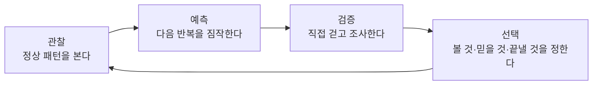

# 4시 44분 — 스토리·연출 프로덕션 블루프린트

> **보관 문서 — REBIRTH 이전 방향 기록.**
> 현재 제작 정사는
> [STORY_BIBLE_MISSING_FLOOR.md](STORY_BIBLE_MISSING_FLOOR.md)
> (「없는 층」 — REBIRTH도 폐기됐다)를 따른다.
>
> 전체 스포일러. 플레이어용 문서가 아니라 과거 구현·연출·QA의 판단 기록이다.
>
> 이 보관본 내부의 옛 정사·대사는 [STORY_BIBLE.md](STORY_BIBLE.md)에 남아 있다.

## 1. 플레이어에게 하는 약속

`4시 44분`의 재미는 길을 잃거나 괴물에게 도망치는 데 있지 않다.
플레이어는 평범한 한국의 새벽을 학습하고, 다음 반복을 예측하고, 직접
걸어 확인하면서 “내가 이미 죽었다”는 결론에 도달한다.

핵심 질문은 챕터마다 하나다.

| 챕터 | 플레이어의 질문 | 챕터가 남길 답 |
|---|---|---|
| CH01 | 왜 이 사람은 이 시간에 물을 사러 가는가? | 이것은 한지운의 마지막 평범한 심부름이다. |
| CH02 | 왜 세계가 내가 오기 전에 내 행동을 알고 있는가? | 나는 이 동선을 이미 걸었고, 방 안에는 또 다른 내가 있다. |
| CH03 | 나는 언제, 어디에서 죽었는가? | 2024년 7월 26일 04:44, 옥상 물탱크 안이다. |
| 결말 | 죽음을 다시 덮을 것인가, 발견될 수 있게 남길 것인가? | 뚜껑을 닫거나, 안경을 물 위에 돌려놓고 뚜껑을 열어 둔다. |

공포의 목표는 플레이어를 소리로 놀라게 하는 것이 아니라, 스스로 맞힌
예측이 더 나쁜 진실로 이어지는 만족을 주는 것이다.

## 2. 재미의 핵심 루프

모든 주요 비트는 다음 네 단계 중 최소 세 단계를 가진다.

### 관찰

- CH01에서 문패, 고양이, 바람과 잎, 차량, 차임, 징글, 영수증을 정상
  인과로 보여 준다.
- 한 번 스쳐 지나가도 형태와 소리가 함께 남도록 시야선과 공간 음향을 맞춘다.
- 중요한 단서는 허리를 숙여 픽셀을 찾게 하지 않는다.

### 예측

- 같은 문, 같은 골목, 같은 편의점에 다시 도착할 것이라는 확신을 만든다.
- 목표 문구와 동선은 반복하되 결과만 한 가지씩 바꾼다.
- CH02 시작 직후부터 모든 것을 틀리게 만들지 않는다. 첫 번째 예측 성공이
  있어야 두 번째 실패가 공포가 된다.

### 검증

- 플레이어가 뒤를 돌아 꺼진 등을 확인하고, 403호 안으로 들어가고,
  영수증을 열어 카드·시각을 읽게 한다.
- 필수 리빌은 자연스럽게 시야에 걸리게 하고, 선택 문서는 우회할 수 있게 한다.
- “정답” 팝업은 없다. 서로 다른 두 단서가 같은 결론을 가리키게 한다.

### 선택

- 작은 선택: 문서를 더 읽을지, 고양이에게 산 물을 조금 나눌지,
  403호의 잠든 등을 가까이 볼지.
- 마지막 선택: 메뉴가 아니라 공간 안에서 손잡이로 걸어가
  뚜껑을 닫거나 안경을 수면 위에 돌려놓고 뚜껑을 열어 둔다.
- 작은 선택은 엔딩을 잠그지 않는다. 생각 자막과 정서의 결만 바꾼다.

## 3. 3막과 긴장 곡선

### 1막 — 정상성을 믿게 한다: CH01, 6~8분

목표는 겁주기가 아니라 한지운과 동네를 기억하게 하는 것이다.

1. 알람·기상·갈증: 조작 학습.
2. 플래너, 작업조끼, 닳은 지갑: 한지운의 피로한 생활을 20초 안에 읽힌다.
3. 복도와 단수 공지: 건물의 사회적 맥락.
4. 골목의 고양이·바람·마른 잎·승용차·배달 오토바이: 살아 있는 새벽.
5. 밝은 편의점과 정상 징글: 안전과 보상.
6. 04:44 영수증: 첫 플레이에는 버그처럼 보이지 않는 복선.

공포 허용량은 가로등 고장 한 번뿐이다. CH01에서 드론, 유령 차임,
매장 조명 딥을 남발하면 2막의 변화가 사라진다.

### 2막 — 예측을 한 항목씩 배반한다: CH02, 10~12분

각 비트는 이전 비트보다 정보가 더 구체적이어야 한다.

1. 같은 기상: 첫 예측 성공.
2. 등 뒤 소등: 공간이 플레이어의 위치를 안다.
3. 이동한 403호와 미러룸: 집이 기억을 재배치한다.
4. 누르지 않은 2층과 젖은 발자국: 내가 먼저 지나갔다.
5. 404호 수취 고지서와 의례: 산 사람들은 무언가를 알고 있다.
6. 고양이 본체 없는 위쪽 소리, 일부 역방향 잎, 보이는 차보다 먼저
   사라지는 엔진음: 바깥의 인과도 믿을 수 없다.
7. 무인 편의점과 같은 영수증 두 장: 상업 기록까지 죽음의 시각에 오염됐다.
8. 위층의 내 알람: “내가 이미 있다”는 질문을 CH03로 넘긴다.

403호 뒤에는 추격을 붙이지 않는다. 플레이어가 문을 다시 열고 스스로
나오는 5~8초가 이 챕터의 핵심 공포다.

### 3막 — 방향과 의미를 뒤집는다: CH03, 12~15분

CH03 세로 단면과 필수 단서 게이트, 두 분기 연출은 구현됐다. 자동
스모크·캡처에서 계단 루프 3회, 옥상·탱크 진입, 선택 타깃 2개와 캡처
4장을 확인했다. 아래 폰, 관리 확인표, 발견·가족 귀환, 비자해 엔딩 B도
현재 코드에 연결돼 있다. 다만 두 엔딩의 감정 호흡과 재시작 UX는 각각
수동 완주해 최종 판단해야 한다.

1. 스스로 꺼지는 알람과 첫 4초 침묵.
2. 생수로 가득 찬 냉장고, 플래너의 실제 알람 5:10, 어머니의 읽지 않은
   「지운아」. 폰은 탱크 반전 전에 한지운을 사람으로 붙드는 필수 비트다.
3. 침수 복도와 죽은 엘리베이터.
4. 내려갈수록 4층으로 돌아오는 계단 세 번.
5. 미완공 5층의 엎어진 정화수: 공포를 잠시 슬픔으로 바꾼다.
6. 옥상 문: 03:50 밸브 잠금·옥상 개방, 03:56 작업 연기, 비어 있는
   열쇠 회수·뚜껑 확인, 7월 29일 허위 완료 기록을 필수 조사로 읽힌다.
7. 옥상: 철문이 닫힐 때 오토바이 체인음의 꼬리만 한 번 울리고,
   이후 넓고 아름다운 공간에서 생활 소리가 전부 사라진다.
8. 탱크 안의 고양이 같은 긁힘 세 번, 주변에는 동물 발자국이 없음.
   04:44 추락 때 손과 안경이 철판을 스친 소리가 04:38로 새어, 실제
   새벽의 지운을 구조 행동으로 이끌었다는 인과를 회수한다.
9. 사다리 아래 안경, 따라 올라오는 금속 울림.
10. 물탱크 속 잠든 등과 두 번째 침묵.
11. 뚜껑을 다시 닫는 부정 또는 안경을 돌려놓고 열어 두는 수용의 공간 선택.

수위가 플레이어를 압박할 수는 있지만 잡아 죽이지 않는다. 시간 제한,
추격 실패, 게임오버는 넣지 않는다.

## 4. 심기 → 변주 → 회수 장부

회수 없는 심기와 심기 없는 리빌은 금지한다.

| 모티프 | CH01 심기 | CH02 변주 | CH03·엔딩 회수 |
|---|---|---|---|
| 4:44 알람 | 정상 기상처럼 들림 | 로비의 나에게 404호에서 울림 | 실제 알람은 5:10. 4:44는 익사 시각 |
| 영수증 | 결제 뒤 `2024/07/26(금) 04:44` | 결제 전 한 장 + 결제 후 같은 한 장 | 세계의 시간이 죽음에 고정됐다는 물증 |
| 빈 생수병 | 냉장고에 옆으로 누움 | 다시 비어 있음 | 냉장고를 가득 채운 물 |
| 단수 공지 | 정상 관리 공지 | 404호만 겨냥한 듯 읽힘 | 03:50 작업 확인표·03:56 연기·꽂힌 열쇠·빈 안전 확인·7월 29일 허위 기록 |
| 403 문패 | 정상 위치 | 맨 벽 + 동쪽 미러룸 | 침대의 등과 탱크 속 등이 같은 형상 |
| 검은 뿔테 안경 | 지운의 설정·403 침대맡 | “내 안경은 쓰고 있는데” | 사다리 밑 안경이 추락 경로를 확정 |
| 젖은 발자국 | 없음 | 캐빈 안에서 내 등 뒤로 끝남 | 반 박자 늦는 첨벙·사다리의 두 번째 발 |
| 소금·정화수·밥 | 401호의 생활 흔적 | 공동현관의 의례 | 엎어진 물그릇·끊긴 소금 |
| 길고양이 | 골목 가장자리에서 한 번 스쳐 지나감 | 본체는 보이지 않고 위쪽 소리와 흐트러진 잎만 남음 | 탱크 안의 긁힘과 옥상의 무발자국. 지운의 구조 동기와 소장의 “고양이겠죠” 핑계를 동시에 회수 |
| 바람·마른 잎 | 돌풍과 같은 방향으로 잎이 움직임 | 일부 잎만 돌풍 반대 방향으로 흩어짐 | 나무 없는 옥상에 같은 잎, 뚜껑을 열면 바람 정지 |
| 승용차 | 차체·빛·소리가 함께 통과 | 차체는 계속 보이지만 엔진음이 통과 중 사라질 수 있음 | 옥상에서 반복 시각에도 완전 부재 |
| 배달 오토바이 | 탑승자·헬멧·배달함과 함께 한 번 자연스럽게 통과 | 더 느린 속도와 같은 음향 탈락 문법으로 반복 | 옥상에는 체인음 잔향 1회만 남음. 엔딩 A는 차임·알람 큐 재시작, 엔딩 B는 다음 봄 자연스러운 일상을 카드로 회수 |
| 편의점 징글 | 정상 | 반음 낮고 12% 느림 | CH03 부재 |
| 어머니의 문자 | CH01 「주말에 내려오니」 | 연락이 없는 부재 | CH03 「지운아」 → 7월 29일 실종 신고 → 8월 16일 발견과 가족 귀환 |
| 작업 전 확인표 | 단수 공지의 관리 주체 | 꽂힌 열쇠와 반복되는 물 | 빈 안전 확인·허위 완료 기록이 탱크 수색 누락과 발견 지연을 설명 |

## 5. 생활 앰비언트의 서사 역할

생활 요소는 “맵이 심심해서” 넣는 장식이 아니다.

| 요소 | 현실 역할 | 공포 역할 | 성능·연출 제한 |
|---|---|---|---|
| 고등어태비 길고양이 | 한국 골목의 생활감, 지운의 작은 연민 | CH02에서 본체 없는 위쪽 소리로 생명의 부재를 보임 | 단일 풀 오브젝트, CH01 17~31초·CH02 29~53초 재예약, 거리 밖 생략 |
| 바람 | 간판·공지·비닐·잎의 공통 원인 | CH02에서 일부 잎의 방향만 뒤집음 | CH01 5~13초·CH02 9~22초 재예약, 방향·세기는 고정 시드 |
| 마른 잎 | 7월 폭염과 풍향을 시각화 | 역방향 잎과 옥상의 한 장으로 동선을 오염 | 풀 24장, 돌풍당 7~13장, 거리 밖 시뮬레이션 중지 |
| 승용차 | 먼 도로와 도시의 지속성 | 보이는 차체보다 엔진음이 먼저 사라지는 인과 훼손 | 차량 풀 2슬롯, 첫 차량으로 보장, 이후 희박한 재예약 |
| 배달 오토바이 | 한국의 이른 배달 노동, 지운의 상하차 노동과 조응 | CH02의 느린 속도와 음향 탈락으로 루프를 청각화 | 같은 차량 풀 사용, 첫 승용차 5.4초 뒤 보장, 탑승자·헬멧·배달함 포함 |

골목 진입 뒤 첫 큐는 고양이 `0.8초`, 바람·잎 `3.4초`, 승용차
`6.8초`, 승용차 뒤 오토바이 `5.4초`로 시작한다. 같은 진입 존이
중복 오버랩돼도 큐를 다시 시작하지 않는다. 그 뒤 사건은 고정 시드 범위로
희박하게 재예약하며, 플레이어가 가시거리 밖이면 실행을 생략한다. CH02
귀환이 시작되면 예약된 고양이·바람·잎·차량을 모두 정지한다.

고양이에게 물을 나눠 주는 선택은 엔딩 조건이 아니다. 구현한다면
CH03 정화수 앞 생각만 “할머니도… 나한테 물을 준 거구나”로 달라져,
플레이어의 작은 친절과 정막례의 물그릇을 조응시킨다.

## 6. 사운드·BGM·효과음 상대 트리거

### BGM

- 편의점 징글만 비다이제틱 음악으로 허용한다.
- CH01 정상, CH02 `-1 semitone / -12% tempo`, CH03 없음.
- 징글을 공포 스팅처럼 갑자기 끊지 않는다. 문서 조사나 조명 변화에 맞춰
  0.8~1.5초 페이드한다.

### 생활 베드

- 공간 진입 시 2초 크로스페이드한다.
- 404호, 복도, 엘리베이터, 로비, 골목, 편의점, 계단, 옥상은 서로 다른
  60/120Hz 험과 대역 제한 노이즈 조합을 가진다.
- 베드가 완전히 사라지는 것은 CH03의 두 침묵뿐이다.

### 사건 FX

| 큐 | 트리거 | 규칙 |
|---|---|---|
| 복도 안정기 스냅 | 플레이어가 등을 지나고 카메라 시야에서 벗어난 뒤 | 발광 패널 소등과 같은 프레임, +6dB 이하 |
| 403 도어락 | 문 닫힘 완료 | 문 밖 위치, 4연 하강, 이후 추격음 없음 |
| 엘리베이터 낙수 | 2층 문틈 12cm 도달 | 틈 위치에서 먼저 들리고 발자국은 늦게 공개 |
| 겹차임 | CH02 편의점 경계 통과 | 0.8초 간격, 두 번째 차임은 플레이어 뒤쪽 |
| 차량·오토바이 | 해당 도로 존과 직전 생활 사건 완료 | 차체 위치·도플러·타이어/체인음 일치 |
| 반 박자 늦는 첨벙 | CH03에서 이동 정지 0.4초 뒤 | 40초 쿨다운, 화면 효과 없음 |
| 사다리 금속 울림 | 플레이어의 한 걸음 뒤 0.4초 | 두 번째 울림 피치 -8%, 아래쪽 공간 위치 |

### 믹스

- 공포 스팅은 직전 L1보다 최대 +6dB, 생활 사건은 +3dB다.
- 사건 FX가 겹치면 L2를 2dB 덕킹하고, 대사를 대신하는 생각 자막이
  뜰 때는 고역 생활음을 1~2dB만 낮춘다.
- CH02 드론은 403 시선 고정, 2층 문틈, 카드번호 확인 세 구간에만
  올라오고 회복 구간에서 6초에 걸쳐 빠진다.
- 물은 CH03의 음악이다. 탱크 앞에 별도 클라이맥스 음악을 추가하지 않는다.

## 7. 점프스케어 금지선

금지:

- 카메라 앞에 얼굴·괴물을 순간 스폰
- 이유 없는 전대역 폭음
- 문을 열 때마다 확률로 발화하는 랜덤 놀람
- 사망 화면, 추격 실패, 강제 재시작
- 새 단서를 처음 등장시키면서 동시에 변형
- 플레이어의 시점을 강제로 돌려 정답을 보여 주기

허용:

- 이미 본 형상의 위치·상태 변화
- 원인이 보이기 전에 들리는 작은 소리
- 조명이 시야 밖에서 꺼지는 사건
- 긴 정적 뒤가 아니라 생활 베드 속에서 발견하는 물증
- 한 번뿐인 물리적 충격: 엔딩 A의 탱크 뚜껑 닫힘
- **이미 본 형상이 내는 소리로 놀라게 하기** (2026-09-09 추가). 그가 무엇을
  들었을 때의 들숨, 추격이 시작되는 비명, 3.2m 안에서 시야에 들어왔을 때의
  스팅어, 덮치는 순간의 저역. 전부 원인이 먼저 보이거나 먼저 들리는 폭음이라
  「이유 없는 전대역 폭음」이 아니다. 밤1 계단참에서 지나칠 때 그가 고개를
  드는 들숨, 밤3 스칠 때의 들숨, 밤2 우리 문의 노크에 화면이 움찔하는 것도
  같은 줄이다. 스트레스 0.3~0.6과 카메라 킥 0.7~1.8도가 함께 온다
- 밤 사이 45~110초마다 **위에서** 한 번씩 나는 건물 소리(배관·목재·석고·먼
  문). 훅이 위에서 나는 소리라 방위는 늘 위다. 규칙적이면 시계가 되므로 간격은
  무작위다
- 소화기가 떨어진 2.2초 뒤 등 뒤 복도 등이 죽는다 — 시야 밖의 조명 사건

“놀랐는가?”보다 “뒤를 돌아 확인했는가?”, “다음 변화를 예측했는가?”를
관찰 테스트의 성공 지표로 삼는다.

## 8. 엔딩의 감정 목표

### 엔딩 A — 뚜껑을 닫는다

첫 감정은 안도, 두 번째 감정은 후회다. 뚜껑을 닫는 쾅 소리는 게임에서
유일하게 큰 물리 충격이어야 한다. 2.2초 암전 안에서 0.75초 뒤 편의점
차임, 1.30초 뒤 4시 44분 알람이 이어지고 「내일 또」 카드가 떠
“부정은 반복”이라는 의미를 남긴다. 플레이어를 실패자로 꾸짖지 않는다.

### 엔딩 B — 안경을 돌려놓고 뚜껑을 열어 둔다

첫 감정은 공포, 마지막 감정은 애도다. 플레이어는 탱크에 들어가지 않는다.
수면 위 형체 곁에 안경을 돌려놓고 뚜껑을 열어 둠으로써, 이미 일어난
죽음을 다시 연기하지 않고 **진실이 발견될 수 있게 남긴다**. 8월 16일
발견과 「가족에게 돌아갔다」 카드로 “찾는 사람이 있었다”를 회수한다.
마지막 「다음 봄, 404호 새 세입자는 물이 조금 달다고 했다」 카드로
해방과 잔류 공포를 함께 끝낸다. 가족의 물건 정리·옥상 물그릇·다음 봄
생활 폴리는 후속 사운드 폴리시 항목이며 현재 세로 단면의 완료 조건에는
포함하지 않는다.

두 엔딩 모두 한지운을 단순한 시체 반전으로 소비하지 않는다. 작업조끼,
플래너, 어머니의 읽지 않은 문자, 고양이에게 건넬 수 있었던 물이 먼저
쌓여 있어야 탱크의 등이 한 사람의 죽음으로 읽힌다.

## 9. 제작 우선순위와 완료 기준

### P0 — 이야기 완결

- 구현 완료: CH01의 한지운 생활 물증과 첫 영수증, 403호와 CH02
  영수증 조사 게이트, CH01 정상 오디오, CH03 필수 폰·플래너·작업표,
  비자해 엔딩 B와 8월 16일 발견·가족 귀환·다음 봄 카드.
- 자동 검증 완료: CH01 캡처 워크스루, CH02 캡처·엘리베이터 검증,
  CH03 계단 루프 3회·옥상·탱크·두 선택 타깃 스모크.
- 남은 완료 기준: CH03 두 엔딩을 실제 입력으로 각각 완주하고 첫
  영수증·403호·필수 단서의 초견 인지율을 사람 플레이로 기록한다.

### P1 — 생활감과 변주

1. 고양이·바람·잎·승용차·오토바이의 풀링·고정 시드 구현 — 완료
2. CH01 정상→CH02 변주→CH02 귀환 시 부재 연결 — 완료
3. 401호 예불 라디오와 CH01 편의점 창고 소리로 사람의 존재 심기 — 완료
4. 고양이 물 나눔 선택과 CH03 생각 자막 변형 — 선택 확장, 미구현

생활 앰비언트는 런타임 통합과 자동 캡처 워크스루까지 완료했다. 위치-소리
일치와 장시간 성능은 수동 플레이와 Unreal Insights 검증이 남아 있으며,
그 결과 전에는 최종 품질 완료로 표기하지 않는다.

### P2 — 재미와 품질 검증

- 첫 플레이어 5명 이상이 도움 없이 핵심 단서 6개 중 4개 이상 인지
- 403호 이후 추격이 없는데도 절반 이상이 자발적으로 뒤를 확인
- CH02 영수증을 “UI 임시 카드”가 아닌 한국 영수증으로 인식
- 두 엔딩 선택 이유를 “좋은/나쁜 엔딩”이 아니라 “부정/수용”으로 설명
- 첫 플레이어가 “갈증 때문에 탱크를 점검했다”가 아니라 “고양이가 갇힌
  줄 알고 구조하러 갔다”고 설명
- 첫 플레이어가 03:56 안전 확인 누락과 7월 29일 허위 기록 때문에
  8월 16일까지 탱크 수색이 빠졌다고 설명
- 생활 사건 누락 시 진행 하드락 0건
- 패키징 빌드에서 생활 액터 풀링, 오디오 가상화, 파티클 bounds,
  프레임 타임과 메모리 회귀 확인

완료의 기준은 요소 수가 아니라 인과의 가독성이다. 플레이어가
관찰→예측→검증→선택을 반복해 자기 말로 진실을 설명할 수 있을 때
스토리가 작동한 것이다.
