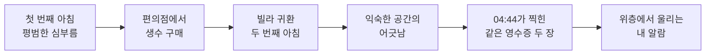

# 4시 44분 (4:44 AM)

> 물이 떨어졌다. 편의점에 다녀온다. 다시 잠든다.
>
> 다음 날 4시 44분 — 냉장고에는 또 물이 없다.

> Unreal Engine 5.8에서 직접 실행해 촬영한 **실제 게임 화면**입니다. 현재 공개된 빌드는 공간과 공포 흐름을 검증하는 플레이 가능한 버전이며, 일부 소품은 계속 개선됩니다.

## 어떤 게임인가요?

`4시 44분`은 한국의 낡은 빌라와 새벽 골목을 배경으로 한 싱글 플레이 1인칭 현실 공포게임입니다. 괴물이나 갑작스러운 점프스케어보다, 매일 지나던 집이 조금씩 어긋나는 감각에 집중합니다.

플레이어는 알람을 끄고, 빈 냉장고를 확인하고, 물을 사러 편의점에 다녀옵니다. 두 번째 아침에도 똑같은 심부름이 시작되지만 어제의 403호가 다른 자리에 있고, 누르지 않은 층에서 엘리베이터가 멈추며, 사지 않은 물의 영수증이 먼저 기다리고 있습니다.

## 현재 플레이 가능한 두 번의 아침

| 챕터 | 플레이 경험 |
|---|---|
| CH01 — 첫 번째 아침: 물이 없다 | 알람을 끄고 일어나 냉장고를 확인한 뒤, 지갑을 챙겨 404호에서 나옵니다. 엘리베이터와 새벽 골목을 지나 편의점에서 생수를 사고 빌라로 돌아옵니다. |
| CH02 — 두 번째 아침: 집이 아니다 | 같은 루틴이 다시 시작됩니다. 복도 불이 시야 밖에서 하나씩 꺼지고, 동쪽으로 옮겨 간 403호 안에는 404호와 같은 방과 잠든 형체가 있습니다. |
| 누르지 않은 2층 | 엘리베이터 문이 12cm만 열린 채 암흑 속에서 멈춥니다. 문이 닫히기 직전, 캐빈 안에 젖은 발자국이 나타납니다. |
| 의례의 흔적 | 로비의 403호 우편함에는 404호 앞으로 온 고지서가 쌓여 있고, 공동현관에는 소금과 정화수, 숟가락이 꽂힌 밥이 놓여 있습니다. |
| 무인 편의점 | 차임이 두 번 울리고 북쪽 조명은 꺼져 있습니다. 익숙한 징글은 반음 낮고 느리며, 계산 전부터 영수증 한 장이 POS 옆에 놓여 있습니다. |
| CH02 엔딩 | 생수를 결제하면 같은 영수증이 한 장 더 나옵니다. 빌라로 돌아오면 4층의 모든 불이 켜지고, 내가 로비에 있는데도 내 방의 알람이 위에서 울립니다. |

### 실제 게임 캡처

아래 세 장은 CH02를 Unreal Engine 5.8에서 직접 실행해 촬영한 **실제 게임 화면**입니다.

영수증에는 다음 내용이 표시됩니다.

- 새벽편의점
- `2026-07-26 04:44`
- 새벽수 500mL `1,100원`
- 체크카드 승인 `4482**`
- 적립 없음

두 번째 계산에서 출력되는 영수증도 시각과 결제 정보가 완전히 같습니다.

CH01의 실제 플레이 화면과 완주 영상도 확인할 수 있습니다.

**걸어서 완주하는 CH01 영상**: [prologue-walkthrough.mp4](Docs/Media/prologue-walkthrough.mp4)

## 바로 실행하기

### 처음부터 플레이

[Scripts/RunGame.bat](Scripts/RunGame.bat)을 더블클릭하면 CH01부터 시작하고, 귀가하면 같은 세션 안에서 CH02로 이어집니다.

1. `Scripts\RunGame.bat` 더블클릭
2. 첫 실행의 셰이더 준비가 끝날 때까지 기다리기
3. 검은 화면에서 알람이 울리면 플레이 시작
4. 종료할 때는 `Alt + F4`

### 두 번째 아침 바로 보기

CH01을 건너뛰고 새로 구현된 구간을 바로 확인하려면 [Scripts/RunGame-Chapter2.bat](Scripts/RunGame-Chapter2.bat)을 더블클릭합니다. 이 실행 방식은 404호 침대에서 CH02 상태로 시작합니다.

첫 실행은 Unreal Engine이 셰이더와 캐시를 준비하므로 몇 분 걸릴 수 있습니다. 시작 직후의 짧은 암전은 의도한 눈 뜨기 연출입니다.

## 조작 방법

| 입력 | 동작 |
|---|---|
| `W A S D` | 이동 |
| 마우스 | 시점 조작 |
| `E` | 알람 끄기·일어나기·문 열기·냉장고 확인·아이템 줍기·문서 보기·계산 |
| `E` 길게 | 계산대처럼 홀드가 필요한 상호작용 |
| `Esc` | 게임 창의 마우스 커서 전환 |
| `Alt + F4` | 게임 종료 |

목표는 화면 상단, 주인공의 짧은 생각은 화면 아래쪽에 표시됩니다. 조사 가능한 문서에는 별도의 읽기 화면이 열립니다. 한글 폰트를 불러오지 못한 환경에서는 영문 안내로 대체됩니다.

## Unreal Editor에서 실행하기

[Scripts/RunEditor.bat](Scripts/RunEditor.bat)을 더블클릭하거나 `IndieGame.uproject`를 열고 상단의 **Play** 버튼을 누릅니다. 기본 시작 맵은 `Prologue_Morning`입니다.

필요 환경:

- Unreal Engine 5.8
- Visual Studio 2026의 `Game development with C++` 워크로드
- Windows 10/11 SDK

새로 내려받은 저장소에서 모듈 빌드를 묻는 창이 나오면 **Yes**를 선택합니다. 자동 빌드가 되지 않으면 생성된 Visual Studio 솔루션에서 `Development Editor | Win64`로 한 번 빌드한 뒤 다시 엽니다.

## 시각 방향

> 위 이미지는 실제 게임 캡처가 아니라, 최종 조명과 공간 밀도를 정하기 위해 **이미지 생성 기능으로 만든 콘셉트 이미지**입니다. 이 README에서 실제 플레이 화면은 각 캡션에 `실제 게임 캡처`라고 별도로 표시했습니다.

게임 안의 인쇄물 배경에는 이미지 생성 기능으로 만든 빈 종이 원본을 사용하고, 한국어 문구와 영수증 정보는 게임에서 정확한 텍스트로 올립니다. 실존 상표는 사용하지 않습니다. 외부 자료와 생성 이미지의 출처는 [에셋 및 라이선스 정책](Docs/ASSET_POLICY.md)에서 확인할 수 있습니다.

## 더 알아보기

- [현재 구현 상태](Docs/IMPLEMENTATION_STATUS.md)
- [시스템 구조](Docs/ARCHITECTURE.md)
- [성능 목표](Docs/PERFORMANCE.md)
- [에셋 및 라이선스 정책](Docs/ASSET_POLICY.md)
- [스토리 바이블](Docs/STORY_BIBLE.md) — 전체 스포일러 포함
